# Debug日志

## 入口断点表格

下面的断点按 `mydocs/0` 的 Serving State 总览和 `mydocs/1` 的 Full Attention KV Cache 主线整理。主线假设是：单个 CUDA worker、普通 Full Attention、`page_size=1`、无 speculative decoding、无 PP/CP/DCP、普通 radix cache。换模型或打开这些功能时，先看文末的分支断点。

断点的目标是覆盖每个状态交接：

```text
上一段产出 → 当前断点消费 → 当前断点产出 → 下一段消费
```

调试器通常在当前行执行前停下。因此，表中写“执行后查看”的位置，实际需要 Step Over 一次，或在下一行设置断点。

前面的表是“源码导航索引”，不是让你一次性设置全部断点。普通请求入口可以用少量断点确认方向；但如果目标是 `mydocs/0、1` 的 KV cache 主线，pool、prefix、allocation、ForwardBatch、backend 写入和回收之间的交接不能跳过，具体推荐顺序见文末。

### 读法（三段共用）

停下后先不要盲目 Step Into：

- 往回看：点 Call Stack 上一帧，确认是谁把当前对象传进来；
- 横着看：展开当前帧的 `self.xxx` 和局部变量；
- 只有某个字段的生产者不清楚时，才 Step Into。

对循环或高频函数加条件断点。条件优先使用真实字段，例如 `req.rid == "目标请求"`、`batch.forward_mode == ForwardMode.EXTEND`、`self.self_attn.attn.layer_id == self.self_attn.start_layer`。

## 粗略断点和详细断点是同一条路线

这里的“粗略”不是另一套跳步流程，而是从详细表中抽出的阶段边界。先用粗略点确认程序走到哪一段，再把当前粗略点展开成右侧的详细点；展开后仍沿同一条调用链前进，不需要重新规划。

| 粗略阶段 | 先停的边界点 | 展开时依次看 | 这一段要回答的问题 |
|---|---|---|---|
| 请求入口 | `0-1 → 0-9` | `0-2、0-3、0-4、0-5、0-6、0-7、0-8` | API 输入怎样变成 Scheduler 的 `Req`？ |
| 启动与模型 | `A-1 → A-14` | `A-2、A-3、A-4、A-5、A-6、A-7、A-8、A-9、A-10、A-11、A-12、A-13` | 哪个进程创建 Worker，Runner 何时真正拿到 `self.model`？ |
| KV 建池 | `A-16 → A-24` | `A-17、A-18、A-19、A-20、A-21、A-22、A-23` | row、physical K/V pool、allocator 如何分别产生？ |
| prefix tree | `A-29 → A-31` | `A-30` | tree 怎样拿已有 pool/allocator 建立索引？ |
| 请求 KV 主线 | `B-3 → B-13` | `B-4、B-5、B-6、B-7、B-8、B-9、B-10、B-11、B-12` | prefix 命中、row、slot 和 `req_to_token` 怎样交接？ |
| 模型与 backend | `B-14 → B-22` | `B-15、B-16、B-17、B-18、B-19、B-20、B-21` | `ForwardBatch` 怎样把 slot 地址交给 backend，并写入 K/V？ |
| 历史读表 | `B-23 → B-24` | 无 | kernel 怎样根据 row 映射读取历史 K/V？ |
| 完成与回收 | `C-4 → C-9` | `C-5、C-6、C-7、C-8、C-9` | finish、chunk、over-allocation release、eviction 有什么区别？ |

因此，如果只想先建立地图，设置每行“先停的边界点”即可；如果目标是复现 `mydocs/1` 的 KV trace，就从对应边界点继续 Step Into 展开列，不能把整段直接跳过。下面的代码带读和后面的详细表使用完全相同的编号。


## 0 段：请求入口（主进程）

这段回答“prompt 怎样变成跨进程请求”。普通请求通常会经过一次 `generate_request`、一次 `_init_req_state` 和一次 `_dispatch_to_scheduler`；控制消息也会走 `_dispatch_to_scheduler`，所以不能把它简单理解成“每个请求只发送一次”。

| # | 位置 | 停下时看什么 | 下一跳 |
|---|---|---|---|
| 0-1 | [`engine.py:382`](python/sglang/srt/entrypoints/engine.py#L382) `Engine.generate` | `prompt`、`input_ids`、`sampling_params`；确认调用是否来自离线 Engine | 构造 `GenerateReqInput`，再调用 `TokenizerManager.generate_request` |
| 0-2 | [`tokenizer_manager.py:776`](python/sglang/srt/managers/tokenizer_manager.py#L776) `generate_request` | `obj` 的单请求/批量形态；Step Over 规范化、默认 priority 和参数校验 | `_init_req_state` 与 tokenizer/processor 路径 |
| 0-3 | [`tokenizer_manager.py:807`](python/sglang/srt/managers/tokenizer_manager.py#L807) `_init_req_state` 调用前 | `obj.rid`、`obj.is_single`；此时 `rid_to_state` 还未更新 | Step Over 到 808，确认 `rid_to_state` 新增 1 条或 batch 对应的多条 `ReqState` |
| 0-4 | [`tokenizer_manager.py:3463`](python/sglang/srt/managers/tokenizer_manager.py#L3463) `_init_req_state` 函数体 | `items`、`rid`、`sub_obj`、`ReqState.event`；这里是真正写入 `rid_to_state` 的地方 | 分词、构造 tokenized request |
| 0-5 | [`tokenizer_manager.py:580`](python/sglang/srt/managers/tokenizer_manager.py#L580) `_dispatch_to_scheduler` | `obj` 的完整字段；这是进程边界前的最后快照 | `sock_send` 把对象发到 Scheduler IPC |
| 0-6 | [`tokenizer_manager.py:583`](python/sglang/srt/managers/tokenizer_manager.py#L583) `sock_send` | `self.send_to_scheduler` 的 IPC 地址和 `obj` 类型；发送完成要 Step Over 验证 | Scheduler 的 `request_receiver.recv_requests` |
| 0-7 | [`scheduler.py:2063`](python/sglang/srt/managers/scheduler.py#L2063) `request_receiver.recv_requests` | Scheduler 本轮收到的 `recv_reqs`；确认请求是否真的跨过进程边界 | `process_input_requests` |
| 0-8 | [`scheduler.py:2092`](python/sglang/srt/managers/scheduler.py#L2092) `_request_dispatcher(recv_req)` | `recv_req` 的具体类型；dispatcher 决定进入普通生成、batch 生成或控制请求 handler | `handle_generate_request` |
| 0-9 | [`scheduler.py:2708`](python/sglang/srt/managers/scheduler.py#L2708) `handle_generate_request` | `recv_req.input_ids`、`rid`、sampling 参数；这里把跨进程 payload 变成调度侧 `Req` | `Req` 加入 waiting queue / grammar queue |

`0-3` 是请求状态的出生点，`0-5` 是发送契约，`0-9` 是 Scheduler 侧 `Req` 的出生点。排查“请求根本没进入调度器”时，从 `0-5 → 0-7 → 0-9` 反查，不要直接跳到 forward。

## A 段：启动链（Scheduler 子进程，一次性）

这段回答“模型、pool、allocator 和 prefix tree 的创建顺序”。执行顺序是：先建 `TpModelWorker/ModelRunner` 并加载权重，再建 KV pool，最后由 Scheduler 在 `init_model_worker()` 返回后调用 `build_kv_cache()` 创建 tree。

| # | 位置 | 停下时看什么 | 下一跳 |
|---|---|---|---|
| A-1 | [`scheduler.py:5795`](python/sglang/srt/managers/scheduler.py#L5795) `Scheduler(...)` | `server_args`、`port_args`、`gpu_id`、`tp_rank`、`pp_rank`；这是调度进程收到的启动参数 | `Scheduler.__init__` |
| A-2 | [`scheduler.py:520`](python/sglang/srt/managers/scheduler.py#L520) `ParallelState(...)` | 构造前看各 rank 入参；Step Over 后查看 `self.ps`，确认当前进程负责哪张卡、哪一层并行切片 | `init_model_config`、IPC 和 tokenizer 初始化 |
| A-3 | [`scheduler.py:543`](python/sglang/srt/managers/scheduler.py#L543) `init_model_config` 调用前 | 调用前看 `server_args`；Step Over 后在 545 或函数体中看 `self.model_config.model_path`、`context_len`、`num_hidden_layers` | `init_metrics_collector` |
| A-4 | [`scheduler.py:549`](python/sglang/srt/managers/scheduler.py#L549) `init_ipc_channels` 调用前 | 调用前看 `port_args`；Step Over 后确认 `self.ipc_channels` 和 rank 0 的接收 socket | `init_tokenizer`、后续请求接收器 |
| A-5 | [`scheduler.py:880`](python/sglang/srt/managers/scheduler.py#L880) `init_tokenizer` 入口 | 这是 tokenizer 初始化前；Step Over 到 907/929 附近再看 `self.tokenizer`、`self.processor` 和 reasoning parser 结果 | MoE/GEMM/Mamba 配置 |
| A-6 | [`scheduler.py:1018`](python/sglang/srt/managers/scheduler.py#L1018) `self.tp_worker = TpModelWorker(...)` 前 | `worker_kwargs`：`server_args`、`gpu_id`、`ps`、`nccl_port`；这是 Scheduler → Worker 的参数翻译契约 | [`tp_worker.py:315`](python/sglang/srt/managers/tp_worker.py#L315) `TpModelWorker.__init__` |
| A-7 | [`tp_worker.py:480`](python/sglang/srt/managers/tp_worker.py#L480) `_init_model_runner` 入口 | `self.model_config` 已经由 `_init_model_config` 创建；speculative draft worker 会使用 draft model path | `ModelRunner(...)` |
| A-8 | [`tp_worker.py:483`](python/sglang/srt/managers/tp_worker.py#L483) `ModelRunner(...)` | ModelRunner 构造参数和 `is_draft_worker`；进入 runner 后会建立设备、分布式组和 forward stream | [`model_runner.py:318`](python/sglang/srt/model_executor/model_runner.py#L318) `ModelRunner.__init__` |
| A-9 | [`model_runner.py:417`](python/sglang/srt/model_executor/model_runner.py#L417) `set_device` 调用前 | 调用前看 `self.device`、`self.gpu_id`；Step Over 后确认 CUDA/NPU 设备上下文已经确定 | `init_torch_distributed` |
| A-10 | [`model_runner.py:433`](python/sglang/srt/model_executor/model_runner.py#L433) `init_torch_distributed` 调用前 | Step Over 后查看 `self.tp_group`、`self.pp_group`、`self.pre_model_load_memory`；后者是 pool 容量计算的显存基线 | 创建 forward stream，随后进入 `initialize()` |
| A-11 | [`model_runner.py:650`](python/sglang/srt/model_executor/model_runner.py#L650) `initialize` | `memory_saver_adapter`、sampler、远端权重传输和 MoE 初始化状态 | `load_model` |
| A-12 | [`model_runner.py:1146`](python/sglang/srt/model_executor/model_runner.py#L1146) `load_model` 入口 | 这是加载前状态；此时不要假设 `self.model` 已存在，重点看 `load_config` 准备前的显存和 runner 配置 | `load_model_with_memory_saver` |
| A-13 | [`model_runner.py:1187`](python/sglang/srt/model_executor/model_runner.py#L1187) `load_model_with_memory_saver` | `model_config`、`load_config`、device、rank；这是实际权重加载调用 | 返回 `loaded` |
| A-14 | [`model_runner.py:1196`](python/sglang/srt/model_executor/model_runner.py#L1196) `self.model = loaded.model` | Step Over 后查看 `self.model`、`self.loader`、`startup_weight_load`；模型对象真正挂到 runner 是这里 | post-load 配置 |
| A-15 | [`scheduler.py:1103`](python/sglang/srt/managers/scheduler.py#L1103) `init_memory_pools` 调用前 | `self.tp_worker` 已创建；普通路径 `self.draft_worker is None`，speculative 路径已额外创建 draft worker | target pool 分配 |
| A-16 | [`scheduler.py:1065`](python/sglang/srt/managers/scheduler.py#L1065) `self.tp_worker.alloc_memory_pool()` | 调用前看 `preloaded_weights_bytes` 和 `memory_pool_config`；Step Over 后 pool 才完成分配 | `ModelRunner.alloc_memory_pool` |
| A-17 | [`model_runner.py:889`](python/sglang/srt/model_executor/model_runner.py#L889) `alloc_memory_pool` | `self.pre_model_load_memory`、`memory_pool_config`；这里只是 pool 配置入口 | `init_kv_cache_configurator` → `configure` |
| A-18 | [`model_runner.py:895`](python/sglang/srt/model_executor/model_runner.py#L895) `configure` 调用 | `KVCacheConfigurator` 的输入：显存基线、模型、page size、dtype、层信息 | `KVCacheConfigurator.configure` |
| A-19 | [`kv_cache_configurator.py:435`](python/sglang/srt/mem_cache/kv_cache_configurator.py#L435) `_init_pools` | 配置后的容量和 pool 分支；普通 plain MHA 会分别构造 request table、K/V backing、allocator | 三个 builder |
| A-20 | [`kv_cache_configurator.py:985`](python/sglang/srt/mem_cache/kv_cache_configurator.py#L985) `_build_req_to_token_pool` | 入口看 `max_num_reqs` 和上下文长度；Step Over 到返回处后查看 `ReqToTokenPool` 的 row 数、dummy row 和 `req_to_token` | `_build_token_to_kv_pool` |
| A-21 | [`kv_cache_configurator.py:1929`](python/sglang/srt/mem_cache/kv_cache_configurator.py#L1929) `_build_mha_kv_pool` | 入口看 layer、KV heads、head dim、dtype、capacity；Step Over 返回后才得到 `MHATokenToKVPool` | allocator builder |
| A-22 | [`kv_cache_configurator.py:1965`](python/sglang/srt/mem_cache/kv_cache_configurator.py#L1965) `_build_token_to_kv_pool_allocator` | 入口看 `page_size` 和 pool 类型；这里决定 `TokenToKVPoolAllocator` / paged allocator | `ModelRunner` 接收 result |
| A-23 | [`model_runner.py:898`](python/sglang/srt/model_executor/model_runner.py#L898) result 字段接收 | Step Over 后看 `max_total_num_tokens`、`req_to_token_pool`、`token_to_kv_pool`、allocator | `_init_post_memory_pool_components` |
| A-24 | [`model_runner.py:881`](python/sglang/srt/model_executor/model_runner.py#L881) `KVIndexTranslator(...)` | translator 持有 `req_to_token`、allocator 和 physical pool；它把 row/slot 信息整理成 backend 读表 | attention backend 初始化 |
| A-25 | [`scheduler.py:1072`](python/sglang/srt/managers/scheduler.py#L1072) `resolve_decode_retraction_backup` | 此时 target pool 已经建好；该行是 pool 分配后的旁路接线点，不是 pool 的构造行 | 可选 draft pool，然后 attention backend |
| A-26 | [`scheduler.py:1082`](python/sglang/srt/managers/scheduler.py#L1082) `init_all_attention_backends` | backend 拿到已经存在的 pool/allocator；验证“pool 先于 backend” | `init_all_cuda_graphs` |
| A-27 | [`scheduler.py:1088`](python/sglang/srt/managers/scheduler.py#L1088) `init_all_cuda_graphs` | CUDA graph 捕获前的 worker/backend/pool 状态 | `build_kv_cache` |
| A-28 | [`scheduler.py:5808`](python/sglang/srt/managers/scheduler.py#L5808) `pipe_writer.send(scheduler.get_init_info())` | `max_total_num_tokens`、`max_req_input_len`、`startup_time`；这是 Scheduler → 父进程的 ready 契约 | 父进程继续接收请求 |
| A-29 | [`scheduler.py:579`](python/sglang/srt/managers/scheduler.py#L579) `kv_cache_builder.build_kv_cache` | `init_model_worker()` 已返回；这里把已存在的 pool、allocator 和 worker 交给 tree builder | `TreeCacheBuildContext` |
| A-30 | [`kv_cache_builder.py:328`](python/sglang/srt/mem_cache/kv_cache_builder.py#L328) `create_tree_cache(...)` | `TreeCacheBuildContext` 的 pool、allocator、模型配置和并行信息 | `registry.create_tree_cache` |
| A-31 | [`registry.py:228`](python/sglang/srt/mem_cache/registry.py#L228) `create_tree_cache` | 工厂选择 `UnifiedRadixCache` 等实现；tree 保存 slot-ID 记录，不复制 K/V bytes | `self.tree_cache` |

`A-20`、`A-21`、`A-22` 分别对应 row 表、K/V 数值 backing、地址 allocator。它们不是同一个 cache。若要追 tree，再挂 [`scheduler.py:579`](python/sglang/srt/managers/scheduler.py#L579) 的 `build_kv_cache`、[`kv_cache_builder.py:328`](python/sglang/srt/mem_cache/kv_cache_builder.py#L328) 的 `create_tree_cache` 和 [`registry.py:228`](python/sglang/srt/mem_cache/registry.py#L228) 的工厂函数：tree 保存 slot-ID 记录，不复制 K/V bytes。

## B 段：请求、KV allocation 与前向（Scheduler 子进程，周期性）

这段是 `mydocs/1` 的核心链路：prefix lookup → admission → row/slot 分配 → `ForwardBatch` → backend 写 K/V 和读历史。第一遍建议只挂 B-1 到 B-13；要观察模型和 backend，再挂 B-14 到 B-24。

| # | 位置 | 停下时看什么 | 下一跳 |
|---|---|---|---|
| B-1 | [`scheduler.py:2050`](python/sglang/srt/managers/scheduler.py#L2050) `ingest_requests` | 本轮 `recv_reqs`；确认请求已进入调度循环 | `process_input_requests` |
| B-2 | [`scheduler.py:2735`](python/sglang/srt/managers/scheduler.py#L2735) `Req(...)` | `rid`、`origin_input_ids`、sampling 参数；这是调度侧请求对象出生点 | grammar queue / waiting queue |
| B-3 | [`schedule_batch.py:1440`](python/sglang/srt/managers/schedule_batch.py#L1440) `Req.init_next_round_input` | `full_untruncated_fill_ids`、`input_len`、`key_limit`；prefix lookup 的输入还不是 slot | `tree_cache.match_prefix` |
| B-4 | [`schedule_batch.py:1501`](python/sglang/srt/managers/schedule_batch.py#L1501) `tree_cache.match_prefix` | `RadixKey`、`limit`、`cache_salt`；确认匹配使用 token key | 返回 `MatchResult` |
| B-5 | [`unified_radix_cache.py:521`](python/sglang/srt/mem_cache/unified_radix_cache.py#L521) `match_prefix` | `result.device_indices`、`last_device_node`；这是 prefix slot-ID 的生产点 | 写回 `Req.prefix_indices` |
| B-6 | [`schedule_batch.py:1517`](python/sglang/srt/managers/schedule_batch.py#L1517) match 结果写回 | `req.prefix_indices`、`req.last_node`、`req.kv.cache_protected_len`；分别给 allocation、lock、finish/release 使用 | `PrefillAdder` admission |
| B-7 | [`schedule_policy.py:1018`](python/sglang/srt/managers/schedule_policy.py#L1018) `_req_inc_lock_ref` | `last_node` 的请求级 lock/refcount；命中 tree 不等于已经分配 request row | `ScheduleBatch.prepare_for_extend` |
| B-8 | [`schedule_batch.py:2561`](python/sglang/srt/managers/schedule_batch.py#L2561) `prepare_for_extend` | `prefix_lens`、`extend_lens`、`seq_lens`、packed `input_ids`；这里把请求组装成 extend batch | `alloc_for_extend` |
| B-9 | [`allocation.py:282`](python/sglang/srt/mem_cache/allocation.py#L282) `alloc_for_extend` | `prefix_tensors`、batch 的 row/slot allocator；allocation 还没有写 K/V 数值 | `alloc_req_slots`、`alloc_token_slots` |
| B-10 | [`allocation.py:313`](python/sglang/srt/mem_cache/allocation.py#L313) `alloc_req_slots` | `req_pool_indices`；这是 request row，不是 K/V slot | `alloc_token_slots` |
| B-11 | [`allocation.py:334`](python/sglang/srt/mem_cache/allocation.py#L334) `alloc_token_slots` | `out_cache_loc`；这是本轮 suffix 将来写入 K/V 的 slot-ID | `write_cache_indices` |
| B-12 | [`allocation.py:354`](python/sglang/srt/mem_cache/allocation.py#L354) `write_cache_indices(` | Step Over 后看 `req_to_token[row, :]`；prefix slot 和新 suffix slot 在这里写回 request table | 返回 `out_cache_loc`、row indices |
| B-13 | [`schedule_batch.py:2761`](python/sglang/srt/managers/schedule_batch.py#L2761) `self.out_cache_loc = out_cache_loc` | Step Over 后看 `batch.out_cache_loc`、`batch.req_pool_indices` 和 `batch.req_to_token_pool`；此刻只有地址和映射，还没有当前 token 的 K/V 数值 | `ForwardBatch.init_new` |
| B-14 | [`tp_worker.py:608`](python/sglang/srt/managers/tp_worker.py#L608) `ForwardBatch.init_new` | `ScheduleBatch` 如何变成一次 forward 的 view；看 `input_ids`、`req_pool_indices`、`seq_lens`、`out_cache_loc` | `ModelRunner.forward` |
| B-15 | [`tp_worker.py:622`](python/sglang/srt/managers/tp_worker.py#L622) `apply_deprecated_skip_attn_backend_init` 后 | `forward_batch` 已经构造完成，适合查看最终 metadata；这里不是构造点本身 | `model_runner.forward` |
| B-16 | [`scheduler.py:4199`](python/sglang/srt/managers/scheduler.py#L4199) `run_batch` | `ScheduleBatch` 的 `forward_mode`、`extend_num_tokens`、`seq_lens`；确认本轮是 extend 还是 decode | `model_worker.forward_batch_generation` |
| B-17 | [`model_runner.py:1608`](python/sglang/srt/model_executor/model_runner.py#L1608) `ModelRunner.forward` | runner 收到的 `ForwardBatch`；这是 scheduler metadata 和模型层的边界 | 模型 `self.model` forward |
| B-18 | [`qwen3.py:512`](python/sglang/srt/models/qwen3.py#L512) Qwen3 外层 `forward` | `input_ids.shape`、`positions.shape`、`forward_batch.forward_mode` | `Qwen3Model` |
| B-19 | [`qwen3.py:388`](python/sglang/srt/models/qwen3.py#L388) `Qwen3DecoderLayer.forward` | `hidden_states.shape`、`positions.shape`；条件用 `self.self_attn.attn.layer_id == self.self_attn.start_layer`，只看当前 rank 的第一层 | `self.self_attn` 与 `self.mlp` |
| B-20 | [`radix_attention.py:157`](python/sglang/srt/layers/radix_attention.py#L157) `RadixAttention.forward` | `q/k/v` shape 和 `forward_batch`；这里不会再次查 radix tree | attention backend 的 extend/decode |
| B-21 | [`flashinfer_backend.py:1290`](python/sglang/srt/layers/attention/flashinfer_backend.py#L1290) `forward_extend` | `forward_batch.out_cache_loc`、layer、`save_kv_cache`；当前 token 的写地址从这里进入 backend | `get_kv_buffer` / `set_kv_buffer` |
| B-22 | [`memory_pool.py:2518`](python/sglang/srt/mem_cache/memory_pool.py#L2518) `MHATokenToKVPool.set_kv_buffer` | `layer_id`、`loc`、`k/v.shape`；这是 K/V 数值真正写入 physical pool 的位置 | FlashInfer wrapper 读取历史 |
| B-23 | [`kv_index_translator.py:365`](python/sglang/srt/mem_cache/kv_index_translator.py#L365) `index_table_for_batch` | `req_pool_indices`、`seq_lens`、kernel-facing read table；读表和写地址是两个方向 | wrapper/kernel |
| B-24 | [`flashinfer_backend.py:1451`](python/sglang/srt/layers/attention/flashinfer_backend.py#L1451) `forward_decode` | decode 的 `out_cache_loc` 和每行追加位置；对比 B-21 的 packed extend | `set_kv_buffer` 后 decode wrapper |

extend 路径中最重要的状态快照是：

```text
prefix_indices       = 已命中的旧 slot-ID
req_pool_indices     = 当前请求使用的 row
out_cache_loc        = 本轮新 suffix 的 slot-ID
req_to_token[row, :] = prefix slot + suffix slot
physical K/V pool    = forward 后才写入 K/V 数值
```

不要把 `req_pool_indices` 当成 K/V slot，也不要把 `out_cache_loc` 当成完整历史读表。历史读取通常还要经过 `req_to_token`、`seq_lens` 和 `KVIndexTranslator`。

## C 段：decode、完成和回收（按需）

这段补上 `mydocs/1` 中容易漏掉的状态生命周期：decode 追加当前位置，finish 可能把 slot-ID 交给 tree，eviction 才真正把 tree 中未锁定的 slot 归还 allocator。

| # | 位置 | 停下时看什么 | 目的 |
|---|---|---|---|
| C-1 | [`schedule_batch.py:3345`](python/sglang/srt/managers/schedule_batch.py#L3345) `prepare_for_decode` | `seq_lens`、`req_pool_indices`、`forward_mode`；确认是否普通 decode | 进入 `alloc_for_decode` |
| C-2 | [`allocation.py:536`](python/sglang/srt/mem_cache/allocation.py#L536) `alloc_token_slots` | decode 每个 request 追加的 slot | 对比 extend 的 packed suffix |
| C-3 | [`allocation.py:559`](python/sglang/srt/mem_cache/allocation.py#L559) `req_to_token_pool.write` | `locs` 与 `out_cache_loc`；确认写到了每行旧 `seq_len` 位置 | 下一轮 forward 读取 |
| C-4 | [`common.py:238`](python/sglang/srt/mem_cache/common.py#L238) `release_kv_cache` | 入口看 `is_insert` 和 `req.kv`；Step Over 到 253 后看 `effective_kv_committed_len` 与 `kv_allocated_len` | 判断 finish、abort、retract 的释放边界 |
| C-5 | [`unified_radix_cache.py:852`](python/sglang/srt/mem_cache/unified_radix_cache.py#L852) `cache_finished_req` | request row 中的 token IDs 和 slot IDs；`values = kv_indices.to(copy=True)` | tree 接管 slot-ID 副本，不复制 K/V bytes |
| C-6 | [`common.py:267`](python/sglang/srt/mem_cache/common.py#L267) `_release_overallocated_kv_indices` | 未提交或 overallocated 的区间 | 把不应进 tree 的 slot 归还 allocator |
| C-7 | [`unified_radix_cache.py:941`](python/sglang/srt/mem_cache/unified_radix_cache.py#L941) `cache_unfinished_req` | chunked prefill 的有效长度、insert value、重新 match 的结果 | 调试中间 chunk 是否进入 tree |
| C-8 | [`common.py:152`](python/sglang/srt/mem_cache/common.py#L152) `evict_from_tree_cache` | allocator available size 与 shortfall | 确认 eviction 是 tree 缓存不足，而不是运行请求抢占 |
| C-9 | [`unified_radix_cache.py:567`](python/sglang/srt/mem_cache/unified_radix_cache.py#L567) `evict_for_alloc` | `EvictParams` 和 component shortfall | 查看哪些未锁定 tree node 被驱逐 |

## 先按代码读一条完整主线

前面的表格解决“断点设在哪里”，这一节解决“停下来以后读什么”。它对应 `mydocs/0` 的对象地图和 `mydocs/1` 的 Full Attention KV Cache 生命周期。建议每个小节先读代码片段，再在同一位置停下来观察字段；下面的片段是当前源码保留主线后的真实代码。

```mermaid
flowchart LR
    E[Engine.generate] --> T[TokenizerManager.generate_request]
    T --> I[ReqState + tokenize]
    I --> X[dispatch_to_scheduler]
    X --> S[Scheduler.ingest_requests]
    S --> R[Req]
    R --> L[match_prefix]
    L --> A[prepare_for_extend / alloc_for_extend]
    A --> F[ForwardBatch]
    F --> M[ModelRunner.forward]
    M --> K[backend set_kv_buffer]
    K --> H[read table / historical KV]
    H --> C[finish / cache / evict]
```



### 0：先看请求对象怎样跨进程

在 [`engine.py:443`](python/sglang/srt/entrypoints/engine.py#L443)，Engine 只是把调用参数收成 `GenerateReqInput`，真正的状态还没有进入 Scheduler：

```python
obj = GenerateReqInput(
    text=prompt,
    input_ids=input_ids,
    sampling_params=sampling_params,
    ...
    rid=rid,
    session_id=session_id,
)
generator = self.tokenizer_manager.generate_request(obj, None)
```

进入 [`tokenizer_manager.py:776`](python/sglang/srt/managers/tokenizer_manager.py#L776) 后，先规范化 batch、补默认 priority，再调用 [`_init_req_state`](python/sglang/srt/managers/tokenizer_manager.py#L3463) 建立 `rid_to_state`。因此 `ReqState` 是“主进程中跟踪响应”的对象，尚不是 Scheduler 的 `Req`。

```python
obj.normalize_batch_and_arguments()
self._set_default_priority(obj)
self._init_req_state(obj, request)
...
tokenized_obj = await self._tokenize_one_request(obj)
await self._send_one_request(tokenized_obj)
```

在 [`tokenizer_manager.py:1589`](python/sglang/srt/managers/tokenizer_manager.py#L1589)，发送前还会包装共享内存字段和 pickle 字段，最后才调用 `_dispatch_to_scheduler`：

```python
tokenized_obj = wrap_shm_features(tokenized_obj)
tokenized_obj.wrap_pickle_fields()
self._dispatch_to_scheduler(tokenized_obj)
self._mark_state_dispatched(tokenized_obj.rid)
```

所以调试入口时要分开看三个对象：`GenerateReqInput`（API 输入）、`ReqState`（主进程响应状态）、`tokenized_obj`（IPC payload）。在 [`scheduler.py:2063`](python/sglang/srt/managers/scheduler.py#L2063) 确认 `recv_reqs`，再到 [`scheduler.py:2735`](python/sglang/srt/managers/scheduler.py#L2735) 看 Scheduler 创建 `Req`；从这里开始，KV 相关字段由调度进程拥有。

### A：启动时沿着 pool owner 往下读

[`scheduler.py:1094`](python/sglang/srt/managers/scheduler.py#L1094) 的 `init_model_worker` 是启动编排器，不是单一的“初始化模型”函数：

```python
def init_model_worker(self):
    self.init_tp_model_worker()
    if get_model().is_startup_weight_load_overlap:
        self.tp_worker.start_startup_weight_load()
    self.maybe_init_draft_worker()
    self.init_memory_pools()
    self.init_all_attention_backends()
    self.init_all_cuda_graphs()
```

先跟 [`scheduler.py:1018`](python/sglang/srt/managers/scheduler.py#L1018) 的 `TpModelWorker(...)`，再跟 [`tp_worker.py:480`](python/sglang/srt/managers/tp_worker.py#L480) 的 `ModelRunner(...)`。Runner 先建立设备和通信环境，[`model_runner.py:1146`](python/sglang/srt/model_executor/model_runner.py#L1146) 才进入权重加载；只有执行到 [`model_runner.py:1196`](python/sglang/srt/model_executor/model_runner.py#L1196) 的 `self.model = loaded.model`，模型对象才真正挂到 runner 上。

pool 的所有权从 Worker 转交给 Runner。在 [`tp_worker.py:407`](python/sglang/srt/managers/tp_worker.py#L407)，Worker 只保存共享的 request pool/allocator 引用并调用 Runner：

```python
if req_to_token_pool is not None:
    self.req_to_token_pool = req_to_token_pool
    self.model_runner.req_to_token_pool = req_to_token_pool
...
self.model_runner.alloc_memory_pool(memory_pool_config)
```

真正的三类对象在 [`model_runner.py:889`](python/sglang/srt/model_executor/model_runner.py#L889) 产生：

```python
self.init_kv_cache_configurator()
result = self.kv_cache_configurator.configure(
    pre_model_load_memory=self.pre_model_load_memory
)
self.req_to_token_pool = result.req_to_token_pool
self.token_to_kv_pool = result.token_to_kv_pool
self.token_to_kv_pool_allocator = result.token_to_kv_pool_allocator
```

阅读 [`kv_cache_configurator.py:435`](python/sglang/srt/mem_cache/kv_cache_configurator.py#L435) 时，依次确认：`_build_req_to_token_pool` 给每个请求分配 row，`_build_mha_kv_pool` 创建保存 K/V 数值的 physical pool，`_build_token_to_kv_pool_allocator` 管理可用 slot。它们分别回答“哪一行”“哪一个 slot 存数值”“谁发 slot”，不要把三个对象合并成一个 cache。

`init_model_worker()` 返回后，Scheduler 才在 [`scheduler.py:579`](python/sglang/srt/managers/scheduler.py#L579) 调用 `kv_cache_builder.build_kv_cache(...)`，并把返回的 `tree_cache` 写入 `self.tree_cache`。因此 prefix tree 是拿已有 pool/allocator 建立的索引层，不是替代 physical K/V pool 的另一份 K/V 数据。

### B：请求侧逐字段追 KV slot

在 [`schedule_batch.py:1440`](python/sglang/srt/managers/schedule_batch.py#L1440)，`Req.init_next_round_input` 先决定本轮要匹配的 token 范围：

```python
token_ids_to_match = self.full_untruncated_fill_ids
key_limit = self._compute_max_prefix_len(input_len)
match_result = tree_cache.match_prefix(
    MatchPrefixParams(
        key=RadixKey(token_ids=token_ids_to_match, limit=key_limit, ...),
        req=self,
        cow_mamba=cow_mamba,
    )
)
self.prefix_indices = match_result.device_indices
self.last_node = match_result.last_device_node
```

这一步只得到“旧前缀对应的 slot-ID 向量”和 tree node，不会把 K/V 数值复制到请求。随后 [`schedule_policy.py:1018`](python/sglang/srt/managers/schedule_policy.py#L1018) 增加 node 的 lock/refcount，防止本轮使用中的前缀被 eviction。

进入 [`schedule_batch.py:2561`](python/sglang/srt/managers/schedule_batch.py#L2561) 后，代码把未命中的 suffix 打包成一次 extend：

```python
input_ids = [r.get_fill_ids()[len(r.prefix_indices):] for r in reqs]
self.prefix_lens = [len(r.prefix_indices) for r in reqs]
self.extend_lens = [r.extend_range.length for r in reqs]
self.seq_lens = seq_lens_tensor
out_cache_loc, req_pool_indices_tensor, req_pool_indices_cpu = alloc_for_extend(self)
```

[`allocation.py:282`](python/sglang/srt/mem_cache/allocation.py#L282) 内部先在 [`allocation.py:313`](python/sglang/srt/mem_cache/allocation.py#L313) 分 request row，再在 [`allocation.py:334`](python/sglang/srt/mem_cache/allocation.py#L334) 分 suffix 的 KV slot，最后由 [`allocation.py:354`](python/sglang/srt/mem_cache/allocation.py#L354) 把两者写入 `req_to_token[row, :]`。这时可以画出一条明确的数据流：

```text
prefix_indices  -> 旧历史 slot-ID
req_pool_indices -> 当前请求的 row-ID
out_cache_loc    -> 本轮 suffix 的新 slot-ID
req_to_token     -> row 到完整 slot 序列的映射
```

注意：allocation 阶段仍然没有当前 token 的 K/V 数值。数值写入发生在 [`tp_worker.py:608`](python/sglang/srt/managers/tp_worker.py#L608) 构造 `ForwardBatch` 之后，由 [`model_runner.py:1608`](python/sglang/srt/model_executor/model_runner.py#L1608) 把 batch 交给模型，再进入 [`radix_attention.py:157`](python/sglang/srt/layers/radix_attention.py#L157)。

在 FlashInfer extend 中，[`flashinfer_backend.py:1290`](python/sglang/srt/layers/attention/flashinfer_backend.py#L1290) 取 `forward_batch.out_cache_loc` 作为写地址，调用 `set_kv_buffer`；普通 MHA 的 [`memory_pool.py:2530`](python/sglang/srt/mem_cache/memory_pool.py#L2530) 才是 K/V tensor 写入 physical pool 的位置。与此同时，[`kv_index_translator.py:365`](python/sglang/srt/mem_cache/kv_index_translator.py#L365) 根据 row、`req_to_token` 和 `seq_lens` 构造 kernel 的历史读表。读表构造和 K/V 写入可能由 backend metadata 流程先后交错，不能仅按 B-21、B-22、B-23 的编号猜执行顺序。

### C：完成时区分“缓存”“释放”“驱逐”

请求结束时先进入 [`common.py:238`](python/sglang/srt/mem_cache/common.py#L238) 的 `release_kv_cache`。它先计算 `effective_kv_committed_len`，再调用 [`unified_radix_cache.py:852`](python/sglang/srt/mem_cache/unified_radix_cache.py#L852) 的 `cache_finished_req`：

```python
effective_kv_committed_len = req.effective_kv_committed_len()
tree_cache.cache_finished_req(
    req,
    is_insert=is_insert,
    kv_len_to_handle=effective_kv_committed_len,
)
```

`cache_finished_req` 读取 `req_to_token_pool.req_to_token[row, :kv_len]`，把 token IDs 和 slot-ID 副本交给 radix tree；它不复制 physical pool 中的 K/V bytes。随后 `_release_overallocated_kv_indices` 释放没有提交进 tree 的尾部 slot，最后释放 request row。只有当后续 allocator 不足时，才沿 [`common.py:152`](python/sglang/srt/mem_cache/common.py#L152) → [`unified_radix_cache.py:567`](python/sglang/srt/mem_cache/unified_radix_cache.py#L567) 看 eviction：eviction 是驱逐未锁定 tree node，不等于运行中请求的 retract/preempt。

### 用一个小 trace 验证自己是否读对

对两个请求 A、B，令 B 的 prompt 前缀与 A 相同。A 的第一轮 forward 后，应该看到：A 有自己的 `req_pool_indices`，`req_to_token[A_row, :]` 指向一串 slot，physical pool 对这些 slot 有 K/V 数值，tree 仍只保存可复用的 token/slot 记录。B 到达 `match_prefix` 时，`prefix_indices` 应命中 A 的那一段；B 仍要分配自己的 request row，未命中的 suffix 仍要拿新的 `out_cache_loc`。B 的 prefix 命中因此表现为“复用 slot-ID 记录”，而不是“复制一份 K/V tensor”。

每次断点都按下面四问记录，才能把断点变成代码阅读：

1. 当前对象是谁拥有的（`Req`、`ScheduleBatch`、pool、tree 还是 backend）？
2. 当前整数是 row-ID、slot-ID、token 数还是 layer-ID？
3. 这一行是生产地址/映射，还是生产 K/V 数值？
4. 下一跳消费的是哪个字段，消费后它是否会被更新？

## 跑的顺序

文档编号不是执行顺序。普通离线 Engine 的顺序是：**A 段完成启动 → 0 段接收生成请求 → B 段调度和前向**。C 段按实际阶段穿插：decode allocation 在对应 forward 之前，finish 在请求完成时，eviction 在需要腾出 slot 时。

第一遍先用阶段边界建立地图：`A-1`（[`scheduler.py:5795`](python/sglang/srt/managers/scheduler.py#L5795)）→ `A-14`（[`model_runner.py:1196`](python/sglang/srt/model_executor/model_runner.py#L1196)）→ `A-16`（[`scheduler.py:1065`](python/sglang/srt/managers/scheduler.py#L1065)）→ `A-24`（[`model_runner.py:881`](python/sglang/srt/model_executor/model_runner.py#L881)）→ `A-31`（[`registry.py:228`](python/sglang/srt/mem_cache/registry.py#L228)）。每停在一个边界点，先确认该阶段的输出对象，再按“粗略断点和详细断点”表展开这一段；这样粗略点始终是详细点的子集，而不是跳到另一条路线。

要完整追 `mydocs/0、1` 的 KV owner，在 `A-16` 停下后按 `A-17 → A-18 → A-19 → A-20 → A-21 → A-22 → A-23 → A-24` 展开；然后从 `A-29 → A-30 → A-31` 追 tree。这里每一个点都对应一个新对象或一份新映射，不能用 `A-16` 一个点代替整段。

启动完成后关闭 A 段，再挂请求入口：`0-1`（[`engine.py:382`](python/sglang/srt/entrypoints/engine.py#L382)）→ `0-3`（[`tokenizer_manager.py:807`](python/sglang/srt/managers/tokenizer_manager.py#L807)）→ `0-5`（[`tokenizer_manager.py:580`](python/sglang/srt/managers/tokenizer_manager.py#L580)）→ `0-7`（[`scheduler.py:2063`](python/sglang/srt/managers/scheduler.py#L2063)）→ `0-9`（[`scheduler.py:2708`](python/sglang/srt/managers/scheduler.py#L2708)）。这条线确认 `ReqState`、跨进程 payload 和 Scheduler 侧 `Req` 都已经存在。此时再设置启动断点不会重新触发初始化，想重看 A 段需要重新启动 Engine。

然后看请求侧的阶段边界：`B-3`（[`schedule_batch.py:1440`](python/sglang/srt/managers/schedule_batch.py#L1440)）→ `B-13`（[`schedule_batch.py:2761`](python/sglang/srt/managers/schedule_batch.py#L2761)）。确认 prefix 和 allocation 的结果后，再展开为 `B-4 → B-5 → B-6 → B-7 → B-8 → B-9 → B-10 → B-11 → B-12`；这条展开线分别产出 prefix slot、lock、request row、`out_cache_loc` 和 `req_to_token`，没有删掉中间状态。

接着挂执行侧这组断点：`B-14`（[`tp_worker.py:608`](python/sglang/srt/managers/tp_worker.py#L608)）、`B-17`（[`model_runner.py:1608`](python/sglang/srt/model_executor/model_runner.py#L1608)）、`B-20`（[`radix_attention.py:157`](python/sglang/srt/layers/radix_attention.py#L157)）、`B-21`（[`flashinfer_backend.py:1290`](python/sglang/srt/layers/attention/flashinfer_backend.py#L1290)）、`B-22`（[`memory_pool.py:2530`](python/sglang/srt/mem_cache/memory_pool.py#L2530)）和 `B-23`（[`kv_index_translator.py:365`](python/sglang/srt/mem_cache/kv_index_translator.py#L365)）。这里才能看到“当前 K/V 写到哪个 slot”和“历史 K/V 通过什么读表交给 kernel”；`B-23` 的读表构造可能发生在 `B-22` 写 K/V 之前，所以不要把这几个编号当成严格执行顺序。

遇到请求结束后 cache 不复用或显存不回收，再追加 `C-4、C-5、C-6、C-8、C-9`。遇到 decode 追加位置错误，改挂 `C-1、C-2、C-3`。

## 常见现象反查

| 现象 | 先挂哪些断点 | 重点字段 |
|---|---|---|
| 请求没到 Scheduler | `0-5 → 0-7 → 0-9` | IPC、`recv_req` 类型、`rid` |
| prefix 相同却没有命中 | `B-3 → B-5 → B-6` | `RadixKey`、`key_limit`、`prefix_indices` |
| row 有了但 slot 映射不对 | `B-8 → B-10 → B-11 → B-12` | `req_pool_indices`、`out_cache_loc`、`req_to_token` |
| 当前 token 的 K/V 写错位置 | `B-13 → B-21 → B-22` | `out_cache_loc`、layer ID、`loc`、`k/v.shape` |
| 历史上下文长度或读取范围不对 | `B-14 → B-23` | `req_pool_indices`、`seq_lens`、kernel-facing read table |
| finish 后 prefix 不再复用 | `C-4 → C-5` | `kv_committed_len`、tree lock、insert key/value |
| 显存不足时 tree 没有释放 | `C-8 → C-9` | allocator available size、eviction shortfall、node lock |

## 分支边界

- 开启 speculative decoding：不要套用普通 `C-1`；先从 `spec_prepare_for_decode` 追临时 slot、verify 和回滚。
- `page_size > 1`：`B-11` 会进入 paged allocation，继续看 `alloc_paged_token_slots_extend/decode` 和 page table。
- 启用 PP：B-19 的条件要用 `self.self_attn.attn.layer_id == self.self_attn.start_layer`，否则 rank 1 以后可能永远停不到当前 rank 的第一层。
- 启用 SWA/Mamba/HiCache/DSA：pool 可能出现多个 component 或 host tier；先保留 `B-3、B-6、B-12、B-23`，再沿具体 backend 分支下钻。
- 使用 Triton、FA3 或 TRTLLM backend：保留 `out_cache_loc → set_kv_buffer → read table` 契约，替换 B-21/B-23 的 backend 文件。

## DSA 架构分支：断点要落在对应实现位置

上面的 0/A/B/C 主线默认讲普通 Full Attention。调试 Tiny GLM-5.3-Flash 的 DSA 时，先在启动脚本确认 GPU 分支，再进入对应的 cache、indexer 和 sparse-attention 断点；不要把 SM80 的 BF16 cache 断点套到 SM120 的 FP8 layout 上。

| 架构 | 启动分支 | index cache | paged-MQA logits | selected-token attention |
|---|---|---|---|---|
| A100 / SM80 | [`tiny_glm5_flash_sglang.py:61-70`](scripts/tiny_glm5_flash_sglang.py#L61-L70) | BF16 行，`256 bytes/row`；[`get_dsa_index_storage_bytes_per_token`](python/sglang/srt/mem_cache/memory_pool.py#L114-L123) 和 [`DSATokenToKVPool.__init__`](python/sglang/srt/mem_cache/memory_pool.py#L4801-L4854) | [`torch_paged_mqa_logits`](python/sglang/srt/layers/attention/dsa/torch_mqa_logits.py#L83-L159) | [`_forward_fa3` 的 `only_qv`](python/sglang/srt/layers/attention/dsa_backend.py#L2514-L2558) |
| SM86 | [`tiny_glm5_flash_sglang.py:71-79`](scripts/tiny_glm5_flash_sglang.py#L71-L79) | 同 SM80，BF16 行，不调用 FP8 store | 同一 Torch 实现 | 同一 FA3 `only_qv` 实现 |
| SM90+ FP8 原路径 | [`tiny_glm5_flash_sglang.py:80-87`](scripts/tiny_glm5_flash_sglang.py#L80-L87) | FP8 key + FP32 scale，`132 bytes/row` | [`DSAPagedMQALogitsBackend.resolve`](python/sglang/srt/layers/attention/dsa/paged_mqa_logits_backend.py#L30-L60) 选择 DeepGEMM/显式后端；[`Indexer._get_topk_paged`](python/sglang/srt/layers/attention/dsa/dsa_indexer.py#L796-L1060) | tiny 脚本请求的实现是 SM120 专用 [`_forward_flashinfer_sparse_mla`](python/sglang/srt/layers/attention/dsa_backend.py#L2945-L2972) |

### SM80 / SM86 的最小断点顺序

1. 先停 [`tiny_glm5_flash_sglang.py`](scripts/tiny_glm5_flash_sglang.py#L60-L87)，确认是 A100/SM80 分支还是 SM86 分支，且 `kv_cache_dtype="bfloat16"`、`dsa_paged_mqa_logits_backend="torch"`。
2. 停 [`Indexer._prepare_index_query`](python/sglang/srt/layers/attention/dsa/dsa_indexer.py#L399-L406)，确认 query 没有经过 `act_quant`，而是 BF16 query + unit scale。
3. 停 [`Indexer._store_index_k_cache`](python/sglang/srt/layers/attention/dsa/dsa_indexer.py#L1480-L1516) 和 [`IndexKeyCache.set_bf16`](python/sglang/srt/mem_cache/index_key_cache.py#L159-L162)，确认写入的是 BF16 行，而不是 FP8+scale 的 132-byte 页。
4. 停 [`DeepseekSparseAttnBackend._refresh_paged_mqa_schedule_metadata`](python/sglang/srt/layers/attention/dsa_backend.py#L748-L761)，确认 Torch 分支直接跳过 DeepGEMM schedule；随后在 [`torch_paged_mqa_logits`](python/sglang/srt/layers/attention/dsa/torch_mqa_logits.py#L83-L159) 检查分页表、context length 和 BF16 page 解码。

SM120 的排查则从同一启动表进入 FP8 store、DeepGEMM schedule 和 FlashInfer sparse MLA；其 cache page 是 `[FP8 key | FP32 scale]`，不要用 SM80/SM86 的 BF16 行视图解释。
