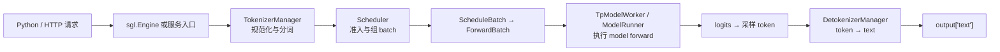
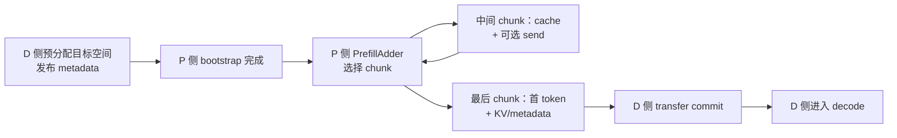

# 0｜SGLang Serving State 对象地图：先找入口，再查职责

> 这篇是“源码导航页”，不是一篇完整机制教程。它只回答三个问题：对象在哪里创建、保存什么、下一步交给谁。
> 第一次接触 SGLang 先读下面的“总览”，再读第 1 节的两条主线；不要从头背完所有类名。
> 完整调用树只放在两条主线上；对象卡统一给“入口 → 输出”，可选分支只标出新增对象和入口。

相关的完整推导放在 [第1篇：Full Attention KV Cache](../1_sglang_full_attention_kv_cache/1_sglang_full_attention_kv_cache.md) 和 [第2篇：MLA/DSA latent cache](../2_sglang_mla_dsa_latent_cache/2_sglang_mla_dsa_latent_cache.md)。

## 总览：先从一次生成请求认识 SGLang

如果这是第一次看 SGLang，先只读这一节；下面原有的 `## 0` 才是 Serving State 的深入地图。第一遍暂时不要碰 DSA、KDA、MoE、CUDA Graph 或并行通信，先回答一个简单问题：`engine.generate()` 怎样从 prompt 走到 `output["text"]`？

把 SGLang 先看成一个“接收请求、组织 batch、执行模型、返回文本”的推理运行时：



这张图是本项目当前普通文本生成路径的概念图，不是所有平台和 backend 的完整调用树。真实代码中，`Engine`、`TokenizerManager` 通常在调用进程，scheduler 和 detokenizer 由独立进程承载；它们通过内部通信交接请求和结果。

### 最小外部契约

先用一个普通模型跑通离线 Engine，不需要自定义模型或特殊 cache 参数：

```python
# 教学最小例子：可运行，但省略异常处理
import sglang as sgl

prompts = ["用一句话介绍 SGLang。", "推理引擎解决什么问题？"]
sampling_params = {"temperature": 0.2, "top_p": 0.95, "max_new_tokens": 32}

with sgl.Engine(model_path="Qwen/Qwen2.5-0.5B-Instruct") as engine:
    outputs = engine.generate(prompts, sampling_params)

for output in outputs:
    print(output["text"])
```

这个例子对应仓库中的 [offline batch inference 示例](../../examples/runtime/engine/offline_batch_inference.py)；`Engine` 的公共导出在 [`sglang/__init__.py`](../../python/sglang/__init__.py#L66-L68)。`prompts` 可以是一个字符串，也可以是一组字符串；列表只表示请求输入是 batch，不表示 GPU 必须按列表边界执行。

### 一条源码导航卡

| 这一跳 | 真实入口 | 上一跳交给它什么 | 它交给下一跳什么 |
|---|---|---|---|
| 创建运行时 | [`Engine.__init__`](../../python/sglang/srt/entrypoints/engine.py#L244-L306) | `model_path` 等 `ServerArgs` 参数 | `TokenizerManager`、scheduler、detokenizer |
| 建立请求 | [`Engine.generate`](../../python/sglang/srt/entrypoints/engine.py#L372-L480) | `prompt`、`sampling_params` | `GenerateReqInput` |
| 规范化与分词 | [`TokenizerManager.generate_request`](../../python/sglang/srt/managers/tokenizer_manager.py#L770-L826) | `GenerateReqInput` | tokenized request、请求状态 |
| 调度与执行 | [`Scheduler.run_batch`](../../python/sglang/srt/managers/scheduler.py#L4020-L4200) | 已准入的请求 | `ScheduleBatch`、worker 调用 |
| 模型 forward | [`TpModelWorker.forward_batch_generation`](../../python/sglang/srt/managers/tp_worker.py#L593-L639) → [`ModelRunner.forward`](../../python/sglang/srt/model_executor/model_runner.py#L1582-L1645) | 当前 batch | logits 和执行侧副作用 |
| 返回文本 | [`TokenizerManager._handle_batch_output`](../../python/sglang/srt/managers/tokenizer_manager.py#L2187-L2360) | detokenizer 的 token/text 片段 | `output["text"]` |

读完这张表，先不要继续追 kernel。下一层的 `Req`、`ReqToTokenPool`、allocator、physical pool 和 radix tree，正是本页后半部分要解释的 Serving State：它们回答“请求运行时的地址和持久数据由谁拥有”，而不是重新定义一次生成 API。

### 教学等价状态循环

下面把多个异步组件压成一个不可直接运行的短循环，只为了建立“旧状态 + 当前输入 → 输出 + 新状态”的感觉：

```python
# 教学等价伪代码：不是 SGLang 原码
state = {"input_ids": tokenize(prompt), "output_ids": [], "finished": False}
while not state["finished"]:
    batch = scheduler.pick_runnable(state)
    logits = model_runner.forward(batch)
    token_id = sample(logits, sampling_params)
    state["output_ids"].append(token_id)
    state["finished"] = should_stop(token_id)
return {"text": detokenize(state["output_ids"])}
```

真实项目中，tokenizer 侧的请求累计状态由 `ReqState` 持有，调度侧还有 `Req`/`ScheduleBatch`，GPU 持久 K/V 则由 physical pool 持有；上面的 `state` 只是把 producer → owner/carrier → consumer 压缩成一条线。接下来进入 `## 0` 时，优先问“这个字段的 owner、定位 ID、写入点和消费者是谁”。

如果只想完成整体入门，可以在这里停下；如果要查 cache 地址，再继续读下面两条真实代码导航。

## 0. 阅读边界

本文先固定最容易追的主线：单个 CUDA worker、普通 Full Attention、非 unified-memory 的静态 KV pool、启用普通 prefix cache、没有 speculative decoding、DCP/CP/SWA；为避免再引入分支，先不展开 chunk cache 和替代 radix backend。MLA、DSA、Mamba/Linear Attention 只在第 5 节说明“多了什么对象”。

源码链接按当前工作区的函数附近行号写；当前 main 已在文档使用的 db017 快照之后，行号漂移时以函数名为准。链接的目标是本地源码，适合在 VS Code 中边看边跳。

### 第一遍只记四句话

1. `Scheduler` 决定这一轮哪些请求可以运行；它不亲自算 attention。
2. `TpModelWorker` 是执行侧的包装，`ModelRunner` 才持有模型运行资源并调用 forward。
3. `ReqToTokenPool` 管“请求 row → token loc”的表；allocator 管“哪些 loc/page 还能发”。
4. physical pool（GPU 上的持久 Tensor）保存真正的 K/V；radix cache（前缀索引树）保存可复用前缀的地址记录和保护状态。

先忽略权重加载、TP/NCCL、CUDA Graph、采样和 disaggregation。只有当它们改变你正在追的对象或地址时，再回来看对应分支。

如果当前只在补第1篇：按 `0 → 1.1 → 1.2 → 2.1–2.5 → 3` 顺读即可；第 5、6、7、8、9 节都是按需查询。

## 1. 两条真实代码导航

### 1.1 启动：pool 和 prefix tree 不是同一个入口

下面是普通非 speculative 路径。缩进中的每一层都是为了告诉你“上一层从哪里进来”；中间包装函数可以先不读实现，但不要从地图上删掉。

~~~text
Scheduler.__init__
├─ init_model_worker()                                      call: scheduler.py:553 / def:1047
│  ├─ init_tp_model_worker()                                → 创建 self.tp_worker
│  ├─ maybe_init_draft_worker()                             → 普通路径得到 None
│  ├─ init_memory_pools()                                   scheduler.py:1020
│  │  └─ init_target_memory_pool()                          scheduler.py:1006
│  │     └─ self.tp_worker.alloc_memory_pool()              tp_worker.py:407
│  │        └─ self.model_runner.alloc_memory_pool()        model_runner.py:881
│  │           ├─ init_kv_cache_configurator()               call:886 / def:605
│  │           │  └─ 只组装 configurator，不建 pool
│  │           ├─ KVCacheConfigurator.configure()           configurator.py:296
│  │           │  ├─ _resolve_memory_pool_config()           容量计算（可跳）
│  │           │  ├─ _derive_pool_sizes()                   容量计算（可跳）
│  │           │  └─ _init_pools()                          configurator.py:397
│  │           │     ├─ _build_req_to_token_pool()          configurator.py:938
│  │           │     ├─ _build_token_to_kv_pool()           configurator.py:1125
│  │           │     └─ _build_token_to_kv_pool_allocator() configurator.py:1832
│  │           └─ _init_post_memory_pool_components()
│  │              └─ init_kv_index_translator()
│  ├─ init_all_attention_backends()                         → backend
│  └─ init_all_cuda_graphs()                                → graph

（init_model_worker() 返回后）
└─ kv_cache_builder.build_kv_cache()                        scheduler.py:559
   └─ CacheInitParams → TreeCacheBuildContext(params=...) → registry.create_tree_cache()
      └─ 本节假设下得到 UnifiedRadixCache
~~~

把这条链拆成两段理解：

- `TpModelWorker.alloc_memory_pool()` 主要是 worker 边界的转发层（还会把共享引用传给额外 runner 并做容量检查）。真正“选择池类型、建 Tensor、返回 allocator”的下一站是 `ModelRunner.alloc_memory_pool()` → `KVCacheConfigurator.configure()` → `_init_pools()`。
- `init_tp_model_worker()` 先只看它的出口即可：[`init_tp_model_worker`](../../python/sglang/srt/managers/scheduler.py#L955-L971) 在普通 CUDA 分支把 `self.tp_worker` 实例化为 `TpModelWorker`；权重加载和并行组装先跳过。
- `init_kv_cache_configurator()` 只把模型、page size、dtype 等参数装进 configurator，不会创建 K/V Tensor；`configure()` 中的 config resolve / size derive 是容量计算，先看懂它们的输入输出即可，细节可以跳到 `_init_pools()`。
- 如果已经点进 `_init_pools()`，继续按三个 builder 找就够了：[req builder](../../python/sglang/srt/mem_cache/kv_cache_configurator.py#L938-L966) 建映射 row，[pool builder](../../python/sglang/srt/mem_cache/kv_cache_configurator.py#L1125-L1245) 建 physical pool，[allocator builder](../../python/sglang/srt/mem_cache/kv_cache_configurator.py#L1832-L1959) 建地址分配器。它们是同一个初始化阶段的三个分支，不是三次独立初始化。
- 如果 `_init_pools()` 顶部命中了 unified-memory fast path，就会改走统一 buffer 的构建逻辑，不会按这里的三个普通 builder 顺序下钻；那是另一条按需分支。
- `build_kv_cache()` 使用已经建好的 pool/allocator，另行装配 prefix tree。它是 `init_model_worker()` 之后的阶段，不是 `TpModelWorker.alloc_memory_pool()` 的隐藏下一层。

你在 `init_memory_pools()` 中还会看到 `resolve_decode_retraction_backup()`；它是 disaggregation/retraction 的旁路接线，位于 target pool 和可选 draft pool 之间，不改变本节的 pool 创建主线。

| 你要找的节点 | 入口链接 | 这一跳只看什么 |
| --- | --- | --- |
| 调度器启动顺序 | [Scheduler.__init__](../../python/sglang/srt/managers/scheduler.py#L553-L559) | `init_model_worker` 后才到 `build_kv_cache` |
| target pool 入口 | [init_memory_pools → init_target_memory_pool](../../python/sglang/srt/managers/scheduler.py#L1006-L1033) | guard 通过后调用 `tp_worker.alloc_memory_pool()` |
| worker 包装层 | [TpModelWorker.alloc_memory_pool](../../python/sglang/srt/managers/tp_worker.py#L407-L433) | 传递共享 pool/allocator，再转给 runner |
| 真正的 pool 装配 | [ModelRunner.alloc_memory_pool](../../python/sglang/srt/model_executor/model_runner.py#L881-L903) → [init_kv_cache_configurator](../../python/sglang/srt/model_executor/model_runner.py#L605-L630) | 调用 configurator，接收 result 并挂到 runner |
| configurator 内部 | [configure](../../python/sglang/srt/mem_cache/kv_cache_configurator.py#L296-L329) → [_init_pools](../../python/sglang/srt/mem_cache/kv_cache_configurator.py#L397-L510) | 配置 → sizing → 三类 pool 结果 |
| tree 装配 | [build_kv_cache](../../python/sglang/srt/mem_cache/kv_cache_builder.py#L197-L330) → [create_tree_cache](../../python/sglang/srt/mem_cache/registry.py#L199-L250) | `CacheInitParams` 放进 `TreeCacheBuildContext`，再选择 tree 实现 |

### 1.2 一次请求：从匹配到 kernel

~~~text
等待队列中的 Req
  → prefix match / 准入
  → ScheduleBatch.prepare_for_extend()                  schedule_batch.py:2504
     └─ alloc_for_extend()                              allocation.py:282
        ├─ 分配 request row
        ├─ 分配本轮 out_cache_loc
        └─ 写入 req_to_token 表
  → Scheduler.run_batch()                               scheduler.py:4020
     └─ model_worker.forward_batch_generation()          scheduler.py:4188 附近
        ├─ ForwardBatch.init_new()                      forward_batch_info.py:723
        └─ ModelRunner.forward()                        model_runner.py:1582
           └─ attention backend 读历史、写新 K/V
  → 结果处理、prefix insert/解锁、row 与可淘汰地址回收
~~~

请求链中最容易漏掉的中间入口是 `alloc_for_extend()`：`prepare_for_extend()` 不是“已经拿到地址”，它只是准备字段并调用分配函数。`ForwardBatch` 也不是第二份持久缓存，它只把这一轮需要的 rows、长度、读表和写位置整理成执行输入。

| 源码入口 | 上一站给它什么 | 它交给下一站什么 |
| --- | --- | --- |
| [Req.init_next_round_input → tree_cache.match_prefix](../../python/sglang/srt/managers/schedule_batch.py#L1390-L1495) | token 序列、tree cache | `prefix_indices`、节点句柄 |
| [ScheduleBatch.prepare_for_extend](../../python/sglang/srt/managers/schedule_batch.py#L2504-L2585) | 请求的 prefix/extend 长度 | `out_cache_loc`、`req_pool_indices` |
| [alloc_for_extend](../../python/sglang/srt/mem_cache/allocation.py#L282-L370) | row、allocator、页大小 | 写回映射表的 loc |
| [Scheduler.run_batch](../../python/sglang/srt/managers/scheduler.py#L4020-L4200) | 已准备好的 `ScheduleBatch` | 调用当前 `model_worker` |
| [TpModelWorker.forward_batch_generation](../../python/sglang/srt/managers/tp_worker.py#L593-L660) | `ScheduleBatch` | `ForwardBatch` 和 runner 输出 |
| [ForwardBatch.init_new](../../python/sglang/srt/model_executor/forward_batch_info.py#L723-L795) | 调度侧 batch | GPU/本轮 metadata view |
| [ModelRunner.forward](../../python/sglang/srt/model_executor/model_runner.py#L1582-L1645) | forward view | logits、attention 输出及写入副作用 |

### 1.3 三个“主角”怎样分工

| 对象 | 它负责 | 它不负责 | 长期 owner / 生命周期 |
| --- | --- | --- | --- |
| `Scheduler` | 准入、预算、batch 组织、结果回写 | 不保存 K/V 数值、不执行 kernel | 调度状态；进程内长期存在 |
| `TpModelWorker` | worker 边界、把请求交给 runner | 不自己实现 pool sizing 和 attention 数学 | runner 的外层引用 |
| `ModelRunner` | model、pool、allocator、translator、forward | 不决定哪个请求先准入 | 跨 forward 持有运行资源 |
| `KVCacheConfigurator` | 一次性解析配置并创建 pool | 不是运行期 allocator，也不是 tree owner | `configure()` 返回后主要留下结果 |
| `ForwardBatch` | 当前一次 forward 的 tensor/view | 不拥有 persistent KV | 一次 forward 借用，随后丢弃或复用 buffer |

这也回答“为什么 SGLang 看起来像只有 Scheduler”：`Scheduler` 是调度进程中最显眼的控制器，但同一条主线还经过 worker、runner、pool 和 backend。Engine/TokenizerManager 等上层负责接收请求并启动这些组件；不要把整个 SGLang 等同于一个 Scheduler。

读代码时可以先用这个临时判断：看到 `worker.forward_batch_generation()`，是在把调度 batch 搭到执行侧；看到 `runner.forward()`，才是在真正执行模型层和 attention。它不是严格的类定义，只是定位调用层次的捷径。

初始化末尾还会设置 `self.model_worker`：没有 speculative 时它指向 target 的 `tp_worker`，启用 speculative 时才切到 draft worker。这只是当前 forward 的 dispatch 别名，不改变 target pool 的创建入口。[dispatch 位置](../../python/sglang/srt/managers/scheduler.py#L1084-L1092)

## 2. 核心对象卡：每张卡都给出入口和下一站

### 2.1 `Req` / `ReqKvInfo`：请求记录 + 资源进度

**入口 → 输出：** [Req、ReqKvInfo](../../python/sglang/srt/managers/schedule_batch.py#L849-L980) → 调度器用它们计算 prefix、extend 和释放边界。

`Req` 保存业务身份、输入/输出 token 和调度进度；`ReqKvInfo` 把容易混淆的资源状态集中起来。先记这几个字段：

| 字段 | 单位 | 含义 |
| --- | --- | --- |
| `rid` | 业务字符串 | 请求身份 |
| `kv.req_pool_idx` | row ID | 这条请求在 `ReqToTokenPool` 的登记行 |
| `prefix_indices` | token loc 向量 | tree 命中的、可读的旧地址；不是 token ID |
| `kv.cache_protected_len` | token 数 | tree 当前保护的前缀边界 |
| `kv.kv_committed_len` | token 数 | 已提交 K/V 的进度边界 |
| `kv.kv_allocated_len` | token 数 | 请求已拿到地址的范围上界 |
| `kv.mamba_pool_idx` | state slot | 只有 hybrid recurrent 路径才有的另一种资源 |

`cached_len`、`cache_protected_len`、`kv_committed_len` 不要按名字互换：它们的 owner 和更新时间不同。一个 row 存在，只能说明有登记位置，不能说明整行每一列都有有效 K/V。

### 2.2 `ReqToTokenPool`：地址映射表，不是 K/V

**入口 → 输出：** [ReqToTokenPool](../../python/sglang/srt/mem_cache/memory_pool.py#L257-L337) → `req_to_token[row, position] = loc`。

普通路径中它是 GPU `int32` Tensor，形状近似 `[请求行数 + 1, 最大上下文长度]`；第 0 行是 dummy，真实 row 从 1 开始。`free_slots` 是 CPU 侧可用 row 列表，`req_generation` 用来区分同一 row 的不同次使用。

~~~text
token ID（文本是什么）       : [10, 11, 12, 13, 20]
req_to_token[row=3, :]（放哪）: [12, 13, 14, 15, 28]
                                      ↑ loc，不是 token ID
~~~

释放 row 通常只归还 row ID；不要求先把整行旧整数全部清零。真正的有效范围由请求长度、登记状态和本轮读表共同限定。

### 2.3 allocator 与 physical pool：发地址和存数值是两件事

**入口 → 输出：** [alloc_for_extend](../../python/sglang/srt/mem_cache/allocation.py#L282-L370) → allocator 发 loc/page；[MHATokenToKVPool](../../python/sglang/srt/mem_cache/memory_pool.py#L1809-L1931) → [set_kv_buffer](../../python/sglang/srt/mem_cache/memory_pool.py#L2381-L2460) 按 loc 写入每层 K/V。

| 对象 | 管什么 | 典型输出 | 不要误解为 |
| --- | --- | --- | --- |
| `TokenToKVPoolAllocator` | `page_size = 1` 时的 token loc | 一串 flat loc | 已经产生 K/V |
| `PagedTokenToKVPoolAllocator` | `page_size > 1` 时内部按 physical page 管理 | 对外通常返回展开后的 flat loc | 每次 decode 必须新申请一页 |
| `MHATokenToKVPool` | GPU 上跨 forward 保留的 K/V Tensor | `k_buffer[layer]`、`v_buffer[layer]` | prefix tree 或 free list |

页内关系可先只记：`loc = page_id × P + offset`。这里 `T` 是 pool capacity，`P` 是 page size。allocator 决定地址能不能再发；只有当前 forward 的 K/V 写入后，该地址才有可读数值。普通布局下每层大致是 `[T + P, Hkv_local, D]`，其中 `Hkv_local` 是当前 TP rank 的 local KV heads，不是全局 head 数。

### 2.4 `UnifiedRadixCache`：保存“可复用前缀的记录”

**入口 → 输出：** [build_kv_cache → create_tree_cache](../../python/sglang/srt/mem_cache/kv_cache_builder.py#L197-L330) → [UnifiedRadixCache.match_prefix](../../python/sglang/srt/mem_cache/unified_radix_cache.py#L523-L539) → `prefix_indices` 与节点句柄。

正式实现把职责拆开：

| 对象 | 主要职责 | 里面的 `value` 是什么 |
| --- | --- | --- |
| `UnifiedRadixCache` | 对外接入 match/insert/lock/release | 不等于整棵树的所有字段 |
| `UnifiedTreeCore` | 节点、边、匹配、LRU、可淘汰状态 | 树结构元数据 |
| `UnifiedTreeNode` | parent/children、prefix key、component 数据 | 节点级记录 |
| `FullComponent` / `ComponentData` | FULL 状态的 loc、lock、eviction 规则 | 通常是地址/句柄 Tensor，不是 attention 的 V |

`match_prefix()` 给出“哪些旧 loc 可以读”，不自动等于锁定。准入时还要由调度侧增加 lock；请求完成时再插入可复用尾部、解锁，并把真正可回收的地址交回 allocator。树复制的通常是 loc 记录，物理 K/V 仍留在 pool 中。

源码入口：[UnifiedTreeCore 的节点状态](../../python/sglang/srt/mem_cache/unified_cache/unified_tree_core.py#L108-L157)、[TreeCore.match_prefix](../../python/sglang/srt/mem_cache/unified_cache/unified_tree_core.py#L698-L746)、[准入时的 lock](../../python/sglang/srt/managers/schedule_policy.py#L1330-L1354)、[finish/release](../../python/sglang/srt/mem_cache/unified_radix_cache.py#L838-L915)。

### 2.5 `ScheduleBatch` / `ForwardBatch` / backend：本轮执行视图

**入口 → 输出：** [ScheduleBatch.prepare_for_extend](../../python/sglang/srt/managers/schedule_batch.py#L2504-L2585) → [ForwardBatch.init_new](../../python/sglang/srt/model_executor/forward_batch_info.py#L723-L795) → backend metadata。

| 字段 | 长度/单位 | 作用 |
| --- | --- | --- |
| `req_pool_indices` | batch size 个 row ID | 每条 batch lane 去查哪一行 |
| `seq_lens` | 每条请求一个有效长度 | attention 可读到哪里 |
| `prefix_lens` / `extend_lens` | 每条请求各一个 token 数 | 旧 prefix 与本轮新算范围 |
| `out_cache_loc` | 本轮新 token 数 | 当前 K/V 写到哪里 |
| `input_ids` / `positions` | 本轮新 token 数 | 模型本轮处理什么 |

两条请求新增 6 和 2 个 token 时，`req_pool_indices` 仍长 2，但 `input_ids` 与 `out_cache_loc` 通常长 8。这里是 request 粒度切换到 token 粒度的地方。

`ForwardBatch` 可能借用 `ScheduleBatch` 的 Tensor；它不是跨请求共享的缓存容器。backend metadata 再把 row/loc/length 转成 page table、ragged offsets 或 sparse indices。**读表**描述历史在哪里，**write loc** 描述本轮新结果写哪里，二者不能互换。

## 3. 用一个 A/B 例子把对象接起来

只看普通 paged MHA，取教学用 page size `P = 4`。树中已有 prefix `[10, 11, 12, 13]`，位于 page 3，所以 flat loc 是 `[12, 13, 14, 15]`。A 和 B 共享这个只读 prefix。

| 现场 | A | B | 所属层 |
| --- | --- | --- | --- |
| token IDs | `[10,11,12,13,20,21]` | `[10,11,12,13,30]` | `Req` |
| request row | `3` | `5` | `ReqToTokenPool` |
| prefix loc | `[12,13,14,15]` | `[12,13,14,15]` | tree → mapping |
| 新写入 loc | `[28,29]` | `[40]` | allocator → `out_cache_loc` |
| 完整有效长度 | `6` | `5` | `seq_lens` |

合并成一个 forward：

~~~text
req_pool_indices = [3, 5]       # 两条请求的 row
seq_lens         = [6, 5]       # 两条请求各自可读长度
input_ids        = [20, 21, 30] # 本轮新增 token，共 3 个
out_cache_loc    = [28, 29, 40] # 三个新 K/V 的写地址
~~~

这几个数字的关系是：

1. tree 先返回共享 prefix 的 loc；match 本身不复制 K/V。
2. allocator 再给 A、B 的 suffix 发不同 loc，并把它们写入各自 row。
3. forward 用 prefix loc 读旧 K/V，用 `out_cache_loc` 写新 K/V。
4. A 完成时可以释放 row 3；共享 prefix 要先解除保护，再由 eviction、重复插入或清理路径决定何时回到 allocator。

A 的 row 恰好等于 page 3 只是示例巧合。row、page ID、flat loc 和 NodeId 属于不同 ID 空间。

## 4. ID 与长度速查

### 4.1 整数先问“它数的是什么”

| 名称 | 例子 | owner | 能否直接当普通 KV 地址 |
| --- | --- | --- | --- |
| `rid` | `A` | `Req` | 否 |
| token ID | `21` | 输入/输出 token 序列 | 否 |
| sequence position | `5` | 请求内位置 | 否 |
| request row | `3` | `ReqToTokenPool` | 否，需查表 |
| flat token loc | `29` | token allocator / pool | 普通 flat pool 可以 |
| physical page ID | `7` | paged allocator | 否，还要页内 offset |
| tree `NodeId` | `42` | `UnifiedTreeCore` | 否，只定位树节点 |
| recurrent state slot | `9` | `MambaSlotAllocator` | 否，它是另一种 state 地址 |

### 4.2 长度也有 owner

| 名称 | 先理解成 | 不要直接等同于 |
| --- | --- | --- |
| `prefix_indices` 长度 | tree 本次返回的可复用 token 数 | 整条请求已算长度 |
| `cache_protected_len` | tree 当前保护到的边界 | allocator 已分配上界 |
| `kv_committed_len` | 已提交 K/V 的进度 | 本轮 query 数 |
| `kv_allocated_len` | 请求记录的已分配范围 | physical buffer 总容量 |
| `extend_lens` | 本轮每条请求新增多少 | batch 中请求条数 |
| `seq_lens` | 每条请求本轮可读的完整长度 | `out_cache_loc` 的长度 |

## 5. 按需分支：只看“多出来的对象”

### 5.1 MLA

普通 MLA 不再把每层 K/V 展开成所有 head，而是由 [MLATokenToKVPool](../../python/sglang/srt/mem_cache/memory_pool.py#L4329-L4650) 保存 compressed latent 和 RoPE 分量，常见行形状近似 `[T + P, 1, r + s]`。这里 `T` 是 pool capacity，`P` 是 page size，`r`、`s` 来自模型配置。先沿用“同一个 loc 找到本层持久数值”的心智模型；payload shape 和 getter 再去读第2篇。

### 5.2 DSA

[DSATokenToKVPool](../../python/sglang/srt/mem_cache/memory_pool.py#L4796-L5574) 在 MLA 主池旁增加 [IndexKeyCache](../../python/sglang/srt/mem_cache/index_key_cache.py#L14-L183)。主 latent、index K/scale 仍通过 loc 对齐，但 sidecar 是另一块物理存储；[Indexer](../../python/sglang/srt/layers/attention/dsa/dsa_indexer.py#L1480-L1565) 生成本轮 score/top-k，[DSAMetadata](../../python/sglang/srt/layers/attention/dsa_backend.py#L209-L298) 携带 page/length/offset 等执行元数据，sparse backend 再消费这些结果。SM80/SM86 的 sidecar 按 BF16 行保存，SM90+ 才走 FP8+scale 紧凑布局。top-k 是 query-dependent 的执行结果，不是 prefix tree 永久保存的 token 列表。

### 5.3 Mamba / Linear Attention

这条路径把寻址粒度从“每个历史 token 的 loc”换成“每条序列的 state slot”：[HybridReqToTokenPool](../../python/sglang/srt/mem_cache/memory_pool.py#L1193-L1408) 维护 row→slot 映射，[MambaSlotAllocator](../../python/sglang/srt/mem_cache/allocator/mamba.py#L30-L97) 分配 slot，[MambaPool](../../python/sglang/srt/mem_cache/memory_pool.py#L371-L414) 保存 state。row 3 和 slot 9 可以同时存在，但不能互当地址。

### 5.4 `draft_worker` 到底是什么

`draft_worker` 是 speculative decoding 的可选第二个 worker，不是普通路径中的隐藏主角。[maybe_init_draft_worker](../../python/sglang/srt/managers/scheduler.py#L973-L1003) 在启用 spec 时创建它；随后 [init_memory_pools](../../python/sglang/srt/managers/scheduler.py#L1020-L1033) 把 target 的 `req_to_token_pool` 和 allocator 传给它。没有 speculative 时 `draft_worker is None`，这整段可跳过。

## 6. 正式 SGLang 与 mini-SGLang：只做职责翻译

不要按类名一一对应，按“谁拥有哪种状态”对应：

| 正式 SGLang | mini-SGLang | 共同直觉 | 关键差异 |
| --- | --- | --- | --- |
| `Scheduler` + `PrefillAdder` | `Scheduler` + prefill manager → `PrefillAdder` | 选择本轮请求、做 prefix match 和预算检查 | 正式调度分支更多 |
| `TpModelWorker` + `ModelRunner` | `Engine` + `Context` | 模型执行资源和当前 batch 入口 | mini 把多个正式边界合并了 |
| `ReqToTokenPool` | `TableManager` + `Context.page_table` | row → loc 的映射 | mini 还另有 token-ID `token_pool` |
| token allocator | `CacheManager` free list | 发可用 page/loc | page 单位和 sentinel 规则不同 |
| `MHATokenToKVPool` | `MHAKVCache` | loc → 持久 K/V 数值 | Tensor layout 不同 |
| `UnifiedRadixCache` + TreeCore | `RadixPrefixCache` | match/insert/lock/evict | 正式把 component/state 拆开 |
| `ForwardBatch` + backend metadata | `Batch` + `ForwardInput` | 组织一次 forward 的读写参数 | mini 没有同名中间类 |

mini 的 `Engine` 不是正式 SGLang 的 `TpModelWorker` 别名；它更像把启动、资源挂载和一部分执行入口合并后的教学对象。用 mini 理解数据流，用正式源码确认字段、单位和生命周期。

## 7. 按问题选源码路线

每条路线只读“入口 → 下一站 → 要回答的问题”。读完能回答问题就停，不必顺着整个文件滚到底。

| 你遇到的问题 | 从这里开始 | 下一站 | 读完应能说清 |
| --- | --- | --- | --- |
| 为什么找不到 `TpModelWorker.alloc_memory_pool` | [scheduler.py: init_target_memory_pool](../../python/sglang/srt/managers/scheduler.py#L1006-L1018) | `tp_worker.py:alloc_memory_pool` → `model_runner.py:alloc_memory_pool` | wrapper 不是 pool 创建者 |
| pool 具体在哪建 | [ModelRunner.alloc_memory_pool](../../python/sglang/srt/model_executor/model_runner.py#L881-L903) | `KVCacheConfigurator.configure` → `_init_pools` | result 中返回哪三个核心对象 |
| prefix 命中后地址从哪来 | [Req.init_next_round_input → tree_cache.match_prefix](../../python/sglang/srt/managers/schedule_batch.py#L1390-L1495) | `alloc_for_extend` | 旧 prefix loc 和新 suffix loc 如何拼接 |
| 本轮到底写哪 | [ScheduleBatch.prepare_for_extend](../../python/sglang/srt/managers/schedule_batch.py#L2504-L2585) | `ForwardBatch.init_new` → `ModelRunner.forward` | `out_cache_loc` 与 read table 的区别 |
| 请求结束为什么不清空整个 pool | [UnifiedRadixCache finish](../../python/sglang/srt/mem_cache/unified_radix_cache.py#L838-L915) | [release_kv_cache](../../python/sglang/srt/mem_cache/common.py#L254-L296) | row、cached prefix、physical buffer 的释放边界 |
| 碰到 MLA/DSA 名字 | [MLATokenToKVPool](../../python/sglang/srt/mem_cache/memory_pool.py#L4329-L4650) | `DSATokenToKVPool` → `IndexKeyCache` | 多的是 payload/sidecar/backend，不是新一套 row 语义 |

## 8. 容易误判的名字

| 看到 | 先不要理解成 | 更安全的读法 |
| --- | --- | --- |
| `token_pool` | K/V 大张量 | 先查它保存 token ID 还是 cache Tensor |
| `slot` | 一定是 token loc | 看 owner：row、page、token 或 recurrent state |
| `value` | attention 的 V | tree 中常是 loc/句柄，必须看 component |
| `page_table` | 一定是 page ID | mini 的 context 表可能是 flat loc，backend 表才是 page ID |
| `cached_len` | 全仓库同一个长度 | 先看谁写、谁读、何时更新 |
| `free` | 删除 GPU Tensor | 通常只是归还 row/page 的可分配资格 |
| `RadixAttention` | 每层现场查 radix tree | 它是模型层到 attention backend 的接口 |
| `HybridBackend` | 已实现 Mamba/KDA state 管理 | mini 中它主要分流 prefill/decode |
| `topk_indices` | 一定是 physical loc | 查 producer/consumer 的 ID 契约 |

## 9. 最后自测：不用背实现细节

1. `init_memory_pools()` 里面为什么看不到 `ModelRunner.alloc_memory_pool()`？请沿 `init_target_memory_pool()` 和 `TpModelWorker.alloc_memory_pool()` 补上中间两跳。
2. `ReqToTokenPool`、allocator、physical pool、radix tree 各自拥有哪一种状态？
3. A、B 共享 prefix loc 时，为什么可以共享旧 K/V，却不能共用同一个可写 recurrent state slot？
4. 为什么两个请求的 `req_pool_indices` 长度可以是 2，而 `out_cache_loc` 长度是 3 或 8？
5. 请求完成后，什么可以立刻归还，什么要等 unlock/eviction，什么始终是全局 backing Tensor？

如果这五题能用第 3 节的 A/B 数字回答，Atlas 的目标就达到了。接下来要深入机制时，回到第1篇的 Full Attention 分配/回收主线；要追 latent、index sidecar 或 state slot，再进入第2篇或后续 Linear Attention 文档。


图只用于查“谁引用谁、谁保存什么”；阅读顺序仍以第 1 节的真实调用链为准。

## 10. Chunked prefill：SGLang 到底按什么选择一次 forward

> 本补充以当前工作区 main `862c483241c15211bc3456e005c693e8bcffe2a4` 为分析基线，主线仍是普通自回归 generation；dLLM、HiSparse、SWA/Mamba 等只在会改变预算或传输 payload 时点出。main 继续演进时，以链接中的函数名和字段关系为准。

### 10.1 先给结论：不是一个 `max_extend_tokens`

mini-SGLang 很容易给人一种印象：prefill 每轮只要做

$$
E = \min(\text{remaining prompt},\ \text{max\_extend\_tokens})
$$

然后把这 $E$ 个 token 交给一次 forward。正式 SGLang 的确也有一个“每轮最多延伸多少输入 token”的旋钮，但它只是 `PrefillAdder` 的一个预算。一次 admission 必须同时通过三类约束：

| 预算 | 代码中的字段 | 它回答的问题 | 典型来源 |
|---|---|---|---|
| 输入预算 | `rem_input_tokens` | 这轮还能把多少新的 prompt token 放入 prefill batch？ | [`max_prefill_tokens`](../../python/sglang/srt/server_args.py#L728-L739) |
| chunk 预算 | `rem_chunk_tokens` | 这一轮 prefill pass 还剩多少 extend token；单请求时就是它的上限 | `chunked_prefill_size`，或 PP dynamic chunking 的预测值 |
| 总状态预算 | `rem_total_tokens`、`cur_rem_tokens` | 分配新 KV、输出预留、页对齐、已有运行请求之后，物理状态还放得下吗？ | allocator 可用量 + tree 可驱逐量 - offset |

设 $q$ 为 page size，$R$ 为当前请求未命中的 prompt 尾部，$C$ 为这个 prefill pass 尚未消费的 chunk 预算。通过总容量门之后，`add_one_req` 的核心选择可以近似写成：

$$
\widehat R = \left\lceil\frac{R}{q}\right\rceil q,\qquad
E =
\begin{cases}
R, & C=\text{None}\ \text{或}\ \widehat R\le C,\\
\left\lfloor\frac{C}{q}\right\rfloor q, & \widehat R>C.
\end{cases}
$$

最后一个 chunk 可以只有 $R$ 个真实 token，不必填满一页；预算记账仍按 $\widehat R$ 扣减。若有 `truncation_align_size`，中间 chunk 还会继续向下对齐。`rem_total_tokens`/`cur_rem_tokens` 不是简单塞进上式的另一个 `min`：`add_one_req` 会先用完整候选的 `total_tokens` 做容量拒绝，可能直接返回 `NO_TOKEN`；已有 chunk 的下一轮才在 `add_chunked_req` 中用 `min(rem_chunk_tokens, rem_total_tokens)` 决定可继续的长度。`rem_input_tokens` 则主要是 pass 级继续/停止门：每加入请求后由 `_update_prefill_budget` 扣减，耗尽后通常不再接纳后续请求。真正的分支应以 [`PrefillAdder.add_one_req`](../../python/sglang/srt/managers/schedule_policy.py#L1177-L1404)、[`add_chunked_req`](../../python/sglang/srt/managers/schedule_policy.py#L973-L1022) 和 [`_update_prefill_budget`](../../python/sglang/srt/managers/schedule_policy.py#L833-L889) 为准。

当 `rem_chunk_tokens is None`（例如 `chunked_prefill_size=-1`）时不会进入中间 chunk 分支；`max_prefill_tokens` 仍参与 batch admission，但源码对空 `can_run_list` 的第一条请求保留了“先接纳再记账”的特殊路径。不要把关闭 chunking 理解成“任何超过 `max_prefill_tokens` 的单请求都立刻拒绝”。

### 10.2 配置值怎样进入 scheduler

`Scheduler.init_chunked_prefill()` 从 schedule 配置读取 `chunked_prefill_size`，非正值会转成 `None`，而 multimodal + Transformers backend 会主动禁用这一功能；同一个入口还决定是否打开 mixed chunk 和 PP dynamic chunking。见 [`init_chunked_prefill`](../../python/sglang/srt/managers/scheduler.py#L1221-L1259)。

配置解析和运行时覆盖可以按下面的顺序读：

`ServerArgs.chunked_prefill_size` 先经过 schedule 配置和 GPU-memory hook 的默认值解析，再由 `Scheduler.init_chunked_prefill()` 归一化；每轮 `_get_new_batch_prefill_raw()` 用它建立 `PrefillAdder`，最后由 `add_one_req()` / `add_chunked_req()` 消费。这样读比把配置值直接当成 forward 长度更准确。

在 [`server_args.py`](../../python/sglang/srt/server_args.py#L713-L718) 中，这个参数的语义就是“一个 chunk 的最大 token 数”；`-1` 表示关闭。没有用户显式设置时，[`handle_gpu_memory_settings`](../../python/sglang/srt/arg_groups/memory_hook.py#L62-L150) 会按 GPU memory 选择一个启发式值（例如小显存通常是 2048，中等显存可能是 4096/8192，更大显存可能是 16384）。这不是 prompt 长度，也不是 decode batch size；它是 admission 时用于切分 extend 的上限。DP attention 还会在 [`parallel_hook.py`](../../python/sglang/srt/arg_groups/parallel_hook.py#L191-L207) 按 DP size 缩小它；除 decode-disagg 的特殊验证路径外，正数值必须满足 page-size 对齐约束（[`validation_hook.py`](../../python/sglang/srt/arg_groups/validation_hook.py#L101-L107)）。

这里有两个容易混淆的“动态”：

1. **GPU-memory 默认值**只在用户没有提供值时补一个初始 chunk size。
2. **PP dynamic chunking**是在已有 chunked request 继续执行时，根据历史长度和 profile predictor 临时替换本轮的 `chunked_prefill_size`；调用入口在 [`_get_new_batch_prefill_raw`](../../python/sglang/srt/managers/scheduler.py#L3599-L3606)，预测器在 [`predict_next_chunk_size`](../../python/sglang/srt/managers/scheduler_pp_mixin.py#L770-L802)。所以调试日志里某一轮的实际 chunk 可以和启动参数不同（可能变小，也可能变大，但受 `max_prefill_tokens`、context length 和 page alignment 约束），不代表配置被改写。

### 10.3 一次调度 pass 的真实主线

下面只保留和问题有关的代码骨架；标记为“源码压缩片段”，变量名和调用顺序对应当前 main，省略了优先级、LoRA、hicache 等旁支。

```python
# 源码压缩片段：scheduler.py:_get_new_batch_prefill_raw
chunk_limit = self.chunked_prefill_size
if self.chunked_req is not None and self.enable_dynamic_chunking:
    chunk_limit = self.predict_next_chunk_size(
        len(self.chunked_req.prefix_indices)
    ) or chunk_limit

adder = PrefillAdder(
    self.page_size,
    self.tree_cache,
    self.token_to_kv_pool_allocator,
    running_batch,
    self.new_token_ratio_tracker.current,
    self.max_prefill_tokens,  # rem_input_tokens
    chunk_limit,               # rem_chunk_tokens
    running_bs if self.is_mixed_chunk else 0,
    ...,
)

if self.chunked_req is not None:
    self.chunked_req.init_next_round_input()
    self.chunked_req = adder.add_chunked_req(self.chunked_req)

for req in self.waiting_queue:
    req.init_next_round_input(self.tree_cache)
    result = adder.add_one_req(req, ...)
    if result != AddReqResult.CONTINUE:
        break

if adder.new_chunked_req is not None:
    self.chunked_req = adder.new_chunked_req
if self.chunked_req is not None:
    self.chunked_req.inflight_middle_chunks += 1

batch = ScheduleBatch.init_new(..., chunked_req=self.chunked_req)
batch.prepare_for_extend()
```

对应的真实入口是 [`get_next_batch_to_run`](../../python/sglang/srt/managers/scheduler.py#L3342-L3489) → [`get_new_batch_prefill`](../../python/sglang/srt/managers/scheduler.py#L3511-L3536) → [`_get_new_batch_prefill_raw`](../../python/sglang/srt/managers/scheduler.py#L3538-L3793)。这条链说明了“选择”发生在哪里：scheduler 先处理上一轮 chunk 的缓存/合并，再让 `PrefillAdder` 依据当前池状态构造 `can_run_list`，最后由 `ScheduleBatch.prepare_for_extend()` 把每条请求的 `extend_range` 变成 forward 输入和写地址。

可以把 producer、owner、carrier、consumer 写成一张小表：

| 阶段 | producer | owner / carrier | consumer |
|---|---|---|---|
| 预算建立 | scheduler、allocator、tree cache | `PrefillAdder.rem_*` | `add_one_req` / `add_chunked_req` |
| 选择区间 | `Req.init_next_round_input` 提供 prefix/full ids | `Req.extend_range`、`adder.can_run_list` | `ScheduleBatch` |
| forward 读写 | `prepare_for_extend` | `input_ids`、prefix loc、`out_cache_loc` | attention backend / model runner |
| 中间 chunk 生命周期 | batch result processor | `Scheduler.chunked_req`、`inflight_middle_chunks` | 下一轮 scheduler 或最终采样 |

### 10.4 `add_one_req` 的两个分支

先定义四个读代码时要反复代入的量：

* $P = \lvert\texttt{req.prefix\_indices}\rvert$：prefix tree 命中的、已经有 K/V 的长度。
* $L = \lvert\texttt{req.full\_untruncated\_fill\_ids}\rvert$：完整 prompt（含命中 prefix）。
* $R = L-P$：本轮真正需要计算的 prompt 尾部。
* $C = \texttt{chunk\_tokens\_limit}$：当前 pass 尚未消费的共享 chunk 预算，可能还受到 SWA 或 dynamic chunking 限制。

在锁定 tree node 并再次检查池预算后，正式代码有一个非常关键的二分：

```python
# 源码压缩片段：schedule_policy.py:add_one_req
input_tokens = ceil_paged_tokens(
    len(req.full_untruncated_fill_ids) - len(req.prefix_indices)
)

if chunk_tokens_limit is None or input_tokens <= chunk_tokens_limit:
    # 整个剩余 prompt 一次提交
    req.set_extend_range(
        len(req.prefix_indices), len(req.full_untruncated_fill_ids)
    )
    self.can_run_list.append(req)
    self._update_prefill_budget(prefix_len, input_tokens, max_new_tokens, ...)
else:
    # 至少保留一个 page，并向下按 page 对齐
    trunc_len = chunk_tokens_limit // self.page_size * self.page_size
    req.set_extend_range(
        len(req.prefix_indices), len(req.prefix_indices) + trunc_len
    )
    self.can_run_list.append(req)
    self.new_chunked_req = req
    self._update_prefill_budget(prefix_len, trunc_len, 0, ...)
```

这是对 [`add_one_req` 的 full/chunk 分支](../../python/sglang/srt/managers/schedule_policy.py#L1301-L1404) 的教学压缩。要注意三个细节：

1. `input_tokens` 是 page-ceil 后的估计，真正的 `extend_range` 还会再次向下对齐；所以实际 chunk 可以比配置值小，而不会跨页写入。
2. **完整分支**把 `max_new_tokens` 计入总预算，因为最后一个 prompt chunk 之后还要为该请求保留 decode headroom；**中间 chunk 分支**传 `max_new_tokens=0`，避免在每个中间段重复预留输出空间。
3. `total_tokens = cand_extend_input_len + max_new + page_size` 在前面先做一次快速拒绝，拿到 tree lock 后又检查一次；这正是“chunk 上限足够”仍然可能因为 KV/页/状态不够而不能准入的原因。

### 10.5 中间 chunk 怎样回到下一轮

假设 `page_size = 4`、没有 prefix 命中、prompt 长度为 18、有效 `C = 8`，忽略显存总预算的额外拒绝：

| forward | `prefix_indices`（进入前） | 本轮 `extend_range` | 是否还有尾部 |
|---|---:|---|---|
| 1 | 0 | `[0, 8)` | 是 |
| 2 | 8 | `[8, 16)` | 是 |
| 3 | 16 | `[16, 18)` | 否，变成最后一个 prefill chunk |

第一轮 `add_one_req` 进入 chunk 分支并把 `self.chunked_req` 指向该请求。下一轮 [`get_next_batch_to_run`](../../python/sglang/srt/managers/scheduler.py#L3368-L3380) 会先把上一段新增 KV stash/cache，再把这个请求从“已完成可合并”的集合中排除；随后 `add_chunked_req` 用

```python
_rem_tokens = min(self.rem_chunk_tokens, int(self.rem_total_tokens))
```

重新计算本轮最多能追加多少，并更新 `extend_range`（真实代码见 [`add_chunked_req`](../../python/sglang/srt/managers/schedule_policy.py#L973-L1022)）。因此 chunk 不只是把一个长 `input_ids` 切成 Python 列表；每一轮前缀都要经过 cache owner 的提交，下一轮才能把它当作可读 prefix。

`stash_chunked_request` 最终会调用 [`maybe_cache_unfinished_req`](../../python/sglang/srt/mem_cache/common.py#L161-L166)，树 cache 的实现会把已完成的有效前缀插回 radix 结构（[`UnifiedRadixCache.cache_unfinished_req`](../../python/sglang/srt/mem_cache/unified_radix_cache.py#L925-L985)）。batch result 侧用 `inflight_middle_chunks` 区分“中间段还没结束”和“可以输出/释放”：[`process_batch_result_prefill`](../../python/sglang/srt/managers/scheduler_components/batch_result_processor.py#L240-L454) 在中间段只递减计数、更新 chunked logprob，不把它当成最终完成。

### 10.6 多请求和 mixed chunk：`C` 是这一轮共享的

`chunked_prefill_size` 初始化的是 `PrefillAdder.rem_chunk_tokens`，而 `_update_prefill_budget` 会在每加入一条请求后从中扣掉 page-ceil 后的 extend 长度。因此它既是单条请求不可能超过的上限，也是**这一轮 prefill batch 共享的 chunk budget**：前面的短请求可以先完整加入，后面的长请求只能使用剩余量并成为 `new_chunked_req`。所以 batch 的 `extend_num_tokens` 可以由多个请求的片段组成，但通常不会超过本轮有效的初始 $C$；它还会同时受 `rem_input_tokens`、物理池和 request-row 数量约束。某条请求的剩余 prompt 小于当前 `rem_chunk_tokens` 时，它直接走完整分支，不会为了“凑满 chunk”人为补 token。

例如 `page_size=16`、本轮有效 $C=8192$：请求 A 的未命中尾部是 5000，B 的未命中尾部是 10000。A 走完整分支，但预算按 $\lceil5000/16\rceil\times16=5008$ 扣掉；B 只能拿到剩余 3184（仍是 page 对齐的中间 chunk），而不是再拿一个独立的 8192。这个小例子正是正式 SGLang 与 mini 中“共享 `token_budget`”的共同直觉。

`enable_mixed_chunk` 是另一个开关：打开后，scheduler 可以把新 prefill chunk 与已有 running decode batch 合成一个 forward（[`mixed-style chunked prefill`](../../python/sglang/srt/managers/scheduler.py#L3813-L3846)）。它主要改变“prefill 和 decode 是否同一轮发射”，但也会把 `running_bs` 作为 `num_mixed_decode_tokens` 从 `rem_input_tokens` 和 `rem_chunk_tokens` 中扣掉（[`PrefillAdder.__init__`](../../python/sglang/srt/managers/schedule_policy.py#L478-L514)），所以 decode token 多时，可留给 prefill 的共享预算会相应变小。调试时先分开问：

1. 这条请求本轮拿了多少 `extend_range`？——看 `PrefillAdder` 和 `Req`。
2. 这轮是否同时带了 decode 请求？——看 `is_mixed_chunk` 和 `new_batch.decoding_reqs`。

### 10.7 和 mini-SGLang 的精确对照

| mini-SGLang | 正式 SGLang | 不能忽略的差别 |
|---|---|---|
| `SchedulerConfig.max_extend_tokens` | `chunked_prefill_size`（本轮可由 PP dynamic predictor 覆盖） | 都初始化一次 prefill pass 的共享 extend budget；正式版还按 page、SWA/Mamba、allocator 和 tree cache 再裁剪 |
| `prefill_budget` | 主要对应 `rem_chunk_tokens`，正式版另有 `rem_input_tokens` | 正式版把 chunk budget 和 prefill-batch 输入停止预算拆开维护 |
| `reserved_size` / decode in-flight | `rem_total_tokens`、`cur_rem_tokens`、running-batch offset | 正式版把物理 KV、输出预留、页 overhead、状态 slot 一起纳入 admission |
| `ChunkedReq` | `Scheduler.chunked_req` + `Req.inflight_middle_chunks` | 正式版还要和 radix cache、overlap/PP/PD 生命周期对接 |

所以一个可操作的近似是：

> mini 的 `max_extend_tokens` 大致对应正式 SGLang 的 `chunked_prefill_size`，但绝不等于“正式 SGLang 一次 forward 的全部预算”。

如果只想定位“为什么这轮不是 8192”，按这个顺序查：

1. `Scheduler.chunked_prefill_size` 是否被设成 `None`、被 DP 除小，或被 PP dynamic predictor 替换。
2. 请求的 `prefix_indices` 命中了多少，剩余 $R$ 是否本来就小于上限。
3. `PrefillAdder.rem_input_tokens`、`rem_total_tokens`、`cur_rem_tokens` 是否先耗尽。
4. page size / `truncation_align_size` 是否把候选值向下裁掉。
5. 如果只关心“是否和 decode 同轮”，再查 `enable_mixed_chunk`，不要把它和 chunk size 混为一谈。

## 11. PD 分离：同一个 prompt 的 KV 怎样从 P 侧交给 D 侧

### 11.1 PD 不是把一个 scheduler 横向切成两半

PD（Prefill/Decode disaggregation）把两个阶段放到两个 scheduler/进程上：P 侧负责 prompt 的 prefill 和 KV 发送，D 侧负责接收 KV、提交首个采样 token，然后继续 decode。仓库用 [`DisaggregationMode.NULL/PREFILL/DECODE`](../../python/sglang/srt/disaggregation/utils.py#L101-L112) 选择事件循环；[`dispatch_event_loop`](../../python/sglang/srt/managers/scheduler.py#L5442-L5469) 再按 mode 和 overlap/PP 选择具体实现。部署参数和 transfer backend 示例另见仓库的 [PD Disaggregation 指南](../../docs/docs/advanced_features/pd_disaggregation.mdx)；本节只追状态 owner 和请求生命周期。

用户请求仍然只有一个 `rid`，但它在 P、D 两侧各有一份本地 `Req` 和各自的 pool row。跨进程真正交接的是：

* KV page（或 flat/unified-memory 地址经过 transfer translation 后的 page index）；
* 最终 chunk 的 metadata，包括 P 侧采出的第一个 output token、cached-token 统计、logprob/采样 mask，以及必要的 recurrent/index state payload；
* bootstrap room、TP/PP/DP rank 等传输协议状态。

因此不要把 PD 理解成“P 把 GPU Tensor 指针交给 D”。D 侧先分配自己的目标页和 metadata slot，P 侧再按照 D 给出的接收协议写入/发送；两边的 row ID 不需要相同，且不能直接互相解引用。

### 11.2 两边各自拥有的队列

| 侧 | 队列 / owner | 主要职责 | 进入下一阶段的条件 |
|---|---|---|---|
| P | `PrefillBootstrapQueue` | 建 sender、握手、等 D 侧 destination/metadata 能用 | bootstrap 完成后移到 P 的 waiting queue |
| P | 普通 `waiting_queue` + `PrefillAdder` | 按第 10 节的规则选择完整或中间 chunk，运行 forward | 每个 chunk 的 KV 可发送；最后 chunk 进入 inflight |
| P | `disagg_prefill_inflight_queue` | 非阻塞轮询最后一段 KV transfer | transfer success 后释放 P 侧请求状态并返回结果 |
| D | `DecodePreallocQueue` | 为 prompt KV 预分配目标 row/page（可利用 D 侧 prefix hit），并为 decode 留容量余量 | `send_metadata` 发布 destination 后进入 transfer queue |
| D | `DecodeTransferQueue` | 轮询网络/IPC transfer，读取 metadata，commit 首 token | success 后把请求放入 D 的 waiting queue |
| D | `waiting_queue` → decode batch | 普通 decode admission/forward | 每个生成 token 继续循环 |

P 侧模块文件开头就把这条生命周期写成三段：bootstrap → waiting/`PrefillAdder` → inflight/轮询（[`prefill.py` module doc](../../python/sglang/srt/disaggregation/prefill.py#L1-L18)）。D 侧对应的 prealloc owner 是 [`DecodePreallocQueue`](../../python/sglang/srt/disaggregation/decode.py#L316-L390)，transfer owner 则是 [`DecodeTransferQueue`](../../python/sglang/srt/disaggregation/decode.py#L2020-L2057)。

### 11.3 一条 P→D 的时序图

```mermaid
sequenceDiagram
    participant C as Client/Router
    participant P as Prefill scheduler
    participant PB as P BootstrapQueue + Sender
    participant DQ as D PreallocQueue + Receiver
    participant D as Decode scheduler

    C->>P: request(prompt, sampling params)
    P->>PB: create_sender + bootstrap handshake
    C->>D: same request metadata / bootstrap room
    D->>DQ: allocate destination row/pages
    DQ-->>PB: destination metadata + prefix boundary
    PB-->>P: bootstrap complete → waiting_queue
    P->>P: PrefillAdder chooses chunk and forward
    P->>PB: send_kv_chunk(middle, page-aligned)
    P->>P: cache unfinished chunk; schedule next chunk
    P->>PB: send_kv_chunk(last, KV pages + output metadata)
    PB-->>DQ: transfer completion / metadata ready
    DQ->>D: commit first output token + cached stats
    D->>D: waiting_queue → normal decode batch
    D-->>C: streamed output tokens
```

这张图故意把“destination 先分配、source 后发送”画出来。真正的事件循环分别在 [`event_loop_normal_disagg_prefill`](../../python/sglang/srt/disaggregation/prefill.py#L594-L631) 和 [`event_loop_normal_disagg_decode`](../../python/sglang/srt/disaggregation/decode.py#L2448-L2485)；overlap 版本只是把 result/transfer 的 CPU 轮询与下一次 forward 交错，并没有改变 owner 关系。

### 11.4 P 侧：chunk 的选择和发送是同一条生命周期，但不是同一个函数

PD P 侧每轮仍然调用普通的 [`get_new_batch_prefill`](../../python/sglang/srt/disaggregation/prefill.py#L568-L592)，所以第 10 节的 `PrefillAdder` 规则完全适用。PD 额外插入的是“上一 chunk 的 transfer 进度处理”：

```python
# 源码压缩片段：prefill.py
def get_next_disagg_prefill_batch_to_run(running_batch, last_batch):
    self.resolve_waiting_queue_bootstrap()
    self.process_prefill_chunk(last_batch, running_batch)
    plan = self.get_new_batch_prefill(running_batch)
    return plan

def process_prefill_chunk(last_batch, running_batch):
    if self.chunked_req is not None:
        maybe_cache_unfinished_req(self.chunked_req, self.tree_cache, chunked=True)
        if self.enable_overlap:
            self.chunked_req.tmp_end_idx = min(
                self.chunked_req.extend_range.end,
                len(self.chunked_req.origin_input_ids),
            )
        else:
            self.send_kv_chunk(self.chunked_req)
```

这是 [`get_next_disagg_prefill_batch_to_run`](../../python/sglang/srt/disaggregation/prefill.py#L568-L592) 和 [`process_prefill_chunk`](../../python/sglang/srt/disaggregation/prefill.py#L1081-L1112) 的压缩片段。`maybe_cache_unfinished_req(..., chunked=True)` 的作用是让下一轮 prefill 能读到上一轮已经写好的前缀；`send_kv_chunk` 的作用是把这些已写好的页交给 D。两者都处理“当前 chunk”，但一个更新 P 侧 cache owner，一个触发跨节点 transfer，不能相互替代。

`run_batch` 还支持在 forward 发射前可选地早发已经命中的 prefix（[`maybe_send_cached_prefix_chunk`](../../python/sglang/srt/disaggregation/prefill.py#L1124-L1161)）；这只优化传输重叠，不改变 `PrefillAdder` 对未命中 suffix 的选择。

### 11.5 `send_kv_chunk` 究竟发送什么

把 [`send_kv_chunk`](../../python/sglang/srt/disaggregation/prefill.py#L1163-L1351) 读成下面三个动作最清楚：

1. **确定范围。** `start_idx = req.start_send_idx`，`end_idx` 来自本轮 `extend_range.end`；非最后 chunk 向下 page-align，不能把半页提前发走。
2. **翻译地址。** 从 P 侧 `req_to_token_pool` 取出 loc，再用 allocator 的 `translate_kv_indices_for_transfer` 转成 transfer engine 要用的 physical/page indices。
3. **最后一段附带状态。** `last_chunk=True` 时填 metadata buffer，并根据 `state_types` 生成 Mamba/SWA/DSA/C128 等附加 state indices；然后 sender 对每个 segment 调 `send(page_indices, state_indices, num_kv_tokens=...)`。

如果启用了 staging buffer，非最后 chunk 还要按 `staging_grid_tokens(get_schedule().chunked_prefill_size, page_size)` 对齐网格（[`send_kv_chunk` staging 分支](../../python/sglang/srt/disaggregation/prefill.py#L1181-L1193)）。这解释了一个很实用的现象：**普通 chunk 的计算边界由 `PrefillAdder` 预算决定，staging 的传输分段边界还可能受同一个 chunk size 的 page/grid 约束。**

P 侧最终结果处理把“中间 chunk”和“最后 chunk”分开：当 `inflight_middle_chunks > 0` 时只递减计数，必要时发送 `last_chunk=False`；计数归零时追加 `next_token_id`、写 metadata，并发送 `last_chunk=True`（[`process_batch_result_disagg_prefill`](../../python/sglang/srt/disaggregation/prefill.py#L684-L859)）。所以 PD 的首个生成 token 是最终 prefill forward 的结果，不是每一个 prompt chunk 都采一个 token。

### 11.6 D 侧：它不选择 prompt chunk，只准备接收空间和 decode 余量

D 侧收到请求后，`DecodePreallocQueue.add()` 创建 receiver 并排队；[`pop_preallocated`](../../python/sglang/srt/disaggregation/decode.py#L1195-L1337) 会检查可撤回 token、pool/metadata 容量和 `max_new_tokens`/reserved decode headroom，然后为该请求建立目标映射。如果启用了 D 侧 radix cache，它先匹配并锁住本地 prefix，只为缺失的 prompt 尾部分配/发布目标页。预分配完成后，它把目标 page indices、metadata buffer index、state indices 和 `decode_prefix_len` 通过 `send_metadata` 发布给 P：

```python
# 源码压缩片段：decode.py:pop_preallocated
decode_req.metadata_buffer_index = metadata_allocator.alloc()
page_indices = kv_to_page_indices(kv_indices, kv_transfer_page_size)
state_indices = [...]  # 与 P 侧 state_types 对齐
decode_req.kv_receiver.send_metadata(
    page_indices,
    decode_req.metadata_buffer_index,
    state_indices,
    decode_prefix_len=total_prefix_len,
)
decode_transfer_queue.extend([decode_req])
```

真实发送点在 [`pop_preallocated`](../../python/sglang/srt/disaggregation/decode.py#L1474-L1532)，而不是 `get_next_disagg_decode_batch_to_run`；后者只在 transfer 成功后把 ready request 组成 decode batch（[`get_next_disagg_decode_batch_to_run`](../../python/sglang/srt/disaggregation/decode.py#L2559-L2590)）。这就是为什么“chunk 怎么切”要去看 P 侧 `PrefillAdder`，不能在 D 侧 decode scheduler 里找一个同名 `max_extend_tokens`。

transfer 成功后，D 侧 [`_commit_transfer_to_req`](../../python/sglang/srt/disaggregation/decode.py#L2059-L2211) 从 metadata buffer 读取 `output_id` 和 cached-token/logprob/state 信息，追加首个 output token，清掉 receiver，再由 [`process_decode_queue`](../../python/sglang/srt/disaggregation/decode.py#L2667-L2701) 放入 D 的 waiting queue。之后才进入普通 decode forward；D 不会重新对 prompt 做 prefill，也不会重新选择 P 侧的 chunk 边界。

### 11.7 PD 下谁在什么时候拥有哪份状态

| 状态 | P 侧何时拥有/修改 | D 侧何时拥有/修改 | 释放边界 |
|---|---|---|---|
| P 的 `Req` row、P 的 KV pages | bootstrap 后分配；每个 chunk forward 写入 | 不可直接读 P 的 row/page | transfer 成功后 P 调 `release_kv_cache`，并解锁 P tree |
| D 的 `Req` row、目标 KV pages | 只知道由 D metadata 发布的目标 | prealloc 时分配，transfer 时填充，之后供 decode 读写 | D 请求完成或失败时按 decode cache 生命周期释放 |
| metadata buffer | 最后 chunk 写 output id、统计和 state payload | `_commit_transfer_to_req` 读取 | transfer commit 后归还 metadata index |
| bootstrap / transfer queue entry | sender/inflight queue 跟踪发送进度 | receiver/transfer queue 跟踪接收进度 | success/failure poll 后移除；失败路径可能延迟释放 |

P 侧只有在 transfer poll 为 `Success` 后才释放自己的 KV/锁（[`process_disagg_prefill_inflight_queue`](../../python/sglang/srt/disaggregation/prefill.py#L876-L979)）。这也是 unified-memory 模式需要 move gate 的原因：只看 queue 是否为空不够，已经发布给 peer、但尚未完成 transfer 的 page 仍不能搬家（[`unified_memory_disagg_move_gate`](../../python/sglang/srt/disaggregation/utils.py#L115-L151)）。

### 11.8 PD 与 chunked prefill 的交叉点

把两者叠在一起时，顺序应记成：



所以：

* PD 不会把 `chunked_prefill_size` 变成 D 侧的 decode chunk 配置；prompt 的切分仍由 P 侧 `PrefillAdder` 决定。
* D 侧为缺失的 prompt KV 分配目标页，同时把 `max_new_tokens`/reserved decode tokens 纳入容量检查；它等待 P 分段填充，不等于 D 侧也逐段执行 prompt forward。
* 开启 staging 时，P/D 两侧都要使用一致的 page/grid 协议；`chunked_prefill_size` 会影响传输网格，但仍不能替代 `rem_total_tokens` 等计算 admission 预算。
* overlap 只改变“何时调用 `send_kv_chunk`、何时轮询结果”的时间关系，不改变 chunk 的 owner 和最终 transfer 成功前的释放边界。

## 12. mini-SGLang 与正式 SGLang：为什么看起来一个简单、一个复杂

### 12.1 mini 其实也有“真 chunk”，只是状态面更窄

mini-SGLang 的 `SchedulerConfig` 把 `max_extend_tokens` 暴露成配置，scheduler 初始化时把它放进 `prefill_budget`（[`Scheduler.__init__`](https://github.com/sgl-project/mini-sglang/blob/9a91cfafe754aa85daee49998176275667eb58f2/python/minisgl/scheduler/scheduler.py#L45-L73)）；其 `PrefillManager`/`PrefillAdder` 在 pending request 仍有剩余 prompt 时构造 `ChunkedReq`，下一轮复用同一个 request/table/cache 状态。这里把 mini 的对照固定在 commit `9a91cfafe754aa85daee49998176275667eb58f2`，可以沿 [`SchedulerConfig`](https://github.com/sgl-project/mini-sglang/blob/9a91cfafe754aa85daee49998176275667eb58f2/python/minisgl/scheduler/config.py#L14-L37)、[`PrefillAdder` 与 chunk continuation](https://github.com/sgl-project/mini-sglang/blob/9a91cfafe754aa85daee49998176275667eb58f2/python/minisgl/scheduler/prefill.py#L32-L151)、[`PrefillManager.schedule_next_batch`](https://github.com/sgl-project/mini-sglang/blob/9a91cfafe754aa85daee49998176275667eb58f2/python/minisgl/scheduler/prefill.py#L117-L162) 逐跳核对。

所以更公平的说法不是“mini 只有一个固定 forward”，而是：

* mini 用一个会逐请求递减的 `token_budget` 同时表达这轮 prefill pass 的总 extend 上限和当前请求可用的 chunk，再用 `reserved_size` 表达 cache 压力；
* 正式 SGLang 保留同样的 chunk 直觉，再加上 page alignment、prefix tree、running decode、SWA/Mamba state、PP/DP、overlap 和 PD transfer 的生命周期；
* 两者都可能对一个长 prompt 做多次 forward，差别在于正式版本一次 admission 的约束和跨组件交接更多。

### 12.2 一张“职责而不是类名”的映射

| 观察问题 | mini 的答案 | 正式 SGLang 的答案 |
|---|---|---|
| 本轮从 prompt 取多少？ | `token_budget` / `max_extend_tokens` | `rem_chunk_tokens` 与 `rem_input_tokens` 共同裁剪，再过总状态预算 |
| prefix 命中后从哪里继续？ | `cached_len`、table handle | `prefix_indices`、`last_node`、tree lock、`Req.extend_range` |
| 中间 chunk 之后如何续？ | `ChunkedReq` 放回 pending/front | `Scheduler.chunked_req`，先 stash/cache，再 `init_next_round_input` + `add_chunked_req` |
| 什么时候产生 output token？ | 最后一个 prefill/forward 完成后 | `inflight_middle_chunks` 清零的最终 prefill chunk；PD 下再写 transfer metadata |
| 谁消费 KV？ | 同一个 Engine 内的 decode | 普通模式是同一 scheduler；PD 模式是 D 侧独立 pool/receiver |

用一句近似关系记忆：

$$
\texttt{mini.max\_extend\_tokens}
\ \approx\ \texttt{SGLang.chunked\_prefill\_size}
\ \ne\ \text{SGLang 的完整 admission 规则}。
$$

这里的“不等于”很重要：如果只把正式 SGLang 的 `chunked_prefill_size` 抄成 mini 的 `max_extend_tokens`，会漏掉“本轮 batch 还剩多少 `max_prefill_tokens`”以及“allocator/tree cache 是否真的能承受这一段”的两个外层门槛。

### 12.3 从 mini 迁移到正式源码的五步

1. 先在 scheduler 里找到 [`_get_new_batch_prefill_raw`](../../python/sglang/srt/managers/scheduler.py#L3538-L3793)，确认本轮传给 `PrefillAdder` 的实际 `chunk_limit`。
2. 再在 request 上打印 `len(prefix_indices)`、`len(full_untruncated_fill_ids)`、`extend_range`，区分 cache hit 与本轮新计算。
3. 同时观察 `rem_input_tokens`、`rem_chunk_tokens`、`rem_total_tokens`，不要只打印一个 chunk size。
4. 如果是 PD，继续看 P 的 `start_send_idx`/`pending_chunk_rids` 和 D 的 `metadata_buffer_index`/transfer queue；不要在 D 的 decode batch 中寻找 prompt chunk 决策。
5. 最后才判断是否需要 `enable_mixed_chunk`、overlap、staging 或 dynamic chunking；这些是发射/传输策略，不能代替基本 chunk 选择。

## 13. 按现象反查 chunk 和 PD 状态

下面的表适合直接贴到调试笔记里。每一行先看左侧现象，再跳到 owner，而不是从 transfer backend 或 CUDA kernel 反向猜。

| 现象 | 首先查看 | 通常意味着什么 |
|---|---|---|
| 长 prompt 仍然一次性 prefill | `Scheduler.chunked_prefill_size`、`req.extend_range` | chunk 被关闭，或剩余未命中 prompt 本来就不超过有效上限 |
| 配置 8192，但本轮只有 4096/更少 | `rem_chunk_tokens`、`rem_input_tokens`、`rem_total_tokens`、page size | 前面的请求已消费共享 chunk budget，或 batch 总输入/物理 KV/页对齐先成为瓶颈；也可能是 DP 除小或 PP dynamic override |
| 每轮都只得到一个 page | `trunc_len`、`page_size`、`truncation_align_size` | 候选预算被向下 page/attention split 对齐，或只剩一个可用页 |
| 下一轮没有继续同一请求 | `self.chunked_req`、`stash_chunked_request`、`inflight_middle_chunks` | 上一 chunk 没有正确提交/cache，或请求已进入最终 chunk/abort 路径 |
| P 侧 forward 完了但 D 侧没有 decode | P `pending_bootstrap` / `disagg_prefill_inflight_queue`、D `DecodePreallocQueue` | bootstrap、destination prealloc 或 transfer 尚未成功；还没到 decode scheduler |
| D 已发 metadata，P 没有发送页 | P `start_send_idx`、`send_kv_chunk`、`disagg_prefill_pending_chunk_rids` | P 侧 chunk 尚未 materialize，或非最后 chunk 等待 page/grid 对齐 |
| P 侧 transfer 成功但仍看到 page 被占用 | `process_disagg_prefill_inflight_queue`、tree lock/ref | 先确认 sender poll 是否真的 `Success`；成功后才会 `release_kv_cache`，tree eviction 仍可能延后物理回收 |
| staging 模式启动即报参数错误 | `chunked_prefill_size % page_size`、MLA/CP/PP 限制 | staging 需要正的 page-aligned grid，并有 backend/parallelism 限制 |
| mixed chunk 延迟变化但 chunk 长度没变 | `is_mixed_chunk`、`new_batch.decoding_reqs` | 这是 prefill/decode 是否同轮发射的变化，不是 `PrefillAdder` 重新切分 |

### 13.1 一个最小的打印清单

不改算法时，给 scheduler 加临时 debug 日志，至少把下面字段成组打印；单独打印 `chunked_prefill_size` 信息不足：

```text
rid
len(prefix_indices)
len(full_untruncated_fill_ids)
extend_range.start / extend_range.end
chunked_prefill_size（本轮 effective 值）
adder.rem_input_tokens / adder.rem_chunk_tokens
adder.rem_total_tokens / adder.cur_rem_tokens
inflight_middle_chunks

PD-P: pending_bootstrap / start_send_idx / pending_chunk_rids
PD-D: metadata_buffer_index / transfer_queue / receiver.poll()
```

这些字段分别落在 `Req`、`PrefillAdder`、P transfer owner 和 D transfer owner 四个状态域；把它们混成一个“当前长度”会再次回到第 4 节所说的 ID/长度误读。

## 14. 补充后的自测：能不能解释“为什么这一轮是这几个 token”

1. `chunked_prefill_size=8192` 时，一个已有 6000-token prefix hit、剩余 10000-token 的请求，第一轮候选 extend 从哪一个长度开始算？哪些预算还会把它裁小？
2. 为什么 `rem_chunk_tokens` 足够，但 `rem_total_tokens` 不足时仍然不能 admission？请指出 page overhead、`max_new_tokens` 和 running-batch offset 分别在哪更新。
3. 中间 chunk forward 结束后，为什么要先 `maybe_cache_unfinished_req`，并且不能立即把请求当成 decode 完成？请用 `inflight_middle_chunks` 解释。
4. PD 模式下，哪个侧决定 prompt chunk？哪个侧先分配目标页？首个 output token 通过哪个 metadata buffer 从 P 到 D？
5. 为什么 P 侧 transfer 成功前不能移动/释放已发布 page，即使请求已经从当前 forward batch 消失？请沿 `pending_chunk_rids`、inflight queue 和 unified-memory move gate 说清楚。
6. 如果只想让 prefill 和 decode 同一轮发射，应该查哪个开关；如果想改变 prompt 每轮最大 extend，又应该查哪个字段？

一句话收束这篇 Atlas 的新增部分：**正式 SGLang 的“真正 chunked prefill”由 P 侧 `PrefillAdder` 在多重预算下选择 `extend_range`，由 `Scheduler.chunked_req` 保存跨轮状态；PD 只是在这条 chunk 生命周期旁边增加 D 侧 destination preallocation、KV transfer 和最终 metadata commit，并没有把 chunk 选择搬到 D 侧。**
