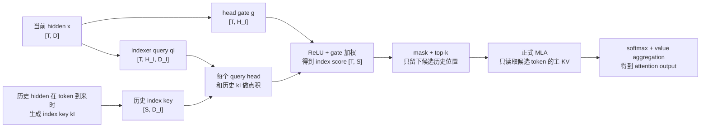
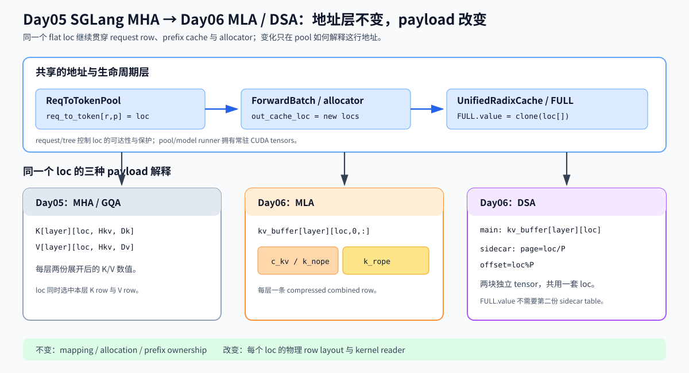
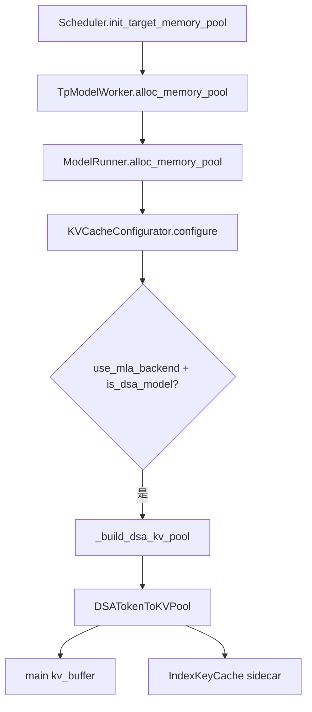
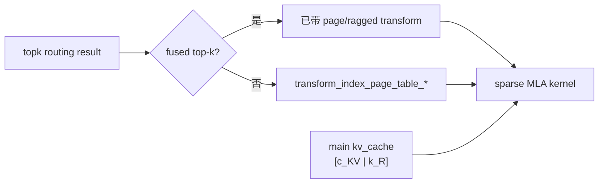

# 2｜先搞懂 DSA，再看 SGLang 如何把它做成 KV Cache

> 本文从零解释 DSA，不假设你读过 DSA 论文、DeepSeek-DSA 实现或 SGLang 的其他缓存文档。先回答“DSA 在计算上做了什么”，再回答“这些中间结果为什么要这样存”，最后才进入 SGLang 的 pool、allocator、metadata 和 backend。
>
> **源码基线与主线条件**：按当前 checkout `a478b5d7e74d83a9bcdb31440c2ffd64b01a2d66`（2026-09-08 核对）阅读；主线固定 CUDA、decoder-only、eager、普通 DSA/MLA pool（main KV 为 BF16），先忽略 DCP/CP、speculative decoding、HiCache、具体量化后端和 CUDA graph。为让第 5 节的 `self.wk`、`self.weights_proj` 非融合摘录与实际代码一致，可在实验进程设置 `SGLANG_DISABLE_DSA_INDEXER_FUSION=1`；未设置时默认 CUDA 可能走融合路径，正文会明确标注哪些片段只适用于非融合分支。

## 0. 这篇只回答一个问题

**DSA 为什么能少读昂贵的主 KV payload，以及 SGLang 怎样保存它需要的两类历史数据？**

先把整条计算链放在眼前：



图里的 **formal MLA** 先只把它理解成“接收候选主 KV、重新算 logits、做 softmax 和聚合”的最终消费者；本文不在这里重新推导 MLA 的全部吸收矩阵优化。重点是：Indexer 的 `top-k` 只决定它读哪些行。

读图时不要先记类名，只记两种计算：

1. **Indexer**：用便宜的 `qI` 和历史 `kI` 选出候选位置；
2. **Formal attention**：只对候选位置读取真正的 MLA 主 KV，再做正式 attention。

这就是 Sparse Attention 的“稀疏”来源：formal 阶段仍使用 logits、softmax 和 value aggregation 的 attention 形式，但只在筛选出的子集上计算。由于非候选 token 被丢弃，它一般不与 dense attention 数值完全相等；模型训练/设计让这个近似在质量与成本之间可接受。注意，Indexer 仍然要扫描全历史的紧凑 `kI`；省下来的主要是主 KV 的带宽和 formal attention 的计算。

### 0.1 本文的前置假设

只需要知道三件事：

- Transformer block 会产生 hidden states；
- attention 会比较 query 和历史 key，再聚合 value；
- PyTorch 的矩阵乘法、`einsum` 和 `topk` 大致怎么工作。

不知道 MLA、RoPE、FP8、page table、SGLang scheduler 都没关系。它们会在各自第一次出现时定义。

为让后面的地址图可复现，源码主线还假定 prefix/radix cache 已开启、未启用 HiSparse 或 DSA
layer split，普通 CUDA pool 使用 `page_size=64`、`index_head_dim=128`；这些是当前实现的
配置条件，不是 DSA 理论常数。第 10 节只在边界说明其他平台和融合路径。

### 0.2 先把三个词分开

| 词 | 这里的含义 | 不是它 |
|---|---|---|
| DSA | DeepSeek Sparse Attention：先索引筛选、再正式 attention | 不是一种 allocator |
| Indexer | 计算历史 token 的 index score 并产生 top-k 的小模块 | 不是正式 attention kernel |
| KV cache | 把已经算过的历史 K/V 或等价表示保存起来，后续直接读取 | 不是 top-k 结果本身 |

本文的阅读顺序固定为：**先用 dense attention 说明要优化什么 → 用一段小代码跑通 DSA → 解释为什么出现 main/sidecar 两份历史数据 → 再引入 `loc`、pool、metadata 和初始化调用链**。后面的章节不会把后面的运行时对象倒灌回前面的公式。

### 0.3 持久状态的最小闭环（教学等价伪代码）

在进入真实 pool 前，先把“当前输入如何产生两份历史 payload、下一轮如何消费它们”压成一个循环：

```text
# 教学等价实现，不是 SGLang API。
state = {"locs": []}                           # owner：一套共享的地址引用
for token in sequence:
    loc = allocator.alloc_one()               # producer：发放同一个逻辑 loc
    main[loc] = make_main_latent(token)       # owner：MLA main payload
    index[loc] = make_index_key(token)        # owner：DSA sidecar payload
    state["locs"].append(loc)
    candidates = topk(read(index, state["locs"]))        # consumer 1
    output = formal_mla(read(main, candidates))          # consumer 2
```

真实路径中，allocation 生产 `out_cache_loc`，`DSA backend`/`Indexer` 分别写 main 与
sidecar，`DSAMetadata` 携带本轮边界和候选坐标，formal MLA 再读取候选 main rows；finish
或 eviction 时两类 payload 必须随同一 `loc` 的 owner 一起转移/失效。这个循环只表达
producer → owner → consumer 和生命周期，不表示实现真的按 Python token 循环。

## 1. 为什么需要 DSA？先从普通 attention 开始

### 1.1 普通 attention 每次都看完整历史

设当前有 $T_q$ 个 query，历史有 $T_k$ 个 token，每个 head 的维度为 $d$：

$$
Q\in\mathbb{R}^{T_q\times d},
\qquad
K\in\mathbb{R}^{T_k\times d},
\qquad
V\in\mathbb{R}^{T_k\times d_v}.
$$

普通 attention 先计算：

$$
L = \frac{QK^\mathsf{T}}{\sqrt d}
\in\mathbb{R}^{T_q\times T_k},
$$

再做 mask、softmax 和 value 聚合：

$$
Y = \operatorname{softmax}(L)V.
$$

关键成本在 $T_q\times T_k$：历史越长，每个 query 都要和越多的 K 比较，也要从 KV cache 读越多的行。

### 1.2 DSA 把一次读取拆成两次

DSA 引入一个较小的 index 表示：

$$
\text{all history}
\xrightarrow{\text{Indexer}}
\text{top-k candidates}
\xrightarrow{\text{formal MLA}}
\text{output}.
$$

第一阶段不追求完整 attention 输出，只追求一个排序结果：哪些历史 token 更值得被 formal attention 读取？因此 indexer 的输出是：

$$
I\in\mathbb{Z}^{T_q\times k},
$$

其中 $k\ll T_k$，每个元素代表一个候选历史位置。它不是概率，也不是最终的 `softmax` 权重。

### 1.3 DSA 的两个消费者

| 结果 | 谁产生 | 谁消费 | 是否是正式 attention 结果 |
|---|---|---|---|
| `index_score` | Indexer | mask / top-k | 否 |
| `topk_result` | Indexer + metadata transform | sparse MLA backend | 否，它是读取路由 |
| `logits` | formal MLA attention | softmax | 是正式 attention 的输入 |
| `attention output` | formal MLA attention | 后续 Transformer block | 是 |

如果把这四个结果混成一个 `score`，后面就会分不清“为什么有一份 index cache”和“正式 attention 读的是什么”。

## 2. 一轮 DSA 计算：每个量从哪里来？

下面先完全不谈 SGLang 的 pool，只看一轮数学计算。为了易读，使用教学维度；真实模型的数值更大，但依赖关系相同。

### 2.1 输入与维度

为了不把“本轮 query 数”和“历史长度”混在一起，后文明确使用两份张量：

$$
x_q\in\mathbb{R}^{T\times D},
\qquad
x_{hist}\in\mathbb{R}^{S\times D}.
$$

`x_q` 是本轮要发起 query 的 token，`x_hist` 是这些 query 可以看到的历史 token。decode 常见 $T=1$、$S$ 很大；prefill 时 $T$ 可以一次包含多个新 token。

其中：

| 符号 | 含义 | 教学形状 |
|---|---|---|
| $T$ | 本轮 query/token 数 | 例如 2 |
| $D$ | Transformer hidden size | 例如 8 |
| $r_q$ | query 的低秩 latent 维度 | 例如 4 |
| $H_I$ | indexer query head 数 | 例如 2 |
| $D_I$ | 每个 index head 的维度 | 例如 4 |
| $S$ | 当前 query 可见的历史 token 数 | 例如 6 |
| $k$ | 最终保留的候选数 | 例如 2 |

### 2.2 Query 侧：`hidden → q_lora → qI`

先把 hidden 压到 query latent：

$$
q_{\mathrm{lora}} = x_qW_{qA},
\qquad
W_{qA}\in\mathbb{R}^{D\times r_q},
\qquad
q_{\mathrm{lora}}\in\mathbb{R}^{T\times r_q}.
$$

再投影到多个 index query heads：

$$
q^I_{\mathrm{flat}}=q_{\mathrm{lora}}W_{qB},
\qquad
W_{qB}\in\mathbb{R}^{r_q\times(H_I D_I)}.
$$

把最后一维 reshape：

$$
q^I=\operatorname{view}(q^I_{\mathrm{flat}},[T,H_I,D_I]).
$$

这里的 `view` 不是计算，只是把连续的 $H_I D_I$ 拆成“head 数 × head dim”。

### 2.3 History 侧：`hidden → kI`

历史 token $s$ 到来时，生成一份用于索引的 key：

$$
k^I_s=\operatorname{Norm}(x_sW_K),
\qquad
W_K\in\mathbb{R}^{D\times D_I}.
$$

DSA indexer 通常是 MQA 形式：每个历史 token 只有一份 $k^I_s\in\mathbb{R}^{D_I}$，被所有 $H_I$ 个 query heads 共享。这样历史侧不用存 $H_I$ 份重复的 K。

这里的 $x_sW_K$ 是为了讲清楚“历史 token 如何变成可扫描的 index key”的教学抽象，
不是 DeepSeek/SGLang 中逐字对应的一层。真实实现把 `x`、`q_lora`、RoPE、归一化和量化
拆在多个函数及 kernel 中；后文会把这两个真实输入重新对齐。

RoPE 只在需要位置编码的子维度上起作用；本文把它写成 `+ RoPE` 的概念步骤，不展开旋转矩阵细节：

$$
\tilde q^I_{t,j}=\operatorname{RoPE}_t(q^I_{t,j}),
\qquad
\tilde k^I_s=\operatorname{RoPE}_s(k^I_s).
$$

### 2.4 Head gate：为什么还要有 `gate`

indexer 有多个 query heads。每个 head 对同一个历史 token 的判断可以不同，所以再从 hidden 产生每个 head 的权重：

$$
g=x_qW_g,
\qquad
W_g\in\mathbb{R}^{D\times H_I},
\qquad
g\in\mathbb{R}^{T\times H_I}.
$$

真实实现还会加入 $H_I^{-1/2}$、query quant scale 和 softmax scale；先把它们看成对 gate/logit 的缩放，不影响理解数据流。

### 2.5 点积、ReLU、加权汇总、top-k

对 query token $t$、历史 token $s$、index head $j$：

$$
\ell_{t,s,j}
 = \left\langle \tilde q^I_{t,j},\tilde k^I_s\right\rangle
 \in\mathbb{R}.
$$

把所有 head 的结果堆起来：

$$
\ell\in\mathbb{R}^{T\times H_I\times S}.
$$

然后先截断负相关，再按 head gate 汇总：

$$
u_{t,s,j}=\operatorname{ReLU}(\ell_{t,s,j}),
$$

$$
\operatorname{index\_score}_{t,s}
 = \sum_{j=1}^{H_I}g_{t,j}u_{t,s,j}
 \in\mathbb{R}.
$$

最终：

$$
\operatorname{index\_score}\in\mathbb{R}^{T\times S},
\qquad
\operatorname{topk\_result}=\operatorname{TopK}_S(\operatorname{index\_score})
 \in\mathbb{Z}^{T\times k}.
$$

真正进入 `TopK` 前还要应用可见范围 mask：未来位置、padding 位置，以及配置要求保留的首 token/局部 token 会被屏蔽或强制保留。这里的 `S` 表示“对这个 query 合法可见的历史范围”，不是无条件把 batch 中所有 token 都拿来比较。

`topk_result[t,:]` 表示第 $t$ 个 query 选择的历史位置；它不携带正式 attention 的 value，也不等于 `softmax(index_score)`。

### 2.6 最小 PyTorch：先只实现算法，不碰 cache

这是教学等价实现，不是 SGLang 原码。它故意不读取任何历史 cache，先把 DSA 的数学关系跑通。

```python
import torch
import torch.nn.functional as F


def toy_dsa_indexer(x_q, x_hist, W_qA, W_qB, W_K, W_g, top_k):
    """
    x_q:    [T, D]       # 本轮要发起 query 的 token
    x_hist: [S, D]       # 可以被本轮 query 看见的历史 token
    W_qA: [D, r_q]
    W_qB: [r_q, H_I * D_I]
    W_K:  [D, D_I]       # MQA: 每个历史 token 一份 kI
    W_g:  [D, H_I]
    """
    T, _ = x_q.shape
    S, _ = x_hist.shape
    H_I = W_g.shape[1]
    D_I = W_qB.shape[1] // H_I

    q_lora = x_q @ W_qA                       # [T, r_q]
    q_i = (q_lora @ W_qB).view(T, H_I, D_I)  # [T, H_I, D_I]
    k_i = x_hist @ W_K                        # [S, D_I]
    gate = x_q @ W_g                          # [T, H_I]

    # 每个 query token、每个 index head、每个历史 token 的点积
    logits = torch.einsum("thd,sd->ths", q_i, k_i)  # [T, H_I, S]
    logits = F.relu(logits)

    # 把 H_I 个 head 汇总成一个历史位置分数
    index_score = (logits * gate[:, :, None]).sum(dim=1)  # [T, S]
    _, topk_indices = torch.topk(index_score, k=top_k, dim=-1)
    return q_lora, k_i, index_score, topk_indices


torch.manual_seed(0)
x_q = torch.randn(2, 8)                # T=2, D=8
x_hist = torch.randn(6, 8)              # S=6, D=8
W_qA = torch.randn(8, 4)              # r_q=4
W_qB = torch.randn(4, 2 * 4)          # H_I=2, D_I=4
W_K = torch.randn(8, 4)               # MQA key: D_I=4
W_g = torch.randn(8, 2)               # H_I=2
_, _, score, indices = toy_dsa_indexer(
    x_q, x_hist, W_qA, W_qB, W_K, W_g, top_k=2
)
assert score.shape == (2, 6)           # 每个 query 对 S 个历史位置各有一个分数
assert indices.shape == (2, 2)         # 每个 query 只留下 k=2 个位置
```

这段代码的阅读顺序只有五步：

1. `q_lora` 是 query 侧的低秩中间量；
2. `q_i` 拆成多个 query index heads；
3. `k_i` 是每个历史 token 的共享 index key；
4. `index_score` 把 head 维汇总掉；
5. `topk_indices` 只保留候选位置。

这里特意把 `x_q` 和 `x_hist` 分开：`T` 是本轮 query 数，`S` 是可见历史长度。实际 decode 常见 $T=1$、$S$ 很大；如果把它们都写成同一个 `x`，就会把“当前 token 数”和“历史 token 数”误解成一回事。

再用一个不需要跑代码的数字例子确认 `top-k` 的含义。假设某个 query 的 `index_score` 为 `[0.2, 1.7, -0.1, 0.9, 0.4]`，且 $k=2$，那么候选位置是 `[1, 3]`（对应分数 `1.7` 和 `0.9`）。后面的 formal attention 只读取历史 K/V 的第 1、3 行；它仍然要在这两行上重新计算 logits、softmax 和 value 聚合，不能把 `1.7`、`0.9` 当成最终 attention 权重。

真实代码还会插入 RMSNorm/LayerNorm、RoPE、Hadamard/旋转和量化，但它们不会改变这五步的消费者关系。

### 2.7 FP8 量化先放在算法之后

实际 indexer 不一定用 BF16 保存 $q^I$、$k^I$。对一个 quant block，可以把 FP8 计算直觉写成（下面省略了 head/block 下标，源码里的 scale 会保留这些前导维度）：

$$
\operatorname{score}_{t,s}
\approx s^k_s\sum_j
\left(g_{t,j}s^q_t\,H_I^{-1/2}\,\mathrm{softmax\_scale}\right)
\operatorname{ReLU}
\left(\left\langle q^{fp8}_{t,j},k^{fp8}_s\right\rangle\right).
$$

其中：

- $s^q_t$ 是 query 量化 scale；
- $s^k_s$ 是历史 key 所在 quant block 的 scale；
- 多个 quant block 时，需要沿 block 维累加；
- `k_scale` 不是 matmul 完成后对所有结果统一乘的常数，具体反量化通常融合在 FP8 MQA kernel 内。

这一步解释的是“为什么 sidecar 要存 key 和 scale”，但不改变 DSA 的算法顺序。

### 2.8 把教学变量钉到真实代码

到这里再打开源码，先只看“谁把什么交给 Indexer”，暂时不追 pool 和 page。

> **导航卡｜从哪里进 → 看什么 → 下一跳 → 先忽略什么**
>
> - **从哪里进**：`DeepseekV2AttentionMLA.forward` 内的 `forward_absorb_prepare`。
> - **这一段看什么**：`q_lora` 的产生，以及 `hidden_states` 和 `q_lora` 同时传入 `self.indexer(...)`。
> - **下一跳**：`Indexer.forward_cuda(x, q_lora, positions, forward_batch, layer_id)`。
> - **先忽略什么**：alt stream、DCP、LoRA、CUDA graph；它们改变执行安排，不改变这两个输入的契约。

下面是**真实源码的压缩摘录**，保留会改变数据流的语句：

```python
# python/sglang/srt/models/deepseek_common/attention_forward_methods/forward_mla.py
q_lora = None
if self.q_lora_rank is not None:
    q, latent_cache = get_attn_tp_context().fetch_qkv_latent().split(...)
    q = self.q_a_layernorm(q)
    if self.use_dsa:
        q_lora = q                         # query 侧 index latent

    if self.should_run_indexer(prev_topk_indices):
        topk_indices = self.indexer(
            x=hidden_states,               # key/gate 侧输入
            q_lora=q_lora,                  # query 侧输入
            positions=positions,
            forward_batch=forward_batch,
            layer_id=self.layer_id,
        )
```

这段代码把教学公式中的两个来源钉住了：`q_lora` 不是重新从 `hidden_states` 猜出来的，
而是上游 Q/KV latent 准备阶段已经得到的张量；Indexer 还会单独消费原始的
`hidden_states`，用它生成 index key 和 head gate。现在手里有的是“Indexer 的两个输入”，
下一跳才是把它们投影成 `query`、`key` 和 `weights`。

| 教学变量 | SGLang 里先看哪里 | 该结果接下来被谁消费 |
|---|---|---|
| `q_lora` | [`forward_absorb_prepare`](../../python/sglang/srt/models/deepseek_common/attention_forward_methods/forward_mla.py#279-670) | `Indexer.forward_cuda` 的 query 投影 |
| `qI` / `kI` | [`Indexer._get_q_k_bf16`](../../python/sglang/srt/layers/attention/dsa/dsa_indexer.py#462-568) | FP8 MQA logits kernel |
| `gate` | [`_get_logits_head_gate`](../../python/sglang/srt/layers/attention/dsa/dsa_indexer.py#367-373) | FP8 logits 的 head 权重 |
| `index_score` / `topk` | [`_get_topk_ragged`](../../python/sglang/srt/layers/attention/dsa/dsa_indexer.py#1035-1238) 或 [`_get_topk_paged`](../../python/sglang/srt/layers/attention/dsa/dsa_indexer.py#794-975) | `topk_transform`，再交给 sparse MLA |

源码会把若干步骤融合进 CUDA/FP8 kernel，所以函数名不一定逐字出现 `index_score`。先用这张表确认“谁生产、谁消费”，再读 kernel 内部优化。

不要把上面的教学变量和真实张量强行一一等同：`qI` 是对 `_get_q_k_bf16` 输出 query
的概念命名，`kI` 是其 key 的概念命名，真实对象还会经历 RoPE、旋转、FP8 量化和 page
布局转换。下一节先解释这些 index 结果为什么必须和 main MLA payload 分开保存。

## 3. DSA 为什么需要两类历史数据？

现在才引入 cache。因为前一节已经知道 DSA 的两个阶段各自需要什么，所以不会把两份 cache 当成凭空出现的对象。

### 3.1 Indexer 需要什么，formal MLA 需要什么

一个历史 token $s$ 至少会产生两类结果：

| 结果 | 典型形状 | 用途 | 是否需要被全历史扫描 |
|---|---|---|---|
| `kI` | `[D_I]`，通常量化保存 | 计算 index score | 是，Indexer 要扫描 |
| `c_KV` | `[kv_lora_rank]` | MLA 的 latent/value 侧 | 否，只读 top-k |
| `k_R` | `[qk_rope_head_dim]` | MLA 的 RoPE key 侧 | 否，只读 top-k |

所以自然形成两个 payload：

1. **index sidecar**：小、便宜、适合扫描全历史；
2. **main cache**：保存正式 MLA 所需的 `[c_KV | k_R]`，只在候选位置被读取。

如果你刚读完第1篇，可以先用下面这张对照图把“地址契约”和“payload 解释”分开。它固定在
本文的 plain prefix-cache 主线上：`req_to_token[r,p]`、allocator 和 `FULL.value` 仍然管理同一
组 `loc`，变化的是每个 `loc` 在 MHA、MLA、DSA 中分别被哪种 backing tensor 解释。



读图时先看最上层的蓝色区域：它描述请求 row、`out_cache_loc` 和 prefix tree 的共同地址层，
不是另一份 K/V。再向下看三列 payload：第1篇的 `loc` 同时索引 K/V 两个 row，第2篇的 MLA
把 latent 与 RoPE key 放进一条 combined row，DSA 则在这条 main row 旁边增加独立的 index-key
sidecar。后文追 `IndexKeyCache` 时，始终沿着这条“同一 `loc`、不同 carrier”的关系即可。

### 3.2 Formal MLA 如何消费候选行

Indexer 选出候选位置集合 $\mathcal{S}_t$ 后，正式 attention 只取：

$$
\{[c_{KV,s}\;|\;k_{R,s}]\mid s\in\mathcal{S}_t\}.
$$

为了只展示“候选行如何被消费”，下面给一个可以运行的简化 attention。它把 main row
拆成参与 logits 的 `k_R` 和参与 value 聚合的 `c_KV`，并把 absorbed projection 抽象成
identity：因此 logits 同时包含 latent/nope 项和 RoPE 项，value 仍只聚合 `c_KV`。

```python
import torch


def toy_formal_attention(q_nope, q_rope, c_kv_rows, k_rope_rows, topk_indices):
    """
    q_nope:       [T, latent_dim]  # 已吸收投影的 query（教学中取 identity）
    q_rope:       [T, rope_dim]    # RoPE query
    c_kv_rows:    [S, latent_dim]  # value 侧的 MLA latent
    k_rope_rows:  [S, rope_dim]    # logits 侧的 RoPE key
    topk_indices: [T, k]            # Indexer 产生的逻辑历史位置
    """
    selected_c = c_kv_rows[topk_indices]               # [T, k, latent_dim]
    selected_k = k_rope_rows[topk_indices]             # [T, k, rope_dim]
    logits_nope = torch.einsum("td,tkd->tk", q_nope, selected_c)
    logits_rope = torch.einsum("td,tkd->tk", q_rope, selected_k)
    logits = logits_nope + logits_rope
    weights = torch.softmax(logits, dim=-1)             # [T, k]
    output = torch.einsum("tk,tkd->td", weights, selected_c)
    return output, weights


q_nope = torch.randn(2, 6)                              # T=2, latent_dim=6
q_rope = torch.randn(2, 4)                              # T=2, rope_dim=4
c_kv_rows = torch.randn(6, 6)                           # S=6, latent_dim=6
k_rope_rows = torch.randn(6, 4)                         # S=6, rope_dim=4
topk_indices = torch.tensor([[1, 3], [0, 4]])           # T=2, k=2
output, weights = toy_formal_attention(
    q_nope, q_rope, c_kv_rows, k_rope_rows, topk_indices
)
assert output.shape == (2, 6)                           # 输出仍在 latent/value 维
assert weights.shape == (2, 2)
```

这段代码不是完整 MLA，而是为了看清箭头：`topk_indices` 同时选择同一 `loc` 的 `c_KV`
与 `k_R`；latent/nope 与 RoPE 两项共同参与 logits，但 value 只聚合 `c_KV`。真实 MLA
会用 `w_kc` 等 absorbed projection 替换这里的 identity。`weights` 才是候选行上的正式
attention probability，不能把 indexer 的分数直接当成 `weights`。

### 3.3 为什么不能只保存 main cache

如果 indexer 每次都从较大的 `[c_KV | k_R]` 中构造筛选所需的表示，会让“扫描全部历史”也搬运正式 attention 的 payload。sidecar 让 indexer 只读取较小的 `kI_fp8 + scale`。

以常见参数作容量直觉（不是所有模型恒定值）：

- BF16 main：`(512 + 64) × 2 = 1152` bytes/token/layer；
- DSA sidecar：`128 + 4 = 132` bytes/token/layer；
- sidecar 大约是 main payload 的 11.5%。

## 4. 先固定一条真实实现主线

前 3 节已经把算法产物确定下来：Indexer 产生 `topk_indices`，formal MLA 消费候选主 KV。
现在只追这一条源码路径，不再把初始化、写入和读取混成一个时间点：

为了把这条依赖顺序和真实 eager forward 对齐，下面用一张时序图替代重复的概念箭头图。它把
“metadata 先准备、Indexer 先产出 sidecar/top-k、backend 再写入并读取 main”放在同一张图里，
并把 `skip_topk` 作为边界分支单独标出。


读图时沿着 0→4 走：调度/分配先补好 `req_to_token` 和 `out_cache_loc`，eager runner 的
[`init_forward_metadata`](../../python/sglang/srt/layers/attention/dsa_backend.py#777-1075) 再构造页表与序列边界；层内准备把 `q_lora`、`k_nope`、`k_pe` 交给
Indexer，Indexer 用同一批写地址保存 sidecar 并产生候选，最后 attention backend 写 main
latent cache 并按候选读取。图中箭头表示数据就绪依赖，不表示 CUDA stream 一定串行；`skip_topk`
层的 0-row sidecar 占位和上一层 top-k 复用属于后续边界，不要把它误读成第二套地址映射。

这张图只回答一个问题：**同一轮 forward 中，Indexer 产出的索引如何和 main KV 在 backend
汇合**。Scheduler、allocator 和 pool 构造是这条路径的“创建背景”，放到第 6 节再看。

> **导航卡｜从哪里进 → 看什么 → 下一跳 → 先忽略什么**
>
> - **从哪里进**：`DeepseekV2AttentionMLA.forward_absorb_prepare`。
> - **这一段看什么**：`q_lora`、`topk_indices`、`forward_batch` 三个状态。
> - **下一跳**：Indexer 侧进入 `Indexer.forward_cuda`；正式 attention 侧进入 `attn_mqa`。
> - **先忽略什么**：DCP、speculative decoding、HiSparse 和不同 CUDA kernel 实现。

## 5. Indexer：从两个输入到 sidecar 和 top-k

### 5.1 入口先确认两个输入

上一节的 `forward_absorb_prepare` 已经把 `hidden_states` 和 `q_lora` 交给 Indexer。真实
调用（压缩了非关键分支）如下：

```python
# 真实源码摘录：forward_mla.py
if self.should_run_indexer(prev_topk_indices):
    topk_indices = self.indexer(
        x=hidden_states,
        q_lora=q_lora,
        positions=positions,
        forward_batch=forward_batch,
        layer_id=self.layer_id,
    )
```

源码入口：[`forward_absorb_prepare`](../../python/sglang/srt/models/deepseek_common/attention_forward_methods/forward_mla.py#279-670)。

`x` 和 `q_lora` 不是同一份东西：`q_lora` 提供 query 侧低秩表示，`x` 仍用于生成 index
key 和 head gate。`forward_batch` 携带本轮的序列长度、请求位置和写入位置；page table 等
更完整的索引 metadata 由 attention backend 构建并通过 `DSAMetadata` 提供。当前手里
有“输入张量 + 本轮 metadata”，下一跳是 `Indexer.forward_cuda` 将它们变成 `query/key/
weights/topk_result`。

### 5.2 `_get_q_k_bf16` 先做投影、分 RoPE，再交给量化

> **导航卡｜从哪里进 → 看什么 → 下一跳 → 先忽略什么**
>
> - **从哪里进**：`Indexer.forward_cuda` 内部调用 `_get_q_k_bf16`。
> - **这一段看什么**：`wq_b(q_lora)`、`wk(x)`、`k_norm`、RoPE split。
> - **下一跳**：`act_quant(query)` 与 `_store_index_k_cache(key, ...)`。
> - **先忽略什么**：dual stream、fused weights 和 context parallel 的 all-gather。

下面是**真实源码的非融合分支局部摘录**（对应上面设置的环境变量），省略了 stream/CP
分支，但保留 shape 和状态变化：

```python
# dsa_indexer.py::_get_q_k_bf16
query, _ = self.wq_b(q_lora)
query = rearrange(query, "l (h d) -> l h d", d=self.head_dim)
q_rope, _ = torch.split(
    query, [self.rope_head_dim, self.head_dim - self.rope_head_dim], dim=-1
)

key, _ = self.wk(x)
key = self.k_norm(key)
k_rope, _ = torch.split(
    key, [self.rope_head_dim, self.head_dim - self.rope_head_dim], dim=-1
)
q_rope, k_rope = self.rotary_emb(positions, q_rope, k_rope)
self._update_rope_guarded(query[..., : self.rope_head_dim], q_rope)
self._update_rope_guarded(key[..., : self.rope_head_dim], k_rope)
query = self._maybe_rotate(query)
key = self._maybe_rotate(key)
```

源码入口：[`Indexer._get_q_k_bf16`](../../python/sglang/srt/layers/attention/dsa/dsa_indexer.py#462-568)。

这段代码对应理论里的 `qI`、`kI`，但还没有进入 cache：query 要被量化后参与 logits，key
要被量化后写入 sidecar。RoPE 只作用于相应切片；它不是把 latent 和 RoPE “相加”，而是
在分出的子空间上做位置变换。现在手里是 bf16/旋转后的 query 和 key，下一跳分别是量化
和 sidecar 写入。

### 5.3 `forward_cuda` 同时生产 sidecar 和 top-k

在 eager、非融合、没有触发 `k-only` 快路径的条件下，`forward_cuda` 的主干可以压缩成下面
这个**忠实骨架**；它不是可直接运行的替代实现（`metadata` 已由入口按 layer/batch 取得）：

```python
# dsa_indexer.py::forward_cuda，省略 graph/CP/平台分支
query, key, weights_raw = self._get_q_k_bf16(
    q_lora, x, positions, enable_dual_stream, forward_batch=forward_batch
)
q_fp8, q_scale = act_quant(query, self.block_size, self.scale_fmt)
self._store_index_k_cache(
    forward_batch=forward_batch,
    layer_id=layer_id,
    key=key,
    act_quant=act_quant,
)
weights = self._get_logits_head_gate(x, q_scale)

if forward_batch.forward_mode.is_decode_or_idle():
    topk_result = self._get_topk_paged(
        forward_batch, layer_id, q_fp8, weights, metadata
    )
else:
    topk_result = self._get_topk_ragged(
        enable_dual_stream, forward_batch, layer_id, q_fp8, weights, metadata
    )
return maybe_capture_indexer_topk(layer_id, topk_result)
```

源码入口：[`Indexer.forward_cuda`](../../python/sglang/srt/layers/attention/dsa/dsa_indexer.py#1580-1920)。下方 `self.wk`/`self.weights_proj` 片段只对应设置 `SGLANG_DISABLE_DSA_INDEXER_FUSION=1` 的非融合路径；默认 CUDA 融合时应改看 `_fused_k_weights` 与 `_scale_head_gates`。

这里发生了两个不同的状态变化：

1. `_store_index_k_cache` 把当前 token 的 `key` 量化后写入 `out_cache_loc` 对应的 sidecar；
2. `_get_topk_paged/ragged` 读取历史 sidecar，计算 index logits，并返回本轮的
   `topk_result`。

`topk_result` 仍是“候选路由”，不是正式 attention 的 softmax 权重。注意它的具体表示
取决于 top-k 是否融合了 page/ragged transform：未融合时它是逻辑候选列号，融合时它可能
已经是 kernel-facing 坐标。下一跳是把它交给 `forward_absorb_core → attn_mqa`，在那里
它会和 main cache 的读取坐标汇合。

### 5.4 sidecar 的 owner 和写入点

`Indexer` 决定写入哪一种 `kI`；pool 决定这些 bytes 由哪个 buffer 承载。真实写入函数的
关键部分是：

```python
# dsa_indexer.py::_store_index_k_cache
if out_cache_loc is None:
    out_cache_loc = forward_batch.out_cache_loc

pool = get_token_to_kv_pool()
...
k_fp8, k_scale = act_quant(key, self.block_size, self.scale_fmt)
pool.set_index_k_scale_buffer(
    layer_id=layer_id,
    loc=out_cache_loc,
    index_k=k_fp8,
    index_k_scale=k_scale,
)
```

写入入口：[`_store_index_k_cache`](../../python/sglang/srt/layers/attention/dsa/dsa_indexer.py#1480-1560)；上面的代码只展示它的非融合 fallback，当前函数还含 CUDA fused store 和 AITER 分支。pool 接口：[`set_index_k_scale_buffer`](../../python/sglang/srt/mem_cache/memory_pool.py#4541-4548)。

因此这里的 producer/owner/consumer 是：

| 状态 | producer | owner/carrier | consumer |
|---|---|---|---|
| 当前 `key` | `_get_q_k_bf16` | `Indexer.forward_cuda` 临时张量 | `act_quant` / store |
| `kI_fp8 + scale` | `_store_index_k_cache` | `DSATokenToKVPool.index_key_cache` | `_get_topk_paged/ragged` |
| `topk_result` | top-k transform/kernel | `forward_absorb_prepare` 返回值 | `attn_mqa` |

## 6. `loc`、pool 和 metadata：计算路径使用的持久状态

### 6.1 `loc` 是地址，`ForwardBatch` 是本轮载体

上一节的 sidecar 写入已经暴露了 `forward_batch.out_cache_loc`。它不是 `kI`，也不是
`topk_indices`，只是“当前 token 应写入哪个物理 slot”的整数向量：

$$
\mathrm{req\_to\_token}[r,p]=\mathrm{loc},
\qquad
\mathrm{ForwardBatch.out\_cache\_loc}[t]=\mathrm{loc}_t.
$$

在当前实现里，`ForwardBatch` 直接携带一组本轮状态；源码定义中最重要的字段是：

```python
# forward_batch_info.py::ForwardBatch，字段摘录
req_pool_indices: torch.Tensor
seq_lens: torch.Tensor
out_cache_loc: torch.Tensor
```

字段定义：[`ForwardBatch`](../../python/sglang/srt/model_executor/forward_batch_info.py#397-415)。

allocation/scheduler 产生位置，`ForwardBatch` 携带位置，Indexer 和 attention backend 消费
位置。这解释了为什么 main cache 与 sidecar 可以共享同一个 `loc`，但仍由两个不同 buffer
解释其 payload。

### 6.2 pool 是计算路径的持久 owner

| 对象 | 持有的状态 | 主要消费者 |
|---|---|---|
| `ReqToTokenPool` | request row → `loc` 表 | batch/metadata 构造 |
| `TokenToKVPoolAllocator` | 可分配和回收的地址 | scheduler/allocation |
| `MLATokenToKVPool` | main `[c_KV | k_R]` | sparse MLA backend |
| `IndexKeyCache` | sidecar `kI_fp8 + scale` | Indexer top-k |
| `DSAMetadata` | page table、序列边界、top-k 坐标 | indexer/backend |
| `UnifiedRadixCache` | prefix → `loc` 向量及淘汰状态 | prefix reuse |

`UnifiedRadixCache` 保存的是地址引用和树状态，不是 GPU payload 本身。先记住 owner，
后面看迁移/释放时才不会把“删树节点”和“清空所有 cache bytes”混为一谈。

### 6.3 pool 的创建路径是背景，不是本轮 token 计算路径

> **导航卡｜从哪里进 → 看什么 → 下一跳 → 先忽略什么**
>
> - **从哪里进**：`Scheduler.init_target_memory_pool`。
> - **这一段看什么**：`alloc_memory_pool → configure → _build_dsa_kv_pool` 的对象创建关系。
> - **下一跳**：回到第 5 节的 `set_index_k_scale_buffer` 和第 7 节的 main KV 写入。
> - **先忽略什么**：draft worker、HiCache、不同设备 backend 和 memory saver 分支。



关键真实源码分别是：

```python
# scheduler.py::init_target_memory_pool
self.tp_worker.alloc_memory_pool()
```

```python
# model_runner.py::alloc_memory_pool
result = self.kv_cache_configurator.configure(
    pre_model_load_memory=self.pre_model_load_memory
)
self.req_to_token_pool = result.req_to_token_pool
self.token_to_kv_pool = result.token_to_kv_pool
self.token_to_kv_pool_allocator = result.token_to_kv_pool_allocator
```

```python
# kv_cache_configurator.py::_init_pools 的 DSA 分支
if self.use_mla_backend and is_dsa_model:  # 前面的 backend 分支已省略
    token_to_kv_pool = self._build_dsa_kv_pool(
        max_total_num_tokens=sizes.max_total_num_tokens,
    )
```

这里的状态交接是“对象创建”：`ModelRunner` 拿到一个已经包含 main/sidecar 能力的
`token_to_kv_pool`。它不是在这里写入某个 token；真正写入发生在 forward 阶段。

### 6.4 main 与 sidecar 的物理布局

main row 的概念布局仍然是：

$$
\mathrm{main\_row}[\mathrm{loc}] = [c_{KV}\;|\;k_R].
$$

先用下面的具体页布局图把这个抽象地址钉住。图中选取当前 CUDA DSA 常见的 `page_size=64`、
`kv_lora_rank=512`、`qk_rope_head_dim=64` 和 `index_head_dim=128`，数字只用于说明寻址，
不是 DSA 理论要求的固定常数。


图的上半部分把 `out_cache_loc`、`req_to_token` 和 page/offset 对齐；下半部分显示两块
独立存储：main 的每个 row 是 `[c_kv(512) | k_rope(64)]`，sidecar 则在 page 内分别排列
FP8 key 和 scale。绿色结论是关键：allocator/tree 只维护一套 loc 的可达性与保护状态，
不能因为 sidecar 有自己的 buffer 就再造一张 request-to-token 表。接下来的源码摘录只需回答
两个问题——谁把同一个 loc 写进 main，谁把它写进 sidecar。

`MLATokenToKVPool.set_mla_kv_buffer` 接收 `loc`、latent 侧 key 和 RoPE 侧 key，并把它们
写入对应 layer 的 `kv_buffer`：

```python
# memory_pool.py::MLATokenToKVPool.set_mla_kv_buffer
layer_id = layer_id_override if layer_id_override is not None else layer.layer_id
self._write_mla_kv_buffer(
    self.kv_buffer[layer_id - self.start_layer],
    loc,
    cache_k_nope,
    cache_k_rope,
)
```

主 cache 写入：[`set_mla_kv_buffer`](../../python/sglang/srt/mem_cache/memory_pool.py#4188-4214)。

`DSATokenToKVPool` 在父类 main pool 之外创建 `index_key_cache`，并限制普通 CUDA 路径的
`index_head_dim == 128`、物理 `page_size == 64`。这两项是当前实现条件，不是 DSA 理论的
固定常数：

```python
# memory_pool.py::DSATokenToKVPool.__init__
assert index_head_dim == 128
...
assert self.page_size == 64
self.index_key_cache = self._create_index_key_cache()
```

DSA pool 定义：[`DSATokenToKVPool`](../../python/sglang/srt/mem_cache/memory_pool.py#4421-4567)。

## 7. formal MLA：top-k 如何变成真正的 cache 读取

> **导航卡｜从哪里进 → 看什么 → 下一跳 → 先忽略什么**
>
> - **从哪里进**：`forward_absorb_core` 把 `topk_indices` 传给 `attn_mqa`。
> - **这一段看什么**：`out_cache_loc` 的 main 写入、`topk_indices` 的坐标转换、`kv_cache` 的 sparse read。
> - **下一跳**：具体 sparse MLA kernel（`flashinfer`、`flashmla`、TileLang 等）。
> - **先忽略什么**：不同 kernel 的 tile、split-kv 和量化细节；它们共享这里的输入契约。

`forward_absorb_core` 的关键交接是把 Indexer 结果原样放进 `attn_mqa` 的参数，而不是在
这里重新算一遍 index score：

```python
# forward_mla.py::forward_absorb_core，省略 backend 分支
attn_output = self.attn_mqa(
    q_nope_out,
    k_nope,
    k_nope,
    forward_batch,
    q_rope=q_pe,
    k_rope=k_pe,
    topk_indices=topk_indices,
)
```

源码入口：[`forward_absorb_core`](../../python/sglang/srt/models/deepseek_common/attention_forward_methods/forward_mla.py#672-925)。

### 7.1 backend 先写本轮 main KV

Indexer 已经把 `topk_indices` 返回给上层；随后 `forward_absorb_core` 将它传入
`attn_mqa`。在 DSA backend 的 extend/decode 路径中，当前 token 的 main KV 仍使用同一个
`forward_batch.out_cache_loc` 写入：

```python
# dsa_backend.py::forward_extend / forward_decode 的共同写入逻辑
if k is not None:
    assert v is not None
    if save_kv_cache:
        cache_loc = forward_batch.out_cache_loc
        self.token_to_kv_pool.set_mla_kv_buffer(
            layer,
            cache_loc,
            k,
            k_rope,
        )
```

真实路径：[`forward_extend`](../../python/sglang/srt/layers/attention/dsa_backend.py#1874-2182) 与 [`forward_decode`](../../python/sglang/srt/layers/attention/dsa_backend.py#2184-2352)。

此时同一个 `loc` 上已经有两类 payload：Indexer 写入的 `kI_fp8 + scale`，以及 backend
写入的 `[c_KV | k_R]`。下一步不是再次计算 index score，而是把 `topk_indices` 变成主 KV
kernel 能使用的坐标。

### 7.2 `topk_indices` 不是 `loc`：未融合路径才在 backend 转换

[`BaseIndexerMetadata.topk_transform`](../../python/sglang/srt/layers/attention/dsa/dsa_indexer_metadata.py#73-90)
的契约已经说明：返回值不一定还是输入 logits 的普通 top-k 列号；如果启用 fused top-k，
Indexer 阶段就可能把 page/ragged transform 一起做完。
下面先看 **未启用 fused top-k 的 decode 分支**，它最适合建立“逻辑列号 → page/slot”直觉：

```python
# dsa_backend.py::forward_decode，按配置进入两个分支
if self.use_fused_topk:
    page_table_1 = self._get_fused_topk_page_table(topk_indices)
else:
    page_table_1 = transform_index_page_table_decode(
        page_table=metadata.page_table_1,
        topk_indices=topk_indices,
        page_size=1,
    )

return self._forward_flashinfer_sparse_mla(
    q_all=q_all,
    kv_cache=kv_cache,
    page_table_1=page_table_1,
    seq_lens=metadata.dsa_cache_seqlens_int32,
    sm_scale=layer.scaling,
    # 其他 kernel 参数与具体 backend 分支已省略
)
```

坐标转换入口：[`transform_index_page_table_decode`](../../python/sglang/kernels/ops/attention/dsa/transform_index.py#22-26)；
其中的固定宽度 Triton kernel 实现见同文件 [`transform_index_page_table_decode_kernel`](../../python/sglang/kernels/ops/attention/dsa/transform_index.py#57-76)。



这里要区分四个名字：

| 名字 | 含义 | 谁消费 |
|---|---|---|
| `topk_indices`（未融合时） | 历史序列中的逻辑 token 列号 | page/offset transform |
| `topk_indices`（融合时） | 上层沿用的变量名，内容可能已经是转换后的路由 | sparse MLA backend |
| `page_table_1` | 逻辑列号到物理 KV page/slot 的映射 | sparse MLA kernel |
| `loc` | pool backing buffer 的写入地址 | main/sidecar pool |

因此不能把 `topk_indices` 直接叫成 `loc`，也不能默认 `topk_indices` 永远是原始列号。
`page_table_1` 的 page size 为 1，是 kernel-facing 的 token 粒度表示；物理
`DSATokenToKVPool.page_size == 64` 描述 backing buffer 的分块方式，两者回答的是不同问题。

### 7.3 `DSAMetadata` 具体带了什么

`DSAMetadata` 是本轮 indexer/backend 共用的请求状态。先用一个 decode 示意快照定位字段
（具体 batch 形状随配置变化）：

```text
cache_seqlens_int32   = [当前每个请求的可见长度]
real_page_table       = [每个请求的物理 page 表]
dsa_cache_seqlens_int32 = [每个 query/展开 token 实际保留的 top-k 长度]
page_table_1          = [page_size=1 的表；仅 fused-decode CUDA graph 可为 None]
indexer_k_start_end   = [prefill 时每个 query token 的 (k 起点, k 终点)；起点按请求累计]
indexer_seq_lens      = [Indexer 扫描的历史长度]
topk_indices_offset   = [prefill ragged 路径的行偏移，可为空]
```

在 fused decode graph 中，`page_table_1` 可能被刻意省掉；ragged 路径也可能直接把
`topk_indices` 作为 kernel-facing 候选。`indexer_k_start_end` 则按 query token 给出
flattened buffer 的 `(ks, ke)` 范围（`ks` 随请求累计，`ke` 再加该 token 的可见长度），
不应解读成单个请求的一对“历史起点/终点”。这些表示差异不改变“逻辑候选需要被转换成
kernel 可读坐标”的契约。

producer/consumer 可以这样记：[`init_forward_metadata`](../../python/sglang/srt/layers/attention/dsa_backend.py#777-1075)
产生这些字段，Indexer 用 page table 和序列边界读 sidecar，backend 再用
`topk_indices_offset` 或 `transform_index_page_table_*` 把候选路由交给 sparse MLA。字段
定义见 [`DSAMetadata`](../../python/sglang/srt/layers/attention/dsa_backend.py#193-254)。

## 8. 地址生命周期：复用、迁移和释放

> **导航卡｜从哪里进 → 看什么 → 下一跳 → 先忽略什么**
>
> - **从哪里进**：allocator/radix cache 的地址复用或迁移操作。
> - **这一段看什么**：同一组 `loc` 是否同时覆盖 main 和 sidecar。
> - **下一跳**：`DSATokenToKVPool.move_kv_cache`，然后再看 free-list/release 调用者。
> - **先忽略什么**：radix tree 的分裂策略；它改变淘汰策略，不改变双 payload 契约。

### 8.1 Prefix reuse 复用的是地址引用

`UnifiedRadixCache` 命中前缀时，复用的是一段 `loc` 向量。它不需要理解 `c_KV`、`k_R` 或
`kI` 的数学含义；只要这些地址仍然有效，main 和 sidecar 就仍然能用同一组位置找到。

### 8.2 迁移必须成对移动两个 payload

真实的 `DSATokenToKVPool.move_kv_cache` 明确先调用父类移动 main，再移动 index cache：

```python
# memory_pool.py::DSATokenToKVPool.move_kv_cache
def move_kv_cache(self, tgt_loc, src_loc):
    super().move_kv_cache(tgt_loc, src_loc)
    self.index_key_cache.move(tgt_loc, src_loc)
```

源码入口：[`DSATokenToKVPool.move_kv_cache`](../../python/sglang/srt/mem_cache/memory_pool.py#4503-4506)。

如果只移动 main，新地址的 `[c_KV | k_R]` 会和旧地址的 `kI` 错配；下一次 Indexer 筛选出
来的候选就不再对应正确 token。这是“同一 `loc` 契约”在生命周期阶段的具体后果。

### 8.3 释放回收的是地址，不等于逐字节清零

allocator 释放 `loc/page` 后，下一次分配可能复用同一地址；生产 top-k 的层会重新写 main
和 sidecar，`skip_topk` 层则按上一层路由复用规则不写自己的 sidecar。读 debug 日志时，
把“request row 从 radix tree 移除”“地址回到 free-list”和“GPU buffer 是否清零”分成三个问题。

## 9. 源码阅读顺序：第一遍主线和第二遍 debug

第一遍只走一条不会迷路的主线：

1. 读本文第 1～3 节，确认 `qI/kI/gate/top-k` 和两类 payload 的理论契约；
2. 看 [`forward_absorb_prepare`](../../python/sglang/srt/models/deepseek_common/attention_forward_methods/forward_mla.py#279-670)，确认 `hidden_states/q_lora → Indexer`；
3. 看 [`Indexer._get_q_k_bf16`](../../python/sglang/srt/layers/attention/dsa/dsa_indexer.py#462-568)，确认 query/key、norm、RoPE；
4. 看 [`Indexer.forward_cuda`](../../python/sglang/srt/layers/attention/dsa/dsa_indexer.py#1580-1920)，确认量化、sidecar 写入和 top-k；
5. 看 [`DSATokenToKVPool`](../../python/sglang/srt/mem_cache/memory_pool.py#4421-4567)，确认两个 payload 如何共享 `loc`；
6. 看 [`dsa_backend.forward_extend`](../../python/sglang/srt/layers/attention/dsa_backend.py#1874-2182) / [`forward_decode`](../../python/sglang/srt/layers/attention/dsa_backend.py#2184-2352)，确认 main 写入、坐标转换和 sparse read；
7. 最后回看 [`ModelRunner.alloc_memory_pool`](../../python/sglang/srt/model_executor/model_runner.py#881-903) 和 [`KVCacheConfigurator._build_dsa_kv_pool`](../../python/sglang/srt/mem_cache/kv_cache_configurator.py#1489-1540)，理解这些 owner 如何被创建。

第二遍按现象反查字段：

| 看到的现象 | 先查什么 | 下一跳 |
|---|---|---|
| sidecar 没有当前 token | `ForwardBatch.out_cache_loc`、`_store_index_k_cache` | `DSATokenToKVPool.set_index_k_scale_buffer` |
| top-k 数量或位置不对 | `DSAMetadata.indexer_seq_lens`、`topk_indices` | `_get_topk_paged/ragged` 与 `topk_transform` |
| main KV 和索引错位 | `loc` 是否被一起移动 | `DSATokenToKVPool.move_kv_cache` |
| kernel 读不到候选页 | `page_table_1` 与物理 `page_size` | `transform_index_page_table_decode` |
| pool 类型不对 | `use_mla_backend`、`is_dsa_model` | `KVCacheConfigurator._build_dsa_kv_pool` |

## 10. 暂时不展开的分支

### 10.1 一个容易误判的优化：历史不超过 `index_topk`

当可见历史长度 $S\le k$ 时，top-k 的结果本来就是全部有效位置，Indexer 计算完整 logits 再排序没有信息收益。源码的 [`Indexer._should_skip_logits_computation`](../../python/sglang/srt/layers/attention/dsa/dsa_indexer.py#395-460) 会在支持的路径走 “k-only” 快路径：仍然写入需要的 `kI`，但跳过这次 logits/top-k 计算。这个优化没有改变 DSA 的理论定义，只是利用了“候选数已经覆盖全部历史”这一边界条件。

另外，配置为复用上一层 top-k 的层不会重新写 index-K；[`IndexKeyCache._layer_num_pages`](../../python/sglang/srt/mem_cache/index_key_cache.py#40-43) 会给这类层建立 0-row placeholder。读代码时把它看成“该层复用路由”的实现优化，不要误解成 sidecar 的地址契约消失了。

以下分支会改变实现细节，但不改变本文的 DSA 因果链：

- HIP / NPU / XPU 的 kernel layout；
- TP、CP、DCP layer split；
- CUDA graph、dual stream、fused indexer；
- HiCache、HiSparse、draft worker；
- RoPE 的完整数学推导；
- MLA absorbed projection 的全部优化路径。

它们应该在你已经能回答“谁产生、谁保存、谁消费”之后再逐个追。

## 11. 自测

1. DSA 为什么要先 Indexer，再 formal attention？
2. `index_score`、`topk_result` 和 formal attention logits 有什么区别？
3. `qI` 为什么有多个 query heads，而历史 `kI` 可以是 MQA 共享的一份？
4. 为什么 `kI` 适合放 sidecar，而 `c_KV/k_R` 放 main cache？
5. `loc` 是什么？它为什么能同时索引两份 payload？
6. 当前 token 的 main/sidecar 写入分别由谁触发？
7. `DSAMetadata` 为什么不是 KV cache 本身？
8. 为什么 `move_kv_cache()` 必须同时移动 main 和 sidecar？
9. `build_kv_cache()` 创建的是 payload，还是 prefix → loc 的 tree metadata？

如果第 1～4 题还答不出来，不要继续抠 SGLang 类名；先回到第 1～2 节，把 DSA 的计算链跑通。只有当“为什么需要两种 payload”清楚之后，SGLang 的 pool 代码才有落点。
