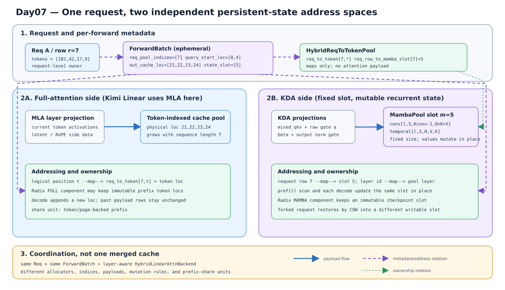
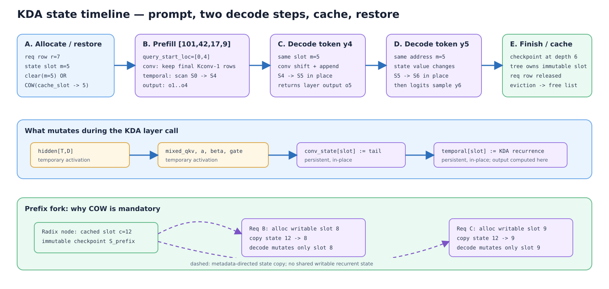
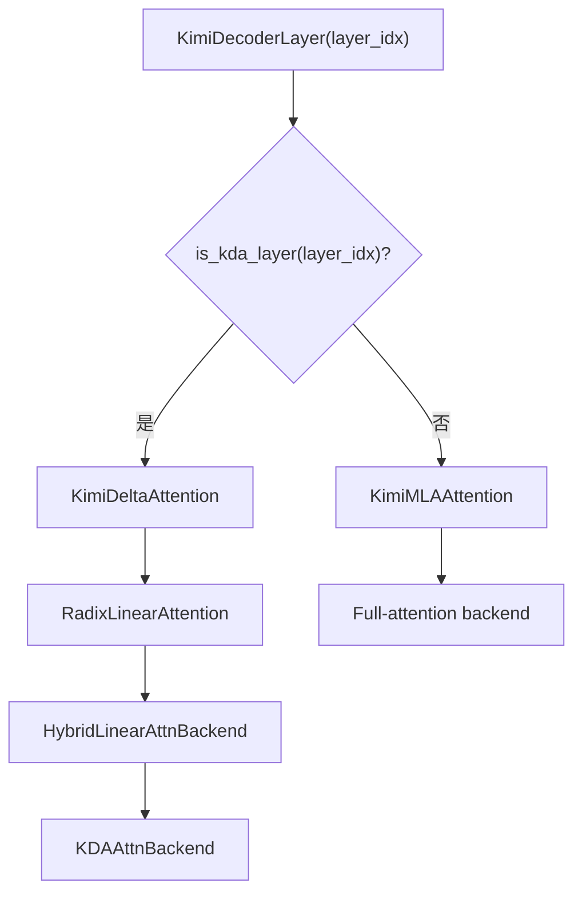
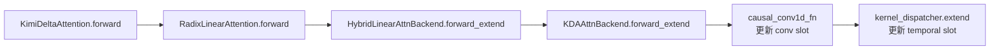

# 3｜先分清 Mamba state，再沿 SGLang 源码追 KDA recurrent cache

> 源码基线：本文按当前 SGLang checkout 的 `a478b5d7e74d83a9bcdb31440c2ffd64b01a2d66`（2026-09-08）整理。源码链接使用仓库相对路径；行号只用于快速定位，切换版本后请优先按函数名重新搜索。
>
> 本文采用 **hybrid** 写法：默认你已经理解 KDA 的 delta-rule，只用一小节把公式映射到 state；默认你不了解 Mamba，因此先补足读懂 `MambaPool`、`mamba_pool_idx` 和 `MAMBA` component 所需的 Mamba/SSM 心智模型，再进入源码。

主线固定为 CUDA、prefix cache 开启、普通 target worker、无 speculative decode、无 DCP/CP、无 HiCache、无 ReplaySSM、无 unified virtual pool。第 12 节再给其他分支入口；第一遍只走 request row → active state slot → KDA forward → checkpoint → decode → release。

## 0. 这篇只回答一个问题

> KDA 明明不是 Mamba，为什么 SGLang 却把它的运行时状态放进 `MambaPool`，又怎样让这个可变 state 支持 prefix reuse、分叉和回收？

先给最重要的结论：

- **算法层**：Mamba/SSM 和 KDA 的递推公式不同，本文不会把两者混成一种算法。
- **运行时层**：两者都不需要保存一条随上下文增长的历史 K/V 列表，而是为每个请求、每个 recurrent layer 保存固定形状的“前缀末状态”。
- **源码命名层**：SGLang 把这类 recurrent-state 基础设施历史性地命名为 `MambaPool`、`mamba_pool_idx` 和 `ComponentType.MAMBA`；KDA 复用的是这套生命周期契约。
- **KDA 落地**：一个 KDA slot 主要包含 causal-conv 滑窗 `conv` 和 delta-rule 矩阵 `temporal`。这里的 `temporal` 是“处理到当前位置后的递推状态”，不是按时间保存的 token 列表。
- **prefix reuse**：radix tree 保存的是只读 checkpoint 的 slot handle。请求命中后要 COW 到自己的 active slot，再继续原地更新。

### 0.1 三种 “Mamba” 不要混用

| 看到的名字 | 本文中的准确含义 | 和 KDA 的关系 |
|---|---|---|
| Mamba / Mamba2 算法 | selective SSM；用 SSM hidden state 扫描序列 | 公式不同，只提供理解 recurrent cache 的参照 |
| mamba-ish / hybrid SSM | SGLang 对“模型中含 recurrent-state 层”的运行时分类 | Kimi Linear 会进入这类建池和调度路径 |
| `MambaPool` / `mamba_pool_idx` / `MAMBA` component | recurrent state 的 backing、请求句柄和 radix component 名称 | KDA 直接复用这套基础设施 |

最直接的源码证据是：Kimi 配置的对外属性仍叫 `mamba2_cache_params`，但实际返回 `KimiLinearCacheParams`，其 shape 来自 `KimiLinearStateShape`，见 [`KimiLinearConfig.mamba2_cache_params`](../../python/sglang/srt/configs/kimi_linear.py#171-180)。所以后文写“ Mamba slot ”时，除非明确讨论 Mamba 算法，否则都指这套通用 state slot。

### 0.2 本文怎么读

建议按三层读：**必读主线**是第 0–11.2 节（state → row/slot → KDA extend/decode → checkpoint → release）；**第二遍**再读第 11.3–11.4 节的调试 invariants；第 12–13 节是进阶分支和源码索引。KDA 公式只负责解释 `temporal` 的 payload；Mamba 公式只负责解释为什么运行时可以按“每请求一个状态槽”管理。

源码片段会标明“真实源码摘录”或“省略分支后的骨架”。每一段后都继续回答：**现在手里有什么，下一跳拿什么**。如果只是想 debug，可直接跳到第 11 节的断点表。

## 1. 先补 Mamba：它为什么只需要“前缀末状态”

### 1.1 从 KV 列表切换到 recurrent state

Full Attention 在位置 $t$ 计算时仍要访问很多历史 token 的 K/V，因此 cache 会随序列长度增长。Mamba/SSM 的推理接口不同：历史先被压进状态 $s_{t-1}$，新 token 只把它推进到 $s_t$。忽略通道和离散化细节，可以写成：

$$
s_t=\bar A_t\odot s_{t-1}+\bar B_t x_t,
\qquad
y_t=C_t s_t+D x_t.
$$

Mamba 的 “selective” 体现在 $\bar A_t$、$\bar B_t$、$C_t$ 等量会随当前输入变化；这篇不继续推导它们。读 SGLang cache 只需抓住下面这个接口：

$$
(s_{t-1},x_t)\longmapsto(y_t,s_t).
$$

处理完前缀 $x_{1:p}$ 后，只要保留 $s_p$，下一 token 就能继续；无需重新读 $x_{1:p}$ 的逐 token SSM state。于是 state 的大小随模型维度变化，但不随前缀长度 $p$ 线性增长。

这也带来代价：`state_at(prefix)` 是整个前缀的有序计算结果。你不能像拼接两段 token-slot 向量那样，直接把两块 state handle 拼成更长前缀；要么从正确 checkpoint 继续 scan，要么重算缺失的 tail。

### 1.2 为什么通常有 `conv` 和 `temporal` 两类状态

Mamba block 在 selective SSM 前通常还有一段短 causal convolution。decode 新 token 到来时，卷积需要最近 $K-1$ 个输入，而 SSM scan 需要上一步 hidden state。因此常见推理 cache 是：

| 状态 | 保存什么 | 随序列长度增长吗 | 下一个 token 怎样消费 |
|---|---|---:|---|
| convolution state | 最近 $K-1$ 个卷积输入的滑窗 | 否 | shift/append 后计算当前卷积输出 |
| SSM/recurrent state | 扫描到当前位置后的前缀摘要 | 否 | 与当前输入一起算输出并写回新状态 |

SGLang 的 `MambaPool.State` 因而统一暴露 `conv` 和 `temporal`，见 [`MambaPool.State`](../../python/sglang/srt/mem_cache/memory_pool.py#371-413)。`temporal` 只是统一字段名：在真正的 Mamba2 层里它装 SSM state；在 KDA 层里它装 delta-rule recurrent matrix。

### 1.3 KDA 只做最短回顾：把你会的公式映射到两个 buffer

对一个 KDA head，采用 $H_t\in\mathbb{R}^{d_v\times d_k}$ 的记法，可以把递推抽象成：

$$
\widetilde H_t=\Lambda_t\odot H_{t-1},
$$

$$
e_t=v_t-\widetilde H_t k_t,
\qquad
H_t=\widetilde H_t+\beta_t e_tk_t^\mathsf{T},
\qquad
o_t=H_tq_t.
$$

这里省略了 scale、head 映射和 gate 参数化；它们不会改变缓存契约。关键是 $H_t$ 已经概括了 KDA 继续计算所需的长历史，所以 KDA 也满足：

$$
(H_{t-1},q_t,k_t,v_t,\Lambda_t,\beta_t)
\longmapsto(o_t,H_t).
$$

这里把 state 写成 $[d_v,d_k]$ 是便于推导的记号；KDA kernel 的物理 tile 按 `[V,K]`（见 [`fused_sigmoid_gating_delta_rule_update_kernel`](../../python/sglang/kernels/ops/attention/fla/fused_sigmoid_gating_recurrent.py#291-346)）解释。Kimi 当前配置中两维相同，转置约定不会改变 shape；换成非对称 $d_v/d_k$ 的实现时不要直接套用这张表。

Kimi 的 Q/K/V 在进入 delta rule 前还有短 causal convolution，所以实际 slot 需要同时保存：

| `MambaPool.State` 字段 | KDA 中的 payload | 不是它 |
|---|---|---|
| `conv[layer, slot]` | Q/K/V 投影经过短卷积所需的 $K-1$ 步滑窗 | 不是长上下文 K/V cache |
| `temporal[layer, slot]` | 每个 head 的 $H_t$，典型 shape 为 `[H, d_v, d_k]` | 不是 `[T,H,D]` 的逐 token 历史 |

这就是 KDA 复用 Mamba runtime 的完整理由：**不是公式相同，而是持久状态的形状、寻址和生命周期模式相同。**

### 1.4 教学等价伪代码：一个 slot 如何跨 token 复用

下面只为了建立状态感，不是 SGLang 原码，也没有实现真实的投影、causal-conv kernel 或 dtype 处理。它把 Mamba/SSM 和 KDA 都写成同一个接口：**读入旧 state，消费一个 token，返回输出和新 state**。

```python
# 教学等价实现：不是 SGLang 原码
def mamba_like_step(x_t, state, A_bar_t, B_bar_t, C_t, D):
    """state.ssm 是处理到上一个 token 的 SSM state。"""
    state.ssm = A_bar_t * state.ssm + B_bar_t * x_t
    y_t = C_t @ state.ssm + D * x_t
    return y_t, state


def kda_extend(slot, projected_tokens, state_pool):
    """
    q/k/v 是 causal conv 后的值，mixed_qkv 是更新 conv tail 的卷积前输入。
    state_pool[slot] 的 shape：conv=[K-1, C]，temporal=[H, V, K]。
    """
    state = state_pool[slot]
    outputs = []
    for q, k, v, decay, beta, mixed_qkv in projected_tokens:
        # 先保留短卷积需要的最近 K-1 个输入
        state["conv"] = update_conv_tail(state["conv"], mixed_qkv)

        h = state["temporal"] * decay[:, None, None]
        error = v - contract(h, k)       # 每个 head 的 value 误差
        h = h + beta[:, None, None] * outer(error, k)
        outputs.append(contract(h, q))   # 当前 token 的 KDA 输出
        state["temporal"] = h            # 给下一个 token 继续使用

    state_pool[slot] = state
    return outputs
```

在真实代码中，`state_pool[slot]` 由 `MambaPool.mamba_cache` 的 layer/slot 索引替代；`update_conv_tail()` 对应 `causal_conv1d_fn()` 或 `causal_conv1d_update()`，循环中的 recurrence 由 `kernel_dispatcher.extend()` / `packed_decode()` 完成。这个伪代码最值得观察的只有两行：`state = state_pool[slot]` 表示读取前缀末状态，`state_pool[slot] = state` 表示同一个 slot 被写成下一轮的输入。

因此 prefill 的多个 token 只是循环多次，decode 的一个 token 只是循环一次；两者都不会为每个 token 新建 state slot。prefix fork 另行分配 destination slot，是为了让这段循环拥有独立的可写 state。

### 1.5 为什么 state 命中后不能直接共享

KV prefix 的已完成 slot 通常只读，多个请求可以共同引用；recurrent state 的下一步却会原地把 $H_p$ 改成 $H_{p+1}$。假设两个请求都命中前缀 $P$，正确关系是：

这就是 COW：radix checkpoint `c` 保持只读，A/B 分别复制到可写的 `a`/`b`，后续 token 只修改各自 destination。第 2 节的 timeline 下半部分把这组 source/destination 和对应源码断点画在一起；checkpoint slot 的值必须保持不变，才能继续服务之后命中同一 prefix 的请求。

## 2. 首屏总览：两套地址、一个请求生命周期

先问一个定位问题：**同一个 request row 为什么同时指向 token loc 和 recurrent slot，而且两者的 owner、增长方式、释放时机都不同？** 下面的图只回答这一个问题；它没有引用外部算法图，因为这里画的是 SGLang 项目专有的对象和地址关系。



图里的 `r` 是 request row，`s` 是 Full/MLA token slot，`m` 是 recurrent state slot。三者不是同一个整数，也不要求相等。图中数字和 shape 是便于阅读的教学值；真正的 layer 数、slot 数和 dtype 由配置决定。

图后立刻回到源码：`ReqKvInfo.req_pool_idx` 与 `mamba_pool_idx` 是请求级句柄（[`ReqKvInfo`](../../python/sglang/srt/managers/schedule_batch.py#848-877)）；`HybridReqToTokenPool.alloc()` 维护 row → state-slot 映射（[`alloc`](../../python/sglang/srt/mem_cache/memory_pool.py#1351-1401)）；`mamba2_layer_cache()` 再按 layer id 取出该层的 `conv/temporal` view（[`mamba2_layer_cache`](../../python/sglang/srt/mem_cache/memory_pool.py#1414-1426)）。树上的 FULL/MAMBA value 只是 token loc 与 state-slot handle，真正的 payload 仍在各自 pool（[`ComponentType`](../../python/sglang/srt/mem_cache/unified_cache/component_type.py#6-30)、[`MambaComponent.finalize_match_result_in_cache`](../../python/sglang/srt/mem_cache/unified_cache/components/mamba_component.py#187-216)）。

接着看时间问题：**一个 active slot 在 prefill、decode、cache、fork 之间，哪几步会改变 payload，哪几步只改变 owner？** 下面这张 timeline 是主线的唯一执行图；状态名仍是本文的 debug 标签，不是源码里的 enum。`c=12`、`m=5` 等均为教学值，`CHECKPOINTED` 只在确实有可恢复 snapshot 且进入 `cache_*` 边界时成立。



图后的源码映射按图中四段读：A 的 fresh `clear` 来自 [`HybridReqToTokenPool.alloc`](../../python/sglang/srt/mem_cache/memory_pool.py#1351-1401)，命中 prefix 的 `COW` 由 [`MambaComponent.finalize_match_result_in_cache`](../../python/sglang/srt/mem_cache/unified_cache/components/mamba_component.py#187-216) 预约，再由 forward 前 deferred mutation 执行（[`_maybe_execute_deferred_mamba_cow_and_clear`](../../python/sglang/srt/model_executor/model_runner.py#1678-1724)）；B 的 prefill 扫描对应 [`KDAAttnBackend.forward_extend`](../../python/sglang/srt/layers/attention/linear/kda_backend.py#693-828)；C/D 的同 slot 原地 decode 对应 [`KDAAttnBackend.forward_decode`](../../python/sglang/srt/layers/attention/linear/kda_backend.py#531-691)；E 的 tree 发布、请求释放和 eviction 对应 [`cache_unfinished_req/cache_finished_req`](../../python/sglang/srt/mem_cache/unified_radix_cache.py#838-1048)、[`prepare_for_caching_req`](../../python/sglang/srt/mem_cache/unified_cache/components/mamba_component.py#529-606) 与 [`cleanup_after_caching_req`](../../python/sglang/srt/mem_cache/unified_cache/components/mamba_component.py#608-653)。图中虚线 fork 只表示 source/destination 的句柄关系，不表示共享可写 state。

`EXTEND`、`CHECKPOINTED` 的真实证据是下面这些 mutation，而不是某个 `req.state` 字段。

| 事件（断点） | 迁移 | 必须发生的 mutation | 不应该发生 |
|---|---|---|---|
| [init_next_round_input · L1390–L1490](../../python/sglang/srt/managers/schedule_batch.py#1390-1490) | NEW → MATCHED | 产生 prefix_indices、last_node；hit 时准备 MAMBA COW | 还没有执行 KDA kernel |
| [PrefillAdder.add_one_req · L1177–L1404](../../python/sglang/srt/managers/schedule_policy.py#1177-1404) | MATCHED → ADMITTED | 预算通过、设置 extend_range、锁定 node | 预算拒绝后保留新分配的 COW slot |
| [alloc_for_extend · L282–L389](../../python/sglang/srt/mem_cache/allocation.py#282-389) | ADMITTED → MATERIALIZED | 绑定 row、token loc、row→Mamba slot | chunk continuation 再分配 active state |
| deferred clear/COW | MATERIALIZED 内部初始化 | 新 slot 清零，或 checkpoint → active slot | KDA 先读未初始化的 slot |
| [KDAAttnBackend.forward_extend · L693–L828](../../python/sglang/srt/layers/attention/linear/kda_backend.py#693-828) | MATERIALIZED → EXTEND | conv/temporal 从前缀状态推进到本轮末端 | 修改 tree checkpoint slot |
| [cache_unfinished_req · L925–L1048](../../python/sglang/srt/mem_cache/unified_radix_cache.py#925-1048) | EXTEND → CHECKPOINTED（有可发布 snapshot 时） | insert、rematch、canonical loc 回写、lock handoff | 释放请求仍要继续写的 active slot |
| [prepare_for_decode · L3287–L3344](../../python/sglang/srt/managers/schedule_batch.py#3287-3344) / forward_decode | CHECKPOINTED → DECODE | 每步追加 token loc；同一 active state 原地推进 | 每个 decode token 新建 Mamba slot |
| [cache_finished_req · L838–L924](../../python/sglang/srt/mem_cache/unified_radix_cache.py#838-924) | DECODE → FINISHED | row/active slot 所有权释放或转交给 tree | tree value 仍指向已归还 allocator 的 slot |
| tree eviction | CHECKPOINTED → EVICTED | 按 component 释放 token loc/state slot | 把 token id 当物理资源释放 |

这里的 EVICTED 也要按 component 理解：MAMBA checkpoint 可能先被淘汰，而同一 radix node 的 FULL value 仍在设备上；不要把“节点存在”当成“所有 component 都可读”。

### 2.1 用一组地址贯穿全文

下面的数字只是为了在 debugger 中区分地址，不代表 allocator 固定返回这些值：

| 时刻 | request row | Full/MLA token loc | active Mamba slot | tree MAMBA checkpoint |
|---|---:|---|---:|---:|
| A 刚进入 waiting queue | None | 无 | None | 无 |
| A miss 后 materialize | r=7 | [21,22,23,24] | m=5，待 clear | 无 |
| A prefill 完成 | r=7 | 同上 | m=5，状态 S4 | 尚未发布 |
| A unfinished checkpoint | r=7 | tree FULL 持有 canonical loc | m=5 继续可写 | c=12，状态 S4 |
| A decode 一步 | r=7 | 追加 loc=25 | m=5，S4→S5 | c=12 仍是 S4 |
| B 命中同一 prefix | row 尚未分配也可以先拿到 dst=8 | 返回 canonical loc | m=8，待 COW | src=c=12 |
| B 第一次 extend 前 | r=6 | row 写入 canonical loc | copy 12→8 已完成 | c=12 不变 |

这组值把最重要的不变量显式化：树的 checkpoint c=12 始终只读；A/B 的后续 token 分别修改自己的 m=5、m=8。

## 3. 从配置到对象账本：谁创建、谁持有 state

**导航卡**

- 从哪里进：`KimiLinearConfig.mamba2_cache_params` 把 KDA layer 的状态 shape 交给 cache configurator。
- 这一段看什么：`KimiLinearCacheParams`、`HybridReqToTokenPool`、`MambaPool` 与 `MambaSlotAllocator` 的创建和 owner。
- 下一跳：第 4 节进入模型 layer/backend 路由；请求真正分 slot 在第 6 节。
- 先忽略什么：int8 checkpoint、extra buffer、unified memory，它们改变具体 backing，不改变主线契约。

### 3.1 创建链：KDA shape 怎样进入 `MambaPool`

Kimi 先把 KDA layer id 和每个 slot 的 shape 封装为 cache params：

```python
# configs/kimi_linear.py#171-180，真实源码摘录
@property
def mamba2_cache_params(self) -> KimiLinearCacheParams:
    shape = KimiLinearStateShape.create(
        tp_world_size=get_parallel().attn_tp_size,
        num_heads=self.linear_attn_config["num_heads"],
        head_dim=self.linear_attn_config["head_dim"],
        conv_kernel_size=self.linear_attn_config["short_conv_kernel_size"],
    )
    return KimiLinearCacheParams(shape=shape, layers=self.linear_layer_ids)
```

这里产出的是“哪些层需要 recurrent state、每层一个 slot 长什么样”。configurator 发现模型属于 mamba-ish 路径后创建 `HybridReqToTokenPool`；其 `_init_mamba_pool()` 再创建 `MambaPool`、`MambaSlotAllocator` 和 `layer_id → pool layer` 映射，见 [`_build_hybrid_req_pool`](../../python/sglang/srt/mem_cache/kv_cache_configurator.py#1038-1086) 与 [`HybridReqToTokenPool._init_mamba_pool`](../../python/sglang/srt/mem_cache/memory_pool.py#1248-1305)。

现在手里已经有 server 常驻的 state backing 和 slot allocator，但还没有任何请求占用它。下一节先看这些对象各自保存什么；第 6 节才让具体请求拿到 row 和 slot。

### 3.2 请求级状态（schedule_batch.py · L849–L898）

ReqKvInfo 把 Full/MLA 和 Mamba 的生命周期并列放在一个请求对象里，见 [ReqKvInfo · L849–L898](../../python/sglang/srt/managers/schedule_batch.py#849-898)。

| 字段 | 形状/类型 | 含义 | 由谁改 |
|---|---|---|---|
| req_pool_idx | Python int 或 None | ReqToTokenPool 的 row | row allocator |
| prefix_indices | 1-D torch.int64 | 当前请求可复用的 token loc | prefix match/rematch |
| cache_protected_len | int | 树为请求保护的前缀边界 | match/insert |
| kv_allocated_len | int | row 已覆盖到的逻辑长度 | extend/decode allocator |
| kv_committed_len | int | scheduler 认为已提交的 KV 长度 | batch bookkeeping |
| mamba_pool_idx | 当前分配路径返回的 0-D tensor（`mid[0]`；字段注释仍写 `(1)`） | 请求当前可写的 Mamba slot | hybrid pool / COW |
| mamba_cow_src_index | tensor 或 None | 下一次 extend 前要复制的 checkpoint slot | MAMBA component |
| mamba_needs_clear | bool | 新 slot 是否需要清零 | hybrid pool |
| mamba_last_track_seqlen | int 或 None | extra-buffer 路径最后一个可缓存 checkpoint 的长度 | track metadata |

最重要的范围不变量可以写成：

$$
\text{request-owned Full/MLA slots}
=
[\texttt{cache\_protected\_len},\ \texttt{kv\_allocated\_len})
$$

Mamba 则不是一个 token 范围，而是：

$$
\texttt{req.kv.mamba\_pool\_idx}
\longrightarrow
\{\text{该请求所有 KDA 层的可变 state 行}\}.
$$

### 3.3 backing、mapping、allocator 和 tree handle

| 对象 | 真正保存什么 | producer | consumer / 生命周期 |
|---|---|---|---|
| `ReqToTokenPool.req_to_token` | `[request_rows+1, max_context_len]` 的 row + logical position → token loc | extend/decode allocation | Full/MLA backend；request row 生命周期 |
| `req_index_to_mamba_index_mapping` | request row → active state slot | `HybridReqToTokenPool.alloc()` | `_forward_metadata()`；request row 生命周期 |
| `MambaSlotAllocator` | 可分配/归还的 state slot ID | 启动时创建，alloc/free 改 free-list | request admission、COW、checkpoint、eviction；server 常驻 |
| `MambaPool.mamba_cache.conv` | `[num_kda_layers, mamba_slots+1, ...]` 的卷积滑窗 | causal-conv extend/decode | 下一轮卷积或 checkpoint copy；server 常驻 |
| `MambaPool.mamba_cache.temporal` | `[num_kda_layers, mamba_slots+1, ...]` 的 KDA recurrent matrix | KDA extend/decode kernel | 下一轮 KDA 或 checkpoint copy；server 常驻 |
| `node.component_data[MAMBA].value` | 通常为长度 1 的 slot-handle tensor（不是 state bytes） | `prepare_for_caching_req()` / `commit_insert_component_data()` | prefix match/COW/eviction；tree entry 生命周期 |

`ReqToTokenPool` 的 row 0 是 dummy，真实 row 从 1 开始，见 [ReqToTokenPool · L257–L337](../../python/sglang/srt/mem_cache/memory_pool.py#257-337)。`MambaPool` 同样给 slot 0 留 dummy；普通布局中 conv/temporal 的 `size + 1` 维度和初始化见 [MambaPool.__init__ · L499–L613](../../python/sglang/srt/mem_cache/memory_pool.py#499-613)，最终封装进 `self.mamba_cache` 的位置见 [memory_pool.py · L824–L861](../../python/sglang/srt/mem_cache/memory_pool.py#824-861)。

一个请求通常只持有一个 active slot 编号 $m$；layer 由 pool 的第一维另行选择。因此第 $l$ 个 KDA 层读写的是：

$$
\texttt{conv}[l,m],\qquad \texttt{temporal}[l,m].
$$

`mamba_pool_idx=m` 不是“只缓存一层”，而是让本 rank 的所有 KDA 层在各自的 layer slice 上使用同一个请求槽编号。`clear_slots(m)` 与 `copy_from(src, m)` 也会跨本 pool 中的 KDA 层一起处理这两类 payload；TP/层切分时不要把它理解成跨 rank 的同一块物理行。

注意：

- row 是“请求的寄存器”；
- Full/MLA loc 是“按 token 访问的地址”；
- Mamba slot 是“按请求访问的可变状态地址”；
- ForwardBatch 是一次 forward 的临时快照，不拥有这些 backing tensor。

## 4. 层与 backend 路由：先确认你正在 debug 哪种 layer

**导航卡**

- 从哪里进：`KimiDecoderLayer` 根据 `is_kda_layer(layer_idx)` 构造不同 attention module。
- 这一段看什么：layer id 决定走 KDA state pool 还是 Full/MLA token cache。
- 下一跳：KDA 分支进入 `RadixLinearAttention`，forward 时由 `HybridLinearAttnBackend` 转到 `KDAAttnBackend`。
- 先忽略什么：具体 KDA kernel 选择；第 7 节只展开普通 extend/decode 契约。

### 4.1 Kimi 的 layer 划分（kimi_linear.py · L501–L586）

Kimi 配置用 is_kda_layer(layer_idx) 把层分成 linear/KDA 和 Full Attention（Kimi 实现里非 KDA 分支是 MLA），见 [KimiLinearConfig.is_kda_layer() · L156–L180](../../python/sglang/srt/configs/kimi_linear.py#156-180)。

模型层构造在 [KimiDecoderLayer · L549–L586](../../python/sglang/srt/models/kimi_linear.py#549-586)：



KDA 层本身先做投影，再把 mixed_qkv、beta、forget_gate 交给线性 attention，见 [KimiDeltaAttention.forward() · L501–L546](../../python/sglang/srt/models/kimi_linear.py#501-546)。RadixLinearAttention 只是统一入口和 forward-mode 分派，不是 state 的 owner，见 [RadixLinearAttention · L38–L148](../../python/sglang/srt/layers/radix_linear_attention.py#38-148)。

### 4.2 Hybrid backend 的唯一关键分支（hybrid_linear_attn_backend.py · L1028–L1186）

`HybridLinearAttnBackend` 按 layer id 路由；`_is_full_attn`、`forward_decode` 和 `forward_extend` 在 [hybrid_linear_attn_backend.py · L1028–L1186](../../python/sglang/srt/layers/attention/hybrid_linear_attn_backend.py#1028-1186)。属于 `full_attn_layers` 就调用 full backend，否则调用 linear backend；Kimi Linear 的 linear backend 才是 `KDAAttnBackend`。

因此同一个 ForwardBatch 中，Full/MLA 层会读写 token cache，KDA 层会读写 MambaPool。不要因为它们共享 req_pool_indices，就推断它们共享同一种 cache。

### 4.3 （FULL, MAMBA）是组件坐标，不是物理坐标（registry.py · L146–L196）

Hybrid 模型的默认 tree component 由 [_create_unified_radix_cache() · L146–L196](../../python/sglang/srt/mem_cache/registry.py#146-196) 组装。下面是省略其他 backend 后的真实骨架：

```python
tree_components = [ComponentType.FULL]
if ctx.is_hybrid_ssm:
    tree_components.append(ComponentType.MAMBA)
```

ComponentType 是整数枚举：FULL=0、SWA=1、MAMBA=2，见 [component_type.py · L6–L30](../../python/sglang/srt/mem_cache/unified_cache/component_type.py#6-30)。树节点预先建立按枚举索引的 component_data 列表，见 [UnifiedTreeNode · L108–L157](../../python/sglang/srt/mem_cache/unified_cache/unified_tree_core.py#108-157)。

所以同一个 tree node 有两个独立 component 槽：

| component 槽 | `value` 的典型内容 | payload 的真正 owner |
|---|---|---|
| `node.component_data[FULL]` | token loc 向量 | Full/MLA token pool |
| `node.component_data[MAMBA]` | 通常为长度 1 的 state-slot handle | `MambaPool` 或 checkpoint pool |

这里的 FULL 是组件索引/命名空间，不是 token 坐标、page 坐标或 GPU 行号。`node.component_data[FULL].value` 通常是 token loc 向量；`node.component_data[MAMBA].value` 通常是长度 1 的 state-slot handle。请求字段 `req.kv.mamba_pool_idx` 则是分配时从 `mid[0]` 取出的 0-D scalar；需要批量索引时才显式 `unsqueeze(0)`。真正的 K/V 或 recurrent matrix 仍在各自 pool。

## 5. T1：NEW → MATCHED，prefix lookup 到底比较什么

**导航卡**

- 从哪里进：scheduler 从 waiting queue 取出 `Req`，调用 `init_next_round_input(tree_cache)`。
- 这一段看什么：`RadixKey`、`prefix_indices`、`last_node`，以及命中 MAMBA checkpoint 后的 COW source/destination。
- 下一跳：匹配结果交给 `PrefillAdder` 做 admission，第 6 节才真正 materialize row 和 slot。
- 先忽略什么：HiCache host hit、page size 大于 1、branching checkpoint 的优化细节。

### 5.1 调度入口（scheduler.py · L3682–L3712）

等待队列中的请求由 [scheduler.py · L3682–L3712](../../python/sglang/srt/managers/scheduler.py#3682-3712) 调用。省略策略分支后的骨架是：

```python
req.init_next_round_input(self.tree_cache)
# 内部调用 tree_cache.match_prefix(...)
# 回写 req.prefix_indices / req.last_node / req.kv.cache_protected_len

adder.add_one_req(req, ...)
```

Req.init_next_round_input() 创建的是 RadixKey，输入是 token ids、extra key、cache salt，见 [Req.init_next_round_input() · L1390–L1490](../../python/sglang/srt/managers/schedule_batch.py#1390-1490) 和 [RadixKey · L59–L103](../../python/sglang/srt/mem_cache/radix_cache.py#59-103)。

**prefix key 是 token id，不是 slot id。**

slot id 只在 tree node 的 value 里作为结果返回。这样同一串 token 在不同物理位置上仍可以命中同一个 prefix；树负责 identity，pool 负责 payload address。

### 5.2 不是“每个 token 从根开始比”（unified_tree_core.py · L698–L810）

UnifiedTreeCore.match_prefix() 先按 child key 找候选节点，再由 RadixKey.match() 比较节点片段；主走法见 [match_prefix() · L698–L723](../../python/sglang/srt/mem_cache/unified_cache/unified_tree_core.py#698-723)、[_match_prefix_helper() · L725–L810](../../python/sglang/srt/mem_cache/unified_cache/unified_tree_core.py#725-810)。

对长普通 token key，`RadixKey.match()` 用 C-level slice compare 加 exponential/gallop + binary search 找分歧位置，见 [RadixKey.match() · L181–L215](../../python/sglang/srt/mem_cache/radix_cache.py#181-215)。高层过程是：先用可哈希的首 page 定位 child，再比较节点片段，命中后收集该节点的 FULL value，最后继续访问下一个 child。

不是把所有 slot 与 query token 逐个做线性扫描。prefix cache 的“匹配身份”和“返回地址”是两个阶段。

### 5.3 MAMBA finalizer 可能在 row 分配前发生（mamba_component.py · L187–L216）

UnifiedRadixCache.match_prefix() 在 tree walk 后调用各 component 的 finalizer，见 [UnifiedRadixCache.match_prefix() · L519–L539](../../python/sglang/srt/mem_cache/unified_radix_cache.py#519-539)。

当命中可用的 MAMBA checkpoint 且 cow_mamba=True 时，Mamba component 会：

1. 从 best_match_node 取 source state slot；
2. 若请求还没有 active slot，先从 mamba_allocator 分配 destination slot；
3. 把 mamba_cow_src_index 写到请求；
4. 标记不需要 clear。

具体代码在 [MambaComponent.finalize_match_result_in_cache() · L187–L216](../../python/sglang/srt/mem_cache/unified_cache/components/mamba_component.py#187-216)。

因此有两个合法顺序：

| 分支 | 先发生什么 | 之后发生什么 |
|---|---|---|
| prefix hit | match + MAMBA COW destination slot（可能尚未有 row） | admission 成功后收集 deferred COW |
| prefix miss | match 返回空/短 prefix | admission 后 HybridReqToTokenPool.alloc() 再分配 row 和 active Mamba slot |

这也是 debug 时不能写死“永远先 row、后 state slot”的原因。

### 5.4 FULL 命中长度和 MAMBA checkpoint 长度可以不同（mamba_component.py · L155–L185）

Hybrid cache 不能默认认为“Full/MLA 命中多少 token，就有多少 token 的 KDA state”。Mamba component 会把 Full-KV 命中长度与最近的 Mamba boundary 分开计算；如果两者之间存在一个对齐的分叉点，就记录 mamba_branching_seqlen，见 [MambaComponent.finalize_match_result_in_tree_core() · L155–L185](../../python/sglang/srt/mem_cache/unified_cache/components/mamba_component.py#155-185)。

debug 时要分别记录 `full_kv_hit_length`、已有可复用 state 的 `mamba_boundary_len`，以及可能为 `None` 的 `mamba_branching_seqlen`。因此出现 $\operatorname{len}(\texttt{req.prefix\_indices})$ 大于可直接复用的 Mamba state 长度并不一定是 bug。

它表示 Full/MLA 可以复用更长的 token prefix，而 KDA 需要从最近的 checkpoint 继续扫描中间 tail；不要用 prefix_indices 的长度直接当作 temporal 已覆盖长度。

## 6. T2：MATCHED → ADMITTED → MATERIALIZED

**导航卡**

- 从哪里进：第 5 节只产生了 prefix 匹配结果；`PrefillAdder.add_one_req()` 决定请求能否进入本轮。
- 这一段看什么：admission、row/token loc/state slot 三种分配，以及 deferred clear/COW。
- 下一跳：`ForwardBatch` 携带 materialize 后的索引，第 7 节的 backend 才读取并更新 state。
- 先忽略什么：host load-back、retract、chunk budget 的细分策略。

### 6.1 admission 不只是 token budget（schedule_policy.py · L1177–L1404）

PrefillAdder.add_one_req() 负责预算、临时锁、host load-back、chunk 截断和最终加入 can_run_list，见 [PrefillAdder.add_one_req() · L1177–L1404](../../python/sglang/srt/managers/schedule_policy.py#1177-1404)。

观察点：

```python
req.prefix_indices          # 命中的 token loc
req.last_node               # 要锁的树节点
req.kv.cache_protected_len  # 树保护边界
req.extend_range            # 本轮真正要算的逻辑区间
adder.can_run_list           # admission 成功的请求
```

_req_inc_lock_ref() 对 last_node 加锁，见 [PrefillAdder._req_inc_lock_ref() · L926–L932](../../python/sglang/srt/managers/schedule_policy.py#926-932)。如果预算不足，scheduler 会回滚刚刚为 prefix hit 预分配的 Mamba destination，见 [scheduler.py · L3721–L3745](../../python/sglang/srt/managers/scheduler.py#3721-3745)。

### 6.2 materialize 的真实顺序（allocation.py · L229–L389）

进入 ScheduleBatch.prepare_for_extend() 后，代码先根据 prefix 截取本轮输入，再调用 alloc_for_extend()，见 [prepare_for_extend() · L2504–L2551](../../python/sglang/srt/managers/schedule_batch.py#2504-2551)。

`alloc_for_extend()` 依次执行四件事：

1. `alloc_req_slots()` 调用 `req_to_token_pool.alloc(reqs)`，分 request row，并为需要 state 的请求绑定 active slot；
2. token allocator 为 Full/MLA 层申请新 loc；
3. `write_cache_indices()` 把 prefix loc 与新 loc 写进 request row；
4. 更新 `req.kv.kv_allocated_len` / `kv_committed_len`。

对应 [alloc_for_extend() · L282–L389](../../python/sglang/srt/mem_cache/allocation.py#282-389) 和 [alloc_req_slots() · L229–L270](../../python/sglang/srt/mem_cache/allocation.py#229-270)。

在 hybrid pool 中：

- super().alloc() 给没有 row 的请求分配 request row；
- req.kv.holds_mamba 为真时，继续 chunk 或 radix-hit 请求复用已有 state slot；
- 否则从 mamba_allocator 分配一个 slot，并标记 mamba_needs_clear=True；
- 最后把 req row → mamba slot 写入 req_index_to_mamba_index_mapping。

代码见 [HybridReqToTokenPool.alloc() · L1349–L1401](../../python/sglang/srt/mem_cache/memory_pool.py#1349-1401)；Mamba slot 的 free-list 实现见 [MambaSlotAllocator · L30–L97](../../python/sglang/srt/mem_cache/allocator/mamba.py#30-97)。

可以把 materialize 后的地址关系写成：

$$
\texttt{req\_to\_token}[r,p]=s_p,
\qquad
\texttt{req\_index\_to\_mamba\_index\_mapping}[r]=m.
$$

前者随 token 位置变化，后者通常在整个请求生命周期内保持同一个 active slot。

### 6.3 deferred clear/COW：为什么不在 scheduler 线程直接 memcpy（model_runner.py · L1678–L1724）

prepare_for_extend() 会把请求级的 COW/clear 信息收集成 batch 级 tensor，见 [_collect_deferred_mamba_cow_and_clear() · L2859–L2879](../../python/sglang/srt/managers/schedule_batch.py#2859-2879)。这些字段被复制到 ForwardBatch，见 [ForwardBatch · L393–L435](../../python/sglang/srt/model_executor/forward_batch_info.py#393-435) 和 [ForwardBatch.init_new() · L722–L826](../../python/sglang/srt/model_executor/forward_batch_info.py#722-826)。

真正的清零/COW 在 forward stream、KDA 层读取 pool 之前执行，见 [_maybe_execute_deferred_mamba_cow_and_clear() · L1678–L1724](../../python/sglang/srt/model_executor/model_runner.py#1678-1724)。下面是省略检查分支后的骨架：

```python
if clear_indices:
    mamba_pool.clear_slots(physical(clear_indices))
if cow_src_indices:
    mamba_pool.copy_from(physical(src), physical(dst))

# 随后清掉一次性 batch metadata，再让 KDA layer 读取 conv/temporal
```

MambaPool.clear_slots() 和 copy_from() 会同时处理本 pool 中所有 KDA 层的 conv、temporal state，见 [clear_slots/copy_from() · L962–L1039](../../python/sglang/srt/mem_cache/memory_pool.py#962-1039)。

这个阶段最容易误判的点是：mamba_pool_idx 可能是 virtual slot。调用物理 pool 的 copy/clear 前必须经过 translate_mamba_indices()；静态 pool 是 identity，unified pool 可能不是，见 [translate_mamba_indices() · L1403–L1412](../../python/sglang/srt/mem_cache/memory_pool.py#1403-1412)。

## 7. T3：MATERIALIZED → EXTEND，KDA 一次 forward 改了哪些 state

**导航卡**

- 从哪里进：第 6 节已经保证 active slot 完成 clear 或 checkpoint COW。
- 这一段看什么：`req_pool_indices → mamba_cache_indices`、`query_start_loc`、`conv` 与 `temporal` 的原地更新。
- 下一跳：forward 结束后，第 8 节决定何时把 active state 发布为只读 checkpoint。
- 先忽略什么：target verify、ReplaySSM、fused decode；它们改变 kernel/回滚路径，不改变 slot owner。

### 7.1 ForwardBatch 只携带地址和元数据（hybrid_linear_attn_backend.py · L114–L270）

ForwardBatch 的核心输入是 req_pool_indices、seq_lens、out_cache_loc；Mamba 相关的是 mamba_track_* 和 deferred COW/clear tensor，见 [ForwardBatch · L393–L435](../../python/sglang/srt/model_executor/forward_batch_info.py#393-435)。

KDA backend 在 _forward_metadata() 中：

1. 用 req_pool_indices 查 get_mamba_indices()；
2. 做 virtual → physical 翻译；
3. decode 生成 query_start_loc=[0,1,...,bs]；
4. extend 根据每个请求的起止位置生成 packed query_start_loc；
5. 有 track mask 时，准备 chunk checkpoint 的 source/destination。

见 [MambaAttnBackendBase._forward_metadata() · L114–L270](../../python/sglang/srt/layers/attention/hybrid_linear_attn_backend.py#114-270)。

row → Mamba slot 的 pool-side lookup 由 [get_mamba_indices()/mamba2_layer_cache() · L1403–L1426](../../python/sglang/srt/mem_cache/memory_pool.py#1403-1426) 提供；layer id 再映射到 MambaPool 的 layer 维，slot id 映射到第二维。

所以进入 kernel 前至少应观察下面这组字段快照：

```python
forward_batch.req_pool_indices
forward_metadata.mamba_cache_indices
forward_metadata.query_start_loc
req_to_token_pool.mamba_pool.mamba_cache.conv[layer]
req_to_token_pool.mamba_pool.mamba_cache.temporal[layer]
```

前三项只负责定位；后两项才是持久 payload。backend 用 row 查到 slot 后，下一段按 layer id 取出该层的两个 buffer 并交给 KDA kernel。

### 7.2 普通 extend 的调用链（kda_backend.py · L693–L828）

以 KDA、非 target-verify 为主线：



KDA extend 的实现见 [KDAAttnBackend.forward_extend() · L693–L828](../../python/sglang/srt/layers/attention/linear/kda_backend.py#693-828)。

其中：

- `mixed_qkv` 先按 Q/K/V 拆分，并分别经过 causal conv；
- `has_initial_state = extend_prefix_lens > 0` 决定卷积与 recurrence 是否接着 prefix state 计算；
- `cache_indices` 指向本批请求各自的 active slot；
- `kernel_dispatcher.extend()` 读取旧 `temporal[slot]`，完成 packed token scan，再写回本轮末状态。

现在 `conv[slot]` 留下最后 $K-1$ 个卷积输入，`temporal[slot]` 留下 $H_{\mathrm{end}}$；输出 activation 继续流向本层的 norm/output projection，而这两个 state 留给下轮 decode 或 checkpoint 消费。

### 7.3 kernel 中真正改变 state 的几行（fused_sigmoid_gating_recurrent.py · L284–L346）

Triton recurrent kernel 的顺序在 [fused_sigmoid_gating_recurrent.py · L284–L346](../../python/sglang/kernels/ops/attention/fla/fused_sigmoid_gating_recurrent.py#284-346)。不再重讲 KDA，只把第 1.3 节的公式压成教学等价伪代码：

```python
decay = exp(compute_forget_gate(a, A_log, dt_bias))
h = h * decay
error = v - h @ k
h = h + beta * outer(error, k)
o = h @ q
temporal[slot] = h
```

其中：

- h 是 recurrent state；Kimi 的 pool-side temporal shape 为 [local_heads, head_dim, head_dim]，定义见 [KimiLinearStateShape · L246–L314](../../python/sglang/srt/configs/mamba_utils.py#246-314)，kernel 中按 [value head, V, K] 解释；
- conv[slot] 保存短卷积的滑动窗口，不等于 temporal[slot]；
- o 是当前 token 的输出；
- h 会被下一个 token 继续使用，因此它不是“算完就丢”的中间激活。

KDA 的 chunk prefill wrapper 固定以 64 为 kernel chunk size，并可返回每个 chunk 边界的中间 h，见 [chunk_kda_fwd() · L1084–L1195](../../python/sglang/kernels/ops/attention/fla/kda.py#1084-1195)。这解释了为什么 scheduler 能在对齐边界保存 checkpoint，但不代表每个 token 都会插入 radix tree。

### 7.4 decode 的调用链：同一 slot，另一种输入粒度（kda_backend.py · L531–L691）

普通 decode 在 [prepare_for_decode() · L3287–L3344](../../python/sglang/srt/managers/schedule_batch.py#3287-3344) 中只为每个请求追加一个新的 Full/MLA token loc，并把 seq len 加一；它不会为每个 decode token 新建一个 Mamba slot。

KDA decode 的关键路径见 [KDAAttnBackend.forward_decode() · L531–L691](../../python/sglang/srt/layers/attention/linear/kda_backend.py#531-691)。backend 先用 `cache_indices` 调 `causal_conv1d_update()` 更新同一批 slot 的卷积滑窗；若后端支持且 token 数等于 batch size，就走 `packed_decode()`，否则走 decode fallback。两条 recurrence 路径都会原地更新 `temporal[cache_indices]`。

先检查这一条断言：

```python
qkv.shape[0] == cache_indices.shape[0]
```

它表达的是“普通 packed decode 每个 request 恰好一个 token”，不是“每个 request 只有一个历史 token”。

## 8. T4：EXTEND → CHECKPOINT，什么时候真的写 prefix tree

**导航卡**

- 从哪里进：KDA forward 已把 active slot 推进到本轮末端，但 tree 还不一定持有这个时刻的 checkpoint。
- 这一段看什么：`cache_unfinished_req()` 的 insert/rematch，以及 unfinished 请求为何复制 checkpoint、保留 active slot。
- 下一跳：第 9 节让同一请求继续 decode；第 10 节处理完成和淘汰。
- 先忽略什么：int8 checkpoint、extra buffer 与 ReplaySSM 的具体对齐规则。

### 8.1 完整 prefill 和 chunked prefill 不是同一个时序（batch_result_processor.py · L307–L392）

非 chunked prefill 在 result processor 中完成后，未结束请求会走 maybe_cache_unfinished_req(req, tree_cache)；结束请求走 release_kv_cache()，相关分支见 [batch_result_processor.py · L307–L347](../../python/sglang/srt/managers/scheduler_components/batch_result_processor.py#307-347)。

`maybe_cache_unfinished_req()` 只是薄包装，见 [common.py · L161–L166](../../python/sglang/srt/mem_cache/common.py#161-166)，真正逻辑在 `UnifiedRadixCache.cache_unfinished_req()`：

1. 从当前 request row 读取 token loc；
2. 让 FULL/MAMBA component 分别准备待插入的 value；
3. 插入 tree 后再次 `match_prefix()`；
4. 用 rematch 得到的 canonical loc 回写 row，并释放重复或未采用的 slot；
5. 把 lock 从旧节点交给新的 `last_node`，更新 `prefix_indices` 与 `cache_protected_len`。

对应代码见 [cache_unfinished_req() · L925–L1048](../../python/sglang/srt/mem_cache/unified_radix_cache.py#925-1048)；insert 的 action barrier 在 [UnifiedRadixCache.insert() · L544–L561](../../python/sglang/srt/mem_cache/unified_radix_cache.py#544-561)，树 walk 从 [UnifiedTreeCore.begin_insert() · L927–L968](../../python/sglang/srt/mem_cache/unified_cache/unified_tree_core.py#927-968) 开始。

这里的“再 match”很关键：insert 可能和已有 radix path 合并、分裂或只插入部分 page，所以 request row 最终要以 canonical match 结果为准，不能盲目相信本轮刚申请的 loc 顺序。

### 8.2 chunked prefill 的真实 checkpoint 时点（scheduler.py · L3252–L3380）

chunked 请求的 result processor 中间分支只减少 inflight_middle_chunks、记录时间和处理 logprob，见 [batch_result_processor.py · L373–L392](../../python/sglang/srt/managers/scheduler_components/batch_result_processor.py#373-392)。

真正的 stash 发生在**下一次 scheduler cycle**。`get_next_batch_to_run()` 发现上一 chunk 产生了新 KV 后调用 `stash_chunked_request(req)`；它再经 `maybe_cache_unfinished_req(..., chunked=True)` 进入 `UnifiedRadixCache.cache_unfinished_req()`，完成 insert、rematch 和 lock handoff。之后下一个 chunk 继续复用原 request row 与 active slot。

入口见 [get_next_batch_to_run() · L3342–L3380](../../python/sglang/srt/managers/scheduler.py#3342-3380) 和 [stash_chunked_request() · L3252–L3253](../../python/sglang/srt/managers/scheduler.py#3252-3253)。

因此更准确的说法是：

> chunk forward 先把 active state 推进到本 chunk 末端；scheduler 下一轮才把一个对齐的 checkpoint 和对应 token prefix 发布到树。不是“每个 token 实时插树”，也不是“所有 chunk 都等整个 prefill 结束后才缓存”。

这里的“对齐”不应机械理解成固定 64：KDA kernel 的 chunk size、Mamba 的 checkpoint grid、page size 以及是否启用 extra buffer 是不同层次的参数。实际边界以 mamba_last_track_seqlen 和本轮的 track metadata 为准。

### 8.3 Mamba checkpoint 不是 temporal 的无条件浅拷贝（mamba_component.py · L529–L606）

Mamba component 在 [prepare_for_caching_req() · L529–L606](../../python/sglang/srt/mem_cache/unified_cache/components/mamba_component.py#529-606) 根据路径选择有效 checkpoint 长度：

- 无 extra buffer：通常使用 token_ids_len；仅在 `is_finished=True` 的 ReplaySSM flush/finish 路径扣掉尚未 flush 的 ring 深度，普通 unfinished/cache 边界不要机械套用；
- 有 extra buffer：使用 mamba_last_track_seqlen，即 track 到的对齐边界；
- is_finished=True：可以把 active slot 作为待插入的 state handle（或写入 int8 checkpoint pool）；
- is_finished=False：为树另分配 checkpoint slot，并把 active state copy 到该 slot，请求继续保留 active slot。

非 finished chunk 的普通路径可以压成下面这段省略分支后的骨架：

```python
checkpoint_slot = mamba_allocator.alloc(1)
mamba_pool.copy_from(active_slot, checkpoint_slot)
insert_params.mamba_value = checkpoint_slot
# request 仍持有 active_slot，后续继续原地写它
```

所以树中的 node.component_data[MAMBA].value 是 checkpoint handle，不是 temporal 矩阵本身。commit_insert_component_data() 将该 handle 放到 MAMBA component，见 [commit_insert_component_data() · L218–L250](../../python/sglang/srt/mem_cache/unified_cache/components/mamba_component.py#218-250)。

如果启用 int8 checkpoint pool，树节点的 handle 指向 checkpoint pool；COW 时走 dequantize/load-to-active，而不是直接从 BF16 active pool copy。先把普通路径走通，再看 int8 分支。

## 9. T5：CHECKPOINTED → DECODE，为什么 decode 不需要重新 match

**导航卡**

- 从哪里进：prefill 已经为请求保留 row 与 active state slot，并可能向 tree 发布过只读 checkpoint。
- 这一段看什么：decode 只给 Full/MLA 侧追加 token loc，KDA 侧继续写同一个 active slot。
- 下一跳：请求结束后进入第 10 节的 ownership 转移。
- 先忽略什么：普通 decode 之外的多 token verify。

chunk continuation 在 scheduler 中调用 self.chunked_req.init_next_round_input()（不传 tree cache），然后由 add_chunked_req() 继续使用此前已建立的 prefix/checkpoint，见 [scheduler.py · L3634–L3636](../../python/sglang/srt/managers/scheduler.py#3634-3636) 和 [PrefillAdder.add_chunked_req() · L973–L1022](../../python/sglang/srt/managers/schedule_policy.py#973-1022)。

普通 decode 中，prefill result processor 先确认请求未结束，必要时调用 `maybe_cache_unfinished_req()`；随后 `prepare_for_decode()` 调 `alloc_for_decode(token_per_req=1)`，最后进入 `KDAAttnBackend.forward_decode()`。

alloc_for_decode() 只分配本轮 token loc 并写入 request row，见 [alloc_for_decode() · L521–L561](../../python/sglang/srt/mem_cache/allocation.py#521-561)。Mamba slot 仍由 req.kv.mamba_pool_idx 指向同一 active state。

这就是两种缓存的核心差别：

| 操作 | Full/MLA token cache | KDA recurrent cache |
|---|---|---|
| prefill | 为新 token 申请 loc，并写 row | 扫描一段 token，更新 active state |
| decode | 每步追加一个 loc | 每步更新同一个 slot 的 conv/temporal |
| prefix reuse | 复制/复用 loc 向量 | COW checkpoint 到新的 active slot |
| tree value | loc 向量 | state-slot handle |
| 可共享对象 | 已完成 token 的 payload | 只读 checkpoint；不能共享可写 active state |

## 10. T6：FINISH、分叉和 eviction

**导航卡**

- 从哪里进：decode 结束时 request row 仍指向 token loc，`mamba_pool_idx` 仍指向最后的 active state。
- 这一段看什么：finish 时 state slot 是转交给 tree 还是释放，以及 eviction 最终归还哪一个 allocator。
- 下一跳：第 11 节用断点验证整条生命周期。
- 先忽略什么：host backup 与 int8 checkpoint pool 的释放分支。

### 10.1 请求结束时的 ownership 转移（unified_radix_cache.py · L838–L924）

UnifiedRadixCache.cache_finished_req() 会：

1. 读取 request row 的 token loc；
2. 调各 component 准备待插入 value；
3. 插入 page-aligned key/value；
4. 释放未插入或未对齐的 Full/MLA tail；
5. decrement 请求锁；
6. component cleanup。

见 [cache_finished_req() · L838–L924](../../python/sglang/srt/mem_cache/unified_radix_cache.py#838-924)。

Mamba finished 路径可能直接把 active slot 作为树的 checkpoint handle；如果树中已存在相同 MAMBA value，则 cleanup 会释放未被采用的 slot。普通 pool 的最终 active slot 释放见 [HybridReqToTokenPool.free_mamba_cache() · L1519–L1573](../../python/sglang/srt/mem_cache/memory_pool.py#1519-1573)。

### 10.2 prefix fork 为什么一定需要 COW（mamba_component.py · L187–L216）

第 1.5 节已经给出 COW 图；源码现场应看到三种不同 handle：`node.component_data[MAMBA].value = c` 是只读 checkpoint，A/B 的 `mamba_pool_idx` 分别是可写的 `a`、`b`。forward 前分别执行 `copy_from(c, a)` 和 `copy_from(c, b)`，之后两个 decode 只能修改各自的 destination。

如果让 A 或 B 直接把 temporal[c] 当 active state 写，另一个请求的历史就会被悄悄污染。finalize_match_result_in_cache() 负责准备 COW source/destination，model runner 在 forward stream 真正执行 copy。

### 10.3 eviction 释放的不是“树上的 token id”（memory_pool.py · L1519–L1573）

树的匹配 key 是 token id；eviction 最终释放的是 component value 对应的物理资源：

- FULL component：token/page allocator 中的 loc；
- MAMBA component：Mamba allocator 或 int8 checkpoint allocator 中的 slot；
- node 的锁为 0 且不再被路径/请求保护后，才有资格进入对应 LRU。

MAMBA 的 slot 释放和 FULL 的 token loc 释放是两条路径，不能只看 node.children 是否为空就判断 state 已经回收。

## 11. 建议的 debugger 路线：只走一条普通请求

先选最小场景：单 GPU、无 speculative decode、无 HiCache、无 ReplaySSM、一个新请求加一个共享 prefix 请求。第一次不要从 fused decode、target verify 或统一内存池开始。

### 11.1 Python debugger 能看到什么

第一次可以加 `--disable-cuda-graph`，让 Python 断点更稳定；若再加 `--disable-overlap-schedule`，调度时序会更直观，但这属于简化运行，之后还要用默认 overlap 路径复查一次。两个开关的定义见 [server_args.py · L885–L892](../../python/sglang/srt/server_args.py#885-892) 和 [L3945–L3950](../../python/sglang/srt/server_args.py#3945-3950)。

Python debugger 能逐步看 scheduler、allocator、metadata 和 backend dispatch，不能像普通 Python 一样逐行进入 Triton GPU kernel。要验证 kernel 是否真的修改 state，可在 kernel 调用前保存一个很小的切片或 norm，在调用后同步 CUDA 再比较：

```python
before = temporal[layer, slot, :1, :2, :2].detach().clone()
# 调用 kernel_dispatcher.extend(...) 或 packed_decode(...)
torch.cuda.synchronize()
after = temporal[layer, slot, :1, :2, :2].detach().clone()
```

临时同步会改变性能和 overlap 时序，所以它只用于正确性观察；不要把整块 recurrent state 打印到终端。

### 11.2 断点顺序（按上述源码行号）

| 顺序 | 断点 | 现场应观察 |
|---|---|---|
| 1 | scheduler.py#3682-3712 | req.origin_input_ids、req.prefix_indices、req.last_node |
| 2 | schedule_batch.py#1390-1490 | RadixKey.token_ids、match_result.device_indices、cache_protected_len |
| 3 | mamba_component.py#187-216 | hit 时 src_index、新 mamba_pool_idx、COW 标志 |
| 4 | schedule_policy.py#1177-1404 | admission 是否成功、extend_range、lock 前后 |
| 5 | memory_pool.py#1349-1401 | row 和 active Mamba slot 是否复用/新分配 |
| 6 | schedule_batch.py#2859-2879 | request 级 COW/clear 是否被收集到 batch |
| 7 | model_runner.py#1678-1724 | copy/clear 是否在 KDA 读取前完成 |
| 8 | kda_backend.py#693-828 | cache_indices、query_start_loc、conv/temporal 调用 |
| 9 | kda.py#1084-1195 | chunk size、initial state、是否返回 intermediate h |
| 10 | scheduler.py#3342-3380 | chunk 是否在下一 scheduler cycle stash |
| 11 | unified_radix_cache.py#925-1048 | insert、rematch、row 回写、lock handoff |
| 12 | kda_backend.py#531-691 | decode 是否仍使用同一 active slot |
| 13 | unified_radix_cache.py#838-924 | finish 后树 value 和请求 slot 的 ownership |

### 11.3 每个阶段都执行的 invariants（对照 ReqKvInfo · L849–L898）

可以在 debugger 的 conditional breakpoint 或临时日志中检查：

```text
# 以下是教学伪代码，不可直接粘贴运行；seq_lens 与 query_start_loc
# 必须来自同一个 ForwardBatch/ForwardMetadata。

# 地址分离
req.kv.req_pool_idx is None or req.kv.req_pool_idx > 0
req.kv.mamba_pool_idx is None or req.kv.mamba_pool_idx.item() > 0

# row → state slot（示意代码；tensor 的 `==` 返回布尔 tensor，不是 Python bool）
torch.equal(
    pool.get_mamba_indices(req_pool_indices),
    req_index_to_mamba_index_mapping[req_pool_indices],
)

# COW
if mamba_cow_src_index is not None:
    assert mamba_pool_idx is not None
    assert src != dst  # 普通 fork

# forward metadata
torch.all(forward_metadata.mamba_cache_indices >= 0)  # 仅 eager/无 padding；CUDA graph 先排除 -1 sentinel
query_start_loc[0] == 0
packed_token_count = sum(seq_lens)
query_start_loc[-1] == packed_token_count

# prefix/tree
len(req.prefix_indices) >= req.kv.cache_protected_len - page_size + 1
# node.component_data[MAMBA].value 应是 handle，不是 temporal tensor
```

最后一条在 page_size>1 或 SWA/HiCache 下要按对应边界语义检查，不要机械套等式。

### 11.4 看到这些现象时先查哪里

| 现象 | 第一怀疑点 |
|---|---|
| 两个请求 decode 后互相影响 | 命中了 MAMBA checkpoint 却没有 COW，或 virtual→physical 翻译遗漏 |
| 第一个 KDA token 输出异常，后续正常 | 新 slot 没 clear，或 COW/clear 在 KDA 读取后才执行 |
| chunk continuation 重算整段 prefix | stash_chunked_request 没发生，或 prefix_indices 没用 rematch 结果回写 |
| tree 命中 token 但 KDA state 不一致 | FULL 命中长度超过 MAMBA checkpoint boundary；检查 mamba_branching_seqlen/track |
| decode 时报 packed T 不等于 batch | 错把 target verify/多 token 路径送进普通 packed decode |
| tree value 看起来像一个小 tensor | 这是正常的：MAMBA value 是 slot handle；去 MambaPool 看矩阵 |

## 12. [进阶] 先不要展开的分支

主线跑通后再进入这些分支，否则容易把状态机和优化细节混在一起：

- target verify / speculative decode：KDAAttnBackend.forward_extend() 会转到 _forward_target_verify()，有中间 state、rollback 和 accept 语义；
- ReplaySSM：decode 可能先写 ring，再按 flush/cursor 重建 temporal；它改变的是“何时 checkpoint”，不是基本的 row→slot ownership；
- extra buffer / overlap schedule：checkpoint 可能来自 ping-pong track slot，不一定直接来自 active slot；
- HiCache：MAMBA value 可能只在 host，需 load-back 后再 COW；
- unified memory pool：Mamba slot 是 virtual id，所有物理 state 操作都要 translate；
- int8 checkpoint pool：树 value 指向量化 checkpoint，COW 是 dequantize/load-to-active；
- 混合 MLA/Full 层：Full component 仍要处理 token loc，即使 KDA 层本身不读普通 K/V。

分支入口可从这些位置跳转：

- target verify：[kda_backend.py#830-1035](../../python/sglang/srt/layers/attention/linear/kda_backend.py#830-1035)
- ReplaySSM metadata：[hybrid_linear_attn_backend.py#146-208](../../python/sglang/srt/layers/attention/hybrid_linear_attn_backend.py#146-208)
- extra-buffer tracking：[schedule_batch.py#2760-2857](../../python/sglang/srt/managers/schedule_batch.py#2760-2857)
- host/load-back MAMBA：[mamba_component.py#664-692](../../python/sglang/srt/mem_cache/unified_cache/components/mamba_component.py#664-692)

## 13. [附录] 源码导航：按状态机读，不按目录漫游

| 状态/问题 | 先读 | 再读 |
|---|---|---|
| NEW → MATCHED | [scheduler.py#3682-3712](../../python/sglang/srt/managers/scheduler.py#3682-3712) | [schedule_batch.py#1390-1490](../../python/sglang/srt/managers/schedule_batch.py#1390-1490) |
| token key / tree walk | [radix_cache.py#59-235](../../python/sglang/srt/mem_cache/radix_cache.py#59-235) | [unified_tree_core.py#698-810](../../python/sglang/srt/mem_cache/unified_cache/unified_tree_core.py#698-810) |
| MAMBA hit / COW | [mamba_component.py#155-216](../../python/sglang/srt/mem_cache/unified_cache/components/mamba_component.py#155-216) | [model_runner.py#1678-1724](../../python/sglang/srt/model_executor/model_runner.py#1678-1724) |
| admission / row / slot | [schedule_policy.py#1177-1404](../../python/sglang/srt/managers/schedule_policy.py#1177-1404) | [memory_pool.py#1349-1412](../../python/sglang/srt/mem_cache/memory_pool.py#1349-1412) |
| extend allocation | [allocation.py#282-389](../../python/sglang/srt/mem_cache/allocation.py#282-389) | [schedule_batch.py#2504-2551](../../python/sglang/srt/managers/schedule_batch.py#2504-2551) |
| KDA extend | [kda_backend.py#693-828](../../python/sglang/srt/layers/attention/linear/kda_backend.py#693-828) | [kda.py#1084-1195](../../python/sglang/kernels/ops/attention/fla/kda.py#1084-1195) |
| chunk checkpoint | [scheduler.py#3342-3380](../../python/sglang/srt/managers/scheduler.py#3342-3380) | [unified_radix_cache.py#925-1048](../../python/sglang/srt/mem_cache/unified_radix_cache.py#925-1048) |
| decode | [schedule_batch.py#3287-3344](../../python/sglang/srt/managers/schedule_batch.py#3287-3344) | [kda_backend.py#531-691](../../python/sglang/srt/layers/attention/linear/kda_backend.py#531-691) |
| finish / free | [unified_radix_cache.py#838-924](../../python/sglang/srt/mem_cache/unified_radix_cache.py#838-924) | [memory_pool.py#1519-1573](../../python/sglang/srt/mem_cache/memory_pool.py#1519-1573) |
| component coordinate | [registry.py#146-196](../../python/sglang/srt/mem_cache/registry.py#146-196) | [component_type.py#6-30](../../python/sglang/srt/mem_cache/unified_cache/component_type.py#6-30) |

第一遍直接把上表从上往下读：先走 lookup/admission，再走 row 与 slot materialization，然后进入 KDA extend、checkpoint/rematch、decode，最后看 finish/free。第 2 节已有同一状态机的总览，这里不再维护另一张重复流程图。

如果在某个断点看到的值和本文不一致，先记录四件事再继续：

```python
forward_mode
req_pool_idx
mamba_pool_idx  # 同时确认 virtual 与 physical 是否相同
prefix_len, cache_protected_len, extend_range
```

这四项足以判断是走到了另一个分支，还是确实违反了状态机不变量。

## 14. 自测：确认你已经把 Mamba 名字和 KDA state 分开

1. 为什么 `KimiLinearConfig.mamba2_cache_params` 返回 `KimiLinearCacheParams`，并不表示 KDA 在执行 Mamba2 selective SSM？
2. 对 KDA 来说，`MambaPool.mamba_cache.conv` 与 `MambaPool.mamba_cache.temporal` 分别保存什么？为什么两者都不随上下文长度线性增长？
3. `req_pool_idx`、Full/MLA token `loc` 与 `mamba_pool_idx` 分别索引哪张表或哪个 pool？
4. prefix tree 的 MAMBA `value` 为什么是 slot handle，而不是 recurrent matrix 本身？
5. 两个请求命中同一 checkpoint 时，为什么不能共享可写 slot？COW 的 source、destination 各由谁持有？
6. 为什么 `len(req.prefix_indices)` 比可直接复用的 state boundary 更长时不一定是 bug？

如果这六题能不看正文回答，Mamba runtime 抽象已经够用了。之后再学真正的 Mamba2，在运行时层面可以先把 `temporal` 中的 KDA 矩阵 $H_t$ 换成 SSM state；算法层仍需单独学习 selective SSM 与对应 layer/kernel，但 row、slot、checkpoint、COW 与回收这条主线可以复用。
