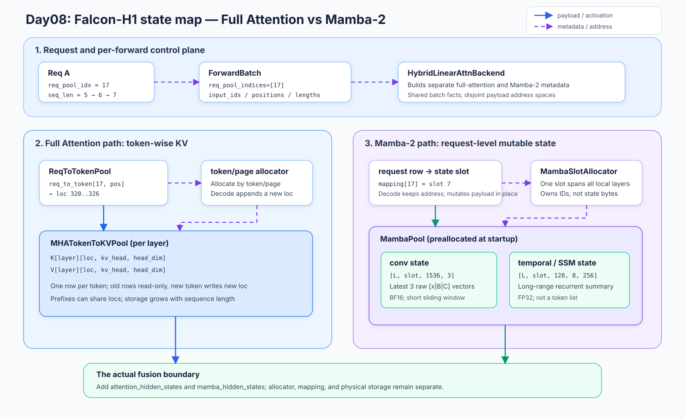
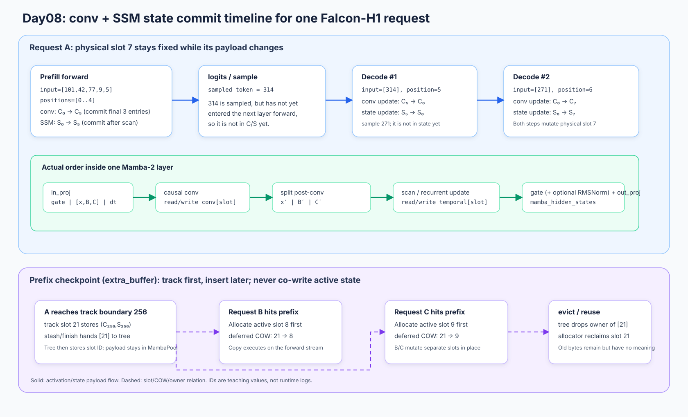

# 4｜先算懂 Mamba-2，再沿 SGLang 源码追 conv 与 SSM state

> 本文追踪一条 Falcon-H1 请求：先算清一个 token 怎样更新短卷积窗口和长程 SSM state，再沿 SGLang 的建池、寻址、prefill/decode、checkpoint 和释放走完生命周期。
>
> 源码基线：当前 checkout `a478b5d7e74d83a9bcdb31440c2ffd64b01a2d66`（2026-09-08 核对）。链接使用仓库相对路径和行号锚点；切换版本后优先按函数名搜索。
>
> 延续第1～3篇的带读方式：先建立计算与状态模型，再用“短源码 → 关键解释 → 下一跳”进入实现。读者起点明确为：**不懂 Mamba**。正文从一个标量递推开始，每次只增加一个概念；先跑通教学 PyTorch mixer，再进入 SGLang。不要求先读其他篇章。这里的“追踪请求”是源码级主线，不代表已经加载 Falcon-H1 权重跑过在线服务。示例默认关闭 gated RMSNorm，以对齐当前 Falcon-H1 配置的 `mamba_rms_norm=False`；需要观察归一化分支时显式传 `use_rms_norm=True`。

## 0. 这篇只回答一个问题

**Mamba-2 为什么要同时保存 `conv` 和 `temporal`，SGLang 又怎样让这两份可变状态支持连续生成和 prefix reuse？**

先区分三个容易混淆的量：当前 token 的 hidden activation 是这一轮计算的输入；`conv` 保存下一轮卷积需要的短窗口；`temporal` 保存处理完整个前缀后的 SSM 末态。后两者跨 forward 存活，但都不是逐 token 追加的历史列表。

Falcon-H1 还同时有 Full Attention 分支，所以整模型仍有按 token 增长的 KV cache。本文重点是 Mamba 分支的状态；Full KV 只在解释“两套地址怎样挂在同一个请求上”时出现。

先看一张地址地图，回答本篇最容易混淆的问题：**同一个请求为什么同时拥有按 token 增长的 Full-KV 地址和按请求复用的 Mamba state slot？** 图中 `17`、`7` 以及 `1536/128/8/256` 是 Falcon-H1 默认配置下的教学值；TinyMamba2 使用更小的 `6/2/2/3`，两者不要混作同一组 shape。



图后按三个源码跳转核对：request row 与 batch metadata 见 [`ReqKvInfo`](../../python/sglang/srt/managers/schedule_batch.py#848-877) 和 [`ForwardBatch`](../../python/sglang/srt/model_executor/forward_batch_info.py#393-435)；Full 侧的 `req_to_token → loc → K/V` 由 [`ReqToTokenPool`](../../python/sglang/srt/mem_cache/memory_pool.py#270-392) 与 [`MHATokenToKVPool`](../../python/sglang/srt/mem_cache/memory_pool.py#1954-3071) 持有；Mamba 侧的 `mapping[row] → slot`、backing tensor 和 layer view 由 [`HybridReqToTokenPool.alloc`](../../python/sglang/srt/mem_cache/memory_pool.py#1426-1481)、[`MambaPool.__init__`](../../python/sglang/srt/mem_cache/memory_pool.py#524-614) 和 [`mamba2_layer_cache`](../../python/sglang/srt/mem_cache/memory_pool.py#1527-1528) 完成。两条分支最后只在 [`FalconH1HybridAttentionDecoderLayer.forward`](../../python/sglang/srt/models/falcon_h1.py#315-367) 汇合 activation；allocator、payload 和 owner 不合并。

建议按三层读：**必读主线**是 1.1–1.8 → 2–7 → 8.1–8.3 → 9，先把 state、row/slot、普通 prefill/decode 和 owner 转移走通；**第二遍**再读 1.9–1.10 的 SSD scan 与第 10 节断点；第 8.4 和第 11 节是对照/进阶分支。这样不会把 tracking、speculative、int8 等优化细节误当成每个请求都必经的步骤。

## 1. 从零理解 Mamba-2：先会算，再看它怎样加速

Mamba-2 可以用来构造语言模型，但它的核心模块首先是一个**有记忆的序列变换**：读进当前层的输入向量，更新内部记忆，产生当前输出向量。token id 会先经过 embedding 等上游计算；本节的输入 $h_t$ 已经是向量，不是词或 token 编号。

这里分两遍学。**第一遍到 1.8 节为止**，亲手把一个完整 token 算完，再连续算一段序列；**第二遍读 1.9–1.10 节**，理解为什么同一计算在 prefill 时会展开成很多 GPU 调用。缓存管理从第 2 节才开始。

### 1.1 先不看 Mamba，写一个会记住过去的程序

假设序列依次输入 2、4、0，每次保留一半旧记忆，再加上当前输入：

```python
# 教学递推，可独立运行；这还不是完整 Mamba。
state = 0.0
outputs = []
for x in [2.0, 4.0, 0.0]:
    state = 0.5 * state + x
    outputs.append(state)
assert outputs == [2.0, 5.0, 2.5]
```

第三个输入明明是 0，输出却是 2.5，因为 `state` 携带前两个输入的影响。展开最后一步就能看出来：$2.5=0.5^2\times2+0.5\times4+0$。这叫递推：下一步把上一步的结果当输入，不必重新访问整段历史。

不过 `state=2.5` 不能告诉你原序列究竟是什么，许多不同输入可以形成同样的状态。它是按更新规则压缩后的历史，不是可以随意取回所有旧 token 的列表。Mamba 也不能把固定大小的 state 当作无损存储无限历史的容器；它通过训练学习保留对任务有用的信息。

上面只用一个数记忆，能力很有限。下一步把它扩成向量，并让“写进去什么”和“读出来什么”成为不同操作。

### 1.2 `B` 负责写入方向，`C` 负责读出方向

先令当前输入 $x_t$ 还是一个数，而 state 是含 $N$ 个数的向量：

$$
s_t=a_t s_{t-1}+B_t x_t,
\qquad y_t=C_t^\mathsf T s_t+D x_t.
$$

$B_t$ 把一个输入分配到 $N$ 个 state 分量里；$C_t$ 再把这 $N$ 个分量加权读成一个输出。$D x_t$ 是当前输入到输出的直连项。下面的数字全是教学手设值：

```python
# 教学向量 SSM，可独立运行。
import torch

state = torch.tensor([1.0, 2.0])
x = torch.tensor(3.0)
a = 0.5
B = torch.tensor([1.0, -1.0])
C = torch.tensor([2.0, 1.0])
D = 0.1
new_state = a * state + B * x  # [3.5, -2.0]
y = C @ new_state + D * x     # 5.3
assert torch.allclose(new_state, torch.tensor([3.5, -2.0]))
assert torch.allclose(y, torch.tensor(5.3))
```

注意 `new_state` 有两个数，`y` 只有一个数；输出与持久 state 是不同产物。下一 token 接走 `new_state`，本层的下一计算模块接走 `y`。

这里的“方向”是数值权重，不是内存地址。`B/C` 可以有正有负，不是写入/读取某个 slot 的整数索引。这种“用隐状态描述系统如何随输入演化”的模型称为 **state space model，SSM，状态空间模型**。本课先学离散的 token 更新，不要求先掌握连续时间微分方程。

### 1.3 Mamba 的 selective：当前输入会改变更新规则

如果每一步都用相同的 $a,B,C$，所有输入都遵守固定的记忆与读写规则。Mamba 让部分量依赖当前输入：当前内容可以影响这一步写入和读出什么、旧历史以多快的速度衰减。这是 [Mamba 论文](https://arxiv.org/abs/2312.00752) 中 selective SSM 的核心动机。

本篇要读的是 **Mamba-2**。先固定一个 head，它把衰减写成：

$$
A=-\exp(A_{\log})<0,
\qquad \Delta_t=\operatorname{softplus}(\widehat\Delta_t+b_\Delta)>0,
\qquad a_t=\exp(\Delta_t A).
$$

其中 `softplus(v)=log(1+exp(v))`。$A$ 是模型学到的参数，$\widehat\Delta_t$ 是当前输入经过投影得到的值；所以 $A$ 不随 token 重算，实际衰减 $a_t$ 却会随输入变化。代码可以直接算：

```python
# 教学参数化，可独立运行。
import torch
from torch.nn import functional as F

A_log = torch.tensor(0.0)
A = -A_log.exp()  # -1
raw_dt = torch.tensor([-3.0, 0.0, 3.0])
dt = F.softplus(raw_dt)
decay = (dt * A).exp()
print(dt.tolist())     # 约 [0.0486, 0.6931, 3.0486]
print(decay.tolist())  # 约 [0.9526, 0.5000, 0.0474]
```

同一个 $A=-1$，小 $\Delta$ 让旧 state 保留较多，大 $\Delta$ 让旧 state 衰减较多。在这里采用的 Mamba-2 更新里，当前写入还乘 $\Delta$：

$$
s_t=\exp(\Delta_t A)s_{t-1}+\Delta_t B_t x_t.
$$

这不是仅有“遗忘门”的公式；$B_t,C_t,x_t$ 也来自输入相关的计算。$\Delta$ 同时作用于旧状态传播和当前写入，但最终输出并不简单地随 $\Delta$ 单调增加。

“时间步长”来自 SSM 的连续时间背景；推理代码里你可以先把 $\Delta$ 理解为输入相关的更新尺度。这里的 $\Delta Bx$ 是本文实现实际采用的写入形式，不要把它误写成任意连续系统精确离散化后的通用公式。

### 1.4 从一个数扩成多 head：为什么 state 是 `[H,P,N]`

一个数的输入太少。现在每个 head 一次处理 $P$ 个数，记为 $x_{t,h}\in\mathbb R^P$；每个输入分量都需要 $N$ 个记忆分量，所以该 head 的 state 是一个 $P\times N$ 矩阵。

先固定一个 $B/C$ group，即所有 head 共享本 token 的 $B_t,C_t\in\mathbb R^N$。更新变成：

$$
S_{t,h}=\exp(\Delta_{t,h}A_h)S_{t-1,h}
+\Delta_{t,h}x_{t,h}B_t^\mathsf T,
\qquad y_{t,h}=S_{t,h}C_t+D_hx_{t,h}.
$$

不要被外积符号挡住。假设 $x=[2,3]$、$B=[1,4,5]$，当前输入写入的矩阵就是：

$$
xB^\mathsf T=
\begin{bmatrix}2\\3\end{bmatrix}
\begin{bmatrix}1&4&5\end{bmatrix}
=
\begin{bmatrix}2&8&10\\3&12&15\end{bmatrix}.
$$

第一行记输入分量 2 的贡献，第二行记分量 3 的贡献。读出时，每行与 $C$ 点积，各得到一个数，合起来恢复 $P$ 维输出。增加 $H$ 个 head 后，state 就是 `[H,P,N]`，而不是 `[T,H,P]`；序列长度 $T$ 没有成为永久 state 的一根轴。

| 量 | 教学 shape | 是否跨 token 保留 |
|---|---|---|
| 本层输入 `hidden` | `[D_model]` | 不是本层的 recurrent cache |
| 卷积后的 `x` | `[H,P]` | 当前步使用 |
| 卷积后的 `B`、`C` | 各 `[N]`，这里固定一个 group | 当前步使用 |
| `dt`、`A`、`D` | 各 `[H]` | `dt` 由输入生成，`A/D` 是模型参数 |
| `temporal` | `[H,P,N]` | 请求的持久状态 |
| SSM 核心输出 `y` | `[H,P]` | 交给门控、归一化与输出投影 |

Mamba-2 这里每个 head 使用一个标量衰减，广播到该 head 的整个 $P\times N$ state；它不是一个每步都要做矩阵乘法的任意稠密 $A$。这个结构限制与 head 设计使后面的 SSD 分块计算成为可能，见 [Mamba-2 论文](https://arxiv.org/abs/2405.21060)。本课不把这些特定约束推广为所有 SSM 的定义。

### 1.5 在 SSM 前面加短卷积：先混合相邻输入

到目前为止，我们把 $x,B,C$ 当作已经给定。完整 block 要自己从 `hidden` 产生它们。Mamba-2 的这条路径先做一个线性投影，拆成三部分：gate $z$、待卷积的 raw $u$、原始步长 $\widehat\Delta$。$u$ 内部又有 raw $x/B/C$ 三段。

raw $u$ 会经过 **depthwise causal convolution**。depthwise 表示每个通道各自做卷积，不在这里混合不同通道；causal 表示只能使用当前和之前的输入。卷积让后续 $x/B/C$ 带上局部邻域信息，是这一架构的组成部分，不是 SSM 递推在数学上必需的步骤。

例如某个通道的核宽 $K=3$、权重 `[0.2,0.3,0.5]`，旧窗口 `[1,2]`，新输入 4：

```python
# 教学单通道窗口，可独立运行；此处暂不加 bias 和 SiLU。
window = [1.0, 2.0]
weights = [0.2, 0.3, 0.5]
current = window + [4.0]
conv_out = sum(w * x for w, x in zip(weights, current))  # 2.8
window = current[1:]  # [2,4]，给下一 token 使用
assert window == [2.0, 4.0]
```

这个窗口保存的是卷积前的 2 和 4，不能改存卷积输出 2.8。实际计算还会加 bias、做 SiLU，再把结果拆成 SSM 使用的 $x,B,C$。SiLU 的定义是 $v\,\operatorname{sigmoid}(v)$。

于是一个 block 需要两种记忆：短窗口保留最近 $K-1$ 个 raw 输入，SSM state 聚合长前缀。它们功能不同，必须一起传给下一步。

这里的单 token 依赖先用文字固定下来：`hidden → in_proj` 产生 gate、raw `[x|B|C]` 与 `dt`；旧 `conv` 与 raw 输入经过 causal conv 后得到 $x,B,C$，再和旧 `temporal` 一起做 SSM 更新；最后 gate、（可选）RMSNorm 和 `out_proj` 只消费本轮 activation。第 8 节的 execution timeline 会把同一顺序放回真实源码调用点。不要把 gate、token 输出和持久 state 混成同一个对象。

### 1.6 把权重与 state 分开：一个可运行的 PyTorch mixer

完整教学代码在 [`examples/tiny_mamba2.py`](examples/tiny_mamba2.py)。它实现单序列、一个 $B/C$ group、无 TP 的 Mamba-2 **教学近似 mixer**，包含输入投影、卷积、SSM、门控和可选 RMSNorm、输出投影；使用随机教学权重，不是可生成有意义文本的训练好模型，也不包含 Falcon-H1 的 attention/MLP/residual 整层。默认 `use_rms_norm=False`，与当前 Falcon-H1 默认配置一致。

下面分段展示同一个类，不是要把缺少方法的片段分别运行。所有维度是教学固定值：`D_model=6, H=2, P=2, N=3, K=3`。先看构造函数：

```python
# 教学实现摘录；类内方法需要与同文件中的其他方法一起使用。
def __init__(
    self, d_model=6, heads=2, head_dim=2, d_state=3, kernel=3,
    use_rms_norm=False,
):
    super().__init__()
    assert kernel >= 2
    self.H, self.P, self.N, self.K = heads, head_dim, d_state, kernel
    self.use_rms_norm = use_rms_norm
    self.inner = heads * head_dim
    self.conv_dim = self.inner + 2 * d_state  # 一个 B/C group
    self.in_proj = nn.Linear(d_model, self.inner + self.conv_dim + heads, bias=False)
    self.conv_weight = nn.Parameter(torch.randn(self.conv_dim, 1, kernel) * 0.2)
    self.conv_bias = nn.Parameter(torch.zeros(self.conv_dim))
    self.A_log = nn.Parameter(torch.zeros(heads))
    self.dt_bias = nn.Parameter(torch.zeros(heads))
    self.D = nn.Parameter(torch.ones(heads))
    if self.use_rms_norm:
        self.norm_weight = nn.Parameter(torch.ones(self.inner))
    else:
        self.register_parameter("norm_weight", None)
    self.out_proj = nn.Linear(self.inner, d_model, bias=False)
```

`inner=H*P=4` 是 SSM 的输入/输出宽度，`conv_dim=inner+2*N=10` 是 raw `[x|B|C]` 总宽度。因此输入投影输出 `4+10+2=16` 个数，分别送给 gate、卷积和步长。注意 `D_model=6` 与 `inner=4` 不必相同，最后 `out_proj` 会投影回 6 维。

这些都是各请求共享的模型权重。请求的两份 state 则由调用者单独持有：

```python
# 教学实现摘录；类内方法需要与同文件中的其他方法一起使用。
def empty_state(self):
    # 与权重同 device/dtype；教学代码使用统一 dtype。
    return {
        "conv": self.A_log.new_zeros(self.conv_dim, self.K - 1),
        "temporal": self.A_log.new_zeros(self.H, self.P, self.N),
    }
```

这个函数只创建 `[10,2]` 的卷积窗口与 `[2,2,3]` 的 SSM 矩阵，没有序列长度参数。下一段 `step` 会拿到它们的引用并原地更新；真实 SGLang 会把很多这样的 state 放进大 pool，而不是每请求新建 Python 字典。

投影这一步也不留作未实现的占位函数：

```python
# 教学实现摘录；类内方法需要与同文件中的其他方法一起使用。
def project(self, hidden):
    # hidden 可以是 [D_model]，也可以是 [T,D_model]。
    projected = self.in_proj(hidden)
    return torch.split(projected, [self.inner, self.conv_dim, self.H], dim=-1)
```

返回顺序是 `(gate, raw_u, raw_dt)`；shape 为 `[4]`、`[10]`、`[2]`。现在当前输入的三条路径都有了具体数值，下一步把 `raw_u` 与旧窗口放在一起计算。

### 1.7 `step`：从完整 hidden 输入，一直算到新 state

以下是教学类的完整单步方法。它没有把卷积或递推藏进未定义的 `update_state()`；只把已经给出的投影与下一节的输出处理作为方法复用：

```python
# 教学实现摘录；类内方法需要与同文件中的其他方法一起使用。
def step(self, hidden, state):
    # 单 token：[D_model] + 旧 state -> [D_model] + 原地更新的 state。
    gate, raw_u, raw_dt = self.project(hidden)
    window = torch.cat([state["conv"], raw_u[:, None]], dim=-1)
    u = F.silu((window * self.conv_weight[:, 0]).sum(-1) + self.conv_bias)
    state["conv"].copy_(window[:, 1:])  # 保存 raw 窗口，不保存 u
    x, B, C = torch.split(u, [self.inner, self.N, self.N], dim=-1)
    x = x.view(self.H, self.P)
    dt = F.softplus(raw_dt + self.dt_bias)
    A = -self.A_log.exp()
    new_s = (
        torch.exp(dt * A)[:, None, None] * state["temporal"]
        + dt[:, None, None] * x[:, :, None] * B[None, None, :]
    )
    state["temporal"].copy_(new_s)
    y = torch.einsum("hpn,n->hp", new_s, C) + self.D[:, None] * x
    return self.finish(y, gate), state
```

可以按四个停顿点调试：

1. `window` 为 `[10,3]`，是旧两步 raw 输入加当前一步；求和、bias、SiLU 后 `u` 为 `[10]`。`conv.copy_` 把最新两条 **raw** 输入保存回去。
2. `torch.split` 把 `u` 拆成 4、3、3 维，随后 `x.view(2,2)` 按 head 整理。`dt` 和 `A` 各是 `[2]`。
3. `x[:,:,None] * B[None,None,:]` 广播成 `[2,2,3]`。这就是 1.4 节每个 head 的外积写入；加上衰减后的旧 state 后，`temporal.copy_` 完成本轮持久状态更新。
4. `einsum("hpn,n->hp", new_s, C)` 沿 state 维度 `n` 求和，得到 `[2,2]` 输出。此时已经有 SSM 核心的 $y_t$，但还没有完整 mixer 的 6 维输出。

这段顺序对应 [`MambaMixer2.forward` 的普通 decode 分支](../../python/sglang/srt/layers/attention/mamba/mamba.py#L673-L752)。真实 kernel 的算术也并没有消失：Triton 路径在 [`mamba_ssm.py`](../../python/sglang/kernels/ops/mamba/triton_ops/mamba_ssm.py#L267-L308) 内执行 `state = state * dA + dB * x[:, None]`，读出后再把 state 写回。后文第 7 节会从 dispatcher 带到这里。

还有一个源码差异要提前标出：教学类每步计算 `A=-exp(A_log)`；SGLang 在 [权重加载器](../../python/sglang/srt/layers/attention/mamba/mamba.py#L415-L420) 中完成这个转换，所以运行时的 `self.A` 已经是负值，不能再对它做一次同样的转换。

### 1.8 门控、（可选）RMSNorm、输出投影：SSM 输出还要处理什么

SSM 的 $y$ 描述读出的历史和当前输入贡献；gate $z$ 由当前输入的另一条投影分支产生。当前实现先计算 $v=y\odot\operatorname{SiLU}(z)$；当 `use_rms_norm=True` 时再对 $v$ 做 RMSNorm，最后输出投影：

$$
\widehat v=\gamma\odot\frac{v}{\sqrt{\operatorname{mean}(v^2)+\epsilon}}
\quad(\text{开启 RMSNorm 时}),
\qquad o=W_{\rm out}\widehat v.
$$

关闭 RMSNorm 时直接取 $\widehat v=v$，仍然执行 gate 和 `out_proj`。

gate 是对输出的逐元素调制；SiLU 不是一个被限定在 0 到 1 的概率门。RMSNorm 用当前向量的均方根控制尺度，这里不减均值，也不维护跨 token 的 running statistics。对本教学配置，若开启归一化，它发生在全部 `inner=4` 个分量上；默认关闭时只有 gate 和输出投影。

```python
# 教学实现摘录；类内方法需要与同文件中的其他方法一起使用。
def finish(self, y, gate):
    # TP=1、一个 norm group；Falcon-H1 默认可关闭 RMSNorm。
    v = y.flatten(start_dim=-2) * F.silu(gate)
    if self.use_rms_norm:
        # 与 Mixer2RMSNormGated.forward_* 的 norm_before_gate=False 对齐。
        v = v * torch.rsqrt(v.square().mean(dim=-1, keepdim=True) + 1e-6)
        v = v * self.norm_weight
    return self.out_proj(v)
```

这时输出恢复为 `[D_model]=[6]`，可以交给后续网络层；state 已在 `step` 中提交，不因输出投影再变化。源码的 `Mixer2RMSNormGated.forward_native/forward_cuda` 都是先 gate；只有 `use_rms_norm=True` 才归一化，CUDA 路径明确传 `norm_before_gate=False`（见 [`forward_native`](../../python/sglang/srt/layers/attention/mamba/mixer2_rms_norm_gated.py#L68-L87)、[`forward_cuda`](../../python/sglang/srt/layers/attention/mamba/mixer2_rms_norm_gated.py#L113-L135)）。Falcon-H1 当前默认 `mamba_rms_norm=False`（[`FalconH1Config` defaults](../../python/sglang/srt/configs/falcon_h1.py#L159-L170)），因此生产默认路径是 gate-only；配置文档/字段中的 `mamba_norm_before_gate`（[`FalconH1Config` field](../../python/sglang/srt/configs/falcon_h1.py#L106-L109)、[`stored fields`](../../python/sglang/srt/configs/falcon_h1.py#L238-L239)）虽保留，目前没有传入 `MambaMixer2`，不能据字段名推断运行顺序。

现在可以真正把一段 hidden 序列交给完整 block：

```python
# 教学实现摘录；类内方法需要与同文件中的其他方法一起使用。
def recurrent(self, hidden, state):
    outputs = []
    for h_t in hidden:
        y_t, state = self.step(h_t, state)
        outputs.append(y_t)
    return torch.stack(outputs), state
```

`recurrent` 循环里每一次 `step` 都消费上一轮的两份 state；prefill 可以循环多次，decode 只循环一次。第一遍读到这里，应当能够不打开 SGLang 就解释这个 block 如何从输入产生输出和新 state。接下来再看 prefill 为什么还需要其他实现。

### 1.9 [第二遍] Prefill 的复杂处：把逐 token 递推改写成 chunk 内矩阵计算

Python 一步接一步更新 state，容易理解，却没有充分利用 GPU 对矩阵乘法的吞吐。prefill 的输入序列已经给定，可以先对全部 token 做投影和短卷积，再重排 SSM 的计算。decode 还不知道未来采样出来的 token，则继续使用单步更新。

先把某个 head 的写入项简写成 $U_t=\Delta_t x_tB_t^\mathsf T$，则三步更新展开为：

$$
S_1=a_1S_0+U_1,
\qquad S_2=a_2a_1S_0+a_2U_1+U_2,
$$

$$
S_3=a_3a_2a_1S_0+a_3a_2U_1+a_3U_2+U_3.
$$

每个历史写入项只是乘上“从写入后到当前”的衰减。令 $L_{t,s}=\prod_{i=s+1}^{t}a_i$，三个位置的权重可以摆成一个因果矩阵：

$$
L=\begin{bmatrix}
1&0&0\\
a_2&1&0\\
a_3a_2&a_3&1
\end{bmatrix}.
$$

对角线为 1，因为当前写入 $U_t$ 不再额外衰减一次；上三角为 0，因为不能使用未来输入。读出时再乘 $C_t$，位置 $s$ 对位置 $t$ 的贡献就成了：

$$
y_t^{\rm within}=\sum_{s\le t}L_{t,s}\Delta_s(C_t^\mathsf T B_s)x_s.
$$

这出现了类似 attention 的“历史位置到当前位置的权重矩阵”，但没有 softmax，权重也不要求非负或和为 1；不能直接把它说成普通 softmax attention。

如果对整条长序列显式建立 $T\times T$ 权重矩阵，就失去了线性递推的内存优势。**分块**解决这个问题：每个 chunk 内只建立小的 $Q\times Q$ 矩阵；chunk 之前的历史由入口 state 表示；chunk 结束只向后传末态。当前输出拆成两部分：本 chunk 内的贡献，以及入口 state 衰减、读出后的贡献。

下面是独立于单步 `step` 写出的教学 SSD 实现。它按 chunk 循环，chunk 内使用矩阵运算；`dt` 已经过 softplus，`A` 已是负值：

```python
# 教学实现摘录；类内方法需要与同文件中的其他方法一起使用。
def ssm_chunked(x, dt, A, B, C, D, initial, chunk_size):
    """教学 SSD：x=[T,H,P], dt=[T,H], B/C=[T,N], initial=[H,P,N]。

    dt 已做 softplus；A=[H] 为负数。只在 chunk 边界传递 state。
    chunk 内使用 [H,Q,Q] 因果权重矩阵；不是生产用的高效 GPU 实现。
    """
    if chunk_size < 1:
        raise ValueError("chunk_size must be positive")
    state = initial.clone()
    outputs = []
    for start in range(0, x.shape[0], chunk_size):
        xc = x[start : start + chunk_size]
        dc = dt[start : start + chunk_size]
        bc = B[start : start + chunk_size]
        cc = C[start : start + chunk_size]
        q = xc.shape[0]
        prefix = (dc * A).cumsum(dim=0)  # [Q,H]，log 衰减的前缀和
        causal = torch.ones(q, q, dtype=torch.bool, device=x.device).tril()
        # 每列 s 独立累加 s+1..t，避免两段很大的前缀和相减。
        terms = (dc * A).T[:, :, None].expand(-1, -1, q)
        segments = terms.masked_fill(~causal.tril(-1), 0).cumsum(dim=1)
        L = segments.masked_fill(~causal, -torch.inf).exp()  # [H,Q,Q]

        # chunk 内部 token 之间的贡献：先算 C_t · B_s，再乘衰减和 dt_s。
        CB = cc @ bc.T  # [Q,Q]；行是读出位置 t，列是写入位置 s
        weights = L * CB[None, :, :] * dc.T[:, None, :]
        within = torch.einsum("hts,shp->thp", weights, xc)
        # 之前所有 chunk 的历史，只通过入口 state 贡献给当前输出。
        from_previous = prefix.exp()[:, :, None] * torch.einsum(
            "hpn,tn->thp", state, cc
        )
        outputs.append(within + from_previous + D[None, :, None] * xc)

        # 只提交这个 chunk 的末态，供下一个 chunk 继续使用。
        tail_weight = L[:, -1, :].T * dc
        written = torch.einsum("th,thp,tn->hpn", tail_weight, xc, bc)
        state = prefix[-1].exp()[:, None, None] * state + written
    return torch.cat(outputs, dim=0), state
```

这里值得多停一下：`CB=cc@bc.T` 的行是读出位置 $t$，列是历史写入位置 $s$；乘上 `L` 与 `dt_s` 后才形成完整权重。`from_previous` 从 **chunk 入口 state** 计算，必须在把 `state` 更新到当前 chunk 末端之前完成。`written` 则把本 chunk 的所有输入合成一份末态，下一 chunk 只需要这份 state，不需要之前 chunk 的完整权重矩阵。

`segments` 的每一列独立累加区间内的 log 衰减，避免用两个很大的前缀和相减。这是为了说明数学等价还不够，数值实现也要考虑消减误差。作者的 [SSD 算法说明](https://goombalab.github.io/blog/2024/mamba2-part3-algorithm/) 包含四阶段解释和稳定性讨论；页面中的 block matrix 图可作第二遍学习参考（作者 Goomba Lab，图片仅外链学习引用，未复制到本仓库）。本文教学代码不声称复现生产 kernel 的布局或性能。

把整段投影、带历史窗口的卷积和这个 SSD 接起来，便得到另一条完整的 prefill 路径：

```python
# 教学实现摘录；类内方法需要与同文件中的其他方法一起使用。
def prefill(self, hidden, state, chunk_size=4):
    # 多 token；投影、卷积并行计算，SSM 使用 chunked SSD。
    gate, raw_u, raw_dt = self.project(hidden)
    history = torch.cat([state["conv"], raw_u.T], dim=-1)
    u = F.silu(F.conv1d(
        history[None], self.conv_weight, self.conv_bias,
        groups=self.conv_dim,
    )[0].T)
    state["conv"].copy_(history[:, -(self.K - 1):])
    x, B, C = torch.split(u, [self.inner, self.N, self.N], dim=-1)
    dt = F.softplus(raw_dt + self.dt_bias)
    y, last_s = ssm_chunked(
        x.view(-1, self.H, self.P), dt, -self.A_log.exp(), B, C,
        self.D, state["temporal"], chunk_size,
    )
    state["temporal"].copy_(last_s)
    return self.finish(y, gate), state
```

`history` 是 `[conv_dim,K-1+T]`，`conv1d` 不再额外 padding，输出恰好有 $T$ 个位置；每个窗口只到当前 token 为止。SSM 的 `last_s` 最后一次性写回 `temporal`。因此 `prefill` 与 `recurrent` 的中间执行方式不同，入口与出口的 state 契约相同。

### 1.10 [第二遍] 在真实 scan 中找到这几部分，再运行对照

现在再点开 SGLang 的 [`_mamba_chunk_scan_combined_fwd`](../../python/sglang/kernels/ops/mamba/triton_ops/ssd_combined.py#L88-L179)，它就不再只是一个名字。下面是省略变长请求、shape 展开和部分参数后的调用骨架：

```python
# SGLang 源码调用骨架；不是可独立运行的替代实现。
dA_cumsum, dt = _chunk_cumsum_fwd(
    dt, A, chunk_size, dt_bias=dt_bias, dt_softplus=dt_softplus, dt_limit=dt_limit
)
states = _chunk_state_fwd(B, x, dt, dA_cumsum, seq_idx=seq_idx, states_in_fp32=True)
# 实际传入前先 flatten P/N 轴，返回后再恢复；详见原函数。
states, final_states = _state_passing_fwd(...)
CB = _bmm_chunk_fwd(C, B, chunk_size, seq_idx=seq_idx, output_dtype=torch.float32)
out_x = _chunk_scan_fwd(CB, x, dt, dA_cumsum, C, states, ...)
# 变长请求分支还用 chunk_state_varlen(...) 提取每个请求末态。
```

教学代码逐 chunk 做完再进入下一块；生产代码可以先并行算各块的摘要，再做块间 state passing，最后合成各块输出。两种组织方式都必须保留下面的因果关系：

| SGLang 调用 | 刚才教学代码中的量 | 接下来谁使用 |
|---|---|---|
| `_chunk_cumsum_fwd` | 正值 `dt`、衰减的累计信息 | chunk state 与输出计算 |
| `_chunk_state_fwd` | 假设入口为零时的块内 `written` | 块间 state passing |
| `_state_passing_fwd` | 按顺序把前面各块影响加入入口 state | 每块的历史贡献读出 |
| `_bmm_chunk_fwd` | `CB` | 块内权重与输出 |
| `_chunk_scan_fwd` | `within + from_previous + D*x` | 后面的 gated norm |
| `chunk_state_varlen` | 按真实请求结束位置取末态 | mixer 提交到各请求的 active slot |

一个 batch 的 flattened token 还可能跨越多条请求；`seq_idx/cu_seqlens/chunk_offsets` 必须阻止 A 请求的 state 传进 B 请求。这些额外代码解决的是实际 batch 边界、临时内存、dtype 与设备执行问题，不是多写了几种不同的 Mamba 数学公式。

完整 demo 在仓库根目录这样运行：

```bash
conda run -n base python mydocs/4_sglang_mamba2_conv_ssm_state/examples/tiny_mamba2.py
```

这次在 `base` 环境、CPU float64 下实际得到（示例默认关闭 RMSNorm；不同 PyTorch/BLAS 版本的最后几位可能漂移）：

```text
PASS: recurrent vs chunked prefill; max output error = 6.939e-18
PASS: nonzero initial state, chunk tails, prefix continuation, COW, in-place decode
output: (7, 6) conv: (10, 2) temporal: (2, 2, 3)
```

脚本比较的是两种不同算法组织下的 **全部输出和两份末态**，不是只比较 shape：覆盖零/非零初态、chunk 为 1/2/4/8、非整除尾段、分段 prefill 再 decode，以及复制 checkpoint 后各请求互不影响。它验证教学模型的闭环；没有加载 Falcon-H1 权重，也没有据此声称生产 GPU kernel 已通过数值或性能验证。

最后把教学对象接回后文的 SGLang 主线：

| 教学产物 | SGLang 对应项 | 写入与下次读取 |
|---|---|---|
| `TinyMamba2` 的参数 | `MambaMixer2` 投影、conv、A/D、norm 参数 | 权重加载一次，各请求共享 |
| 调用者持有的 `state["conv"]` | 当前 layer 的 `layer_cache.conv[0][slot]` | conv kernel 写回，下个 token 消费 |
| `state["temporal"]` | `layer_cache.temporal[slot]` | scan 末态提交或 decode kernel 原地更新 |
| `clone_state(prefix)` | prefix COW 的 conv + temporal 复制 | 新请求获得独立可写副本 |
| `recurrent` / `prefill` 的输入序列 | metadata 描述的本轮请求 token 区间 | mixer 按区间与 slot 计算 |

Mamba-2 的核心公式短，是因为它把每一步写得很紧凑。读懂实现仍需展开参数如何产生、两个 state 如何更新、输出如何形成，以及同一递推如何变成 GPU 的分块计算。带着这些已经算过的对象，再去第 2 节看 pool、slot 和 metadata，才不会只剩下类名和断点。

## 2. 把计算产物落到 SGLang 的对象和地址

### 2.1 固定一条实现主线

后文固定 Falcon-H1、TP=1、CUDA eager、普通 target worker、UnifiedRadixCache、prefix cache 开启、`page_size=1`、`extra_buffer` 和 overlap schedule 开启。关闭 speculative decoding、HiCache、ReplaySSM、int8 checkpoint、unified memory 与 page-major/envelope layout。

观测时显式选择 `--attention-backend triton --mamba-radix-cache-strategy extra_buffer --disable-cuda-graph`，并核对 resolved args。Full Attention backend 的 `triton` 选项不代表所有 Mamba kernel 都固定为 Triton；具体 selective-update 还经过 [独立 dispatcher](../../python/sglang/kernels/ops/mamba/triton_ops/ssu_dispatch.py#L235-L305)。这不是完整启动命令，实际还需要模型路径和资源配置。

`no_buffer` 是第 8 节的对照分支，必须另起一轮并关闭 overlap，约束见 [`validate_mamba_no_buffer`](../../python/sglang/srt/arg_groups/mamba_hook.py#L143-L147)。正文不会在同一轮 trace 中切换两种策略。

### 2.2 一个请求有两套地址

第 0 节的 state-map SVG 已把 `r`、token loc、`m`、`c` 四种坐标画在同一张图里，本节不再复制一张等价流程图；这里改为用对象表逐项核对。layer cache 先选择层，再由 `mamba_cache_indices` 选择请求；metadata 携带地址，不持有这些 state bytes。

| 角色 | 本项目实际对象 / 字段 | producer | consumer 与寿命 |
|---|---|---|---|
| 请求行 | `req.kv.req_pool_idx` | request pool `alloc` | `req_to_token` 和 row→Mamba mapping 使用；请求释放时回收 |
| 可写状态句柄 | `req.kv.mamba_pool_idx` | miss 时 allocator；hit 时 COW 准备 | pool mapping 和后续 forward；绑定期间可写 |
| 行到状态的映射 | `req_index_to_mamba_index_mapping`，GPU int32 表 | `HybridReqToTokenPool.alloc` | backend `get_mamba_indices` gather |
| 持久 payload owner | `MambaPool.State.conv/temporal` | 启动建池 | mixer 的 conv/SSM kernel；大 tensor 常驻 |
| 本轮状态载体 | `ForwardBatch`、`Mamba2Metadata` | batch 转换、backend metadata 构造 | 本轮所有 Mamba 层复用 |
| 只读前缀 checkpoint | `node.component_data[MAMBA].value` | cache boundary 的 component insert | 后续 prefix hit 复制；eviction 后归还 slot |

`mamba_pool_idx` 在实际分配代码中来自 `mid[0]`，是 **0 维标量 tensor**；需要长度一向量时再 `unsqueeze(0)`。不要仅凭旧字段注释把它写成固定 `[1]`，证据见 [`alloc`](../../python/sglang/srt/mem_cache/memory_pool.py#L1426-L1481) 和 [`finalize_match_result_in_cache`](../../python/sglang/srt/mem_cache/unified_cache/components/mamba_component.py#L187-L216)。

`FULL=0`、`MAMBA=2` 只是 [`ComponentType`](../../python/sglang/srt/mem_cache/unified_cache/component_type.py#L6-L30) 的 namespace 索引。`node.component_data[FULL].value` 通常保存 token-loc 向量，MAMBA 的 value 保存 state-slot 向量；树没有把整块 conv/SSM tensor 塞进 node。

## 3. 启动建池：先确定 shape，再创建长期 owner

### 3.1 从 scheduler 进入，模型配置提供 state 的尺寸

> **导航卡**：从 `Scheduler.init_memory_pools` 进入；看 `cache_params`、`mamba_layer_ids` 和 `mamba_size`；下一跳是 `HybridReqToTokenPool._init_mamba_pool`；先忽略 draft、disaggregation 和 unified-memory 分支。

创建发生在请求到来之前。直接上层入口是 [`Scheduler.init_target_memory_pool`](../../python/sglang/srt/managers/scheduler.py#L1006-L1035)，它调用 [`TpModelWorker.alloc_memory_pool`](../../python/sglang/srt/managers/tp_worker.py#L407-L424)，再到 [`ModelRunner.alloc_memory_pool`](../../python/sglang/srt/model_executor/model_runner.py#L881-L903)。下面是两个不同函数中保留主线语句的骨架：

```python
# 省略分支后的骨架：ModelRunner.alloc_memory_pool
self.init_kv_cache_configurator()
result = self.kv_cache_configurator.configure(
    pre_model_load_memory=self.pre_model_load_memory
)
self.req_to_token_pool = result.req_to_token_pool
self.token_to_kv_pool = result.token_to_kv_pool
self.token_to_kv_pool_allocator = result.token_to_kv_pool_allocator

# 省略参数后的骨架：KVCacheConfigurator._build_hybrid_req_pool
req_to_token_pool = HybridReqToTokenPool(
    size=max_num_reqs,
    mamba_size=get_schedule().max_mamba_cache_size,
    cache_params=self.mambaish_config.mamba2_cache_params,
    # device、layer 范围、tracking 与其他参数见原函数
)
```

runner 接收的是 configurator 已创建的对象引用，不是在每次 forward 重建 pool。普通静态池走 [`_init_pools`](../../python/sglang/srt/mem_cache/kv_cache_configurator.py#L516-L550)，由 [`_build_req_to_token_pool`](../../python/sglang/srt/mem_cache/kv_cache_configurator.py#L938-L966) 的 mambaish 分支进入 [`_build_hybrid_req_pool`](../../python/sglang/srt/mem_cache/kv_cache_configurator.py#L1036-L1095)。下一步要打开 `cache_params` 的 producer，才能知道这一块内存究竟保存什么。

Falcon-H1 的 [`mamba2_cache_params`](../../python/sglang/srt/configs/falcon_h1.py#L301-L315) 调用 `Mamba2StateShape.create`。按配置类的 [默认参数](../../python/sglang/srt/configs/falcon_h1.py#L140-L166)：`mamba_d_ssm=1024`、`mamba_n_heads=128`、`mamba_n_groups=1`、`mamba_d_state=256`、`mamba_d_conv=4`，自动 head dim 为 $1024/128=8$。这些是配置类默认值，实际权重的 config 可以覆盖，不能当成所有 Falcon-H1 checkpoint 的固定尺寸。

[`Mamba2StateShape.create`](../../python/sglang/srt/configs/mamba_utils.py#L188-L237) 在 TP=1 时给出：

$$
D_c=1024+2\times1\times256=1536,
\qquad \texttt{conv\_state\_shape}=(1536,3),
$$

$$
\texttt{temporal\_state\_shape}=(H,P,N)=(128,8,256).
$$

这正好对应第 1 节的 raw 窗口和 SSM 矩阵。`temporal` 的三个轴里没有序列长度；`conv` 的最后一轴也只保留 $K-1$，不随上下文增长。

### 3.2 真正分配 tensor 的位置

`HybridReqToTokenPool` 得到上述 shape 后，在 [`_init_mamba_pool`](../../python/sglang/srt/mem_cache/memory_pool.py#L1280-L1317) 创建 `MambaPool`、`MambaSlotAllocator` 和全局 layer id 到 pool ordinal 的 `mamba_map`。随后 [`MambaPool.__init__`](../../python/sglang/srt/mem_cache/memory_pool.py#L524-L614) 真正分配 backing：

```python
# 真实源码摘录：MambaPool.__init__ 普通 layout 分支
conv_state = [
    torch.zeros(
        size=(num_mamba_layers, size + 1) + conv_shape,
        dtype=conv_dtype,
        device=device,
    )
    for conv_shape in conv_state_shape
]
# 省略其他平台对 conv layout 的转换
temporal_state = torch.zeros(
    size=(num_mamba_layers, size + 1) + temporal_state_shape,
    dtype=ssm_dtype,
    device=device,
)
```

构造函数按模型提供的 shape 同时建立两类 buffer，后续 forward 只选择其中的 layer/slot view。这里的 `size + 1` 给 slot 0 留出 dummy 空间。设本 rank 有 $L$ 个 Mamba 层、$M$ 个可用 slot，普通布局的完整 shape 为：

| payload | backing tensor | 当前层 view |
|---|---|---|
| `conv[0]` | `[L, M+1, 1536, 3]` | `[M+1, 1536, 3]` |
| `temporal` | `[L, M+1, 128, 8, 256]` | `[M+1, 128, 8, 256]` |

[`mamba2_state_dtype`](../../python/sglang/srt/configs/mamba_utils.py#L47-L107) 默认 conv 为 BF16、temporal 为 FP32；`SGLANG_MAMBA_CONV_DTYPE`、`mamba_ssm_dtype` 配置与 `SGLANG_MAMBA_SSM_DTYPE` 可改变 dtype。默认尺寸和 dtype 下，每层每 slot 为 $1536\times3\times2+128\times8\times256\times4=1{,}057{,}792$ B；32 层的一份 state 为 32.28125 MiB。

这是 **一份** slot 的 payload 估算。`extra_buffer` 的 active、tracking 和树中 checkpoint 都占 slot；它不等于单请求总开销，更不是完整的并发容量结论。现在 pool 已经存在，下一步才是让一条请求得到可写 slot。

## 4. 请求进场：miss 分配，hit 准备 COW

### 4.1 Prefix lookup 返回的是可恢复前缀

> **导航卡**：从 `Req.init_next_round_input` 进入；看 `RadixKey`、`prefix_indices` 和 `mamba_cow_src_index`；下一跳是 admission 与 `prepare_for_extend`；先忽略 host load-back 和 speculative key。

[`Req.init_next_round_input`](../../python/sglang/srt/managers/schedule_batch.py#L1419-L1490) 用 token ids 和可选隔离字段构造 `RadixKey`，再调用 [`UnifiedRadixCache.match_prefix`](../../python/sglang/srt/mem_cache/unified_radix_cache.py#L523-L539)。树匹配的是 token 前缀，不是拿 token id 与 GPU slot id 比较。

命中可用 MAMBA checkpoint 且要求 COW 时，component 在 [`finalize_match_result_in_cache`](../../python/sglang/srt/mem_cache/unified_cache/components/mamba_component.py#L187-L216) 准备继续计算的目标位置：

```python
# 省略 eviction 重试后的骨架：MambaComponent.finalize_match_result_in_cache
src_index = self.tree_core.get_component_device_value(
    result.best_match_node, self.component_type
)
if src_index is not None:
    if not req.kv.holds_mamba:
        dst_index = self.cache.req_to_token_pool.mamba_allocator.alloc(1)
        req.kv.mamba_pool_idx = dst_index[0]
    req.kv.mamba_cow_src_index = src_index
    req.kv.mamba_needs_clear = False
```

现在请求已经记录 source，必要时也预约了 destination，但 **还没有复制 conv/temporal 内容**。因此 lookup 后可能已经有 `mamba_pool_idx`，不能把“request row 分配”当成所有 state slot 分配的最早时刻。tree 节点存在也不保证 MAMBA component 仍在 device 上；可复用深度必须经过 component 的匹配检查。

接下来 [`PrefillAdder`](../../python/sglang/srt/managers/schedule_policy.py#L1177-L1404) 做预算与锁保护，scheduler 的 [拒绝清理](../../python/sglang/srt/managers/scheduler.py#L3730-L3744) 回滚本轮新预约的 COW slot。只有 admission 通过，才把请求 materialize 为本轮 batch。

### 4.2 `prepare_for_extend` 把 row、token loc 和 active slot 接起来

[`ScheduleBatch.prepare_for_extend`](../../python/sglang/srt/managers/schedule_batch.py#L2504-L2552) 先得到本轮 suffix 的 token 与长度，再调用 [`alloc_for_extend`](../../python/sglang/srt/mem_cache/allocation.py#L282-L389)。后者经 [`alloc_req_slots`](../../python/sglang/srt/mem_cache/allocation.py#L229-L270) 进入 hybrid request pool：

```python
# 省略 tracking 和平台分支后的骨架：HybridReqToTokenPool.alloc
select_index = super().alloc(reqs)  # request rows
mamba_indices = []
for req in reqs:
    if not req.kv.holds_mamba:
        mid = self.mamba_allocator.alloc(1)
        req.kv.mamba_pool_idx = mid[0]
        req.kv.mamba_needs_clear = True
    mamba_indices.append(req.kv.mamba_pool_idx)
mamba_index_tensor = torch.stack(mamba_indices).to(dtype=torch.int32)
self.req_index_to_mamba_index_mapping[select_index] = mamba_index_tensor
```

这段 [真实分配路径](../../python/sglang/srt/mem_cache/memory_pool.py#L1426-L1481) 的关键是 `holds_mamba`：全新 miss 才分 fresh active slot；已有 COW destination 或 chunk continuation 继续使用现有句柄。最后写 mapping，才把请求行与 active slot 绑定。主线 `extra_buffer` 还会分配 tracking buffer；overlap 开启时 [buffer 数量为 2](../../python/sglang/srt/mem_cache/memory_pool.py#L1254-L1255)。

`alloc_for_extend` 同时从 token allocator 得到 `out_cache_loc`，并写入 `req_to_token[row, position]`，供 Full Attention 使用。5 个新 token 需要 5 个 Full token loc，却只推进一份 active Mamba state。

以下地址是教学值，不是实测日志，也不是 allocator 的固定返回顺序：

```python
# 教学字段快照：5-token miss 已分配，但尚未 forward
req_pool_idx = 17
req_to_token_row = [320, 321, 322, 323, 324]
mamba_pool_idx = 7
row_to_mamba = {17: 7}
tracking_slots = [21, 22]
mamba_needs_clear = True
```

现在地址齐了，内容还未必有效。新分配的 slot 可能残留前任请求的数据，prefix hit 的 destination 也还没复制。下一跳必须先完成 clear/COW，才能交给 mixer。

## 5. Forward 前：初始化 payload，再生成 kernel 的定位信息

### 5.1 Scheduler 收集意图，forward stream 执行 mutation

> **导航卡**：从 `prepare_for_extend` 的 deferred 收集进入；看 clear、COW source/destination；下一跳是 eager metadata 初始化；先忽略 int8 checkpoint 与虚拟池迁移。

[`_collect_deferred_mamba_cow_and_clear`](../../python/sglang/srt/managers/schedule_batch.py#L2859-L2879) 把请求字段汇总到 batch：

```python
# 真实源码摘录：循环内的两条互斥分支
if req.kv.mamba_cow_src_index is not None:
    cow_src_tensors.append(req.kv.mamba_cow_src_index)
    cow_dst_tensors.append(req.kv.mamba_pool_idx.unsqueeze(0))
    req.kv.mamba_cow_src_index = None
    req.kv.mamba_needs_clear = False
elif req.kv.mamba_needs_clear:
    clear_tensors.append(req.kv.mamba_pool_idx.unsqueeze(0))
    req.kv.mamba_needs_clear = False
```

清掉请求标志表示意图已转交 batch，不代表 GPU copy 已完成。source/destination 经 worker batch 传给 [`ForwardBatch.init_new`](../../python/sglang/srt/model_executor/forward_batch_info.py#L783-L796) 的同名字段，再由 [`ModelRunner._maybe_execute_deferred_mamba_cow_and_clear`](../../python/sglang/srt/model_executor/model_runner.py#L1678-L1724) 消费：

```python
# 省略空值检查和 int8 分支后的骨架；clear/COW 各自有非空条件
pool.mamba_pool.clear_slots(
    pool.translate_mamba_indices(forward_batch.mamba_clear_indices)
)
pool.mamba_pool.copy_from(
    pool.translate_mamba_indices(forward_batch.mamba_cow_src_indices),
    pool.translate_mamba_indices(forward_batch.mamba_cow_dst_indices),
)
```

实际实现先检查每组索引是否存在，fresh 与 COW 请求分别走对应动作。普通静态池的 translation 是 identity。clear/COW 在 forward stream 上、第一层读取前执行；这解决的是跨 stream 的读写时序，而非仅给 slot 起一个新名字。

[`_forward_raw`](../../python/sglang/srt/model_executor/model_runner.py#L1726-L1775) 在 eager 执行前调用这一步。之后 [`EagerRunner._execute_extend`](../../python/sglang/srt/model_executor/runner/eager_runner.py#L272-L325) / [`_execute_decode`](../../python/sglang/srt/model_executor/runner/eager_runner.py#L243-L270) 先构造 attention metadata，再执行 `model.forward()`。于是下一节拿到的地址已经指向有效初态。

### 5.2 从 row gather slot，再描述本轮 token 边界

[`MambaAttnBackendBase._forward_metadata`](../../python/sglang/srt/layers/attention/hybrid_linear_attn_backend.py#L114-L145) 的前几行值得单独看：

```python
# 真实源码摘录
mamba_cache_indices = self.req_to_token_pool.get_mamba_indices(
    forward_batch.req_pool_indices
)
mamba_cache_indices = self._translate_mamba_indices(mamba_cache_indices)
```

`ForwardBatch.req_pool_indices=[17]` 经 mapping 得到 `[7]`，再转换为 kernel 的物理 slot。不是 `out_cache_loc=[320,...]` 被截取成了 Mamba 地址，也不是 tree 在每个 layer 重新匹配前缀。

[`Mamba2AttnBackend.init_forward_metadata`](../../python/sglang/srt/layers/attention/hybrid_linear_attn_backend.py#L917-L923) 随后调用 [`Mamba2Metadata.prepare_mixed`](../../python/sglang/srt/layers/attention/mamba/mamba2_metadata.py#L214-L324)：

| metadata | producer / 含义 | mixer 怎样消费 |
|---|---|---|
| `mamba_cache_indices` | mapping gather，顺序跟 batch rows 一致 | 当前 layer 的 conv/temporal slot 轴 |
| `query_start_loc` | flattened token 的请求边界 | causal-conv 与 scan 的变长序列边界 |
| `num_prefills`、`num_prefill_tokens` | prefill 请求数与 token 总数 | 分开 request 轴和 token 轴的切片 |
| `num_decodes` | 普通 decode 请求数，每请求一个 token | decode 的状态行数 |
| `has_initial_states` | `extend_prefix_lens > 0` | 是否从 slot 的前缀末态开始 |
| tracking 索引 | 本轮要记录的边界与目标 slot | 额外写快照，不改变 active 索引的含义 |

以一个 5-token miss 为例，`query_start_loc=[0,5]`、`num_prefills=1`、`num_prefill_tokens=5`、初态 mask 为 false。prefix continuation 的 mask 为 true，前提是调度和 COW 已保证该深度的 state 可用；mask 本身不检查 tree checkpoint 是否有效。

纯 decode 即使采用 eager，也会在 `prepare_mixed` 中因 `extend_num_tokens is None` 转到 [`prepare_decode`](../../python/sglang/srt/layers/attention/mamba/mamba2_metadata.py#L184-L242)。因此不能把 `prepare_decode` 只写成 CUDA graph 入口。metadata 现在同时提供“读哪一行”和“这批 token 属于哪个请求”，下一跳才是模型计算。

## 6. 一次 layer：projection、conv、SSM，最后汇合 activation

### 6.1 Falcon-H1 的两条分支读取同一层输入

> **导航卡**：从 `FalconH1HybridAttentionDecoderLayer.forward` 进入；看 Mamba branch 的输入、`layer_id` 和 `layer_cache`；下一跳是 `MambaMixer2.forward`；先忽略 residual/MLP 通信和 Full Attention kernel。

[`Falcon-H1 layer forward`](../../python/sglang/srt/models/falcon_h1.py#L315-L367) 先完成层输入准备，再分别计算 attention 和 Mamba。以下骨架保留两条分支的输入与汇合关系：

```python
# 省略 communicator、backend 类型检查和 MLP 的骨架
attention_hidden_states = self.self_attention(
    positions, hidden_states * self.attention_in_multiplier, forward_batch
)
attention_hidden_states = attention_hidden_states * self.attn_out_multiplier
mamba_hidden_states = torch.empty_like(hidden_states)
attn_backend.linear_attn_backend.forward(
    self.mamba,
    hidden_states * self.ssm_in_multiplier,
    mamba_hidden_states,
    layer_id=self.layer_id,
    forward_batch=forward_batch,
    mup_vector=self.mup_vector,
)
mamba_hidden_states = mamba_hidden_states * self.ssm_out_multiplier
hidden_states = attention_hidden_states + mamba_hidden_states
```

Mamba branch 的输入来自当前层 `hidden_states`，不是 attention branch 的输出。最后相加的是两条分支的 activation，不是把 K/V 与 SSM state 相加；两套 cache 始终由各自的 kernel 更新。

Mamba backend 的实际入口是 [`Mamba2AttnBackend.forward`](../../python/sglang/srt/layers/attention/hybrid_linear_attn_backend.py#L925-L949)：

```python
# 真实源码摘录：backend 先取 layer view，再交给 mixer
layer_cache = self.req_to_token_pool.mamba2_layer_cache(layer_id)
mixer_out, intermediate_states = mixer.forward(
    hidden_states=hidden_states,
    output=output,
    layer_cache=layer_cache,
    metadata=self.forward_metadata,
    mup_vector=mup_vector,
    use_triton_causal_conv=use_triton_causal_conv,
)
```

[`mamba2_layer_cache`](../../python/sglang/srt/mem_cache/memory_pool.py#L1527-L1528) 先把全局 `layer_id` 映射到本 rank 的 pool ordinal，再切掉 backing 的 layer 轴。本 rank 的 Mamba 层共享请求的 slot 数字 7，但分别修改自己那一层的 `[7]`；TP/层切分时不要把它理解成跨 rank 的同一块物理行。这一层 view 和第 5 节的 metadata 合在一起，才是 mixer 完整的 state 输入。

不要在此 wrapper 的 `forward_extend()` / `forward_decode()` 上下断点：它们 [明确抛 `NotImplementedError`](../../python/sglang/srt/layers/attention/hybrid_linear_attn_backend.py#L974-L982)，Mamba-2 直接走 `forward()`。

### 6.2 投影值中只有 `[x|B|C]` 进入短窗口

mixer 开头从 layer view 得到两份 payload，并生成当前 token 的投影：

```python
# 真实源码摘录：MambaMixer2.forward，省略局部变量和注释
state_indices_tensor = metadata.mamba_cache_indices
conv_state = layer_cache.conv[0]
ssm_state = layer_cache.temporal
projected_states, _ = self.in_proj(hidden_states)
if mup_vector is not None:
    projected_states = projected_states * mup_vector

gate, hidden_states_B_C, dt = torch.split(
    projected_states,
    [self.intermediate_size // self.tp_size,
     self.conv_dim // self.tp_size,
     self.num_heads // self.tp_size],
    dim=-1,
)
```

这段 [投影与拆分](../../python/sglang/srt/layers/attention/mamba/mamba.py#L458-L482) 对应第 1 节的 $z,u,\widehat\Delta$。按前述默认配置和 5 个 token，shape 为：

| 张量 | shape | 去向 |
|---|---|---|
| 层输入 `hidden_states` | `[5,4096]` | `in_proj` |
| `projected_states` | `[5,2688]` | 按最后一轴拆分 |
| `gate` | `[5,1024]` | 末尾 gated norm |
| `hidden_states_B_C` | `[5,1536]`，raw `[x\|B\|C]` | causal-conv，并保存短窗口 |
| `dt` | `[5,128]` | SSM 内加 bias、softplus |

接下来 [token/request 切片](../../python/sglang/srt/layers/attention/mamba/mamba.py#L497-L532) 分开 prefill 和 decode。activation 按 token 数切，state indices 按 request 数切；两者在 prefill 时不能互换。先跟这批 5-token prefill 的 `_p` 分支。

### 6.3 Prefill：conv 在调用内写回，SSM 末态由 Python 提交

> **导航卡**：从 mixer 的 `has_prefill` 分支进入；看 `cache_indices`、`initial_states` 和 `varlen_state`；下一跳是 gated norm 或 tracking；先忽略中间 checkpoint 与 mixed decode 切片。

[`causal-conv 调用`](../../python/sglang/srt/layers/attention/mamba/mamba.py#L559-L589) 的关键参数如下：

```python
# 省略 tracking、ccfn 选择后的骨架
cache_indices = state_indices_tensor_p
x = hidden_states_B_C_p.transpose(0, 1)
hidden_states_B_C_p = ccfn(
    x, conv_weights, self.conv1d.bias,
    activation=self.activation,
    conv_states=conv_state,
    has_initial_state=has_initial_states_p,
    cache_indices=cache_indices,
    query_start_loc=query_start_loc_p,
    seq_lens_cpu=mixed_metadata.extend_seq_lens_cpu,
).transpose(0, 1)[:num_prefill_tokens]
hidden_states_p, B_p, C_p = split_hidden_states_B_C_fn(hidden_states_B_C_p)
```

这里 `x` 暂时是 channel-major 的整段 raw `[x|B|C]`，还不是公式中拆分后的 $x_t$。`ccfn` 根据边界处理每个请求，从有效前缀窗口继续或从零起步，并把末 $K-1$ 条 raw 输入留回 `conv_state[7]`。返回值拆成真正供 SSM 使用的 `hidden_states_p`、`B_p`、`C_p`，分别是 `[5,1024]`、`[5,256]`、`[5,256]`。

短窗口已经推进了，长程 state 还需要接着消费这些卷积结果。以下是 [SSM scan 与提交](../../python/sglang/srt/layers/attention/mamba/mamba.py#L592-L632) 的骨架：

```python
# 省略 shape 展开、tracking 和输出 buffer 参数的骨架
initial_states = None
if has_initial_states_p is not None and prep_initial_states:
    initial_states = torch.where(
        has_initial_states_p[:, None, None, None],
        ssm_state[state_indices_tensor_p], 0,
    )
intermediate_states, varlen_state = mamba_chunk_scan_combined(
    hidden_states_p.view(1, num_prefill_tokens, local_num_heads, self.head_dim),
    dt_p.unsqueeze(0), self.A,
    B_p.view(1, num_prefill_tokens, local_num_groups, -1),
    C_p.view(1, num_prefill_tokens, local_num_groups, -1),
    chunk_size=mixed_metadata.chunk_size,
    D=self.D, dt_bias=self.dt_bias, dt_softplus=True,
    cu_seqlens=query_start_loc_p, initial_states=initial_states,
    return_varlen_states=True, return_final_states=False,
    return_intermediate_states=True,
    # seq_idx、chunk indices、out、dtype 等参数见原函数
)
if varlen_state is not None:
    ssm_state[state_indices_tensor_p] = varlen_state
```

`initial_states` 决定从哪里继续递推；全新 miss 可以保持 `None`，表示从零开始。scan 将 token 输出写到实际调用提供的 `out` buffer，同时返回每个请求末端的 `varlen_state`，shape 为 `[num_prefills,H,P,N]`。最后的 indexed assignment 把这些末态提交给对应 active slot，而不是把每个 token 的中间 state 全部永久存入 pool。

至此 `conv[7]` 和 `temporal[7]` 都表示五 token 前缀。下一步由 [`self.norm` 和 `out_proj`](../../python/sglang/srt/layers/attention/mamba/mamba.py#L754-L764) 结合 gate 生成 Mamba activation，再回到 Falcon-H1 layer 与 attention activation 汇合。

## 7. Decode：新 token 继续写同一份 active state

prefill 产生 logits 并采样出 token 314，只表示“选出了下一输入”，不会让它自动进入 Mamba state。[结果处理](../../python/sglang/srt/managers/scheduler_components/batch_result_processor.py#L315-L347) 记录 token；下一轮 [`prepare_for_decode`](../../python/sglang/srt/managers/schedule_batch.py#L3287-L3332) 把它作为输入并申请新的 Full token loc。

> **导航卡**：从下一轮 `prepare_for_decode` 进入 mixer 的 `has_decode` 分支；看两个 kernel 是否收到同一组 state indices；下一跳是输出与可选 tracking；先忽略 speculative verify 的临时 state。

对教学请求，Full loc 追加 325，Mamba slot 仍为 7。decode 的 [两个更新调用](../../python/sglang/srt/layers/attention/mamba/mamba.py#L673-L752) 可以压缩为：

```python
# 省略选择器、head/group 展开后的骨架；普通 decode
hidden_states_B_C_d = ccu(
    hidden_states_B_C_d, conv_state,
    conv_weights, self.conv1d.bias, self.activation,
    conv_state_indices=state_indices_tensor_d,
)
hidden_states_d, B_d, C_d = split_hidden_states_B_C_fn(hidden_states_B_C_d)
# 实际代码在这里把 x、A、dt、B、C、D 展成 kernel 需要的 head/group 形状
selective_state_update(
    ssm_state, hidden_states_d, dt_d, A_d, B_d, C_d, D_d,
    z=None, dt_bias=dt_bias, dt_softplus=True,
    state_batch_indices=state_indices_tensor_d,
    out=preallocated_ssm_out_d.view(num_decodes, -1, self.head_dim),
)
```

`ccu` 一次推进短窗口；`selective_state_update` 直接在 kernel 内把 `temporal[7]` 推进到下一步。它不像 prefill 那样等一个 Python `ssm_state[...] = varlen_state`，所以“没有看到 Python assignment”不代表 state 没变。

如果要继续核对 1.7 节的算术，并且实际 SSU backend 选择了 Triton，可从 [`TritonSSUBackend`](../../python/sglang/kernels/ops/mamba/triton_ops/ssu_dispatch.py#L50-L113) 进入 [`_selective_scan_update_kernel`](../../python/sglang/kernels/ops/mamba/triton_ops/mamba_ssm.py#L178-L203)。kernel 先从 `state_batch_indices[pid_b]` 得到 active slot，再用 head 和维度偏移定位 state；`pid_b` 是本轮 batch 坐标，不一定等于 slot 7。

固定普通 Mamba-2 的标量 head 衰减、启用 dt softplus、关闭随机舍入与 speculative 分支后，[核心算术和写回](../../python/sglang/kernels/ops/mamba/triton_ops/mamba_ssm.py#L269-L345) 可读成：

```python
# Triton 源码的省略分支骨架；load 参数和 pointer 构造见原函数。
state = tl.load(state_ptrs, mask=mask, other=0.0).to(tl.float32)
dt = softplus(dt + dt_bias)
dA = tl.exp(A * dt)
dB = B * dt
state = state * dA + dB * x[:, None]
out = tl.sum(state * C[None, :], axis=1)
out += x * D
tl.store(out_ptrs, out, mask=offs_m < dim)
state_to_store = state.to(state_ptrs.dtype.element_ty)
tl.store(state_ptrs, state_to_store, mask=mask)
```

这里 `state` 是当前 head 的一块 `[P,N]` tile，`dB*x[:,None]` 就是教学代码的外积；`tl.sum(..., axis=1)` 沿 N 读出，`tl.store(state_ptrs, ...)` 才是持久末态的真正提交。kernel 的 `state` 局部值和 pool backing 之间有明确的 load/store 边界。回到 mixer 后，gate/（可选）RMSNorm/out projection 再消费 `out`，其职责与 1.8 节相同。

| 观察时刻 | Full loc | active Mamba slot | state 已覆盖的输入 |
|---|---|---:|---|
| 5-token prefill 后 | 320–324 | 7 | 原始 5 token |
| 采样 314 后、下一轮 forward 前 | 同上 | 7 | 仍是原始 5 token |
| decode 输入 314 后 | 追加 325 | 7 | 原始 5 token + 314 |
| 再输入下一采样 token 271 后 | 追加 326 | 7 | 再加 271 |

这就是第 1 节 `TinyMamba2.step(hidden, state)` 在真实路径中的落点：地址沿用，内容推进。现在 active state 已正确服务当前请求，下一节讨论怎样把某个历史边界保留下来供其他请求使用。

## 8. Checkpoint 与 prefix fork：快照写入、发布和 COW 是三件事

### 8.1 先写 tracking slot，再在 cache boundary 交给树

> **导航卡**：从 extend/decode 的 tracking 进入；看 `mamba_track_indices`、`mamba_last_track_seqlen` 和 `insert_params.mamba_value`；下一跳是 `cache_unfinished_req` 或 `cache_finished_req`；先忽略 int8、lazy tracking 和 host checkpoint。

先问一个时序问题：**active slot 每轮都会被覆盖，怎样在不暂停请求的情况下留下可复用的历史边界？** 下面的 timeline 把“计算改变 payload”“tracking 留快照”“cache boundary 才交给 radix tree”“命中后 COW”放在同一条请求线上。图中 token、slot 和深度都是教学值，不是运行日志；`256` 也只是本例 Falcon-H1 默认 grid，不能推广为所有模型的固定边界。



图后按面板回到源码：Prefill 的 `C₀→C₅` 与 `S₀→S₅` 对应 [`MambaMixer2.forward` 的 conv/scan 分支](../../python/sglang/srt/layers/attention/mamba/mamba.py#L552-L632)；两次 decode 的同 slot 原地更新对应 [`MambaMixer2.forward` decode 分支](../../python/sglang/srt/layers/attention/mamba/mamba.py#L673-L752)。track 面板对应 [`_track_mamba_state_extend`](../../python/sglang/srt/layers/attention/hybrid_linear_attn_backend.py#L844-L865)、[`Mamba2AttnBackend.forward` 的 decode tracking](../../python/sglang/srt/layers/attention/hybrid_linear_attn_backend.py#L960-L970) 和结果处理器的轮换记录（[`_mamba_prefix_cache_update`](../../python/sglang/srt/managers/scheduler_components/batch_result_processor.py#L1213-L1262)）；stash/finish 才调用 [`cache_unfinished_req/cache_finished_req`](../../python/sglang/srt/mem_cache/unified_radix_cache.py#L838-L1048)，并由 [`prepare_for_caching_req`](../../python/sglang/srt/mem_cache/unified_cache/components/mamba_component.py#L529-L606) 把 snapshot handle 交给树。B/C 的 deferred COW 对应 [`finalize_match_result_in_cache`](../../python/sglang/srt/mem_cache/unified_cache/components/mamba_component.py#L187-L216) 与 [`_maybe_execute_deferred_mamba_cow_and_clear`](../../python/sglang/srt/model_executor/model_runner.py#L1678-L1724)；evict/reuse 对应 MAMBA component 的释放逻辑（[`evict`](../../python/sglang/srt/mem_cache/unified_cache/components/mamba_component.py#L330-L361)）。

active slot 每一步都被覆盖，不能拿它同时表示任意旧前缀。主线 `extra_buffer` 为此准备额外 tracking slot，在可缓存深度保留完整的 conv/temporal 快照：

| 时机 | conv 从哪里来 | temporal 从哪里来 | 此刻已进树吗 |
|---|---|---|---|
| extend/chunk tracking | flattened raw 输入中边界前的窗口 | chunk 中间 state 或已提交的 active 末态 | 没有 |
| decode tracking | 本轮更新后的 active conv | 本轮更新后的 active temporal | 没有 |
| cache boundary | 使用已写好的 tracking slot | 与 conv 同一前缀深度 | 实际 insert 后才归树 |

extend 的 conv 快照在 [`MambaMixer2.forward`](../../python/sglang/srt/layers/attention/mamba/mamba.py#L564-L572) 从 raw 输入提取；SSM 快照在 [`_track_mamba_state_extend`](../../python/sglang/srt/layers/attention/hybrid_linear_attn_backend.py#L844-L865) 选择 intermediate 或 final source。两者可能位于 Python 调用的不同位置，但必须对应同一前缀边界。

decode 则在 [`Mamba2AttnBackend.forward`](../../python/sglang/srt/layers/attention/hybrid_linear_attn_backend.py#L960-L970) 调用 `track_mamba_states_if_needed`；随后 [result processor](../../python/sglang/srt/managers/scheduler_components/batch_result_processor.py#L1213-L1262) 记录深度并轮换 `last/next_track_idx`。这里没有 `tree.insert()`。

发布的入口是 [chunk stash](../../python/sglang/srt/managers/scheduler.py#L3252-L3254)、[prefill 结果处理](../../python/sglang/srt/managers/scheduler_components/batch_result_processor.py#L315-L347) 或请求完成时的 `cache_*`。树收到的是 **对应 token 前缀的 Full loc 与对应深度的 MAMBA state handle**，不能把深度 256 的状态挂在深度 300 的 key 上。

实际 grid 见 [`mamba_checkpoint_grid` / `mamba_track_grid`](../../python/sglang/srt/runtime_context.py#L1912-L1933)：extend checkpoint 结合模型 chunk size 与 tree page，decode 还结合 `mamba_track_interval`。本例默认 chunk/track interval 为 256，所以前面的 5-token 演示只说明 active 更新，不能据此声称已经发布一个 `extra_buffer` checkpoint。

### 8.2 Unfinished insert 后为什么还要 rematch

假设此时已经有可用快照。[`MambaComponent.prepare_for_caching_req`](../../python/sglang/srt/mem_cache/unified_cache/components/mamba_component.py#L529-L606) 在主线中把它交给 cache：

```python
# 省略 finished/int8/no_buffer 分支后的骨架：extra_buffer + unfinished
cache_len = req.kv.mamba_last_track_seqlen
if cache_len is None:
    return 0
new_slot = self._alloc_mamba_slot()
mamba_value_donated = self.cache.req_to_token_pool.donate_mamba_ping_pong_slot(
    req, new_slot
)
insert_params.mamba_value = mamba_value_donated
return cache_len
```

这里 donate 转交的是已有快照的 slot 所有权，`new_slot` 用来补充请求后续 tracking；没有重新计算 SSM。active `mamba_pool_idx` 保留可写。未到边界时返回 0，[`cache_unfinished_req`](../../python/sglang/srt/mem_cache/unified_radix_cache.py#L943-L1048) 会保留请求当前 loc 并提前返回，不发布 checkpoint。

真正 insert 后，同一个函数会再次 `match_prefix()`，取树的 canonical token loc，写回 request row 的未保护区间，再转移锁与更新 `prefix_indices/cache_protected_len/last_node`。这次 rematch 是为了采用去重后的地址和锁边界，不是在重新跑 Mamba，也不是每次 tracking 都要做一次。

### 8.3 新请求命中 checkpoint 后，复制 payload 才能继续写

假设树持有深度 $p=256$ 的 checkpoint `c=21`。A 的 active slot 7 可以继续前进，B/C 命中这段前缀时各自需要可写副本：

这些 slot 数字仍是教学值；第 8.1 节 timeline 的 Prefix checkpoint 面板已经画出同一组 source/destination。第 4 节 finalizer 记录 source/destination，第 5 节 forward stream 复制实际内容，随后第 6、7 节 kernel 只写自己的 active slot。checkpoint 的 `conv` 与 `temporal` 必须一起复制；只复制句柄会 alias，只复制 SSM 会缺卷积窗口。

### 8.4 [对照分支] `no_buffer`：改变的是快照来源与 owner 转移

下面把 unfinished 与 finish 分开；不能把“复制 active”推广到所有完成路径：

| 策略 / 事件 | 待插入的 checkpoint 怎样来 | active slot 的后续 |
|---|---|---|
| `extra_buffer` + unfinished | donate 已写好的 tracking slot，并补充 tracking slot | 请求继续持有 |
| `extra_buffer` + finish | 取 tracking keep slot；没有可用深度时不能形成有效 checkpoint | cleanup 释放 active 与未被树接管的 tracking |
| `no_buffer` + unfinished | 分配新 slot，复制 active 的 conv + temporal | 请求继续持有 |
| `no_buffer` + finish | 直接把 active 句柄作为待插入 value | 成功插入由树接管；重复/未插入则释放 |

证据集中在 [`prepare_for_caching_req` 与 `cleanup_after_caching_req`](../../python/sglang/srt/mem_cache/unified_cache/components/mamba_component.py#L529-L653)。`no_buffer` 在本文 `page_size=1`、无 ReplaySSM 的对照条件下使用当前已处理 token 长度，不要求 256 边界。策略之间可以比较生命周期契约，但不要把一个策略的边界条件套给另一个。

## 9. Finish 和 eviction：释放的是资源所有权

> **导航卡**：从 `release_kv_cache` / `cache_finished_req` 进入；看 `is_insert`、`insert_result.mamba_exist` 和 keep slot；下一跳是 component cleanup 与 allocator；先忽略抢占恢复和外部迁移。

[`cache_finished_req`](../../python/sglang/srt/mem_cache/unified_radix_cache.py#L838-L924) 在允许 insert 时准备各 component value 并插入，随后减锁和清理；不插入时释放请求自有的 KV 区间再清理。它不会像 unfinished 那样 rematch 后继续维护 request row，因为请求已经结束。

MAMBA 的 [`cleanup_after_caching_req`](../../python/sglang/srt/mem_cache/unified_cache/components/mamba_component.py#L608-L653) 使用 insert result 决定哪些句柄留下：主线 `extra_buffer` 只保留真正被树接管的 keep slot，释放 request active 和其余 tracking。重复前缀已有 checkpoint 时，不能把另一个未被接管的 slot 一起遗留。

随后 [`release_kv_cache`](../../python/sglang/srt/mem_cache/common.py#L254-L297) 的释放链归还 request row。树保存的 checkpoint 仍有效，直到 [MAMBA eviction](../../python/sglang/srt/mem_cache/unified_cache/components/mamba_component.py#L330-L361) 释放该 component 的 value。MAMBA component 可以独立淘汰，不能仅凭 node 仍存在就断言它还能恢复 SSM。

这几步都不会析构启动时分配的整个 `MambaPool` tensor。slot 回到 allocator 后，旧 bytes 不再属于前一请求；下一位 owner 仍需 fresh clear 或 COW。这也解释了为什么第 5 节的初始化不能省略。

## 10. [第二遍/调试] 断点与状态观察

### 第一次运行的边界

关闭 CUDA graph、speculative、HiCache 和 unified-memory/page-major/envelope layout，先用 `page_size=1`；保留 `mamba_track_interval=256`。没有 Falcon-H1 权重或 GPU 时，可以只做静态断点布置，下面的 token/slot 数字仍然是教学值，不是运行日志。实际复用实验需先产生并发布有效边界，例如前缀长度达到 256；第 7 节的 5-token trace 只用于观察 active state。

### 8 个断点与预期

| # | 位置 | 先记录 | 通过条件 |
|---:|---|---|---|
| 1 | [`init_next_round_input · L1390–L1490`](../../python/sglang/srt/managers/schedule_batch.py#L1390-L1490) | token-id `RadixKey`、`prefix_indices`、`cache_protected_len`、`mamba_pool_idx` | key 是 token id；hit 时可能已有 COW dst；新请求 miss 时通常没有 slot，chunk continuation/retracted request 可能已经持有 active slot |
| 2 | [`MambaComponent.finalize_match_result_in_cache · L187–L216`](../../python/sglang/srt/mem_cache/unified_cache/components/mamba_component.py#L187-L216) | source/dst slot、`mamba_cow_src_index` | dst 与 source ID 不同；尚未发生 payload copy |
| 3 | [`HybridReqToTokenPool.alloc · L1426–L1481`](../../python/sglang/srt/mem_cache/memory_pool.py#L1426-L1481) | row、`mapping[row]`、`mamba_needs_clear` | miss 分到 fresh slot；命中且已有 MAMBA value/COW destination 时不重复 alloc；无有效 MAMBA 初态时还需核对实际重算起点；mapping 与 Req 一致 |
| 4 | [`_collect_deferred_mamba_cow_and_clear · L2859–L2879`](../../python/sglang/srt/managers/schedule_batch.py#L2859-L2879) | clear/COW tensors | fresh 与 COW 互斥；source/destination 成对 |
| 5 | [`_maybe_execute_deferred_mamba_cow_and_clear · L1678–L1724`](../../python/sglang/srt/model_executor/model_runner.py#L1678-L1724) | copy/zero 后的 state 签名 | 第一次 Mamba layer read 前，fresh 全零或 COW 内容相等且 pointer 不 alias |
| 6 | [`Mamba2Metadata.prepare_mixed · L214–L324`](../../python/sglang/srt/layers/attention/mamba/mamba2_metadata.py#L214-L324) | `mamba_cache_indices`、`query_start_loc`、`num_prefills`、`num_decodes`、`has_initial_states` | row→slot 顺序与 batch rows 一致；prefix continuation 的 initial mask 正确 |
| 7 | [`MambaMixer2.forward · L552–L764`](../../python/sglang/srt/layers/attention/mamba/mamba.py#L552-L764)、[`_track_mamba_state_extend · L844–L865`](../../python/sglang/srt/layers/attention/hybrid_linear_attn_backend.py#L844-L865)、[`decode track · L951–L970`](../../python/sglang/srt/layers/attention/hybrid_linear_attn_backend.py#L951-L970) | conv/temporal pointer 与签名、state indices、tracking dst | prefill conv 先写窗口、scan 再写 temporal；extend/decode snapshot 写到 tracking slot；decode 普通路径两者同 active slot 原地变 |
| 8 | [`cache_unfinished_req · L925–L1048`](../../python/sglang/srt/mem_cache/unified_radix_cache.py#L925-L1048) / [`cache_finished_req · L838–L924`](../../python/sglang/srt/mem_cache/unified_radix_cache.py#L838-L924) | tree value、request fields、allocator free list | checkpoint owner 清楚；unfinished rematch 后 canonical loc 回 row；finish 路径不 rematch，slot 按插入结果转移或释放，evict 不重复 free |

### 用小签名看 state，不要打印整块 tensor

在断点处先同步一次（只用于 debug），再比较 pointer、shape、stride、dtype 和少量元素：

```python
# 调试辅助函数；在已有进程断点处绑定下方三个上下文变量后运行。
import torch


def state_sig(tensor: torch.Tensor, slot: int) -> dict:
    view = tensor[slot]
    flat = view.detach().float().reshape(-1)
    return {
        "base_ptr": tensor.data_ptr(),
        "slot_ptr": view.data_ptr(),
        "slot": slot,
        "shape": tuple(view.shape),
        "stride": tuple(view.stride()),
        "dtype": str(view.dtype),
        "l1": float(flat.abs().sum().item()),
        "head": flat[:8].cpu().tolist(),
    }


# req_to_token_pool、layer_id、forward_metadata 取自当前 backend/mixer 上下文。
torch.cuda.synchronize()
layer_cache = req_to_token_pool.mamba2_layer_cache(layer_id)
slot = int(forward_metadata.mamba_cache_indices[0].item())
print("conv", state_sig(layer_cache.conv[0], slot))
print("ssm ", state_sig(layer_cache.temporal, slot))
```

预期观察：

| 时刻 | slot pointer | conv 内容 | temporal 内容 |
|---|---|---|---|
| fresh clear 后 | slot 7 固定 | 全零 | 全零 |
| 5-token prefill 后 | 不变 | 非零，末 3 条 raw window | 非零，$S_5$ |
| sample 出 314 后、下一轮 forward 前 | 不变 | 不变 | 不变 |
| decode 输入 314 后 | 不变 | $C_5\to C_6$ | $S_5\to S_6$ |
| prefix COW 后 | source/dst 不同 | 内容相等、地址不 alias | 内容相等、地址不 alias |

`.item()` 会同步 GPU；签名函数不要放进性能基准或生产热路径。关闭 int8/HiCache 时 COW 应逐元素相等；只看 norm 不能证明 slot、stride 和 owner 都正确。

### 出错时的排查顺序

先确认 request row 和 `mapping[row]`，再核对 forward 前的 clear/COW；随后检查 `mamba_cache_indices`、变长 token 边界以及 conv/temporal 的 shape、dtype、stride。只有这些契约都成立，才进入 kernel 的数值细节。

现象到原因的最小映射：

| 现象 | 优先怀疑 |
|---|---|
| active `mamba_cache_indices` 的 pointer/slot 换了 | slot lifecycle、COW/reallocation 或误走了重新 admission；tracking donate 通常不应改变 active slot |
| tracking slot 的 pointer 换了 | `extra_buffer` 的 ping-pong donate/rotation 可能是预期，核对 `last_track_idx` / `next_track_idx` 和 tracked seqlen |
| pointer 不变但 state 全不变 | `mamba_cache_indices`、forward mode、Mamba layer 是否真的执行 |
| COW 后 B 写入影响 A | source/destination alias、copy 尚未完成或 tree value 被当 active slot 写 |
| prefill 第一 token 就错 | `has_initial_states` / prefix depth、conv 初始窗口、row→slot mapping |
| Mamba branch 对但最终 logits 错 | Falcon layer 的 attention/Mamba hidden input 或 `attention + mamba` 汇合点 |

## 11. [附录/进阶] 主线之外的分支

下面是“知道入口即可”的旁路，不是本课状态机的默认路径：

- speculative verify：`SpeculativeState.intermediate_ssm`、draft conv window 和 commit/rollback 会增加另一套临时 owner；先关闭；
- `extra_buffer_lazy`：第二个 tracking slot 延迟到边界分配，不能套用普通 ping-pong 数量；
- int8 checkpoint：tree value 属于独立 checkpoint pool，COW 是量化加载，不是 active pool 的普通 copy；
- HiCache / host / disaggregation：增加 host value、load-back 和 physical translation，但仍必须满足“进入 mixer 前 depth 正确”；
- envelope/page-major/unified memory：conv 和 temporal 可能是同一 raw buffer 的 strided view，语义仍是两份 state；
- CUDA graph：静态 buffer 会遮住部分 Python 时序；`prepare_decode()` 同时服务纯 eager decode，不是 graph 独占；
- KDA/GDN/linear attention：可以复用 MambaPool 和 lifecycle 契约，但 temporal 的数学含义、conv layout 与 kernel 不同，不要按字段名类比。

## 12. 自测：能否从计算一直追到回收

1. 为什么 `conv` 存最近的 raw `[x|B|C]`，而 `temporal` 存 $[H,P,N]$ 的末态？丢失任一份后，哪个计算先失去正确初态？
2. 在第 1 节示例的 `clone_state()` 中，移除 tensor 的 `clone()`，让两个请求直接复用 state，B decode 后哪条断言会失败？在源码中对应哪个 owner 错误？
3. 从 `req_pool_idx=17` 出发，怎样找到 slot 7 当前层的两份 tensor？`out_cache_loc=325` 为什么不能用于这个索引？
4. prefill 的 `varlen_state` 在哪里写回？decode 为什么没有对应的 Python assignment？
5. 采样出一个 token、处理一个 token、写 tracking snapshot、发布 tree checkpoint，各发生在什么位置？
6. A 完成后，树持有的 checkpoint 为什么仍能服务 B？eviction 后 slot 被新请求拿走，哪一步保证它不会读到 A 的旧状态？

如果要继续手写练习，可以在第 1 节可运行示例上增加 allocator、slot 0 保留、request row 映射和 tree owner 表。先实现 `no_buffer` 的 copy，再实现 `extra_buffer` 的 tracking/donate；验收应覆盖“同一 checkpoint 分叉互不影响、重复插入不泄漏 slot、finish 后只保留 tree-owned slot、evict 不重复 free”。这些是教学练习，不是已经完成的真实模型运行测试。
