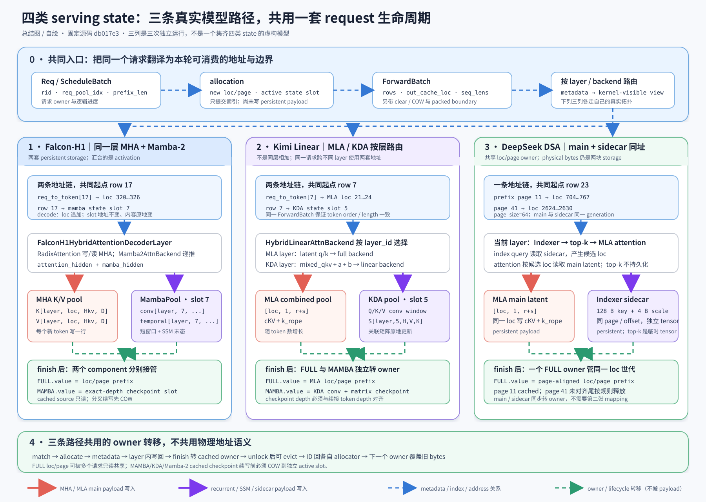

# 5｜SGLang 四类 Serving State：三条真实模型路径的统一 debug 框架

> **实现源码基线**：正文源码直达链接固定到 SGLang fork 的教学快照 [`db017e34902b51e1fd1ac7ebbedaf720c75b374d`](https://github.com/tangpanyu/sglang/commit/db017e34902b51e1fd1ac7ebbedaf720c75b374d)（2026-09-02），以便行号稳定；关键调用已在当前 checkout `a478b5d7e74d83a9bcdb31440c2ffd64b01a2d66`（2026-09-08）复核。版本变化后请按函数名重新搜索，不要把历史行号当作 API 契约。
>
> **系列入口**：先看总览页 [`0_sglang_state_object_atlas.md`](../0_sglang_state_object_atlas/0_sglang_state_object_atlas.md)，再按需回看第1～4篇；本课只统一 serving-state 的 debug 视角，不复制前置章节的完整机制推导。

今天不再分别复述 MHA、MLA/DSA、KDA、Mamba-2 的原理，而是把它们压进同一套可调试的状态模型：**一个请求如何同时占用 request row、token/page locations 与 recurrent slot；一次 `ForwardBatch` 如何把这些映射翻译给不同 backend；prefix、finish、evict 又如何分别转移两类物理资源的 owner。**

## 已掌握可跳过：4 分钟诊断

- 你能不看代码画出 `req_pool_idx → req_to_token[row,pos] → loc → layer KV/latent row` 与 `req_pool_idx → req_index_to_mamba_index_mapping[row] → slot → layer conv/temporal` 两条地址链：跳到「3. 三条真实路径」。
- 你能解释 DSA 的 main latent 与 indexer sidecar 为什么共用 loc 却不共享 bytes，也能说明 top-k 为什么不是 persistent state：跳到「4. 一次 forward 的逐站追踪」。
- 你能解释 MHA/MLA prefix page 可以让分叉请求只读共享，而 KDA/Mamba checkpoint 必须 COW 到独立 active slot 后才能继续写：跳到「5. Prefix 与回收」。
- 你能指出 Kimi Linear 的 full-attention 侧是 MLA、Falcon-H1 是同层 MHA+Mamba、DeepSeek DSA 是 MLA main+indexer sidecar，并且绝不会把三者拼成一个模型：跳到「6. 统一 debug 观测表」。
- 你能从一次 decode 日志中区分“新 token loc 被追加”“同一 recurrent slot 被原地更新”“采样出的 token 尚未进入下一次 forward”：跳到手撕题。
- 任一项含糊就从头读；本课目标是让你在 debugger 里看到任意一个 row/loc/slot/tensor 时，立刻知道它属于哪一层状态、谁能写、何时失效。

## 课程预算与实验边界

真实 wall-clock 预算约 **170～180 分钟**。

| 模块 | 时间 | 必须完成的动作 |
| --- | ---: | --- |
| A. 六层统一模型与四类 state 横向对照 | 45 分钟 | 不看代码复画两条地址链，独立算四类容量单位 |
| B. 三条真实模型路径 | 30 分钟 | 对每条路径标出同一请求实际持有的 pool 与 mapping |
| C. 七个源码观测站 | 60 分钟 | 按执行顺序核实 allocation、metadata、layer write、prefix/finish |
| D. 统一 debug 观测表 | 20 分钟 | 对一次 prefill 和两次 decode 记录 pointer、owner、长度与签名 |
| E. 手撕与回看 | 20 分钟 | 实现跨 token-state / recurrent-state 的 owner invariant 检查器 |

主路径统一假设：CUDA、单 DP、普通 target worker、无 speculative decoding、无 disaggregation、无 HiCache/offload、无 unified-memory backing、`page_size` 取各案例已经明确的值、关闭 CUDA graph 以便观察 Python 时序。关闭这些 production 分支只减少额外副本、虚拟地址翻译和静态 graph buffer，不改变本文要验证的核心 owner 与 mapping 契约。

下面所有 request row、loc、slot 与 token ID 都是沿用第2～4篇的**教学构造值**，不是伪造运行日志。当前环境未加载对应权重并执行 GPU serving；代码路径、shape、dtype 默认与副作用已按固定快照静态核验，具体数值签名和耗时需要你在自己的运行环境中确认。

## 1. 先开天眼：统一的是请求生命周期，不是物理 cache

> **先带着一个问题读图**：同一个 request row 在三种模型里分别怎样落到 token `loc`、recurrent `slot` 或双 payload；哪一步只是 metadata 汇合，哪一步才真正写入 persistent storage？本图只回答这条跨模型导航问题，不把三种模型拼成一个运行实例。
>
> 
>
> *图源与范围：本文自绘的教学图，依据上方固定源码快照抽象；不是运行时截图，也不表示所有 backend/并行分支。*

**怎么读图**：从最上方的共同入口向下看，再在三列中分别走到底。左列是 Falcon-H1：同一 decoder layer 的 MHA 与 Mamba-2 都执行，分别写 token-wise K/V 与 request-level conv/SSM state，最后只把两个 activation 相加。中列是 Kimi Linear：同一请求在 MLA layer 用 token loc，在 KDA layer 用 recurrent slot，`HybridLinearAttnBackend` 按 layer 路由。右列是 DeepSeek DSA：main latent 与 indexer sidecar 用同一个 loc、不同 tensor；本轮 top-k 只是临时候选地址。

图中的蓝色区域和虚线只表示 request row、loc、slot、length、owner 等 metadata/index/address 关系；橙色实线表示当前 token 的 K/V 或 latent payload 真实写入；紫色实线表示 conv、recurrent、SSM 或 sidecar payload 的真实写入；绿色区域表示 finish 后由 Radix 节点接管的 cached state。任何一列都没有把两种 state 拼成同一个 tensor，也没有暗示 kernel fusion。

三列对应三个相互独立的真实模型运行，不是一个“集齐四类 state”的虚构请求。

| 图中列 | 固定快照里的真实模型路径 | 同一请求真正同时拥有的 state | 汇合方式 |
| --- | --- | --- | --- |
| Falcon-H1 | `FalconH1HybridAttentionDecoderLayer` | 普通 MHA K/V locs + Mamba-2 active slot | 同一层两个 `[N,D_model]` activation 相加 |
| Kimi Linear | `KimiDecoderLayer` 按层选择 `KimiMLAAttention` 或 `KimiDeltaAttention` | MLA token locs + KDA active slot | 同一请求跨不同 layer 使用两个 child backend |
| DeepSeek DSA | DeepSeek MLA attention + `Indexer` | MLA main latent + 同 loc 的 index K/scale sidecar | top-k 地址把 sidecar score 与 main latent read 串起来 |

沿图继续读源码时，可按这组落点跳转：Falcon 列看 [`falcon_h1.py`](../../python/sglang/srt/models/falcon_h1.py) 的双 branch addition；Kimi 列看 [`kimi_linear.py`](../../python/sglang/srt/models/kimi_linear.py) 与第3篇的 KDA metadata；DSA 列看第2篇的 [`forward_absorb_prepare`](../2_sglang_mla_dsa_latent_cache/2_sglang_mla_dsa_latent_cache.md)。图中的蓝色节点是 carrier/定位字段，橙/紫节点才是 payload 写回；后文仍以真实 producer → owner → consumer 为准。

一句话压住全课：**state 随 token 数增长，就用 token/page address space；state 只保留序列末态，就用 request-level mutable slot；混合模型让同一个请求同时携带两类映射，但不会自动让两类 storage 共址或同生命周期。**

## 2. 六层状态模型：遇到一个对象，先放回正确层

### 2.1 六层不是类名词典，而是一条翻译链

| 层次 | 解决的问题 | MHA / MLA / DSA | KDA / Mamba-2 | 调试时先看什么 |
| --- | --- | --- | --- | --- |
| request state | 这个请求当前持有什么 | `ReqKvInfo.req_pool_idx`、`cache_protected_len`、`kv_committed_len` | `mamba_pool_idx`、clear/COW/track 字段 | request ID 与 owner 是否仍一致 |
| logical mapping metadata | 逻辑位置怎样找到 storage | `req_to_token[row,pos]=loc` | `req_index_to_mamba_index_mapping[row]=slot` | 整数单位是 row、loc 还是 slot |
| allocator/cache metadata | 哪些地址可分配、缓存、保护、驱逐 | token/page allocator；Radix `FULL.value`、lock/LRU | `MambaSlotAllocator`；Radix `MAMBA.value`、lock/LRU | free list 与 tree owner 是否互斥 |
| physical GPU state storage | 真正的历史数值放哪里 | K/V buffers；MLA combined rows；DSA sidecar | `MambaPool.conv`、`MambaPool.temporal` | base pointer、shape、dtype、stride、layer slice |
| per-forward metadata | 本批如何访问正确请求 | `ForwardBatch.req_pool_indices/out_cache_loc/seq_lens`；backend table | `mamba_cache_indices/query_start_loc/initial-state mask` | batch 重排后索引是否同步重排 |
| kernel-visible view | 算子最终拿到什么 | current q/k/v、pool pointer、write loc、page/token table、length | current projected tensors、conv/temporal pointer、slot list、sequence boundary | pointer/index/length/layout 是否相互匹配 |

翻译方向必须单向清楚：`Req` 不直接持有 GPU K/V tensor；`ForwardBatch` 不拥有长期 state；Radix tree 不把 K/V bytes 塞进 node；kernel 也不认识 request ID。每一层只把上一层的语义压成下一层能消费的地址与边界。

### 2.2 四类 persistent state 的形状、粒度与增长单位

设本 rank 的 KV head 数为 $H_{kv}$，K/V head 维分别为 $D_k,D_v$，MLA latent rank 为 $r$、RoPE key 维为 $s$，KDA 本地 head 数为 $H_l$、head dim 为 $D$、短卷积核长为 $C$，Mamba-2 本地 head 数为 $H_m$、head dim 为 $P$、SSM state size 为 $N$。

下表中的 KDA `[C-1,3H_lD]` 与 `[H_l,D,D]` 只描述 **plain Kimi、q/k/v 等头等维的教学几何**。模块与 kernel 接口虽然出现 `num_k_heads`、`head_k_dim`、`head_v_dim` 等非对称参数，KDA backend 也会按 `[num_v_heads,head_v_dim,head_k_dim]` 检查运行时 state，但当前 `KimiLinearStateShape.create()` 并未接收 `head_v_dim`，仍用 `num_heads/head_dim` 构造 persistent `temporal`。因此不能仅凭接口字段宣称非对称配置已经端到端支持；遇到非默认模型必须核对或扩展 cache-shape wiring，再以实际 pool view 为准，不能套用下面的等维公式。

| state 类型 | 每层 physical payload | 默认寻址粒度 | 随长度增长 | 当前 token 怎样改变它 |
| --- | --- | --- | ---: | --- |
| Full Attention MHA/GQA | `K[loc,Hkv,Dk]` + `V[loc,Hkv,Dv]` | token loc；paged backend 再解释为 page+offset | 是，$O(T)$ | 为当前 token 新写一行，历史行通常只读 |
| MLA / DSA | main `[loc,1,r+s]`；DSA producer/indexer layer 另有同 loc 的 128-byte index K + 4-byte scale | 与 MHA 相同的 token loc/page | 是，$O(T)$ | 新写一条 latent；满足该层配置时再写 sidecar，top-k 当场重算 |
| KDA / LA（等维教学路径） | conv `[C-1,3H_lD]`；temporal `[H_l,D,D]` | 每请求一个 recurrent slot | 基本不随 $T$ 增长 | 先更新短窗口，再用 gated delta rule 原地改关联矩阵 |
| Mamba-2 | conv `[conv_dim,C-1]`；temporal `[H_m,P,N]` | 每请求一个 recurrent slot | 基本不随 $T$ 增长 | 先更新短窗口，再用 input-dependent SSM recurrence 原地改 hidden state |

“固定大小”只描述 active recurrent state 主体，不代表总 serving 内存固定。prefix checkpoint、ping-pong tracking、COW destination、ReplaySSM ring、speculative scratch 或 host backup 都可能再占空间；这些额外对象仍必须服从同一 owner 协议。

### 2.3 容量单位不能混算

普通 MHA 每 token、每层的基础字节数为：

$$
B_{MHA/token/layer}=(H_{kv}D_k+H_{kv}D_v)\cdot b_{kv}.
$$

普通 MLA 每 token、每层为：

$$
B_{MLA/token/layer}=(r+s)\cdot b_{kv}.
$$

在第2篇的教学几何 $r=512,s=64,$ BF16 下，MLA 是 1,152 B/token/layer；CUDA DSA producer layer 再加 132 B/token 的 indexer sidecar，因此同一 loc 的合计是 1,284 B/token/layer。这里的 128+4 是当前 CUDA producer 配置的容量示例，不是 DSA 理论常数；`skip_topk` 或本 rank 不拥有的 layer 可能本轮不写 sidecar，某些路径仍会预留 0-row placeholder，不能把 placeholder 当成所有层的普遍形态。sidecar 没有独立 allocator，不等于它不占预算。

在上述等维教学路径下，KDA 每 request、每层的基础 state 为：

$$
B_{KDA/req/layer}=(C-1)(3H_lD)\cdot b_{conv}+(H_lD^2)\cdot b_{state}.
$$

第3篇的缩小几何 $H_l=4,D=4,C=4,$ conv BF16、temporal FP32 给出 544 B/layer/slot；它只是便于手算，不冒充真实 Kimi 权重配置。以下容量数字按 **TP=1** 计算；多 TP 时每个 rank 的 head/conv 宽度要按实际 `divide(...)` 结果重算。非等维模型请直接从 state-shape 配置与各 payload dtype 重新求和。

Mamba-2 每 request、每层为：

$$
B_{Mamba/req/layer}=conv\_dim(C-1)\cdot b_{conv}+H_mPN\cdot b_{state}.
$$

第4篇的 Falcon-H1 默认几何给出 1,057,792 B/layer/slot，32 层为 32.28125 MiB/slot（同样按 TP=1 的整模型宽度估算；分片后按本 rank 的 `conv_dim`、head 数和 dtype 重算）。它与该模型 256-token、32-layer BF16 MHA KV 的数量级接近，但增长轴不同：MHA 继续随 token 增长，Mamba active state 保持同一 slot shape。

因此 scheduler 面对的是两个独立短缺量：`num_tokens/pages` 与 `num_mamba_slots`。二者可以在统一 cache 中协调 eviction，甚至在可选 unified-memory 模式共享 raw byte budget，但默认主路径仍是不同 allocator、不同地址空间、不同 correctness 语义。

## 3. 三条真实路径：用三次独立运行覆盖四类 state

### 3.1 案例 F：Falcon-H1，同一层的 MHA + Mamba-2

沿用第4篇：prompt `[101,42,77,9,5]`，`req_pool_idx=17`，MHA locs `[320,321,322,323,324]`，Mamba active slot `7`；prefill 后采样 314，decode #1 才把 314 送进模型并追加 loc 325、原地更新 slot 7，随后采样 271；decode #2 输入 271，追加 loc 326、再次更新 slot 7。

| 同一 layer 的两条支路 | 调用前 persistent view | 本轮写法 | layer 返回 |
| --- | --- | --- | --- |
| MHA | 本层 K/V 的 locs 320…历史末尾 | `out_cache_loc` 新写一行，然后按完整 request row 读历史 | `attention_hidden_states:[N,4096]` |
| Mamba-2 | 本层 `conv[layer,7]` 与 `temporal[layer,7]` | causal conv 与 SSM update 在 slot 7 原地提交末态 | `mamba_hidden_states:[N,4096]` |
| 汇合 | 两套 cache 仍独立 | 只做 activation addition | `attention_hidden_states + mamba_hidden_states` |

这是真正的“同层融合”案例，但融合对象是 activation。若 MHA loc 正确、Mamba slot 错误，程序仍可能维度合法并输出数值；所以 debug 必须同时记录两条地址链，不能只盯最终相加处。

### 3.2 案例 K：Kimi Linear，不同层的 MLA + KDA

沿用第3篇：prompt `[101,42,17,9]`，`req_pool_idx=7`，MLA token locs `[21,22,23,24]`，KDA active slot `5`。`KimiDecoderLayer` 对 KDA layer 实例化 `KimiDeltaAttention`，其余 full-attention layer 实例化 `KimiMLAAttention`。

| layer 类型 | 地址 | physical payload | backend 需要的当前 activation |
| --- | --- | --- | --- |
| MLA layer | `req_to_token[7,pos] → loc` | combined latent `[c_kv / k_rope]` | q/nope/rope latent；本轮 write loc |
| KDA layer | `row 7 → state slot 5` | Q/K/V 短窗口 + `[H_l,V,K]` 关联矩阵 | `mixed_qkv`、forget gate `a`、delta strength `b` |

`HybridLinearAttnBackend` 会为两个 child backend 都准备 metadata，再按 `layer_id` 选择 full 或 linear path。它不是把 MLA row 转成 KDA matrix，也不是让 KDA 用 `out_cache_loc` 找 state；同一个 `ForwardBatch` 只保证两条支路看到一致的 request membership、token order 与长度。

### 3.3 案例 D：DeepSeek DSA，MLA main + indexer sidecar

沿用第2篇：`page_size=64`，请求 A 为 70 token，命中 cached page 11 的 64-token prefix，对应 locs `704..767`；未命中 6 token 取得 page 41 的 locs `2624..2629`，request row 为 23；第一次 decode 再使用 loc 2630。

| 同一个 `loc=2624+i` 的解释 | 物理对象 | persistent? | consumer |
| --- | --- | ---: | --- |
| combined latent row | `DSATokenToKVPool.kv_buffer[layer][loc]` | 是 | sparse/dense MLA attention |
| 128-byte index K + 4-byte scale | `IndexKeyCache.buffer[layer][page=41,offset=i]` 的逻辑 row（仅适用的 producer/indexer layer；`skip_topk` 或本 rank 不拥有的 layer 可能本轮不写，某些路径才有 0-row placeholder） | 是 | 当前 query 的 indexer score |
| transformed top-k location | per-forward `DSAMetadata`/temporary tensor | 否 | sparse attention 选择 main latent rows |

main 与 sidecar 共享 page 41 的 owner、Radix `FULL.value`、prefix 命中和 eviction 世代，但它们是两块独立 GPU storage。top-k 依赖当前 query，不能跟 prefix 一起缓存；即使某层复用前一层 top-k，那也只是同一次 forward 的临时计算复用。

若请求在第一次 decode forward 后结束，长度是 71，图中的 page 11 是已对齐 cached prefix；page 41 只写了 locs 2624…2630，仍是未对齐尾，finish 时按 page-aware cache 规则释放而不会冒充完整 cached page。无论转 cached owner 还是归还 allocator，main 与 sidecar 都必须对 page 41 做同一次世代变化。

### 3.4 三个案例的共同生命周期矩阵

| 生命周期点 | Falcon-H1：MHA + Mamba | Kimi Linear：MLA + KDA | DeepSeek DSA：main + sidecar |
| --- | --- | --- | --- |
| startup | 预分配 K/V buffers 与 Mamba conv/temporal pool | 预分配 MLA combined buffers 与 KDA conv/temporal pool | 预分配 main latent 与按同一 token/page 索引空间组织的 sidecar |
| prefix match | FULL 返回 token locs；MAMBA 可返回精确 checkpoint slot | FULL 返回 MLA locs；MAMBA 可返回 KDA checkpoint slot | FULL 的 loc 同时定位 main 与 sidecar |
| admission | 分配 request row、新 token loc、独立 writable Mamba slot | 分配 request row、新 latent loc、独立 writable KDA slot | 分配 request row 与一套 loc/page，不另配 sidecar allocator |
| prefill | MHA 逐 token 写 K/V；Mamba scan 后保留末态 | MLA layer 逐 token 写 latent；KDA layer scan 后保留末态 | 在适用 producer layer 同 loc 写 sidecar 与 main，top-k 本轮生成 |
| decode | 追加一个 K/V loc；同一 Mamba slot 原地更新 | MLA layer 追加 loc；同一 KDA slot 原地更新 | 追加同一 loc 的 main+sidecar，再重算 top-k |
| finish | FULL pages 与 MAMBA checkpoint 分别转成 tree owner 或释放 | FULL latent pages 与 MAMBA checkpoint 分别转 owner 或释放 | 对齐 FULL pages 整体接管两块同址 payload |
| eviction/reuse | 分别归还 token/page ID 与 state slot；pool tensor 仍在 | 同左 | page ID 归还后两块旧 payload 同时失去语义 |

## 4. 一次 forward 的详细流程：七个状态观测站

源码按执行顺序组织。每站只验证一个跨机制 invariant；不要从 HTTP 入口开始逐行 F11。

### 观测站 1｜启动时先定容量单位，再实例化正确 pool（10 分钟）

> **为什么现在看**：先知道服务进程实际创建了哪些 backing tensor，之后看到 loc/slot 才有物理落点。**前置条件**：能区分 token capacity 与 request-slot capacity。**看完必须知道**：普通路径先构建 request pool，再按模型选择 MHA、MLA 或 DSA token pool；mambaish 模型把 `HybridReqToTokenPool` 与 `MambaPool`一起装配。**精确范围**：[`scheduler.py#L1006-L1060`](https://github.com/tangpanyu/sglang/blob/db017e34902b51e1fd1ac7ebbedaf720c75b374d/python/sglang/srt/managers/scheduler.py#L1006-L1060)、[`kv_cache_configurator.py#L515-L555`](https://github.com/tangpanyu/sglang/blob/db017e34902b51e1fd1ac7ebbedaf720c75b374d/python/sglang/srt/mem_cache/kv_cache_configurator.py#L515-L555)、[`kv_cache_configurator.py#L1038-L1099`](https://github.com/tangpanyu/sglang/blob/db017e34902b51e1fd1ac7ebbedaf720c75b374d/python/sglang/srt/mem_cache/kv_cache_configurator.py#L1038-L1099) 与 pool builders：[`DSA #L1489-L1540`](https://github.com/tangpanyu/sglang/blob/db017e34902b51e1fd1ac7ebbedaf720c75b374d/python/sglang/srt/mem_cache/kv_cache_configurator.py#L1489-L1540)、[`MLA #L1610-L1623`](https://github.com/tangpanyu/sglang/blob/db017e34902b51e1fd1ac7ebbedaf720c75b374d/python/sglang/srt/mem_cache/kv_cache_configurator.py#L1610-L1623)、[`MHA #L1796-L1830`](https://github.com/tangpanyu/sglang/blob/db017e34902b51e1fd1ac7ebbedaf720c75b374d/python/sglang/srt/mem_cache/kv_cache_configurator.py#L1796-L1830)。**重点**：`init_memory_pools()`、`_build_req_to_token_pool()`、`is_dsa_model`、`mambaish_config`、local layer IDs。**读后自检**：为什么更换 pool layout 必须同时改 capacity sizing，而不只是改 backend view？

`Scheduler.init_model_worker()` 调 `init_memory_pools()`，target worker 最终让 `ModelRunner` 的 `KVCacheConfigurator` 解析剩余内存和模型拓扑。输入是模型 config、parallel layer slice、dtype、page size、最大请求数与内存预算；副作用是创建服务进程级 pools/allocators，尚无任何业务请求。

普通 MHA、MLA 与 DSA 共享 token/page capacity 单位，但 builder 选择不同 `KVCache` 子类；DSA 构造时把 indexer sidecar一并纳入 pool owner。mambaish 配置则让 request pool 本身变成 `HybridReqToTokenPool`，其中再创建 `MambaPool` 与 slot allocator。下一站请求 admission 只拿已有大 tensor 的 index，不会为每个请求重新 `torch.zeros` 一套 cache。

**关键 invariant**：pool 的总字节、layer slice、dtype 与 locator 解释必须在启动时一致；若 sidecar或recurrent state漏进预算，服务可能在启动/高并发时 OOM，即使单次 kernel完全正确。

### 观测站 2｜`ReqKvInfo` 同时登记两类资源，但不保存 payload（10 分钟）

> **为什么现在看**：这是所有生命周期问题的 request-side source of truth。**前置条件**：physical pools 已存在。**看完必须知道**：`req_pool_idx` 只是逐 token 表的一行；`mamba_pool_idx` 是另一地址空间中的 request state slot；committed/allocated/protected length 也不是同一个长度。**精确范围**：[`schedule_batch.py#L848-L903`](https://github.com/tangpanyu/sglang/blob/db017e34902b51e1fd1ac7ebbedaf720c75b374d/python/sglang/srt/managers/schedule_batch.py#L848-L903) 与 [`memory_pool.py#L1193-L1309`](https://github.com/tangpanyu/sglang/blob/db017e34902b51e1fd1ac7ebbedaf720c75b374d/python/sglang/srt/mem_cache/memory_pool.py#L1193-L1309)。**重点**：`holds_kv`、`holds_mamba`、`cache_protected_len`、`kv_committed_len`、两张 mapping tensor。**读后自检**：为什么 `req_pool_idx=17` 与 `mamba_pool_idx=7` 数值相等或不等都不携带语义？

`Req` 创建时自带 `ReqKvInfo`；allocation helper 后续写入 owner 字段。`HybridReqToTokenPool` 继承普通 request row 表，又增加 `req_index_to_mamba_index_mapping`，因此同一个 row 成为两条地址链的共同入口，却没有把两条物理 storage合并。

请求结束后这些字段会被清理或失效；MHA/MLA/DSA/Mamba/KDA 的 GPU backing tensor仍由 pool持有。反过来，一个 request row 被 free 并不证明其历史 token pages 已free，因为对齐 prefix可能已经转为Radix owner；一个 active recurrent slot被request释放也不证明相同prefix的cached checkpoint不存在。

**关键 invariant**：request state只记录owner和边界，不可用“字段还留着某个整数”证明physical payload仍有效；有效性必须同时由allocator/cache owner确认。

### 观测站 3｜allocation 在模型前把逻辑位置提交为 loc/slot（12 分钟）

> **为什么现在看**：这是 Scheduler 上层语义进入内存层的真正接缝。**前置条件**：请求已完成 prefix match。**看完必须知道**：extend 先拿 request row与recurrent slot headroom，再为新 token拿loc/page并写完整row；decode只追加当前write set；fresh recurrent slot此时仍可能有脏bytes。**精确范围**：[`allocation.py#L229-L270`](https://github.com/tangpanyu/sglang/blob/db017e34902b51e1fd1ac7ebbedaf720c75b374d/python/sglang/srt/mem_cache/allocation.py#L229-L270)、[`allocation.py#L282-L389`](https://github.com/tangpanyu/sglang/blob/db017e34902b51e1fd1ac7ebbedaf720c75b374d/python/sglang/srt/mem_cache/allocation.py#L282-L389)、[`allocation.py#L521-L584`](https://github.com/tangpanyu/sglang/blob/db017e34902b51e1fd1ac7ebbedaf720c75b374d/python/sglang/srt/mem_cache/allocation.py#L521-L584) 与 [`memory_pool.py#L1349-L1412`](https://github.com/tangpanyu/sglang/blob/db017e34902b51e1fd1ac7ebbedaf720c75b374d/python/sglang/srt/mem_cache/memory_pool.py#L1349-L1412)。**重点**：`prefix_tensors`、`out_cache_loc`、`write_cache_indices`、`mamba_needs_clear`、row→slot assignment。**读后自检**：为什么 `out_cache_loc` 只含本轮新 token，而 `req_to_token[row,:seq_len]` 必须覆盖完整可见历史？

`alloc_for_extend()` 的输入是一个已经决定加入本轮的 `ScheduleBatch`。它先调用 `alloc_req_slots()`；对hybrid request pool，该函数先检查recurrent slot headroom，必要时请求统一cache驱逐MAMBA component，再分配row。`HybridReqToTokenPool.alloc()`只在request尚未持有state时分配新slot，并标记 `mamba_needs_clear=True`；chunked prefill续接不会重分配。

随后token/page allocator产生当前suffix的flat locs，`write_cache_indices()`把matched prefix loc与新loc合进request row。本阶段真正改变的是request state、mapping与allocator metadata，没有写K/V、latent、conv或temporal数值。`kv_committed_len` 在这里表示调度已经预留/提交的逻辑边界，不等于 payload 已经 ready；K/V、latent、conv、temporal 是否可被消费者读取，仍要看 backend/pool 写回及 stream/event contract。`alloc_for_decode()`同理在当前逻辑末尾增加loc；recurrent slot保持不变。

**关键 invariant**：模型第一次读取前必须同时满足“完整row映射已提交”和“recurrent slot已clear/COW”；只完成其一都不能安全forward。

### 观测站 4｜`ForwardBatch` 搬的是本轮工作单，不搬 persistent state（9 分钟）

> **为什么现在看**：把跨forward的state与一次forward的索引材料分开。**前置条件**：row/loc/slot已经分配。**看完必须知道**：`ForwardBatch.init_new()`复制/引用哪些核心字段，deferred Mamba clear/COW怎样进入forward stream，write loc怎样被translator重绑定。**精确范围**：[`forward_batch_info.py#L723-L830`](https://github.com/tangpanyu/sglang/blob/db017e34902b51e1fd1ac7ebbedaf720c75b374d/python/sglang/srt/model_executor/forward_batch_info.py#L723-L830) 与 [`model_runner.py#L1678-L1724`](https://github.com/tangpanyu/sglang/blob/db017e34902b51e1fd1ac7ebbedaf720c75b374d/python/sglang/srt/model_executor/model_runner.py#L1678-L1724)。**重点**：`req_pool_indices`、`seq_lens`、`out_cache_loc`、`mamba_*indices`、`kv_index_translator.rebind_write_loc`。**读后自检**：为什么 `ForwardBatch` 生命周期结束不会释放任何cached page？

`ForwardBatch.init_new()`由model runner在每轮forward前从`ScheduleBatch`创建。它携带当前packed tokens、rows、lengths、current write loc以及deferred recurrent clear/COW列表；这些tensor本身是per-forward metadata，不是历史payload。

`ModelRunner._maybe_execute_deferred_mamba_cow_and_clear()`在forward stream上把fresh destination清零或把cached checkpoint复制到writable slot，完成后才允许backend构造kernel-facing state indices。普通非unified pool的virtual→physical translation是identity，但接口仍要求显式翻译；因此调试日志最好同时记录virtual与physical slot，不能把identity当成永久事实。

**关键 invariant**：clear/COW是实际数据写零/复制，必须先于任一KDA/Mamba layer read；其余row/loc/length字段只是地址解释，不会替你初始化payload。

### 观测站 5｜模型拓扑决定“这一层用哪条 state 路径”（9 分钟）

> **为什么现在看**：避免把“hybrid”统一理解成一种层组合。**前置条件**：ForwardBatch已就绪。**看完必须知道**：Falcon-H1是同层MHA+Mamba activation addition；Kimi Linear是MLA/KDA按层二选一；DeepSeek DSA是在MLA attention中增加Indexer。**精确范围**：[`falcon_h1.py#L299-L367`](https://github.com/tangpanyu/sglang/blob/db017e34902b51e1fd1ac7ebbedaf720c75b374d/python/sglang/srt/models/falcon_h1.py#L299-L367)、[`kimi_linear.py#L549-L586`](https://github.com/tangpanyu/sglang/blob/db017e34902b51e1fd1ac7ebbedaf720c75b374d/python/sglang/srt/models/kimi_linear.py#L549-L586)、[`configs/kimi_linear.py#L145-L180`](https://github.com/tangpanyu/sglang/blob/db017e34902b51e1fd1ac7ebbedaf720c75b374d/python/sglang/srt/configs/kimi_linear.py#L145-L180) 与 [`deepseek_v2.py#L1831-L1924`](https://github.com/tangpanyu/sglang/blob/db017e34902b51e1fd1ac7ebbedaf720c75b374d/python/sglang/srt/models/deepseek_v2.py#L1831-L1924)。**重点**：Falcon两次branch call与addition；Kimi `is_kda_layer`；DeepSeek `use_dsa/indexer/attn_mqa`。**读后自检**：能否分别指出三种模型中cache/state的汇合点，而且不说“都在Hybrid backend里融合”？

Falcon layer先用当前hidden产生q/k/v并走`RadixAttention`，再直接调用`Mamba2AttnBackend`处理同一hidden，最后相加两个branch activation。Kimi layer构造时已经固定为`KimiDeltaAttention`或`KimiMLAAttention`；其wrapper按layer路由，不在同层把两者都算一遍。DeepSeek DSA仍建立一个latent attention模块，但producer layer另外实例化Indexer，用sidecar选候选。

输入对象都是当前hidden、positions与`ForwardBatch`；本阶段先产生临时projection activation，持久写回发生在各自backend/pool setter调用期间。下一站要盯的是实际buffer而不是最终hidden。

**关键 invariant**：模型拓扑决定某层必须拥有哪种persistent state；变量名`hybrid`、`mamba`、`ssm_states`只说明wrapper/历史抽象，不能替代实际module与shape证据。

### 观测站 6｜同一 `ForwardBatch` 被翻译成不同 kernel-visible view（16 分钟）

> **为什么现在看**：这里能一次看见四类state的读写差异。**前置条件**：知道当前layer真实类型。**看完必须知道**：MHA/MLA/DSA以loc与table寻址，KDA/Mamba以slot与sequence boundary寻址；各写回都在layer/backend内完成。**精确范围**：MHA物理shape与write见 [`memory_pool.py#L2099-L2163`](https://github.com/tangpanyu/sglang/blob/db017e34902b51e1fd1ac7ebbedaf720c75b374d/python/sglang/srt/mem_cache/memory_pool.py#L2099-L2163) 和 [`#L2381-L2460`](https://github.com/tangpanyu/sglang/blob/db017e34902b51e1fd1ac7ebbedaf720c75b374d/python/sglang/srt/mem_cache/memory_pool.py#L2381-L2460)；MLA/DSA pool见 [`#L3970-L4082`](https://github.com/tangpanyu/sglang/blob/db017e34902b51e1fd1ac7ebbedaf720c75b374d/python/sglang/srt/mem_cache/memory_pool.py#L3970-L4082)、[`#L4188-L4237`](https://github.com/tangpanyu/sglang/blob/db017e34902b51e1fd1ac7ebbedaf720c75b374d/python/sglang/srt/mem_cache/memory_pool.py#L4188-L4237)、[`#L4421-L4498`](https://github.com/tangpanyu/sglang/blob/db017e34902b51e1fd1ac7ebbedaf720c75b374d/python/sglang/srt/mem_cache/memory_pool.py#L4421-L4498) 与 [`#L4503-L4548`](https://github.com/tangpanyu/sglang/blob/db017e34902b51e1fd1ac7ebbedaf720c75b374d/python/sglang/srt/mem_cache/memory_pool.py#L4503-L4548)；DSA实际sidecar写与top-k→attention交接见 [`dsa_indexer.py#L1471-L1550`](https://github.com/tangpanyu/sglang/blob/db017e34902b51e1fd1ac7ebbedaf720c75b374d/python/sglang/srt/layers/attention/dsa/dsa_indexer.py#L1471-L1550)、[`forward_mla.py#L417-L445`](https://github.com/tangpanyu/sglang/blob/db017e34902b51e1fd1ac7ebbedaf720c75b374d/python/sglang/srt/models/deepseek_common/attention_forward_methods/forward_mla.py#L417-L445) 与 [`#L672-L765`](https://github.com/tangpanyu/sglang/blob/db017e34902b51e1fd1ac7ebbedaf720c75b374d/python/sglang/srt/models/deepseek_common/attention_forward_methods/forward_mla.py#L672-L765)；hybrid metadata与路由见 [`hybrid_linear_attn_backend.py#L1075-L1186`](https://github.com/tangpanyu/sglang/blob/db017e34902b51e1fd1ac7ebbedaf720c75b374d/python/sglang/srt/layers/attention/hybrid_linear_attn_backend.py#L1075-L1186)。**重点**：layer slice、`loc`、combined latent、sidecar同址、top-k只在本轮流转、`_is_full_attn`。**读后自检**：为什么同一loc可以同时索引DSA两块payload，而同一个slot变量不能被拿去索引MHA rows？

MHA setter接收本层q/k/v投影中的K/V与当前write loc，写入`k_buffer[layer][loc]`和`v_buffer[layer][loc]`；backend再由request row构造token/page table和有效length读取完整历史。MLA setter把`cache_k_nope`与`cache_k_rope`拼入本层combined row；value view只是latent前缀的view，不存在独立展开V tensor。

DSA pool继承MLA main buffer，并额外持有`IndexKeyCache`；`set_index_k_scale_buffer(layer,loc,...)`与main setter消费同一loc。在本文关闭graph/capture的CUDA观察路径里，`forward_absorb_prepare()`先调用Indexer：Indexer先把当前index K/scale写进sidecar，再读取有效sidecar产生本轮top-k locations；`forward_absorb_core()`随后把这些locations传给`attn_mqa`，该attention调用负责保存并读取main latent。top-k只属于per-forward/kernel-visible层，不进入Radix node；启用alt-stream/capture后可发生合法重叠，但必须用stream依赖保持同样的数据可见性契约。

KDA child backend用row gather得到`mamba_cache_indices`，从`MambaPool`切出当前KDA layer的conv与temporal views；prefill的卷积与递推写回见 [`kda_backend.py#L693-L775`](https://github.com/tangpanyu/sglang/blob/db017e34902b51e1fd1ac7ebbedaf720c75b374d/python/sglang/srt/layers/attention/linear/kda_backend.py#L693-L775) 和 [`#L781-L828`](https://github.com/tangpanyu/sglang/blob/db017e34902b51e1fd1ac7ebbedaf720c75b374d/python/sglang/srt/layers/attention/linear/kda_backend.py#L781-L828)，decode主路径见 [`#L629-L691`](https://github.com/tangpanyu/sglang/blob/db017e34902b51e1fd1ac7ebbedaf720c75b374d/python/sglang/srt/layers/attention/linear/kda_backend.py#L629-L691)。它先按slot更新Q/K/V短窗口，再让delta-rule kernel读取并原地改同一slot的关联矩阵。

Mamba-2 mixer从同一metadata取得slot和packed sequence boundary；projection、prefill conv与SSM写回见 [`mamba.py#L440-L545`](https://github.com/tangpanyu/sglang/blob/db017e34902b51e1fd1ac7ebbedaf720c75b374d/python/sglang/srt/layers/attention/mamba/mamba.py#L440-L545) 与 [`#L552-L632`](https://github.com/tangpanyu/sglang/blob/db017e34902b51e1fd1ac7ebbedaf720c75b374d/python/sglang/srt/layers/attention/mamba/mamba.py#L552-L632)，普通decode原地更新见 [`#L672-L752`](https://github.com/tangpanyu/sglang/blob/db017e34902b51e1fd1ac7ebbedaf720c75b374d/python/sglang/srt/layers/attention/mamba/mamba.py#L672-L752)。它保存的是`[x,B,C]`短窗口与SSM末态，不是KDA关联矩阵。

| kernel/op最终需要 | MHA | MLA/DSA | KDA | Mamba-2 |
| --- | --- | --- | --- | --- |
| current activation | q/k/v | latent q、`k_nope/k_rope`；DSA index query/key | `mixed_qkv,a,b` | `gate,[x,B,C],dt` |
| persistent pointer | K与V buffers | combined latent；DSA sidecar | conv与temporal matrix | conv与temporal SSM state |
| primary index | write loc + token/page table | write loc + table；top-k candidate loc | physical state slot | physical state slot |
| valid boundary | seq lengths / indptr | seq lengths、sparse valid range | `query_start_loc`、initial-state flag | `query_start_loc`、prefill/decode counts |
| persistent副作用 | 新K/V row ready | 新latent；DSA sidecar row ready | conv末窗口与$S_t$原地提交 | conv末窗口与SSM末态原地提交 |

**关键 invariant**：一次layer call返回当前activation时，该层要求的persistent写回已经完成或已经按算子契约原地发生；若写回在异步 stream 上，必须由 event/stream contract 保证消费者可见；不存在“所有层跑完、logits产生后再统一写cache”的额外阶段。

### 观测站 7｜Radix / UnifiedRadixCache 转移 owner，但不抹平语义（14 分钟）

> **为什么现在看**：把prefix hit、COW、finish、evict与reuse闭成一圈。**前置条件**：至少一轮forward已提交state。**看完必须知道**：tree按真实模型选择`FULL`与可选`MAMBA` component；FULL复用一条loc path，MAMBA只取best-match checkpoint并COW；finish逐component准备与cleanup。**精确范围**：component选择见 [`registry.py#L146-L187`](https://github.com/tangpanyu/sglang/blob/db017e34902b51e1fd1ac7ebbedaf720c75b374d/python/sglang/srt/mem_cache/registry.py#L146-L187)；match见 [`unified_radix_cache.py#L519-L539`](https://github.com/tangpanyu/sglang/blob/db017e34902b51e1fd1ac7ebbedaf720c75b374d/python/sglang/srt/mem_cache/unified_radix_cache.py#L519-L539) 与 [`mamba_component.py#L155-L216`](https://github.com/tangpanyu/sglang/blob/db017e34902b51e1fd1ac7ebbedaf720c75b374d/python/sglang/srt/mem_cache/unified_cache/components/mamba_component.py#L155-L216)；hybrid finish见 [`unified_radix_cache.py#L838-L915`](https://github.com/tangpanyu/sglang/blob/db017e34902b51e1fd1ac7ebbedaf720c75b374d/python/sglang/srt/mem_cache/unified_radix_cache.py#L838-L915) 与 [`mamba_component.py#L529-L650`](https://github.com/tangpanyu/sglang/blob/db017e34902b51e1fd1ac7ebbedaf720c75b374d/python/sglang/srt/mem_cache/unified_cache/components/mamba_component.py#L529-L650)；FULL-only经典Radix的page alignment与尾部释放见 [`radix_cache.py#L459-L510`](https://github.com/tangpanyu/sglang/blob/db017e34902b51e1fd1ac7ebbedaf720c75b374d/python/sglang/srt/mem_cache/radix_cache.py#L459-L510)。**重点**：`tree_components`、`finalize_match_result_in_cache`、`cow_mamba`、`prepare_for_caching_req`、`cleanup_after_caching_req`、`RadixKey.page_aligned`。**读后自检**：FULL命中512 token而最近MAMBA checkpoint只有256时，为什么不能让recurrent backend从512直接续接？

模型没有recurrent state时，tree只需`FULL` component；mambaish/KDA模型再加入`MAMBA`。`UnifiedRadixCache.match_prefix()`先让tree core遍历token key，再让每个component finalizer完成自己的语义。FULL把路径上的locs作为只读prefix复用；MAMBA只消费best-match node上某一精确depth的checkpoint slot，并为新请求分配writable destination、记录deferred COW。

若FULL hit深于可恢复的MAMBA checkpoint，结果会记录recurrent branching/replay边界；进入KDA/Mamba前，active state 所代表的 depth 要对齐本轮实际 checkpoint/replay boundary；`extend_prefix_lens` 只是 token-prefix 边界，还要核对 `mamba_last_track_seqlen`/`mamba_branching_seqlen`（以及具体 tracking/speculative 分支）。token pages可以直接让多个请求只读指向相同loc，mutable recurrent state则不能让两个分叉请求共享写slot。

hybrid finish时cache先让每个component准备候选value并取共同有效cache length，再把page-aligned token key与FULL locs插入tree；MAMBA component根据策略donate/copy checkpoint或释放未采用slot。FULL-only经典Radix遵守相同page-alignment底线：案例D若在71-token处finish，只缓存page 11，page 41的未对齐尾整体归allocator。请求row、per-forward metadata和private tail被释放；被tree接管的pages/checkpoint仍常驻。eviction删除没有锁/ref保护的component value并把ID归还对应allocator；大tensor allocation不会缩小，旧bytes只变成stale。

**关键 invariant**：对 token loc/page 和 recurrent slot 这两类由 allocator 管理的 physical ID，各自在同一时刻只能处于一个可写 active owner、一个只读 cached owner 或 allocator-free；cached 与 free 绝不能同时成立，COW source 与 destination 绝不能 alias。DSA `IndexKeyCache` sidecar 没有独立的 allocator/free-list，它随对应 page 的生命周期和 owner 世代变化。

## 5. Prefix、finish、evict：用同一组词，但不要偷换对象

### 5.1 四个词的统一定义

| 词 | token/page state | recurrent slot state | backing tensor |
| --- | --- | --- | --- |
| free | ID在token/page allocator可分配；旧row无语义 | slot在`MambaSlotAllocator`可分配；旧state无语义 | 仍存在，通常不清零 |
| active / held | request row的private区间拥有写权限 | 一个请求独占active slot并可原地更新 | pool持有tensor对象 |
| cached | Radix `FULL.value`持有只读loc/page | Radix `MAMBA.value`持有精确depth checkpoint slot | bytes仍在相应pool |
| protected / locked | cached且lock/ref阻止eviction | cached checkpoint同理 | 不改变pointer或payload |
| evicted | tree删除value，ID回allocator | tree删除checkpoint，slot回allocator | 不是tensor free/缩容 |
| request released | row与private tail不再归request；cached prefix可继续存在 | active/tracking slot释放或转移给tree | server级pool继续存在 |

`released`描述request lifecycle，`evicted`描述cache lifecycle，`free`描述allocator可分配性，`cached`描述tree owner；四者绝不是同义词。

### 5.2 Prefix reuse 复用的到底是什么

| state | key / 成立条件 | 真正复用 | 新分叉请求怎样继续 |
| --- | --- | --- | --- |
| MHA | token prefix + model/cache namespace一致，page-aligned loc仍cached | 历史K/V rows | 直接只读旧loc，为suffix分配新loc |
| MLA | 同上，且latent layout/dtype/adapter语义一致 | 历史combined latent rows | 同MHA |
| DSA | MLA条件外，main与sidecar同一generation均ready | main latent + index K/scale | 共享旧loc；当前query重算score/top-k |
| KDA | tree在精确可恢复depth真的有全部KDA layers的conv+temporal checkpoint | 一份不可变recurrent checkpoint | COW到独立active slot，再扫描suffix |
| Mamba-2 | 同上，checkpoint含conv window与SSM末态且depth一致 | 一份不可变Mamba checkpoint | COW到独立active slot，再递推suffix |

共享数据、复用计算、恢复状态是三件不同的事。DSA prefix 不会跨 forward 复用当前 query 的 top-k；`skip_topk` 只可能在同一次 forward 内复用前层结果。KDA/Mamba 命中 checkpoint 省掉 prefix scan，却仍要为可变续写取得新 slot；FULL 命中更深也不能自动补齐不存在的 recurrent 末态。

### 5.3 两步 decode 时最容易看错的时序

对案例F，prefill `[101,42,77,9,5]` 完成后，K/V loc 320…324与Mamba state $C_5,S_5$已经提交；采样器随后产生314，但此刻persistent state尚不包含314。下一次forward输入314，allocation先追加loc325，MHA layer写K/V[325]，Mamba branch在slot7写成$C_6,S_6$，整网才产生用于采样271的logits。再下一次forward输入271，才追加loc326并写$C_7,S_7$。

对案例K同理：采样结果只有再次成为`input_ids`，才会让MLA追加一条combined row并让KDA slot从$S_t$更新到$S_{t+1}$。对案例D，当前decode token同时写main与sidecar的新loc；随后top-k能看见哪些rows由本轮backend时序与有效length决定，不能只凭row中已经出现loc就假定两份payload都ready。

## 6. 面向 debug：20 分钟建立一张统一状态观测表

### 6.1 只打六类断点

| # | 断点位置 | 记录字段 | 正确预期 |
| ---: | --- | --- | --- |
| 1 | pool configurator返回后 | pool class、capacity、page size、每个buffer shape/dtype/stride | 模型拓扑与pool家族一致；DSA含sidecar，hybrid含MambaPool |
| 2 | `alloc_for_extend/decode`返回前 | rid、row、完整有效loc row、`out_cache_loc`、virtual state slot、owner/free count | write set是本轮token；row覆盖完整历史；active slot唯一 |
| 3 | deferred clear/COW执行后 | src/dst physical slot、pointer、两份state签名 | fresh为零；COW内容相等但地址不同 |
| 4 | child backend metadata返回后 | mode、batch order、seq lengths、page/token table、state slots、query boundaries | batch重排后loc/slot都仍跟原request |
| 5 | 目标layer调用前后 | current activation shape；相关pool slice pointer与签名 | token path新增row；recurrent path同址改值；非本层state不误写 |
| 6 | prefix/finish/evict后 | FULL/MAMBA node value、lock/ref、row/slot free list、request fields | owner转移守恒；cached ID不free；evicted ID才可reuse |

### 6.2 一条记录要同时回答四个问题

建议每个观测点只输出一行结构化 record，不打印大 tensor。下面是教学骨架（不可直接运行）；`physical_slot`、`view`、`owner_label` 必须在对应断点从实际 pool/backend/owner ledger 查询。

```python
physical_slot = ...
view = ...
owner_label = ...

record = {
    "rid": req.rid,
    "mode": str(forward_batch.forward_mode),
    "req_row": int(req.kv.req_pool_idx),
    "kv_allocated": int(req.kv.kv_allocated_len),
    "kv_committed": int(req.kv.kv_committed_len),
    "protected": int(req.kv.cache_protected_len),
    "write_locs": forward_batch.out_cache_loc.detach().cpu().tolist(),
    "state_slot_virtual": (
        None if req.kv.mamba_pool_idx is None else int(req.kv.mamba_pool_idx)
    ),
    "state_slot_physical": physical_slot,
    "buffer": {"shape": tuple(view.shape), "dtype": str(view.dtype), "ptr": view.data_ptr()},
    "signature": {"l1": float(view.float().abs().sum()), "head": view.flatten()[:8].tolist()},
    "owner": owner_label,
}
```

这条 record 仍是不可直接运行的字段骨架，必须替换为断点现场的真实对象；它要回答：**这是哪个 request；逻辑进度到哪；正在访问哪个物理地址；这个地址当前谁拥有。** `l1/head` 只用于比较变化，不能单独证明数值正确；它要与 pointer、shape、dtype、length 和下一步输出共同判断。

### 6.3 三条路径各自最值钱的断言

Falcon-H1：同一次decode中 `out_cache_loc`较上轮新增一个值，Mamba physical slot保持7；本层K/V新row与conv/temporal签名都改变；两个branch output shape相同后才相加。

Kimi Linear：MLA layer不读取slot5，KDA layer不把`out_cache_loc`当state地址；batch重排后`req_pool_indices`重新gather出正确slot；两次decode保持slot pointer不变而temporal内容变化。

DeepSeek DSA：对每个适用 producer layer 的新 loc，main 与 sidecar 应属于同一 generation/owner，并在交给 consumer 前都 ready；具体写入先后可能因 eager、alt-stream 或 fused 分支变化，不能把“sidecar 先写”当作普遍时序。top-k 是本轮 tensor，prefix hit 后不应出现第二套 sidecar page mapping；`skip_topk` 或本 rank 不拥有的 layer 可能不写新 sidecar，只有部分路径会出现 0-row placeholder。

统一 prefix 分叉：两个请求可以在 request row 中引用相同 cached FULL locs；如果有 MAMBA component，它们的 writable destination slots 必须不同，且 cached source 在任一分支 decode 后保持不变。

### 6.4 出错时沿地址翻译反向排查

按下面的顺序逐项缩小范围（这是排查清单，不是额外的运行时流程图）：

1. 先确认这一层真实实例化的是哪种 module/backend。
2. 核对 request row / batch row 是否仍对应正确的 `rid`。
3. 分别核对 `row→token loc` 与 `row→state slot`，不要用一套整数替代另一套。
4. 确认 fresh clear 或 prefix COW 已在 forward stream 完成。
5. 检查 per-forward table、length 和 query boundary 只暴露有效范围。
6. 再核对 layer ordinal、physical pool slice、dtype 与 stride。
7. 最后确认写回时机与 owner invariant；这些外部契约都通过后，才进入 kernel 内部数值或性能排查。

如果pointer错，先查mapping/translation；pointer对但读到旧bytes，查owner、clear/COW与committed length；state签名对但logits错，查当前activation、layer routing与两branch汇合；只有这些外部契约都正确，才值得进入kernel内部。

## 7. 本课主动跳过什么，以及为什么不改变主数据流

- 跳过日志、metrics、异常包装与OOB/canary实现细节；它们能帮助观察，但不改变row/loc/slot的owner与写回顺序。
- 跳过connector、PD disaggregation、HiCache、host offload与external storage；它们增加副本位置和transfer phase，device-only主线仍是判断每份副本合法性的基础。
- 跳过speculative verify、rollback、draft worker与intermediate state；它们增加每draft token scratch与commit/rollback协议，普通prefill+decode的两类地址空间仍不变。
- 跳过CUDA graph、overlap、piecewise graph与静态padding buffer；首次debug关闭graph能直接观察同一metadata/pointer invariant，生产路径只是把这些对象预建或复用。
- 跳过unified-memory/page-major/envelope backing；它们可能让多个逻辑pool从一块raw byte allocation切view，但不会让FULL loc与MAMBA slot变成同一整数语义。
- 跳过DCP/CP、PP跨stage、HIP/NPU与量化KV的全部分支；这些会改变local shape、loc translation或storage dtype，本文的layer/loc/slot/owner分层仍是进入分支前的前置。
- 跳过GDN专用ReplaySSM细节；不能把GDN的gate ring条件推广到KDA或Mamba-2，固定快照中的KDA只说明该接口存在correctness wiring，是否启用必须按真实config和benchmark判断。
- 跳过kernel线程、warp/lane、PTX与微架构；今天只核实kernel获得的pointer/index/length/layout及其persistent副作用。
- 不在本课展开 GLM-5.3-Flash 的 model-specific glue；它不属于本文固定的 `db017` 教学快照主线。当前 checkout 可能已有相应适配文件，但是否在你的启动配置中真正接通，必须另用对应 commit、模型配置与 E2E 日志核实，不能把它拼接进三条路径的统一主线。

## 8. 手撕 15～20 分钟：统一 token-state / recurrent-state owner ledger

实现下面接口，只用Python标准库；本课不提供完整答案。

```python
class StateLedger:
    def start_request(
        self,
        rid: str,
        req_row: int,
        *,
        prefix_locs: tuple[int, ...] = (),
        recurrent_checkpoint: int | None = None,
    ) -> None: ...

    def commit_token_step(
        self,
        rid: str,
        new_locs: tuple[int, ...],
        *,
        dsa_main_ready: bool = False,
        dsa_sidecar_ready: bool = False,
    ) -> None: ...

    def commit_recurrent_step(self, rid: str, state_slot: int, depth: int) -> None: ...

    def cache_prefix(self, rid: str, depth: int, *, with_recurrent: bool) -> str: ...

    def fork_from_prefix(self, new_rid: str, cache_key: str, req_row: int) -> None: ...

    def finish(self, rid: str) -> None: ...

    def evict(self, cache_key: str) -> None: ...

    def check_invariants(self) -> None: ...
```

约束：request row在active requests中唯一；token loc可以由多个request只读引用同一cached prefix，但任一private loc只能有一个writer；recurrent active slot只能有一个writer；cached checkpoint不可写，fork必须获得不同destination并记录COW。无 extra-buffer tracking 的主线中，`commit_recurrent_step` 的 depth 应等于该 request 已提交 token 深度；开启 tracking 时，recurrent depth 以 `mamba_last_track_seqlen`/实际 branching boundary 为准，并把这个字段一并记录，不能强行与最新 token 长度相等。DSA producer layer 对一个新 loc 只有 main 与 sidecar 都 ready 后才允许把该 loc 标成 fully committed；free ID 的旧 bytes 不自动清零；finish 可以把对齐 loc/checkpoint owner 转给 cache，evict 后才能把 cached ID 转 free。

示例一：Falcon request A用row17，提交locs320…324与state slot7/depth5，再提交decode loc325与slot7/depth6；验收slot7的writer不变而token loc集合增长。

示例二：A把depth256的FULL locs与recurrent checkpoint21缓存；B/C从同一key启动，二者可共享FULL prefix locs，但必须分别得到active slots8/9；B更新后checkpoint21与C slot9保持不变。

示例三：DSA request D提交loc2624时故意令`main_ready=True, sidecar_ready=False`；`check_invariants()`必须拒绝将其暴露给top-k/main read，补齐sidecar后才通过。

验收点：任何时刻 `free ∩ active = free ∩ cached = active_writer_slots ∩ cached_slots = ∅`；同一cached FULL loc允许多个reader；同一active recurrent slot最多一个writer；无 tracking 时每个 request 的 committed depth、有效 loc 数与 recurrent depth 一致，tracking 分支则核对 `last_track_seqlen` 与 checkpoint boundary；finish/evict 前后资源总数守恒。

渐进hint：先给每个physical ID维护`FREE/ACTIVE/CACHED`枚举与owner集合；再分别实现token loc的多reader规则和recurrent slot的单writer规则；最后加入DSA双payloadcommit barrier与prefix COW。不要先写复杂Radix tree，cache key到一条immutable record的dict足够验证本题核心。

## 验收标准

1. 不看正文，能对Falcon-H1、Kimi Linear、DeepSeek DSA分别画出真实的`request row → loc/slot → physical pool → backend metadata → layer write`，且不虚构一个集齐四类state的模型。
2. 能用断点证明一次decode中token-wise state追加新loc、recurrent state保持同一slot原地改值、DSA main/sidecar同址同世代，并准确区分sample与下一次state write。
3. 能从owner表解释FULL prefix共享、MAMBA checkpoint COW、finish转移、evict归还与 free 后旧 bytes 可能残留（stale）这五个状态变化，并让手撕 ledger 捕获双写或 cached/free 重叠。

## 对正式 SGLang 的开发结论

正式SGLang里最稳定的二次开发边界不是某个统一`Cache`类，而是五个可验证契约：`ReqKvInfo`登记资源；allocation提交完整row与本轮write set；pool把`layer + loc/slot + payload`解释成physical storage；backend metadata把batch翻译成kernel-visible indices/lengths；UnifiedRadixCache在FULL与MAMBA component之间协调owner转移。你可以替换layout、metadata builder或kernel，但必须保持两类地址空间独立、在简化的无 tracking/speculative 主线中 state depth 与 token depth 对齐、DSA同址双payload同世代、cached checkpoint只读且COW后再写；进入 tracking、branching 或 speculative 路径时，应以实际 checkpoint/replay boundary 和 `mamba_last_track_seqlen`/`mamba_branching_seqlen` 为准。

## 下一篇预告

第6篇将把这套观测表做成一个最小可落地的 SGLang state-trace MVP：给定一次短 prompt、两步 decode 和一次 prefix fork，自动输出 row/loc/slot、buffer 签名、owner 转移与关键断言，并用最小 patch boundary 评估它适合做临时 debug 脚本、可选 runtime hook 还是 profiling/PR 工具。
