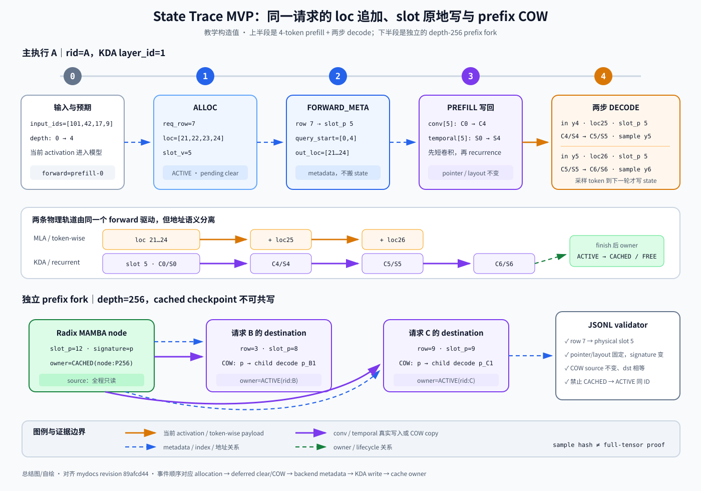

# 6｜SGLang State Trace MVP：用一次 KDA 执行证明 row、loc、slot、写回与 COW

> **实现源码基线**：正文源码直达链接固定到 SGLang fork 的教学快照 [`db017e34902b51e1fd1ac7ebbedaf720c75b374d`](https://github.com/tangpanyu/sglang/commit/db017e34902b51e1fd1ac7ebbedaf720c75b374d)（2026-09-02），以便行号稳定；关键调用已在当前 checkout `a478b5d7e74d83a9bcdb31440c2ffd64b01a2d66`（2026-09-08）复核。版本变化后请按函数名重新搜索，不要把历史行号当作 API 契约。
>
> **系列入口**：先看总览页 [`0_sglang_state_object_atlas.md`](../0_sglang_state_object_atlas/0_sglang_state_object_atlas.md)，再按需回看第1～5篇；本课只负责把统一 state 模型落成可验证的 trace，不复制各机制的完整源码主线。

今天不再讲一遍 KDA、Mamba 或 RadixCache，而是把前几课的“应该这样变化”变成一条可以在 debugger 中留下证据的 JSONL 时间线：给定一个短 prompt、两步 decode 和一次 prefix fork，你要能证明 request row 怎样找到 token loc 与 recurrent slot、KDA 在哪次函数调用中写了哪份 state、地址何时保持不变、cached source 为什么没有被 child 污染，以及 finish/evict 后 owner 到底去了哪里。

本课交付的 [`assets/state_trace_probe.py`](assets/state_trace_probe.py) 是一个只依赖 Python 标准库的 debugger-side probe；[`assets/test_state_trace_probe.py`](assets/test_state_trace_probe.py) 是不需要 PyTorch/GPU 的最小契约测试。它们没有修改 SGLang 源码，也不是性能 profiler。

## 已掌握可跳过：5 分钟诊断

- 你能看到 `req_pool_idx=7` 后立即写出两条不同地址链：`row 7 → req_to_token[7,pos] → token loc` 与 `row 7 → req_index_to_mamba_index_mapping[7] → virtual slot → physical slot`：跳到「2. 贯穿样例」。
- 你能解释 `out_cache_loc=[25]` 是本轮 token-wise cache 的写地址，而 KDA 的 `cache_indices=[5]` 才是 recurrent state 的写选择器：跳到「4. 七个观测站」。
- 你能区分 `STATE_AFTER`、layer output、logits 与 sampled token，并知道 sampled token 直到下一次 forward 才进入 state：跳到观测站 5。
- 你已经能在一次 KDA layer 调用前后记录同一 slot view 的 `data_ptr/shape/stride/sample signature`，且不会把高级索引产生的临时 gather pointer 当作 pool 地址：跳到观测站 6。
- 你能用断言证明 `cached slot 12` 经 COW 得到 `active slot 8`，拷贝后两者相等、child decode 后只有 slot 8 改变：跳到手撕。
- 只要其中一项依赖“我大概知道”，就从头走一遍；今天的完成标准不是记住类名，而是产出一份能解释错误发生在哪一层的 trace。

## 课程预算与实验边界

真实 wall-clock 预算约 **165～180 分钟**。

| 模块 | 时间 | 必须完成的动作 |
| --- | ---: | --- |
| A. trace 原理与证据边界 | 30 分钟 | 写出 semantic identity、address identity、owner identity 三组字段 |
| B. 工具加载与样例预演 | 20 分钟 | 跑完 probe 自测，理解 metadata-only 与 values mode 的同步差异 |
| C. 七个源码观测站 | 75 分钟 | 完成 prompt prefill、两次 decode、prefix COW 与 finish 记录 |
| D. 离线校验与故障定位 | 25 分钟 | 用 `summary` 和 `validate` 把 trace 归因到 mapping、write 或 owner |
| E. 手撕与回看 | 20 分钟 | 给 validator 增加 batch reorder 检查并复画总图 |

主实验沿用你已经能启动的 Kimi Linear / KDA eager 路径，并把会改变 checkpoint 语义的条件显式固定：`--page-size 1 --mamba-radix-cache-strategy no_buffer --linear-attn-backend triton --cuda-graph-backend-prefill=disabled --cuda-graph-backend-decode=disabled --disable-overlap-schedule`，保持 `--enable-int8-mamba-checkpoint` 未开启。先用 batch size 1、target worker、普通 prefill/decode；不要开启 speculative decoding、PD disaggregation、HiCache、unified-memory 或 ReplaySSM。这些当前开关在固定快照中真实存在，目的只是让 Python 调用与 GPU 写回的先后更容易观察，并不代表生产默认必须关闭这些能力；旧的 `--disable-cuda-graph` 兼容别名也存在，但已标记 deprecated，本课不使用它。若你的模型 override 改写了 page size、strategy 或 backend，以 resolved args 为准，并在 trace 旁记录实际值。

模型路径、权重位置、TP/PP 和 tokenizer 仍以你的可运行环境为准，本文不伪造一条无法在你机器上复现的完整 launch command。贯穿示例的 token、row、loc、slot 与小尺寸几何都是**教学构造值**，不是实际运行日志；源码时序、对象关系、shape 推导、默认 dtype 与写回副作用已经按固定快照静态核验。probe 只依赖 Python 标准库；是否具备 PyTorch、对应权重和 GPU serving 进程取决于你的环境，因此文中不会把离线 probe 结果声称为实机 debug。

## 0. 先定目标：trace 不是“多打印点 tensor”，而是恢复一次状态事务

### 0.1 一次 recurrent forward 必须同时回答三种 identity

KDA 的一个逻辑步可以写成：

$$
(x_t,\ C_{t-1},\ S_{t-1})\longrightarrow(o_t,\ C_t,\ S_t),
$$

其中 $x_t$ 是本轮当前 activation，$C$ 是短卷积窗口，$S$ 是 KDA 关联矩阵，$o_t$ 是 KDA attention 的核心输出，随后还会经过 `o_norm/o_proj`。这个公式只说明数学依赖，不能告诉 debugger “改的是谁的哪块显存”。

一条可用 trace 必须同时绑定三组身份：

| identity | 必须记录什么 | 它排除哪类错误 |
| --- | --- | --- |
| semantic identity | `rid`、`forward_id`、input token、`depth_before/after`、`layer_id` | 把 sampled token 当成已写入 token；把另一轮 forward 的末态拿来比较 |
| address identity | `req_row`、`out_cache_loc`、virtual/physical recurrent slot、pool/view pointer、shape、stride | row 当 slot；virtual id 未翻译；batch reorder 后更新了错误请求 |
| owner identity | `FREE/ACTIVE/CACHED`、owner、COW source/destination、finish/evict 原因 | cached state 被原地写；double free；slot 已归还却仍被请求引用 |

少任意一组都可能得到“数值变了”的假阳性。例如你在 decode 前后看到 `temporal` 的某个切片不同，如果没有 rid/slot，就不知道是不是另一个 batch row 写的；如果只有 slot 没有 depth，就不知道比较的是 $S_4\to S_5$ 还是 $S_5\to S_6$；如果没有 owner，就无法判断写入本身是否合法。

### 0.2 KDA 与 token-wise cache 在同一个请求中协同，但 trace 必须分轨

Kimi Linear 的 full-attention 侧是 MLA，KDA 层走 recurrent state；两者共享 `Req`、`ScheduleBatch`、`ForwardBatch` 和最终序列深度，但不共享地址语义。

| 轨道 | 本轮写选择器 | persistent payload | decode 的变化 |
| --- | --- | --- | --- |
| MLA/token-wise | `out_cache_loc`，再由 backend 解释 page/token table | 每 token 一条 latent row | 分配一个新 loc 并追加 |
| KDA/recurrent | `mamba_cache_indices` 里的 physical slot | 每 layer、每 request 的 conv window + temporal matrix | slot 不变，切片原地更新 |

因此 `ForwardBatch.out_cache_loc=[25]` 与 KDA `cache_indices=[5]` 同时出现完全正常：25 不是 KDA state slot，5 也不是第 5 个 token 的 cache location。trace 将二者放进同一事件，只是为了证明它们属于同一个 rid/forward，不是为了把两个 pool 合并。

### 0.3 allocation、初始化、写回是三个提交点

新请求拿到 recurrent slot 后，slot 的旧字节可能仍来自上一个 owner；正确路径是先完成 bookkeeping allocation，再在 forward stream 上 `clear_slots`，最后才让 KDA layer 读取并写回。prefix hit 则把 clear 替换为 COW：先分配 destination，随后在 forward stream 上把 cached checkpoint 复制过去，再允许 child 写 destination。

可以把它看成三阶段状态事务：

1. `ALLOCATED`：request metadata 与 row→slot mapping 已建立，但 slot 内容尚不可读。
2. `INITIALIZED`：新请求已 clear，或 prefix child 已 COW；现在 state 对该 owner 有语义。
3. `COMMITTED(depth=n)`：该 forward 的 conv/temporal 写回已经发生，下一轮可以从 $C_n,S_n$ 继续。

`MambaSlotAllocator.free()` 只改变可分配集合，不主动清旧字节；所以“free slot 仍有非零值”不是 bug，“新 owner 在 clear/COW 前读取它”才是 bug。

## 1. 为什么不直接用仓库现有 dumper 或 KV canary

固定快照已经有很有用的观测工具，但它们回答的问题不同。

> **为什么现在看**：先确认我们没有重复造一个 tensor dumper。**前置条件**：知道本课要追踪 persistent state 的前后值与 owner。**看完必须知道**：现有 `TensorDumper` 面向 module output，主动把输出搬到 CPU；它记录 `ForwardBatch` 时只摘 input IDs、seq lens 和 positions，不覆盖 recurrent pool 的 row→slot、COW 与 owner。**精确范围**：[`debug_utils/tensor_dump_forward_hook.py#L26-L87`](https://github.com/tangpanyu/sglang/blob/db017e34902b51e1fd1ac7ebbedaf720c75b374d/python/sglang/srt/debug_utils/tensor_dump_forward_hook.py#L26-L87) 与 [`debug_utils/tensor_dump_forward_hook.py#L127-L164`](https://github.com/tangpanyu/sglang/blob/db017e34902b51e1fd1ac7ebbedaf720c75b374d/python/sglang/srt/debug_utils/tensor_dump_forward_hook.py#L127-L164)。**重点字段/invariant**：`.cpu()`、module output、top-level forward flush。**预算**：5 分钟。**读后自检**：为什么看到某层 output 一致，仍不能证明下一轮读取了正确 recurrent slot？

`TensorDumper` 适合跨实现比较 activation 或 logits，但它会按 module 递归注册 hook，并把整份记录搬到 host；本课只想在一个 rid、一个 KDA layer、三个 forward 上采集少量 metadata 和 slot signature，所以全量 dumper 的同步、磁盘与信息密度都不合适。

> **为什么现在看**：再把 token-wise KV corruption 检查与 recurrent-state trace 分开。**前置条件**：知道 `out_cache_loc` 与 KDA slot 是两套地址。**看完必须知道**：KV canary 的 per-forward 边界显式消费 `input_ids/positions/out_cache_loc` 并验证 token KV endpoint；它没有替你建立 KDA conv/temporal 的 request-slot 生命周期。**精确范围**：[`kv_canary/runner/kernel_launcher.py#L27-L112`](https://github.com/tangpanyu/sglang/blob/db017e34902b51e1fd1ac7ebbedaf720c75b374d/python/sglang/srt/kv_canary/runner/kernel_launcher.py#L27-L112)。**重点字段/invariant**：`out_cache_loc`、`req_to_token`、per-forward verify/write plan。**预算**：4 分钟。**读后自检**：KV canary 通过时，为什么 KDA 仍可能因 row→slot 错位而生成错误结果？

本课 MVP 因此只补一个缺口：把 runtime metadata、选中的 persistent slot view、COW 与 owner event 关联成一条窄 trace。它不替代现有 dumper、canary 或 profiler。

## 2. 贯穿样例：先写出预期，再让 debugger 验证

### 2.1 主样例 A：4-token prefill + 两步 decode

沿用第3篇的教学样例：请求 A 的 prompt token IDs 为 `[101,42,17,9]`，`req_pool_idx=7`，MLA/token-wise locations 为 `[21,22,23,24]`，KDA virtual slot 与 physical slot 在默认静态 pool 中均为 `5`。为便于画图，下面把一个**合法的当前 KDA layer**记作 `layer_id=1`；真实运行必须从 layer 对象读取 ID，并确认它属于 `pool.mamba_map`，不能把 1 当成全模型约定。

教学几何取全局 $H=8,D=4$、attention TP size $P=2$、短卷积核长 $C=4$。当前 rank 有 $H_{local}=4$，所以这一层的关键 shape 是：

| 对象 | shape | 默认 dtype | 持久性 |
| --- | --- | --- | --- |
| `mixed_qkv` prefill | `[4,48]`，其中 Q/K/V 各 16 channels | model activation dtype | 临时 activation |
| `a=forget_gate` prefill | `[1,4,4,4]` | projection dtype | 临时 activation |
| `b=beta` prefill | `[1,4,4]` | 代码中 `.float().sigmoid()` 后为 FP32 | 临时 activation |
| canonical `conv[0]` layer slice | `[num_slots,3,48]` | 默认 BF16 | persistent |
| `temporal` layer slice | `[num_slots,4,4,4]` | 默认 FP32 | persistent |
| slot 5 基础字节 | conv `3×48×2=288 B`；temporal `4×4×4×4=256 B` | — | 合计 544 B/layer/slot |

这里 `KDAAttnBackend.forward_extend` 会把 canonical conv view 临时转置为 `[num_slots,48,3]` 以拆出 Q/K/V 窗口；转置只改变 view 的 shape/stride，不搬迁 backing storage。

prefill 处理完 token 9 后产生 KDA attention 核心输出 $o_1\ldots o_4$，并把 slot 5 从 $C_0,S_0$ 更新为 $C_4,S_4$。核心输出随后经过 `o_norm/o_proj` 并继续流过整网；整网产生 logits 并采样 `y4`，但此时 `y4` 还没有进入 state。

decode #1 的输入才是 `y4`：token-wise 路径追加 loc 25，KDA 仍写 physical slot 5，把 $C_4,S_4$ 更新为 $C_5,S_5$，然后整网采样 `y5`。decode #2 输入 `y5`，追加 loc 26，并把同一 slot 更新为 $C_6,S_6$。

| forward | 输入到 KDA 的 token | `req_to_token[7,:depth]` | KDA physical slot | 调用前 | 调用后 | 本轮结束后才采样 |
| --- | --- | --- | ---: | --- | --- | --- |
| `prefill-0` | `[101,42,17,9]` | `[21,22,23,24]` | 5 | $C_0,S_0$ | $C_4,S_4$ | `y4` |
| `decode-1` | `[y4]` | `[21,22,23,24,25]` | 5 | $C_4,S_4$ | $C_5,S_5$ | `y5` |
| `decode-2` | `[y5]` | `[21,22,23,24,25,26]` | 5 | $C_5,S_5$ | $C_6,S_6$ | `y6` |

trace 中不打印 $C_n,S_n$ 的大张量，只记录 canonical slot view 的 pointer/layout 与固定位置 sample hash。正确预期是：三轮的 `state_slot_physical=5`、`data_ptr`、shape、stride 都不变，sample signature 按轮次改变；每轮 `STATE_AFTER` 恰好成为下一轮同一 tensor 的 `STATE_BEFORE`。

### 2.2 分叉样例 P：cached checkpoint 必须只读

4-token prompt 很适合看 prefill/decode，但真实 recurrent prefix checkpoint 必须落在该配置允许的 checkpoint grid。为避免假装任意深度都一定有 checkpoint，prefix fork 单独使用教学深度 256：Radix 的 MAMBA component 已持有 physical slot 12，对应 $C_{256},S_{256}$；请求 B、C 命中同一 prefix 后分别取得 writable destination slots 8、9。

| 时刻 | cached slot 12 | B slot 8 | C slot 9 | 必须成立的断言 |
| --- | --- | --- | --- | --- |
| match 后、COW 前 | `CACHED(node:P256)` | `ACTIVE` 但内容尚不可读 | `ACTIVE` 但内容尚不可读 | source 与 destination ID 不同 |
| COW 后 | signature `p` | signature `p` | signature `p` | `src_before==src_after==dst_after` |
| B decode 后 | 仍为 `p` | 变为 `p_B1` | 仍为 `p` | cached source 与 sibling 不被 B 写入 |
| C decode 后 | 仍为 `p` | `p_B1` | 变为 `p_C1` | 两个 child 各有单 writer |

`sample_sha256` 只是低成本的定点证据，不是数学上无碰撞的全 tensor 等价证明；定位到 COW 疑点时，再在一个 layer/slot 上使用 `torch.equal(src,dst)` 做一次会同步且会扫描全部元素的严格检查。

> **先带着一个问题读图**：一次普通 KDA forward，哪些字段只是本轮 carrier，哪些 view 会在同一个 physical slot 上被原地改写；prefix fork 时，哪条边必须先完成才能让 child 写入？本图只回答这两个问题，不展开 kernel 内部线程。
>
> 
>
> *图源与范围：本文自绘的教学图，按上方固定源码快照抽象，不是运行时截图，也不表示所有可选 backend。*

**怎么读图**：上半部分从左到右走请求 A。蓝色卡片只放 row、loc、slot、length 等 metadata；橙色实线表示当前 token activation 或 token-wise payload 的写入；紫色实线表示 conv/temporal 的实际更新；绿色虚线表示 owner 转移。prefill 与两次 decode 中 physical slot 都是 5，变化的是 `C/S` signature 与 token loc suffix。

下半部分是独立的 depth-256 prefix fork，不要把它误认为 4-token 主样例自动生成了 checkpoint。cached slot 12 先通过紫色实线复制到 slots 8/9，再由两个 child 独立写；从 node 指向 request 的蓝色虚线只表示 match/COW metadata，绝不表示两请求共写 source。右侧 validator 消费的是 JSONL 事件，不在 model forward 中改变任何 state。

图中节点与源码的落点是：`row/loc` 对应 `ForwardBatch.req_pool_indices/out_cache_loc`，`slot` 对应 `mamba_cache_indices` 翻译后的 physical index，紫色写回对应 KDA backend 的 `conv_states/ssm_states`，fork 的 copy 边对应 `ModelRunner._maybe_execute_deferred_mamba_cow_and_clear` 中的 `copy_from`。因此图可以导航到第 4 节观测站 1～6，但不能替代那些断点处的 JSONL 证据。

## 3. 工具先跑通：metadata-only、values mode 与正确取 pointer

### 3.1 本地契约测试

解压后在课程目录执行：

```bash
cd assets
conda run -n base python -m py_compile state_trace_probe.py test_state_trace_probe.py
conda run -n base python -m unittest -v test_state_trace_probe.py
```

测试用 fake torch-like tensor 验证 JSONL、sample signature、同一步 pointer/layout 不变、COW sample 相等和非法 `CACHED → ACTIVE` 同 slot 转移会被拒绝。它不验证 CUDA tensor 访问或真实 KDA 数值；这些必须由下面的实际断点完成。

### 3.2 在 debugger 中加载 probe

最简单的方式是把课程 `assets/` 加入调试进程的 `PYTHONPATH`，然后在第一个断点的 Debug Console 中执行：

```python
from state_trace_probe import StateTraceProbe
probe = StateTraceProbe("/tmp/sglang_kda_state_trace.jsonl", include_values=True, max_values=32)
```

如果不想改 `PYTHONPATH`，可以用文件路径动态加载：

```python
import importlib.util
import sys
spec = importlib.util.spec_from_file_location("state_trace_probe", "/ABS/PATH/assets/state_trace_probe.py")
state_trace_probe = importlib.util.module_from_spec(spec)
sys.modules[spec.name] = state_trace_probe
spec.loader.exec_module(state_trace_probe)
probe = state_trace_probe.StateTraceProbe("/tmp/sglang_kda_state_trace.jsonl", include_values=True, max_values=32)
```

结束请求后执行 `probe.close()`，再离线查看：

```bash
python assets/state_trace_probe.py summary /tmp/sglang_kda_state_trace.jsonl
python assets/state_trace_probe.py validate /tmp/sglang_kda_state_trace.jsonl
```

### 3.3 两种模式不是“详细/不详细”，而是是否允许同步

| 模式 | 构造 | 记录内容 | GPU 同步风险 | 用途 |
| --- | --- | --- | --- | --- |
| metadata-only | `include_values=False` | shape/dtype/device/stride/numel/data pointer/storage pointer/offset | tensor metadata 本身不做 D2H；显式 `small_list` 仍会同步 | 先验证映射、地址和 batch reorder |
| values | `include_values=True` | 上述内容 + 固定步长最多 N 个 FP32 host sample 与 hash | 每次采样都会 D2H 并同步 | 只对一个 rid、一个 layer、三轮 forward 做 correctness debug |

probe 每写一条 JSONL 都会 flush 文件，因此它故意牺牲性能换崩溃前证据。不要用 values mode 跑吞吐 benchmark，也不要在所有 layer、所有 request 上打开它；E2E 性能问题应另用 profiler，这个工具只负责先把 state correctness 契约钉死。

### 3.4 pointer 最容易记录错：只对 basic-index view 解释为 persistent address

正确做法：

```python
slot = 5
conv_slot = layer_cache.conv[0][slot]
temporal_slot = layer_cache.temporal[slot]
```

这两个 basic-index view 指向原 backing storage 的 slot slice，`storage_ptr` 相同而 `data_ptr/storage_offset` 表示具体切片。

错误做法：

```python
gathered = layer_cache.temporal[cache_indices]
```

`cache_indices` 是 tensor，高级索引可能生成新 tensor；`gathered.data_ptr()` 只能证明临时 gather 的地址，不能证明 persistent slot 在哪里。正确 trace 应记录原始 layer pool 的 base metadata、整数 `cache_indices`，再单独基本索引 `temporal_slot`。

## 4. 七个观测站：沿真实代码时序留下最短闭环

### 观测站 1：allocation 同时提交 token row 与 recurrent slot owner

> **为什么现在看**：这是同一请求的 token loc 与 recurrent slot 第一次分轨，也是后续所有 trace 的根。**前置条件**：请求已完成 prefix match，当前 batch 将执行 extend。**看完必须知道**：`alloc_for_extend` 分配 request row 与新 token loc，写完整 `req_to_token` row；`HybridReqToTokenPool.alloc` 另外为没有 state 的请求分配 Mamba/KDA slot，并标记 deferred clear。**精确范围**：[`mem_cache/allocation.py#L282-L389`](https://github.com/tangpanyu/sglang/blob/db017e34902b51e1fd1ac7ebbedaf720c75b374d/python/sglang/srt/mem_cache/allocation.py#L282-L389) 与 [`mem_cache/memory_pool.py#L1349-L1412`](https://github.com/tangpanyu/sglang/blob/db017e34902b51e1fd1ac7ebbedaf720c75b374d/python/sglang/srt/mem_cache/memory_pool.py#L1349-L1412)。**重点对象/字段/invariant**：`out_cache_loc`、`req_pool_indices_device`、`req_to_token`、`mamba_pool_idx`、`mamba_needs_clear`；row 与 slot 是两个独立整数。**真实预算**：10 分钟。**读后自检**：为什么 `out_cache_loc` 分配成功仍不能说明 KDA 初态可读？

调用关系是 `ScheduleBatch.prepare_for_extend → alloc_for_extend → alloc_req_slots/alloc token pages → write_cache_indices`。输入是 `batch.reqs`、prefix locations、每请求 extend length 与 sequence length；副作用是 request row、token locations、row→loc 表和 request→Mamba slot mapping都建立，输出的 `out_cache_loc` 只描述本轮新 token-wise writes。

在 `alloc_for_extend` 返回前、`req.kv.kv_committed_len` 更新后停住，对 batch size 1 记录：

```python
req = batch.reqs[0]
row = int(req_pool_indices_cpu[0].item())
seq_len = int(batch.seq_lens_cpu[0].item())
full_locs = probe.small_list(batch.req_to_token_pool.req_to_token[row, :seq_len])
write_locs = probe.small_list(out_cache_loc)
probe.owner(space="recurrent", resource_id=int(req.kv.mamba_pool_idx.item()), state="ACTIVE", owner=f"rid:{req.rid}", reason="alloc_pending_clear")
probe.capture("ALLOC", rid=req.rid, forward_id="prefill-0", req_row=row, seq_len=seq_len, full_locs=full_locs, write_locs=write_locs, state_slot_virtual=int(req.kv.mamba_pool_idx.item()), mamba_needs_clear=bool(req.kv.mamba_needs_clear))
```

主样例应得到 row 7、full/write locs `[21,22,23,24]`、virtual slot 5、`mamba_needs_clear=True`。注意 `OWNER=ACTIVE` 在这条事件中表示 allocator/bookkeeping owner 已经转给请求，`reason=alloc_pending_clear` 明确说明 payload 还没进入可读态。

decode 的 token-wise追加走另一段代码，但 recurrent slot不会重新分配：

> **为什么补看这一小段**：让两次 decode 的 loc 25/26 有真实来源。**前置条件**：请求 row 7 与 slot 5 已存在。**看完必须知道**：`alloc_for_decode` 在旧 seq length 位置写一个新 token loc并增加 committed length；它不分配新的 Mamba slot。**精确范围**：[`mem_cache/allocation.py#L521-L584`](https://github.com/tangpanyu/sglang/blob/db017e34902b51e1fd1ac7ebbedaf720c75b374d/python/sglang/srt/mem_cache/allocation.py#L521-L584)。**重点对象/字段/invariant**：`locs=seq_lens_gpu.clone()`、`req_to_token_pool.write`、`kv_committed_len += 1`。**真实预算**：5 分钟。**读后自检**：decode #1 后为什么 full row 增到 5 项，而 KDA slot 数仍是一项？

在 decode 中复用同一 `ALLOC` event schema，只把 `forward_id` 改成 `decode-1/decode-2`，`write_locs` 分别是 `[25]`、`[26]`。validator 会检查 write set 是 full row 的 suffix。

### 观测站 2：ForwardBatch 携带待办，forward stream 才执行 clear/COW

> **为什么现在看**：slot 已分配但旧 bytes 尚未获得新语义，必须找到真正的初始化 barrier。**前置条件**：观测站 1 已看到 `mamba_needs_clear` 或 prefix hit 的 `mamba_cow_src_indices`。**看完必须知道**：`ForwardBatch` 借用 row/loc/length，并额外携带 COW/clear indices；`ModelRunner` 在任何 KDA/Mamba layer 读取前执行真实 zero/copy，然后清空待办字段。**精确范围**：[`model_executor/forward_batch_info.py#L393-L432`](https://github.com/tangpanyu/sglang/blob/db017e34902b51e1fd1ac7ebbedaf720c75b374d/python/sglang/srt/model_executor/forward_batch_info.py#L393-L432)、[`model_executor/forward_batch_info.py#L778-L830`](https://github.com/tangpanyu/sglang/blob/db017e34902b51e1fd1ac7ebbedaf720c75b374d/python/sglang/srt/model_executor/forward_batch_info.py#L778-L830) 与 [`model_executor/model_runner.py#L1678-L1724`](https://github.com/tangpanyu/sglang/blob/db017e34902b51e1fd1ac7ebbedaf720c75b374d/python/sglang/srt/model_executor/model_runner.py#L1678-L1724)。**重点对象/字段/invariant**：`mamba_clear_indices`、`mamba_cow_src/dst_indices`、`translate_mamba_indices`；schedule 收集阶段可以先把 COW 与 clear 互斥地放入待办，但当前 runner 的执行顺序是 **先 clear，再 COW**，两者都在 forward stream 上完成。**真实预算**：12 分钟。**读后自检**：为什么 scheduler 线程直接清 GPU slot 可能与前一轮 forward 产生 race？

`ForwardBatch.init_new` 没有复制长期 state，它只是把 `ScheduleBatch` 的一次 forward 输入压成 runtime snapshot。schedule 收集阶段会让 clear 与 COW 互斥；当前 `ModelRunner._maybe_execute_deferred_mamba_cow_and_clear` 的 runner 顺序是 **先 `clear_slots(dst)`，再执行 COW**（COW 分支在满足条件时调用 `copy_from(src,dst)`，或在 checkpoint pool 分支调用 `load_to_active`）。完成后三个 metadata 字段被置 `None`，防止同一待办重复执行。

对新请求 A，可在 `clear_slots` 前后分别采样当前 KDA layer 的 slot 5。若 free slot 恰好残留旧值，before 允许非零；after 必须为零。示意调用如下；`layer_id=1` 只是教学构造值，实际必须从当前 KDA layer 对象读取，并确认它存在于 pool 的 `mamba_map`：

```python
physical = int(pool.translate_mamba_indices(forward_batch.mamba_clear_indices)[0].item())
kda_layer = current_kda_layer  # 从真实 forward loop 捕获，不要猜编号
layer_id = int(kda_layer.layer_id)
assert layer_id in pool.mamba_map
layer_cache = pool.mamba2_layer_cache(layer_id)
probe.capture("CLEAR_BEFORE", rid=forward_batch.rids[0], forward_id="prefill-0", state_slot_physical=physical, tensor_values={"conv_slot": layer_cache.conv[0][physical], "temporal_slot": layer_cache.temporal[physical]})
# 单步越过 clear_slots(...)
probe.capture("CLEAR_AFTER", rid=forward_batch.rids[0], forward_id="prefill-0", state_slot_physical=physical, tensor_values={"conv_slot": layer_cache.conv[0][physical], "temporal_slot": layer_cache.temporal[physical]})
```

`CLEAR_AFTER` 目前不由通用 validator 自动判断全零，因为 sample 不能证明未采样位置；你应在此处先看 sample，必要时对这一个小 view执行 `(slot_view == 0).all()` 的严格检查。下一站之前最重要的 invariant 是：KDA 第一次读 slot 5 时，它已代表 $C_0,S_0$，而不是上一个 owner 的 stale bytes。

### 观测站 3：backend metadata 把 batch row 翻成 physical slot

> **为什么现在看**：kernel 不认识 rid，也不能把 request row 直接当 state address。**前置条件**：`ForwardBatch.req_pool_indices=[7]`，row 7 的 mapping 已指向 virtual slot 5。**看完必须知道**：`MambaAttnBackendBase._forward_metadata` 先 gather row→slot，再做 virtual→physical translation，并为 packed tokens 构造 `query_start_loc`；KDA kernel-visible view只消费 physical slot和sequence boundary。**精确范围**：[`layers/attention/hybrid_linear_attn_backend.py#L108-L151`](https://github.com/tangpanyu/sglang/blob/db017e34902b51e1fd1ac7ebbedaf720c75b374d/python/sglang/srt/layers/attention/hybrid_linear_attn_backend.py#L108-L151) 与 [`layers/attention/hybrid_linear_attn_backend.py#L209-L274`](https://github.com/tangpanyu/sglang/blob/db017e34902b51e1fd1ac7ebbedaf720c75b374d/python/sglang/srt/layers/attention/hybrid_linear_attn_backend.py#L209-L274)。**重点对象/字段/invariant**：`get_mamba_indices(req_pool_indices)`、`_translate_mamba_indices`、`query_start_loc`、padding `-1`。**真实预算**：12 分钟。**读后自检**：batch order 改成 `[B,A]` 时，为什么 state 应跟 `[slot_B,slot_A]` 重排，而不是跟 row position 0/1 走？

普通静态 pool 的 translation 是 identity，所以主样例 virtual 5→physical 5；开启 unified memory 后 virtual id 是稳定逻辑 handle，physical placement 可能不同，所有 pool state op 与 kernel 都必须使用翻译后的值。今天先关闭 unified memory，但 trace schema同时保留两列，防止以后把“当前相等”误写成“永远同义”。

在 `_forward_metadata` 即将返回 `ForwardMetadata` 处记录：

```python
probe.capture(
    "FORWARD_META",
    rids=list(forward_batch.rids),
    forward_id="prefill-0",
    req_rows=probe.small_list(forward_batch.req_pool_indices),
    out_cache_loc=probe.small_list(forward_batch.out_cache_loc),
    state_slots_virtual=probe.small_list(self.req_to_token_pool.get_mamba_indices(forward_batch.req_pool_indices)),
    state_slots_physical=probe.small_list(mamba_cache_indices),
    query_start_loc=probe.small_list(query_start_loc),
    require_unique_writers=True,
)
```

prefill 的预期是 `req_rows=[7]`、`out_cache_loc=[21,22,23,24]`、virtual/physical slots `[5]`、`query_start_loc=[0,4]`；decode #1/#2 都应是 `query_start_loc=[0,1]`、slot `[5]`，只有 `out_cache_loc` 分别变为 `[25]`、`[26]`。

eager 时序也必须对上：metadata 在模型 forward 前初始化，随后模型才逐层读写 state。

> **为什么补看 runner**：确认断点顺序不是文档想象。**前置条件**：已关闭 CUDA graph。**看完必须知道**：eager decode/extend 都在进入 `model.forward` 前调用 backend metadata init；deferred clear/COW 更早由 `ModelRunner._forward_raw`执行。**精确范围**：[`model_executor/runner/eager_runner.py#L243-L270`](https://github.com/tangpanyu/sglang/blob/db017e34902b51e1fd1ac7ebbedaf720c75b374d/python/sglang/srt/model_executor/runner/eager_runner.py#L243-L270) 与 [`model_executor/runner/eager_runner.py#L272-L330`](https://github.com/tangpanyu/sglang/blob/db017e34902b51e1fd1ac7ebbedaf720c75b374d/python/sglang/srt/model_executor/runner/eager_runner.py#L272-L330)。**重点对象/字段/invariant**：`init_forward_metadata` 在 `model.forward` 前；同一 forward 只应使用一份一致 metadata。**真实预算**：5 分钟。**读后自检**：若 slot clear 正确但 `mamba_cache_indices` 指向别的 request，下一步会出现什么表象？

### 观测站 4：prefill 中 conv 先更新，temporal 随 KDA scan 写回

> **为什么现在看**：这是输入第一次真正变成 persistent KDA state 的位置。**前置条件**：slot 5 已 clear，metadata 是 `query_start_loc=[0,4]`、`cache_indices=[5]`。**看完必须知道**：模型投影产生临时 `mixed_qkv/beta/forget_gate/norm_gate`；backend 在函数返回前先写 conv window，再由 extend recurrence 把末态原地写进 temporal，同时返回当前 layer output。**精确范围**：[`models/kimi_linear.py#L449-L546`](https://github.com/tangpanyu/sglang/blob/db017e34902b51e1fd1ac7ebbedaf720c75b374d/python/sglang/srt/models/kimi_linear.py#L449-L546)、[`layers/attention/linear/kda_backend.py#L693-L775`](https://github.com/tangpanyu/sglang/blob/db017e34902b51e1fd1ac7ebbedaf720c75b374d/python/sglang/srt/layers/attention/linear/kda_backend.py#L693-L775) 与 [`layers/attention/linear/kda_backend.py#L781-L828`](https://github.com/tangpanyu/sglang/blob/db017e34902b51e1fd1ac7ebbedaf720c75b374d/python/sglang/srt/layers/attention/linear/kda_backend.py#L781-L828)。**重点对象/字段/invariant**：`mixed_qkv` 是临时投影；`conv_states` 与 `ssm_states` 是 pool view；`cache_indices` 选择 slot；实际写回发生在 backend call 内，不等待整网 logits。**真实预算**：18 分钟。**读后自检**：为什么在 `KimiDeltaAttention.forward` 返回后再拍“before”已经太晚？

模型先从 `hidden_states` 产生 `mixed_qkv`、`beta`、`forget_gate` 和输出 norm gate。prefill 把 beta 转 FP32 sigmoid，并把 gate整理成 chunk KDA 需要的 shape；这些都是当前 forward activation，函数返回后不会作为历史逐 token 保存在 pool 中。

在 `KDAAttnBackend.forward_extend` 取得 `mamba_cache_params` 后记录整体 transition 的 before：

```python
slot = int(cache_indices[0].item())
layer_cache = mamba_cache_params
probe.capture(
    "STATE_BEFORE",
    rid=forward_batch.rids[0],
    forward_id="prefill-0",
    layer_id=layer.layer_id,
    req_row=int(forward_batch.req_pool_indices[0].item()),
    state_slot_physical=slot,
    depth_before=int(forward_batch.extend_prefix_lens_cpu[0]),
    transition_id=f"{forward_batch.rids[0]}/prefill-0/layer-{layer.layer_id}",
    input_ids=probe.small_list(forward_batch.input_ids),
    tensor_meta={"mixed_qkv": mixed_qkv, "conv_pool": layer_cache.conv[0], "temporal_pool": layer_cache.temporal},
    tensor_values={"conv_slot": layer_cache.conv[0][slot], "temporal_slot": layer_cache.temporal[slot]},
)
```

三次 `causal_conv1d_fn` 处理 Q/K/V 并把每个 sequence 的最后 $C-1$ 个 raw projected rows写回对应 conv slot。单步越过第三次调用后可额外记录 `STATE_MID`：此时 `conv_slot` 应从 $C_0$ 变为 $C_4$，temporal 仍等待 KDA recurrence。

`kernel_dispatcher.extend` 消费 q/k/v、forget gate、beta、旧 temporal、physical slots 与 packed boundary，产生 4 个 token 的 `core_attn_out`，并在这次调用内把每条 sequence 的最终关联矩阵写回 `ssm_states[slot]`。是否由 kernel 内部融合实现不影响外部契约：调用返回时 $S_4$ 已提交。

在 `forward_extend` 返回前记录 after：

```python
probe.capture(
    "STATE_AFTER",
    rid=forward_batch.rids[0],
    forward_id="prefill-0",
    layer_id=layer.layer_id,
    req_row=int(forward_batch.req_pool_indices[0].item()),
    state_slot_physical=slot,
    depth_after=int(forward_batch.extend_seq_lens_cpu[0]),
    transition_id=f"{forward_batch.rids[0]}/prefill-0/layer-{layer.layer_id}",
    expect_changed=["conv_slot", "temporal_slot"],
    tensor_meta={"core_attn_out": core_attn_out},
    tensor_values={"conv_slot": layer_cache.conv[0][slot], "temporal_slot": layer_cache.temporal[slot]},
)
```

关键检查不是 hash “看起来随机”，而是 before/after 的 slot、`data_ptr`、shape、stride一致，签名变化，`depth 0→4`，且 `STATE_AFTER(prefill-0)` 在下一轮 decode 前仍可读为同一 state。`core_attn_out` 是 KDA attention 的核心输出，连本层的 `o_norm/o_proj` 都还没走完，后面还有其他 decoder layers 与 LM head；它不是最终 logits，更不是 sampled `y4`。

### 观测站 5：两次 decode 证明“同地址原地更新”，并钉住 token 时序

> **为什么现在看**：prefill 只证明能从零态扫描；decode 才能暴露旧 state定位错误、batch row错位和“采样即写入”的时序误解。**前置条件**：slot 5 已是 $C_4,S_4$，decode #1 的 input 是 `y4`。**看完必须知道**：普通 Kimi Linear 路径先由 `causal_conv1d_update` 原地滚动 conv，再由 packed decode/recurrent decode 原地更新 temporal；函数有不同 return 分支，观测点必须落在实际分支之后。**精确范围**：[`layers/attention/linear/kda_backend.py#L531-L666`](https://github.com/tangpanyu/sglang/blob/db017e34902b51e1fd1ac7ebbedaf720c75b374d/python/sglang/srt/layers/attention/linear/kda_backend.py#L531-L666) 与 [`layers/attention/linear/kda_backend.py#L668-L691`](https://github.com/tangpanyu/sglang/blob/db017e34902b51e1fd1ac7ebbedaf720c75b374d/python/sglang/srt/layers/attention/linear/kda_backend.py#L668-L691)。**重点对象/字段/invariant**：`conv_state_indices=cache_indices`、`ssm_states/cache_indices`、packed 路径“一请求一 token”；写回先于函数 return。**真实预算**：18 分钟。**读后自检**：decode #1 结束时 state 包含 `y4` 还是 `y5`？

主样例使用普通 `kimi_linear.py`，不会提供 Kimi-K3 专属 `_k3_fused_decode_args/onorm_gate`，所以应走 line 629 之后的 unfused conv + recurrent chain；若你实际换成 Kimi-K3 并命中 fused branch，conv、KDA recurrence 与 norm 可能都在 `kda_fused_decode` 调用内完成，trace 应移动到该调用前后，不能为了对齐本文强迫它走另一条路径。

decode #1 在函数取得 `layer_cache/cache_indices` 后记录：

```python
forward_id = "decode-1"
slot = int(cache_indices[0].item())
transition_id = f"{forward_batch.rids[0]}/{forward_id}/layer-{layer.layer_id}"
probe.capture("STATE_BEFORE", rid=forward_batch.rids[0], forward_id=forward_id, layer_id=layer.layer_id, req_row=int(forward_batch.req_pool_indices[0].item()), state_slot_physical=slot, depth_before=4, transition_id=transition_id, input_ids=probe.small_list(forward_batch.input_ids), out_cache_loc=probe.small_list(forward_batch.out_cache_loc), tensor_meta={"mixed_qkv": mixed_qkv, "conv_pool": conv_states, "temporal_pool": ssm_states}, tensor_values={"conv_slot": conv_states[slot], "temporal_slot": ssm_states[slot]})
```

单步越过 `causal_conv1d_update` 后，conv slot 已从 $C_4$ 变为 $C_5$；单步越过实际 `packed_decode` 或 `decode` 调用后，temporal 从 $S_4$ 变为 $S_5$。在对应 return 前写 `STATE_AFTER`，设置 `depth_after=5` 与 `expect_changed=["conv_slot","temporal_slot"]`。

decode #2 使用相同代码，只把 `forward_id/depth/input/out_cache_loc` 改为 `decode-2/5→6/y5/[26]`。离线 trace 必须按下面的顺序核对（这是状态连续性检查清单，不是额外的运行时流程图）：

1. `prefill-0` 的 `STATE_AFTER`：slot 5，深度 $4$，得到 $C_4/S_4$。
2. `decode-1` 的 `STATE_BEFORE`：仍是 slot 5，且应与上一步的 pointer/layout 和 $C_4/S_4$ 对上；完成后变为 $C_5/S_5$。
3. `decode-2` 的 `STATE_BEFORE`：仍是 slot 5，且应与 `decode-1` 的 after 对上；完成后变为 $C_6/S_6$。

对每个相邻 pair，比较 `rid`、`layer_id`、physical slot、pointer/layout 和 depth；只有在这些身份连续时，sample signature 的变化才有解释意义。

`state_trace_probe.py validate` 会检查每个单步 transition 内 pointer/layout 不变和指定 sample 是否改变；跨 forward 的 after→before 连续性目前请人工对 summary/hash，这正是手撕题可以继续扩展的地方。

如果 decode #1 的 input IDs 已是 `y5`，不是 kernel “提前写了下一个 token”，而是你给 forward 编号错了一轮或把采样回调事件与下一次模型输入混在一起。先修 semantic identity，再查 state 数值。

### 观测站 6：prefix hit 先产生 COW plan，真实 copy 必须在 child 写入前完成

> **为什么现在看**：cached recurrent checkpoint 是不可变计算结果，不是可让两个请求共写的 active slot。**前置条件**：Radix MAMBA component 在 depth 256持有 cached slot 12，请求 B 命中该 node。**看完必须知道**：match finalize 为 B分配 destination 并只记录 source；真正的 copy 延迟到 forward stream，且同时复制所有 recurrent layers 的 conv+temporal。**精确范围**：[`mem_cache/unified_cache/components/mamba_component.py#L155-L216`](https://github.com/tangpanyu/sglang/blob/db017e34902b51e1fd1ac7ebbedaf720c75b374d/python/sglang/srt/mem_cache/unified_cache/components/mamba_component.py#L155-L216)、[`model_executor/model_runner.py#L1705-L1724`](https://github.com/tangpanyu/sglang/blob/db017e34902b51e1fd1ac7ebbedaf720c75b374d/python/sglang/srt/model_executor/model_runner.py#L1705-L1724) 与 [`mem_cache/memory_pool.py#L992-L1039`](https://github.com/tangpanyu/sglang/blob/db017e34902b51e1fd1ac7ebbedaf720c75b374d/python/sglang/srt/mem_cache/memory_pool.py#L992-L1039)。**重点对象/字段/invariant**：`mamba_cow_src_indices`/`mamba_cow_dst_indices`、destination active slot、virtual→physical translation；默认无 checkpoint-pool 的分支调用 `copy_from`，checkpoint pool 分支可能调用 `load_to_active`，两者都应同时复制 conv 与 temporal；source/destination 不重叠。**真实预算**：15 分钟。**读后自检**：为什么 Radix lock/ref 能保护 source 不被 eviction，却不能授权 B 直接写 source？

在 `finalize_match_result_in_cache` 末尾确认 `src_virtual=12,dst_virtual=8,owner(src)=node:P256,owner(dst)=rid:B`。这个函数没有搬 state；如果在这里比较 destination 与 source，它们仍可能不同。真正写 trace 的 `COW_PLAN` 放在 `_maybe_execute_deferred_mamba_cow_and_clear` 的 `copy_from` 前，这样它能直接拍到同一 physical source view 的 before 快照。

```python
src_v = int(forward_batch.mamba_cow_src_indices[0].item())
dst_v = int(forward_batch.mamba_cow_dst_indices[0].item())
src_p = int(pool.translate_mamba_indices(forward_batch.mamba_cow_src_indices)[0].item())
dst_p = int(pool.translate_mamba_indices(forward_batch.mamba_cow_dst_indices)[0].item())
kda_layer = current_kda_layer  # 从真实 forward loop 捕获，不要猜编号
layer_id = int(kda_layer.layer_id)
assert layer_id in pool.mamba_map
lc = pool.mamba2_layer_cache(layer_id)
cow_id = f"{forward_batch.rids[0]}/cow/{src_p}->{dst_p}"
probe.capture(
    "COW_PLAN",
    rid=forward_batch.rids[0],
    transition_id=cow_id,
    prefix_depth=256,
    src_slot_virtual=src_v,
    dst_slot_virtual=dst_v,
    src_slot_physical=src_p,
    dst_slot_physical=dst_p,
    src_owner_state="CACHED",
    src_owner="node:P256",
    tensor_values={"src_before": lc.temporal[src_p]},
)
```

单步越过 `copy_from` 后记录：

```python
rid = forward_batch.rids[0]
probe.capture(
    "COW_DONE",
    rid=rid,
    transition_id=cow_id,
    prefix_depth=256,
    src_slot_physical=src_p,
    dst_slot_physical=dst_p,
    src_owner_state="CACHED",
    src_owner="node:P256",
    tensor_values={"src_after": lc.temporal[src_p], "dst_after": lc.temporal[dst_p]},
)
probe.owner(space="recurrent", resource_id=dst_p, state="ACTIVE", owner=f"rid:{rid}", reason="cow_from_cached_prefix")
```

validator 会把同一 `transition_id` 的 `COW_PLAN/DONE` 配对，拒绝相同 src/dst，检查实际 `tensors.src_before/src_after/dst_after` 的 pointer/layout 与 sample：copy 前后 source 不变、destination copy 后与 source 相等；若 source 没有先出现 `OWNER=CACHED`，会给出警告。随后跑 B 的一次 decode，再对 slot 12/8 分别拍 signature；slot 8 应变、12 不变。C 复用相同 prefix 时 destination 必须是另一个 active slot 9。

当前窄 schema 的一条 COW event 只表示一对 scalar slot，正好覆盖本课 batch size 1 的断点。真实 batch 同时出现多对 COW 时，应为每一对使用独立 `transition_id` 逐对记录并额外检查 source/destination 集合不相交；不能把整批 tensor 塞进这两个 scalar 字段后声称 validator 已覆盖全批次。

`MambaPool.copy_from` 的单位是整个 active state slot，内部复制所有 conv tensors 与 temporal layers，并把可选 ReplaySSM cursor重置；只检查一个 temporal layer 是今天的窄 smoke test。若准备把它做成 PR 级 regression test，必须至少遍历所有 KDA layer ordinal，同时检查 conv、temporal 与任何启用的 ring/cursor。

### 观测站 7：finish、cached、evicted、free 必须用 owner event 收尾

> **为什么现在看**：数值写对但 owner 未转移，下一次复用仍会产生双写、泄漏或 stale reference。**前置条件**：请求 A 或 B 已完成生成，active slot持有精确 committed depth。**看完必须知道**：finish 可把 active slot donate给 Radix MAMBA component，插入失败/重复时归还；eviction先从 node 摘掉 cached value，再由统一回收阶段归 allocator；request metadata清空不等于大 tensor 被销毁或清零。**精确范围**：[`mem_cache/unified_cache/components/mamba_component.py#L529-L650`](https://github.com/tangpanyu/sglang/blob/db017e34902b51e1fd1ac7ebbedaf720c75b374d/python/sglang/srt/mem_cache/unified_cache/components/mamba_component.py#L529-L650)、[`mem_cache/unified_cache/components/mamba_component.py#L322-L339`](https://github.com/tangpanyu/sglang/blob/db017e34902b51e1fd1ac7ebbedaf720c75b374d/python/sglang/srt/mem_cache/unified_cache/components/mamba_component.py#L322-L339) 与 [`mem_cache/memory_pool.py#L1519-L1573`](https://github.com/tangpanyu/sglang/blob/db017e34902b51e1fd1ac7ebbedaf720c75b374d/python/sglang/srt/mem_cache/memory_pool.py#L1519-L1573)。**重点对象/字段/invariant**：`mamba_value_inserted`、donate vs free、`mamba_pool_idx=None`、cached value收集到 free list；一个 slot 任一时刻只有一种 owner state。**真实预算**：15 分钟。**读后自检**：为什么 finish 后 slot bytes还在，既可能正确又可能危险？

no-extra-buffer 的 finished request先把 active slot index作为候选 `mamba_value` 交给 tree insert；如果新 checkpoint被接受，cleanup 不 free 它，owner应记录为：

```python
probe.owner(space="recurrent", resource_id=5, state="CACHED", owner="radix:MAMBA@depth6", reason="finish_inserted_checkpoint")
```

如果树已有同等 checkpoint或 candidate 未采用，则 active slot归 allocator，并且 `req.kv.mamba_pool_idx` 被清空：

```python
probe.owner(space="recurrent", resource_id=5, state="FREE", owner=None, reason="finish_candidate_unused")
```

之后真正 eviction cached slot 时，记录 `CACHED→FREE`；不要记录 `CACHED→ACTIVE(rid:new)`。新请求若恰好再分到同一个整数 slot，必须先有 FREE→ACTIVE event，并在第一层读取前另有 CLEAR 或 COW evidence。probe validator正是用这个状态机抓“cached source直接变成 child writer”与“ACTIVE owner无释放就换 rid”。

request row、per-forward metadata和 `Req` 上的 slot字段会被释放或置空，进程级 `MambaPool.conv/temporal` allocation仍然存在；free slot里的 sample signature可以保持旧值，直到下一个 owner执行 clear/COW/forward write。trace结束时看到 stale bytes不应触发“allocator必须 memset”的错误修复。

## 5. 从 JSONL 读故障：先归层，再决定是否进入 kernel

### 5.1 最小事件集合

一次主样例至少应有：

| event | 数量 | 回答的问题 |
| --- | ---: | --- |
| `ALLOC` | 3 | full row、write loc、virtual slot 与 forward identity 是否一致 |
| `FORWARD_META` | 3 | 每轮 row 是否翻译到正确 physical slot，packed boundary 是否正确 |
| `CLEAR_BEFORE/AFTER` | 1 对 | 新 owner第一次读取前是否消除 stale state |
| `STATE_BEFORE/AFTER` | 3 对 | prefill与两次 decode是否在同一 slot、同一 layout内更新 |
| `OWNER` | 至少 2 | slot从 free/active到cached或free的生命周期是否闭环 |
| `COW_PLAN/DONE` | fork child各1对 | source/destination是否分离，真实 copy何时发生 |

一个 metadata-only trace可以先回答映射和 owner；只有这些正确，才启用 values mode。这样能避免你在错误 slot上认真分析 KDA 公式或 kernel输出。

### 5.2 validator 已检查什么，故意没检查什么

当前 `state_trace_probe.py validate` 检查（目标是本课的非空、单批次窄 trace）：

- `event_seq` 连续、schema一致。
- trace 不能为空；`ALLOC`、`FORWARD_META`、`STATE_BEFORE/AFTER`、`COW_PLAN/DONE`、`OWNER` 会检查各自的必需字段与基本类型。
- `ALLOC.full_locs` 长度等于 seq length，write locs 是完整 row suffix，并带 `state_slot_virtual`；`FORWARD_META` 的 `forward_id`、rid/row/virtual-slot/physical-slot 长度一致且 rid 不重复，`out_cache_loc` 与 `query_start_loc` 是列表，后者从 0 单调增长并以 `len(out_cache_loc)` 结束，至少包含一个 request，写者 slot 不重复，slot 0 不成为真实 owner。
- 同一个 `transition_id` 的 before/after 使用同一 rid、forward、layer、row、physical slot、pointer、shape 与 stride；snapshot 的 shape/stride/pointer 具备基本类型检查，且 depth 前进；values mode 下可要求 sample 改变。
- COW `COW_PLAN/DONE` 必须按 `transition_id` 成对出现，src/dst 不同；若提供 `src_owner_state`，必须是 `CACHED` 并带 source owner；实际 tensor snapshot 的 sampled source 不变、destination 与 source 相等。若缺少先前的 `OWNER=CACHED`，给 warning。
- owner只能走 `FREE→ACTIVE→CACHED/FREE` 或 `CACHED→FREE`，不能让 cached ID直接变成 active child。

它故意不自动推断：真实 Radix checkpoint grid、全 tensor严格相等、所有 layer均被复制、speculative rollback、unified virtual→physical remap的资源世代、token loc跨请求只读共享规则和 DSA main/sidecar barrier、多个 COW pair 的全量 batch 覆盖。这些需要 runtime知道更多上下文，塞进第一版通用脚本反而容易给出错误结论。`CLEAR_BEFORE/AFTER` 是否真的全零仍需人工或更严格的项目专用 validator；values 未开启时，COW/state 的 sample 比较只给 warning。为了支持从中途断点开始的离线片段，validator 允许首个 `OWNER` 直接是 `ACTIVE/CACHED`，但会给 warning；正式完整 trace 应先记录 `FREE` inventory。`append=True` 会从现有 JSONL 的最大 sequence 继续编号，单 writer 且文件保持合法 JSONL 时避免重复事件号。

### 5.3 四种典型 trace 症状

| trace 症状 | 最可能的层 | 下一步看哪里 | 暂时不要做什么 |
| --- | --- | --- | --- |
| rid/row正确，physical slot却属于另一个请求 | logical mapping / translation | `req_index_to_mamba_index_mapping`、batch reorder、virtual→physical translate | 不要先改 KDA recurrence |
| slot正确，prefill第一次 BEFORE含stale且没有 CLEAR/COW | owner initialization barrier | deferred lists、forward stream执行点 | 不要靠 kernel内部额外清零掩盖 |
| pointer/layout稳定，conv变了但 temporal没变 | backend/kernel-visible write contract | 实际 dispatcher分支、in-place flag、return位置 | 不要把 layer output变化当 state已提交 |
| COW后相等，child decode后cached source也变 | source/destination alias 或错误 indices | COW src/dst、basic vs advanced view、slot translation | 不要允许共享 writable checkpoint |
| state链连续且正确，logits仍错 | 当前 activation/模型计算 | projection、gate、norm、后续layers、LM head | 此时才进入算子数值对比 |

### 5.4 一次可接受的 summary 长什么样

实际整数与 hash 以你的运行结果为准，结构应类似：

```text
seq  event          rid       fwd        layer  row   loc/write        slot  note
--------------------------------------------------------------------------------
  0  OWNER                                         5  alloc_pending_clear
  1  ALLOC          A         prefill-0               [21, …, 24]         5
  2  FORWARD_META                                      [21, …, 24]
  3  STATE_BEFORE  A         prefill-0      1     7                       5
  4  STATE_AFTER   A         prefill-0      1     7                       5
  5  ALLOC          A         decode-1                [25]                5
  6  STATE_BEFORE  A         decode-1       1     7                       5
  7  STATE_AFTER   A         decode-1       1     7                       5
  8  ALLOC          A         decode-2                [26]                5
  9  STATE_BEFORE  A         decode-2       1     7                       5
 10  STATE_AFTER   A         decode-2       1     7                       5
 11  OWNER                                         5  finish_inserted_checkpoint
```

CLI summary 为了终端宽度会截断长 list；上面用 `…` 明确表示省略，JSONL 仍保存 `[21,22,23,24]` 等完整字段。判断 hash连续性或多请求 reorder时直接看 JSONL或用小脚本读取，不要从被截断的终端列反推地址。

## 6. 这个 MVP 应该停在哪个 boundary

### 6.1 今天推荐：debugger-side probe，不改生产热路径

这是当前最合适的形态，原因不是“代码少”，而是问题仍在探索：你尚未确定最常坏的是 allocation、metadata translation、KDA write还是prefix owner。手动在七个语义断点调用统一 probe，可以快速删减字段，不需要把同步、文件IO和debug-only依赖带进 serving runtime。

代价是每次需要在 debugger 中执行少量表达式，跨 frame保存 COW signature也比较手工；它适合一人定位与建立预期，不适合长期回归或线上开启。

### 6.2 反复命中同一问题后：做一个 no-op runtime hook，而不是在每个函数直接 print

若你连续三次都需要同一组字段，可以把 MVP提升为可选 `StateTraceSink`，默认 `None`，只在以下五个 boundary 发结构化 event：allocation commit、deferred clear/COW commit、backend metadata commit、linear-state backend transition、cache owner transition。

PR 级 hook 至少要满足：默认关闭时不构造 Python list、不做 `.item()/cpu()`、不打开文件、不破坏 CUDA graph；过滤条件包括 rid/rank/layer/forward count；metadata event与values capture分开；多进程文件名含 rank/pid；所有 payload采集在明确 debug flag下；测试覆盖 batch reorder、COW source immutability、finish/evict资源守恒。

KDA backend 有 fused return、packed return与fallback return，多处直接塞 `print` 很容易漏分支。更稳的 boundary 是 backend外层 transition context或一个所有 return都经过的 helper；若无法做到，先保持 debugger-side，不要用不完整日志制造“某分支没写 state”的假象。

### 6.3 它不是 profiler

values mode的 D2H、`.item()`、JSON flush都会改变延迟与stream行为。完成 correctness debug 后应完全关闭 probe，再用生产配置测 E2E；如果某个 kernel E2E表现堪忧，性能文档应另外记录输入shape/layout、调用频率、占比、同步与上下游融合机会，再决定优化或提 PR。不能拿本课 trace 下的 wall time评价 kernel。

## 7. 本课主动跳过什么，以及为什么不改变主实验

- 跳过 CUDA graph、overlap scheduler、piecewise prefill graph与静态padding buffer；本课显式关闭它们以观察Python时序，核心 row→slot、state write与owner invariant不变。
- 跳过 speculative verify、draft worker、rollback、intermediate SSM/conv scratch和accept-length pool；它们会新增每draft token状态与commit协议，不属于“三轮普通forward”的最小闭环。
- 跳过 ReplaySSM、GDN ring、KDA fused-accept和Kimi-K3 fused decode；主案例是普通 Kimi Linear/KDA，启用这些能力后必须新增cursor/ring或fused return观测点，不能用本课少量事件声称已覆盖。
- 跳过 HiCache、host backup、PD disaggregation与connector；它们会加入host/device副本与transfer owner，device-only source→destination COW仍是理解它们的前置。
- 跳过 unified-memory envelope/page-major backing；schema已保留virtual/physical两列，但主例使用identity translation，避免第一次debug同时引入placement变化。
- 跳过全量 tensor dump、所有layer签名与线上采样；它们会放大同步和磁盘干扰，今天只钉一个rid、一个KDA layer、三轮forward。
- 跳过 kernel线程、warp/lane、PTX与微架构；只有当映射、pointer、state continuity和owner都正确而输出仍错，才进入具体kernel数值；性能优化另开E2E证据链。
- 不在本课展开 GLM-5.3-Flash 的 model-specific glue；它不属于本文固定的 `db017` 教学快照主线。当前 checkout 可能已有相应适配文件，但是否在你的启动配置中真正接通，必须另用对应 commit、模型配置与 E2E 日志核实，不能把它拼接进本课的 KDA 调用链。

## 8. 手撕 15～20 分钟：给 trace validator 增加 batch reorder 连续性

不要改 SGLang；只在 `assets/state_trace_probe.py` 旁新建自己的练习文件，实现：

```python
def validate_request_slot_continuity(records: list[dict]) -> list[str]:
    """Return invariant violations; [] means pass."""
    ...
```

输入只考虑 `FORWARD_META`、`STATE_BEFORE`、`STATE_AFTER` 与 `OWNER`。每个 `FORWARD_META` 含 `rids`、`req_rows`、`state_slots_physical`；每个 state event 含 `rid`、`forward_id`、`req_row`、`state_slot_physical`、`depth_before/after`。

约束：同一个 active rid跨forward可以换batch position，但不能无COW/重新allocation证据就换physical slot；同一个forward内 `STATE_BEFORE/AFTER` 的 rid、row、slot必须等于最近的 `FORWARD_META` 对应项；两个 writable rid不能指向同一physical slot；depth必须首尾连续；cached resource不能出现在 writable mapping中。

示例输入：

```python
records = [
    {"event": "FORWARD_META", "forward_id": "decode-7", "rids": ["B", "A"], "req_rows": [2, 7], "state_slots_physical": [8, 5]},
    {"event": "STATE_BEFORE", "forward_id": "decode-7", "rid": "B", "req_row": 2, "state_slot_physical": 8, "depth_before": 9},
    {"event": "STATE_AFTER", "forward_id": "decode-7", "rid": "B", "req_row": 2, "state_slot_physical": 8, "depth_after": 10},
    {"event": "STATE_BEFORE", "forward_id": "decode-7", "rid": "A", "req_row": 7, "state_slot_physical": 5, "depth_before": 6},
    {"event": "STATE_AFTER", "forward_id": "decode-7", "rid": "A", "req_row": 7, "state_slot_physical": 5, "depth_after": 7},
]
```

验收点：上例返回 `[]`；把 `B` 的 state slot改成5必须报双writer与metadata不一致；交换两个 state event的row但不改rid必须报mapping错位；把A下一轮 `depth_before` 改成8必须报连续性断裂；让cached slot12进入任何 active `FORWARD_META`必须报错。

渐进 hint：先按 `forward_id` 建立 `rid → (row,slot)` snapshot，再逐条核对state event；随后维护跨forward的 `rid → last_slot,last_depth`；最后从OWNER事件维护cached set。不要假设batch position恒定，也不要用list下标当request identity。

## 验收标准

1. 能用本课 probe 在一个真实 KDA layer 上产出 `prefill + decode-1 + decode-2` 的 JSONL，并证明 row 7对应physical slot 5、token loc逐轮追加、conv/temporal在同一pointer/layout内从 $C_0/S_0$ 连续更新到 $C_6/S_6$。
2. 能对一个对齐prefix完成 `COW_PLAN/COW_DONE`，验证cached source与destination不同、copy后相等、child decode后source不变，并让非法 `CACHED→ACTIVE` 同slot转换被validator拒绝。
3. 能根据trace把故障先归到allocation/mapping、initialization barrier、backend write或owner lifecycle，只有这些契约通过后才进入kernel数值或E2E性能分析。

## 对正式 SGLang 的开发结论

当前最值得保留的开发 boundary 是五个状态提交事件，而不是一个新的“大一统Cache类”：allocation提交row/loc/virtual slot；forward barrier提交clear/COW；backend metadata提交physical slot与packed boundary；KDA layer提交conv/temporal末态；Radix/allocator提交owner转移。第一版保持debugger-side最安全；当同一观测重复成为真实bug或PR回归需求时，再把它提升为默认no-op、无同步、可按rid/rank/layer过滤的runtime hook。任何kernel优化都应先通过这条state continuity证据链，再在完全关闭trace的生产配置下评价E2E收益。

## 下一篇预告

Serving State Sprint 的第一轮到此闭环；下一阶段若进入GLM-5.3-Flash优化，将先固定一个确实包含model-specific integration的真实SGLang commit，用同一state-trace方法建立E2E基线，再分别整理MHC、DSA cache及其他优化的存储边界、调用占比、正确性回归与可提PR的kernel候选，不把尚未接入当前fork的代码拼成伪调用链。
