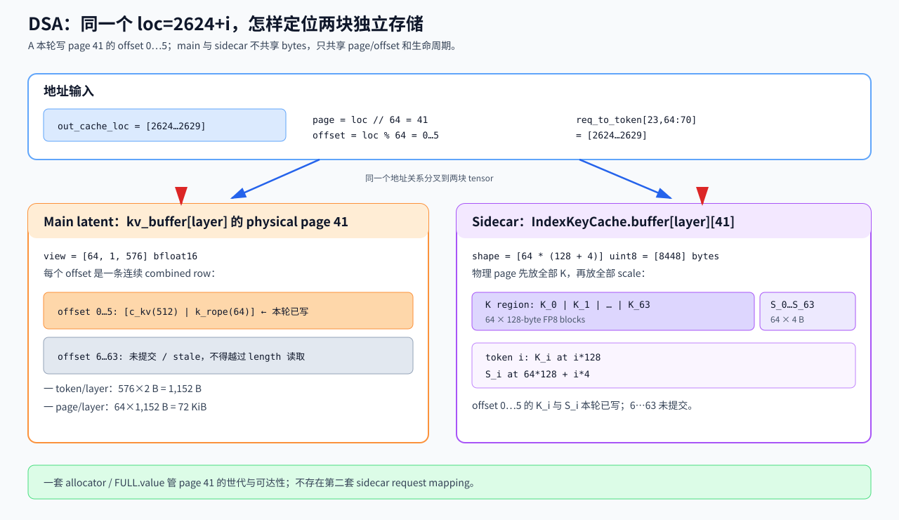
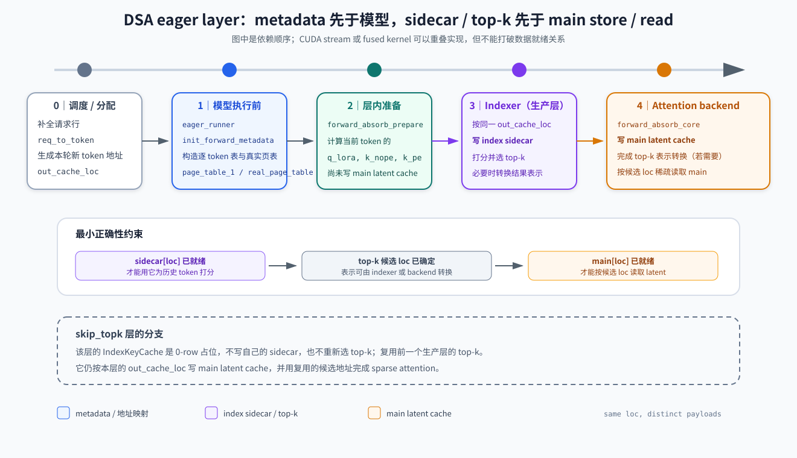

# Day 06｜SGLang MLA / DSA Latent Cache：从同一 loc 的双状态写入到 sparse read

> 源码基线：SGLang checkout 的 `HEAD` 为 `db017e34902b51e1fd1ac7ebbedaf720c75b374d`（2026-09-02）。本文使用仓库相对链接；源码变化后请按类名和函数名重新定位，不要把行号当成 API。
>
> 主线范围：CUDA、decoder-only MLA、单 worker/device、无 DCP/CP/speculative decoding、无 hybrid SWA/Mamba、无 HiCache/HiSparse、无 disaggregation。DSA 主线使用 `DSATokenToKVPool`，因此 `page_size=64`、`index_head_dim=128`；数值例子使用 BF16 main cache。FP8、HIP、TRTLLM 和 fused CUDA graph 只在边界处说明。
>
> Prefix cache 使用当前默认的 `UnifiedRadixCache + UnifiedTreeCore + ComponentType.FULL`。旧 `RadixCache` 只适合帮助理解接口，不作为本文默认调用链。

> 源码定位约定：源码链接使用 `文件.py#起始行-结束行`，点击即可跳到当前实现；正文同时保留 `Lx–Ly` 方便扫读。这些行号只对上述 commit 有效；切换版本后先按类名/函数名搜索，再用行号确认局部逻辑。

[Day05](../sglang_full_attention_kv_cache/day05_sglang_full_attention_kv_cache.md) 已经走完 SGLang Full Attention 的地址生命周期：

~~~text
prefix_indices + out_cache_loc
→ ReqToTokenPool 的完整 request row
→ ForwardBatch
→ attention backend 写入/读取
→ finish、release、eviction
~~~

Day06 不重新讲 row/slot 是怎样分配的，只追一个新问题：

> **同一个 physical `loc`，在 MLA 中保存什么；进入 DSA 后，为什么它又能同时定位 main latent 和 indexer sidecar？**

最少只需要四个主角：

| 对象 | 真实结构 | 保存什么 | 生命周期 |
|---|---|---|---|
| `ReqToTokenPool.req_to_token` | GPU `int32` tensor，`[num_req_rows+1, max_context_len]` | `request row, logical position → flat loc` | request 运行期间 |
| `MLATokenToKVPool.kv_buffer` | 每个 local layer 一个 GPU tensor | `loc → [c_kv \| k_rope]` | server/model runner 常驻 |
| `IndexKeyCache.buffer` | producer layer 各一个 page-major `uint8` tensor | 同一 `loc` 的量化 index K 与 scale | 与 main latent 共用 loc 生命周期 |
| `DSAMetadata` / `topk_indices` | 每轮创建或复用的 GPU metadata | request row 的 kernel view、当前 query 的候选地址 | 一次 forward |

完整调用顺序先看一行：

~~~text
Scheduler.__init__
├─ init_model_worker()
│  └─ init_memory_pools()
│     └─ init_target_memory_pool()
│        └─ tp_worker.alloc_memory_pool()
│           └─ model_runner.alloc_memory_pool()
│              └─ KVCacheConfigurator.configure()
│                 └─ _init_pools()
│                    ├─ request-to-token pool
│                    ├─ MLA/DSA token-to-KV pool
│                    └─ paged token allocator
└─ build_kv_cache()
   └─ create_tree_cache() → UnifiedRadixCache

请求阶段（建池完成之后）：
match_prefix() → PrefillAdder 加锁 → alloc_for_extend/decode
→ 写完整 request row → attention backend 构造 metadata
→ forward_mla / Indexer 写 main latent 与 sidecar
→ top-k 选择候选 loc → DSA backend 读取候选 latent
→ release_kv_cache()；短缺时 evict_for_alloc()
~~~

这张图中的第一部分是初始化的真实入口，第二部分才是请求到来后的数据流。本文关闭 speculative decoding，因此只展开 `tp_worker`；如果代码中出现 `draft_worker`，先把它视为被 `if self.draft_worker is not None` 包住的另一条可选分支。`configure()` 下面的 pool 名称是函数内部创建并返回的对象，不是 `configure()` 返回后还会再调用的函数。

## 1. 从 Day05 到 Day06：地址层不变，physical payload 改变

Day05 的三个地址量仍原样成立：

$$
\texttt{req\_to\_token}[r,p]=\text{loc},
\qquad
\texttt{out\_cache\_loc}=\{\text{本轮新写 loc}\},
\qquad
\texttt{FULL.value}=\text{cached loc 向量的副本}.
$$

变化只发生在 pool 如何解释 `loc`：

- MHA：`loc` 分别索引本层 K buffer 和 V buffer；
- MLA：`loc` 索引本层的一条 combined latent row；
- DSA：同一个 `loc` 还可拆成 `page_id + offset`，定位本层 `IndexKeyCache` 中的 K 块和 scale。

这张图的边界很重要：request 和 radix tree 管理的是 loc 的可达性、保护和复用；pool/model runner 才拥有 CUDA tensors。DSA 没有为 sidecar 再建一张 request table，也没有再建一套 allocator。

## 2. 启动：先算一格多少钱，再选择具体 pool

### 2.1 pool 与 allocator 的真实选择

从 scheduler 进入 pool 的路径不要直接从 `ModelRunner` 开始猜。当前文件中的逐跳入口是：[`Scheduler.__init__` 调用 `init_model_worker()` 和 `build_kv_cache()` · L553–L559](../../python/sglang/srt/managers/scheduler.py#553-559) → [`init_memory_pools()` · L1020–L1038](../../python/sglang/srt/managers/scheduler.py#1020-1038) → [`init_target_memory_pool()` · L1006–L1018](../../python/sglang/srt/managers/scheduler.py#1006-1018) → [`TpModelWorker.alloc_memory_pool()` · L407–L433](../../python/sglang/srt/managers/tp_worker.py#407-433) → [`ModelRunner.alloc_memory_pool()` · L881–L903](../../python/sglang/srt/model_executor/model_runner.py#881-903) → [`KVCacheConfigurator.configure()` · L296–L329](../../python/sglang/srt/mem_cache/kv_cache_configurator.py#296-329)。

在 `configure()` 内部，继续进入 [`_init_pools()` · L397–L510](../../python/sglang/srt/mem_cache/kv_cache_configurator.py#397-510)；DSA 分支再进入 [`_build_dsa_kv_pool()` · L1489–L1516](../../python/sglang/srt/mem_cache/kv_cache_configurator.py#1489-1516)，allocator 则由 [`_build_token_to_kv_pool_allocator()` · L1832–L1959](../../python/sglang/srt/mem_cache/kv_cache_configurator.py#1832-1959) 选择。`ModelRunner.alloc_memory_pool()` 返回后，才经 [`_init_post_memory_pool_components()` · L904–L934](../../python/sglang/srt/model_executor/model_runner.py#904-934) 做 [`init_kv_index_translator()` · L869–L879](../../python/sglang/srt/model_executor/model_runner.py#869-879) 的后置接线。

因此，本文范围内的启动选择可压缩为：

~~~text
use_mla_backend = True
├─ is_deepseek_dsa(hf_config) = False
│  └─ MLATokenToKVPool
└─ is_deepseek_dsa(hf_config) = True
   └─ DSATokenToKVPool
      ├─ inherited main kv_buffer
      └─ IndexKeyCache sidecar
~~~

`DSATokenToKVPool.__init__` 在普通 CUDA 路径断言：

~~~text
page_size     = 64
index_head_dim = 128
~~~

因此 allocator 走 [`PagedTokenToKVPoolAllocator` · L105–L271](../../python/sglang/srt/mem_cache/allocator/paged.py#105-271)，按 page ID 管理容量，但 `alloc_extend()/alloc_decode()` 仍把本轮 token 对应的 flat loc 返回给上层。

pool 建好后，[`registry.default_radix_cache_factory()` · L80–L143](../../python/sglang/srt/mem_cache/registry.py#80-143) 为普通 Full Attention 构造 `UnifiedRadixCache`，tree component 是 `FULL`。DSA sidecar 没有单独的 tree component：`FULL.value` 保存的一份 loc 向量已经能同时定位 main 与 sidecar。

### 2.2 MLA main pool 的真实 shape

[`MLATokenToKVPool` · L3970–L4239](../../python/sglang/srt/mem_cache/memory_pool.py#3970-4239) 为每个 local attention layer 创建：

~~~text
kv_buffer[layer_local]
shape = [capacity + page_size, 1, kv_cache_dim]
dtype = store_dtype
~~~

在本文 BF16 主线中：

$$
\texttt{kv\_cache\_dim}=r+s,
$$

其中 $r=\texttt{kv\_lora\_rank}$，$s=\texttt{qk\_rope\_head\_dim}$。一条物理 row 的解释是：

~~~text
kv_buffer[layer][loc, 0, :r]   = c_kv / k_nope
kv_buffer[layer][loc, 0, r:r+s] = k_rope
~~~

这里的第二维 `1` 是 storage interface 的 head 维，不代表模型只有一个 query head。`get_key_buffer()` 返回整条 combined row；`get_value_buffer()` 返回前 $r$ 维 view，因为 MLA 的 value-side latent 与 `c_kv` 共用这份物理数据。对应 getter 在 [`MLATokenToKVPool.get_key/value_buffer()` · L4061–L4079](../../python/sglang/srt/mem_cache/memory_pool.py#4061-4079)，combined getter 在 [`get_kv_buffer()` · L4080–L4108](../../python/sglang/srt/mem_cache/memory_pool.py#4080-4108)。

物理 tensor 使用 `store_dtype`，不能一概写成“配置 dtype”。例如 FP8 配置在 [`KVCache` · L1671–L1808](../../python/sglang/srt/mem_cache/memory_pool.py#1671-1808) 基类中会把 backing dtype 设成 `torch.uint8`，getter/kernel 再按逻辑 FP8 layout 解释字节。本文后续的 shape 和字节数默认 BF16。

### 2.3 DSA sidecar：132 B/token，但不是连续的 132-byte token row

[`IndexKeyCache` · L14–L160](../../python/sglang/srt/mem_cache/index_key_cache.py#14-160) 对每个 producer layer 创建：

~~~text
buffer[layer_local]
shape = [num_pages, page_size * (index_head_dim + 4)]
dtype = uint8

num_pages = (index_buf_size + page_size + 1) // page_size
~~~

在 `page_size=64`、`index_head_dim=128` 时，第二维是 `64×132=8448` bytes。逻辑上每个 token 的成本确实是：

$$
128\ \text{B FP8 key}+4\ \text{B FP32 scale}=132\ \text{B}.
$$

但普通 CUDA page 内的真实排列是两段，不是 64 条连续的 `[K|scale]`：

~~~text
page bytes:
[ K_0(128 B) | K_1(128 B) | ... | K_63(128 B)
| S_0(4 B)   | S_1(4 B)   | ... | S_63(4 B) ]

K_i 起点 = i * 128
S_i 起点 = page_size * 128 + i * 4
~~~

对应写入公式见 [`SetKAndS` · L259–L276](../../python/sglang/kernels/ops/attention/dsa/index_buf_accessor.py#259-276) 及其 Triton kernel（[L277–L409](../../python/sglang/kernels/ops/attention/dsa/index_buf_accessor.py#277-409)）；fused CUDA store 也使用相同的 K 区/scale 区分段布局。

如果某层 `skip_topk`、只复用前层候选，该层的 sidecar 是 shape `[0, page_size*132]` 的 placeholder。它保持 layer list 对齐，但不会写 index K。

图中两块 tensor 不共享字节。共享的是 `loc` 的解释、allocator page ID、cache identity 和可复用时刻。

### 2.4 容量公式与一组数字

[`DefaultPoolConfigurator._compute_cell_size()` · L248–L362](../../python/sglang/srt/model_executor/pool_configurator.py#248-362) 先算每个可服务 token 的总成本；DSA sidecar 的额外 cell cost 由 [`_compute_dsa_indexer_cell_size()` · L364–L426](../../python/sglang/srt/model_executor/pool_configurator.py#364-426) 计算。BF16 普通 MLA 为：

$$
B_{\text{main/token}}
=L_{\text{main}}\,(r+s)\,2.
$$

DSA 再加 producer layers 的 indexer 成本：

$$
B_{\text{index/token}}
=L_{\text{index}}\left(d_i+\frac{d_i}{128}\times4\right),
$$

其中 $d_i=128$，且 $L_{\text{index}}\le L_{\text{main}}$。`skip_topk` layer 不计入普通 target worker 的 sidecar layer 数。

固定一组教学配置：

~~~text
capacity = 4096
page_size = 64
L_main = L_index = 4
r = 512
s = 64
main dtype = BF16
~~~

| 项目 | 计算 | 结果 |
|---|---:|---:|
| main 一 token/layer | `(512+64)×2` | 1,152 B |
| main 一 page/layer | `64×1,152` | 72 KiB |
| main 一个 layer tensor | `(4096+64)×576×2` | 4,792,320 B |
| 四层 main tensors | `4×4,792,320` | 18.28125 MiB |
| sidecar 一 page/layer | `64×132` | 8,448 B |
| sidecar 一个 active layer | `65×8,448` | 549,120 B |
| 四层 sidecar | `4×549,120` | 2.09473 MiB |
| main + sidecar backing | 两者相加 | 20.37598 MiB |
| capacity sizing cell | `4×1,152 + 4×132` | 5,136 B/token |

`cell_size` 用来由 byte budget 反推 capacity；`capacity+page_size` 和 sidecar 的 65 pages 还包含 dummy/padding page，所以“backing 实际 bytes”和“每个可服务 token 的 cell cost”不是同一个数。

如果 CUDA DSA 使用 scaled FP8 main layout，main row 的 byte width 变为：

$$
r+\frac{r}{128}\times4+2s.
$$

代入 $r=512,s=64$ 得 656 B/token/layer，再加 132 B sidecar 得 788 B/token/active-layer。TRTLLM 和部分 HIP backend 使用不同 layout；不能把 656 B 外推到所有 DSA 部署。

## 3. 连续示例：A、B 合法共享 page 11

后文一直使用同一组地址。假设 `UnifiedRadixCache` 已缓存一个 64-token prefix，它位于 physical page 11：

~~~text
shared prefix locs = [704, 705, ..., 767]  # 11 * 64 ... 11 * 64 + 63
~~~

现在同时加入两个请求：

- A：总长 70，request row `r=23`，命中 64 token，新增 6 token；
- B：总长 66，request row `r=31`，命中相同 64 token，新增 2 token。

`match_prefix()` 为两者返回相同 `prefix_indices=[704..767]` 和相应 NodeId。**match 只返回候选，不加锁**；两条请求被 `PrefillAdder` 接受后，`_req_inc_lock_ref()` 才分别增加这条树路径的 component lock。

假设 allocator 给 A page 41，给 B page 52：

~~~text
A new locs = [2624..2629]  # page 41, offsets 0..5
B new locs = [3328..3329]  # page 52, offsets 0..1
~~~

[`write_cache_indices()` · L54–L103](../../python/sglang/srt/mem_cache/allocation.py#54-103) 写出的完整 mapping 是：

~~~text
req_to_token[23, 0:70] = [704..767, 2624..2629]
req_to_token[31, 0:66] = [704..767, 3328..3329]
~~~

对应的 `ForwardBatch` 核心字段为：

~~~text
req_pool_indices = [23, 31]
seq_lens         = [70, 66]
extend_seq_lens  = [6, 2]
out_cache_loc    = [2624..2629, 3328..3329]
~~~

这里必须守住三个事实：

1. 两个 request rows 共享 `[704..767]` 是合法 prefix reuse，不是非法 alias；
2. `out_cache_loc` 只含本轮 8 个新 token，不含共享 prefix；
3. allocator 按 page 交出 page 41/52，但本轮只把其中 6/2 个 token 暴露给 kernel；其余 offset 尚未提交。

## 4. MLA：一个 layer 怎样写、怎样读 combined latent

### 4.1 为什么只需缓存 `c_kv + k_rope`

标准 MHA/GQA 会为历史 token 保存展开后的 K/V。MLA 把非 RoPE K/V 压到共享 latent $c_t^{KV}\in\mathbb{R}^{r}$，只把不能同样吸收的 RoPE key 分量 $k_t^R\in\mathbb{R}^{s}$ 一起持久化：

$$
\text{persistent row}_t=[c_t^{KV}\mid k_t^R]\in\mathbb{R}^{r+s}.
$$

若非 RoPE K 由 $W_h^{UK}c_t^{KV}$ 展开，则：

$$
(q_h^C)^TW_h^{UK}c_t^{KV}
=\left((W_h^{UK})^Tq_h^C\right)^Tc_t^{KV}.
$$

若 V 由 $W_h^{UV}c_t^{KV}$ 展开，则：

$$
\sum_t\alpha_{h,t}W_h^{UV}c_t^{KV}
=W_h^{UV}\left(\sum_t\alpha_{h,t}c_t^{KV}\right).
$$

因此 K 的 up-projection 可吸收到 query 侧，V 的 up-projection 可推迟到 reduce 之后；persistent cache 不必保存 per-head 展开 K/V。

### 4.2 physical write

[`forward_absorb_prepare()` · L279–L671](../../python/sglang/srt/models/deepseek_common/attention_forward_methods/forward_mla.py#279-671) 把当前 token 的 latent 拆成（实现文件为 `forward_mla.py`）：

~~~text
k_nope : [N_new, 1, r]
k_pe   : [N_new, 1, s]
~~~

其中 A/B batch 的 `N_new=8`。进入 `RadixAttention` 和具体 MLA backend 后，[`MLATokenToKVPool.set_mla_kv_buffer()` · L4188–L4215](../../python/sglang/srt/mem_cache/memory_pool.py#4188-4215) 使用同一个 packed `out_cache_loc` 写本层 buffer：

~~~text
layer ℓ:
  kv_buffer[ℓ][2624..2629] ← A 的 6 条 [k_nope | k_pe]
  kv_buffer[ℓ][3328..3329] ← B 的 2 条 [k_nope | k_pe]
~~~

所有 local MLA layers 共用 loc 编号，但每层有自己的 `kv_buffer[layer_local]`，所以“同一个 loc”不代表不同层共享数值。

### 4.3 kernel read

以 [`FlashMLABackend` · L58–L581](../../python/sglang/srt/layers/attention/flashmla_backend.py#58-581) 为例，decode metadata 从 request rows 构造 block table，再把：

~~~text
query
k_cache.view(-1, PAGE_SIZE, 1, kv_cache_dim)
block/page table
cache_seqlens
head_dim_v = kv_lora_rank
~~~

交给 kernel。table 选 page，length 限制有效 token，buffer pointer/layout 决定每个 loc 的 payload。prefix lookup 不会在 attention layer 内重新发生。

## 5. DSA：同一 layer 多了一条 indexer → sparse read 支路

### 5.1 `DSAMetadata` 在进入模型层之前建立

在 eager path 中，[`EagerRunner._execute_decode/extend()` · L243–L378](../../python/sglang/srt/model_executor/runner/eager_runner.py#243-378) 先调用 attention backend 的 `init_forward_metadata(forward_batch)`，随后才进入模型 `forward()`。

[`DeepseekSparseAttnBackend.init_forward_metadata()` · L777–L1076](../../python/sglang/srt/layers/attention/dsa_backend.py#777-1076) 在本文范围内先 gather：

~~~text
page_table_1 =
  req_to_token[req_pool_indices, :max_seq_len_k]
~~~

它是逐 token flat loc table，典型 shape 为 `[B,max_seq_len_k]`。随后构造 compact page view：

$$
\texttt{real\_page\_table}[:,j]
=\frac{\texttt{page\_table\_1}[:,jP]}{P}.
$$

对 A/B：

~~~text
page_table_1 valid rows:
  A = [704..767, 2624..2629]
  B = [704..767, 3328..3329]

real_page_table valid pages:
  A = [11, 41]
  B = [11, 52]
~~~

短请求行右侧内容不保证是 `-1` 或 0；`cache_seqlens` 才是有效边界。fused decode CUDA graph 甚至可以不物化宽 `page_table_1`，只保留 `real_page_table`；本文的“两张表同时存在”仅指普通 eager 主线。

### 5.2 producer layer 的真实顺序

普通 eager、非并流分支可按下面读；准备与投影在 [`forward_absorb_prepare()` · L279–L671](../../python/sglang/srt/models/deepseek_common/attention_forward_methods/forward_mla.py#279-671)，attention 主体在 [`forward_absorb_core()` · L672–L926](../../python/sglang/srt/models/deepseek_common/attention_forward_methods/forward_mla.py#672-926)：

~~~text
forward_absorb_prepare()
  → 产生 q_lora / k_nope / k_pe
  → producer layer 调 self.indexer(...)
      → 产生并量化 index K
      → _store_index_k_cache(out_cache_loc)
      → 读取历史 sidecar，计算 score
      → top-k selection + optional address transform
  → forward_absorb_core()
      → RadixAttention
      → DeepseekSparseAttnBackend.forward_extend/decode
          → set_mla_kv_buffer(out_cache_loc, k_nope, k_pe)
          → 必要时完成 top-k address transform
          → sparse attention 读取选中的 main latent rows
~~~

部分实现会把 projection、indexer 或 main write 放到不同 CUDA stream，fused path 也会合并 kernel；因此不要把 Python 语句顺序外推成所有 backend 的硬件串行顺序。真正的不变量是：

- producer layer 暴露 top-k 前，本轮 index K 已经写入 sidecar；
- sparse attention 读取某个 main loc 前，本层对应 latent row 已 ready；
- main 与 sidecar 使用同一 `out_cache_loc`，但分别写入两块 tensor。

`skip_topk` layer 不执行自己的 indexer，也没有可写 sidecar；它复用前一 producer layer 在本轮产生的 `topk_indices`，但仍写自己的 main latent。

### 5.3 top-k 是 per-forward state，不是 prefix cache

必须分开三种东西：

| 状态 | persistent | 复用粒度 | 由谁保存 |
|---|---:|---|---|
| main latent `[c_kv\|k_rope]` | 是 | prefix loc | `DSATokenToKVPool.kv_buffer` |
| index K + scale | 是 | 同一个 prefix loc | `IndexKeyCache.buffer` |
| score / top-k candidate | 否 | 当前 query，至多本轮跨层 | `topk_indices` / backend metadata |

[`BaseIndexerMetadata.topk_transform()` · L74–L92](../../python/sglang/srt/layers/attention/dsa/dsa_indexer_metadata.py#74-92) 明确允许“选择并可能转换”。fused path 可以在 indexer 中直接返回 physical flat loc；unfused path 可能先返回 score column，再由 DSA attention backend 通过 `page_table_1` 转换。因此正确契约是：

> 不要假设 `topk_indices` 永远是 raw column，也不要假设转换永远发生在 indexer；到 sparse-attention 调用边界时，它才必须是该 kernel 可消费的候选地址表示。

例如 A 某个 query 在逻辑历史位置上选中 `[0,25,51,68]`，PAGED transform 得到：

~~~text
[704, 729, 755, 2628]
~~~

前三个位置落在共享 page 11，位置 68 落在 A 的 page 41 offset 4。B 即使共享相同 prefix，也会因当前 query 不同而重新计算 score/top-k。

## 6. Prefix cache 与释放：一份 loc 向量管理两份 persistent state

### 6.1 match、lock 和 reuse 是三个相邻动作

当前默认链路是：

~~~text
registry.default_radix_cache_factory()
→ UnifiedRadixCache
→ UnifiedTreeCore
→ FULL component
~~~

`UnifiedRadixCache.match_prefix()` 返回 `MatchResult.device_indices` 和 NodeIds。随后 scheduler 把 `device_indices` 写进 `req.prefix_indices`；请求被 `PrefillAdder` 接受后才调用 `_req_inc_lock_ref()`。

`FULL.value` 只保存一维 `torch.int64` loc tensor 的 clone，不保存 latent，也不保存 index K。之所以不需要第二份 sidecar loc vector，是因为 `DSATokenToKVPool` 对同一 loc 同时定义了：

$$
\text{loc}
\longrightarrow
\begin{cases}
\text{main latent row},\\
(\text{index page},\text{offset})\text{ 中的 K/scale}.
\end{cases}
$$

### 6.2 finish 不只是“转移 ownership”

[`release_kv_cache()` · L254–L296](../../python/sglang/srt/mem_cache/common.py#254-296) 调用 [`UnifiedRadixCache.cache_finished_req()` · L838–L924](../../python/sglang/srt/mem_cache/unified_radix_cache.py#838-924)：

1. 从 request row 读取已提交 loc；
2. 对 key 和 loc 做 page alignment；
3. 把 loc tensor clone 到 `FULL.value`；
4. 释放 duplicate、未对齐 tail 或未插入区间；
5. 降低活动路径的 lock；
6. 最后归还 request row。

因此完成后既可能发生“树接管整页”，也可能立即把 private partial page 交回 allocator。对于当前 A/B 的 70/66-token prompt，如果没有继续 decode 到页边界，page 41/52 的未对齐 suffix 不会被当作完整 prefix page 永久缓存。

### 6.3 cached、request release 与 eviction 不能合并

| loc 状态 | request row 可指向 | `FULL.value` 持有 | FULL lock | allocator 可再次发放 |
|---|---:|---:|---:|---:|
| private-live | 是 | suffix 尚未进入树 | 命中 prefix 可能被锁 | 否 |
| cached-protected | 是 | 是 | `>0` | 否 |
| cached-evictable | 可无 request row | 是 | `0` | 否 |
| allocator-free | 否 | 否 | 不适用 | 是 |

如果 A、B 同时引用 page 11，二者会分别持有树路径锁；A 结束只减少自己的引用，B 仍运行时该节点不能 eviction。

allocator 短缺时，[`evict_from_tree_cache()` · L168–L194](../../python/sglang/srt/mem_cache/common.py#168-194) 把 shortfall 交给 [`UnifiedRadixCache.evict_for_alloc()` · L566–L639](../../python/sglang/srt/mem_cache/unified_radix_cache.py#566-639)。`FullComponent` 只选择可淘汰的 device node，把其 loc tensor 交回 allocator；main/sidecar CUDA backing 不销毁，旧字节只是 stale。

调度器 retract/preempt 运行请求走 `release_kv_cache(..., is_insert=False)`，可能 backup/requeue；它不是 cache eviction，也不新增 prefix entry。

## 7. 按执行顺序读源码

| 顺序 | 文件 | 先找什么 | 读完应得到什么 |
|---:|---|---|---|
| 1 | `scheduler.py` | [`Scheduler.__init__` 中的调用 · L553–L559](../../python/sglang/srt/managers/scheduler.py#553-559)、[`init_memory_pools()` · L1020–L1038](../../python/sglang/srt/managers/scheduler.py#1020-1038)、[`init_target_memory_pool()` · L1006–L1018](../../python/sglang/srt/managers/scheduler.py#1006-1018) | 找到 target pool 初始化的真正入口，不把 `init_memory_pools()` 误认为直接调用 worker |
| 2 | `tp_worker.py` | [`alloc_memory_pool()` · L407–L433](../../python/sglang/srt/managers/tp_worker.py#407-433) | 明白 worker 只是把 pool 初始化转交给 `model_runner` |
| 3 | `model_runner.py` | [`alloc_memory_pool()` · L881–L903](../../python/sglang/srt/model_executor/model_runner.py#881-903) | pool 初始化发生在 backend/请求之前 |
| 4 | `pool_configurator.py` | [`_compute_cell_size()` · L248–L362](../../python/sglang/srt/model_executor/pool_configurator.py#248-362)、[`_compute_dsa_indexer_cell_size()` · L364–L426](../../python/sglang/srt/model_executor/pool_configurator.py#364-426) | main 与 sidecar 怎样共同决定 capacity |
| 5 | `kv_cache_configurator.py` | [`_build_token_to_kv_pool()` · L1125–L1245](../../python/sglang/srt/mem_cache/kv_cache_configurator.py#1125-1245)、[`_build_dsa_kv_pool()` · L1489–L1541](../../python/sglang/srt/mem_cache/kv_cache_configurator.py#1489-1541)、[`_build_token_to_kv_pool_allocator()` · L1832–L1945](../../python/sglang/srt/mem_cache/kv_cache_configurator.py#1832-1945) | MLA/DSA/paged allocator 的分流 |
| 6 | `memory_pool.py` | [`MLATokenToKVPool` · L3970–L4239](../../python/sglang/srt/mem_cache/memory_pool.py#3970-4239)、[`DSATokenToKVPool` · L4421–L4569](../../python/sglang/srt/mem_cache/memory_pool.py#4421-4569) | main row shape、setter、同址 facade |
| 7 | `index_key_cache.py` / `index_buf_accessor.py` | [`_buffer_shape()`、`store_quantized()` · L14–L160](../../python/sglang/srt/mem_cache/index_key_cache.py#14-160)、[`SetKAndS` · L259–L276](../../python/sglang/kernels/ops/attention/dsa/index_buf_accessor.py#259-276) | sidecar 的真实 page-major bytes |
| 8 | `allocation.py` / `forward_batch_info.py` | [`write_cache_indices()` · L54–L103](../../python/sglang/srt/mem_cache/allocation.py#54-103)、[`ForwardBatch` · L394–L411](../../python/sglang/srt/model_executor/forward_batch_info.py#394-411)、[`init_new()` · L723–L800](../../python/sglang/srt/model_executor/forward_batch_info.py#723-800) | 完整 read row 与本轮 write loc |
| 9 | `eager_runner.py` / `dsa_backend.py` | [`_execute_decode/extend()` · L243–L378](../../python/sglang/srt/model_executor/runner/eager_runner.py#243-378)、[`init_forward_metadata()` · L777–L1076](../../python/sglang/srt/layers/attention/dsa_backend.py#777-1076)、[`_transform_table_1_to_real()` · L748–L756](../../python/sglang/srt/layers/attention/dsa_backend.py#748-756) | 两张 page table 在何时产生 |
| 10 | `forward_mla.py` / `dsa_indexer.py` | [`forward_absorb_prepare/core` · L279–L926](../../python/sglang/srt/models/deepseek_common/attention_forward_methods/forward_mla.py#279-926)、[`_store_index_k_cache()` · L1471–L1552](../../python/sglang/srt/layers/attention/dsa/dsa_indexer.py#1471-1552) | sidecar → top-k → main store/read 顺序 |
| 11 | `registry.py` / `unified_radix_cache.py` / `full_component.py` | [`default_radix_cache_factory()` · L80–L143](../../python/sglang/srt/mem_cache/registry.py#80-143)、[`cache_finished_req()` · L838–L924](../../python/sglang/srt/mem_cache/unified_radix_cache.py#838-924)、[`evict_for_alloc()` · L566–L639](../../python/sglang/srt/mem_cache/unified_radix_cache.py#566-639)、[FullComponent lock/evict · L160–L344](../../python/sglang/srt/mem_cache/unified_cache/components/full_component.py#160-344) | loc clone、锁、finish 和 eviction |

旧版 [`RadixCache` · L303–L863](../../python/sglang/srt/mem_cache/radix_cache.py#303-863) 的实现较短，可辅助理解 [`RadixKey.page_aligned` · L150–L154](../../python/sglang/srt/mem_cache/radix_cache.py#150-154) 和经典接口；但当前默认对象、NodeId、component lock 与 eviction 行为必须以上表第 9 行为准。

## 8. 手撕：从两条 flat-loc row 构造 DSA 两种 table

这道题只验证地址转换，不假装验证 runtime ownership。仅凭两条 rows 无法判断一个跨请求 alias 是否来自合法 prefix、错误复用还是不同 cache namespace；那需要 tree key、lock 和 allocator 状态。

~~~python
from dataclasses import dataclass

PAD = -1  # 仅是本练习的可视 sentinel；不是 runtime tail invariant

@dataclass
class DSAViews:
    page_table_1: list[list[int]]
    real_page_table: list[list[int]]
    cache_seqlens: list[int]

def build_dsa_views(
    rows: list[list[int]],
    seq_lens: list[int],
    page_size: int,
) -> DSAViews:
    ...
~~~

约束：

1. `len(rows)==len(seq_lens)`，且 `0<=seq_lens[i]<=len(rows[i])`；
2. 只检查 `rows[i][:seq_lens[i]]`；
3. 每个逻辑 page 的第一个 loc 必须 page-aligned，页内 loc 必须严格连续；最后一页可以不满；
4. **允许不同 requests 共享相同的完整 prefix pages**；
5. `page_table_1` 用有效 flat loc 填充，练习中右侧以 `PAD` 补到 batch 最大 token 长度；
6. `real_page_table` 每个逻辑 page 只保留 `first_loc//page_size`，右侧补到 batch 最大 page 数；
7. 时间复杂度为 $O(\sum_i\texttt{seq\_lens}[i])$。

沿用 A/B：

~~~python
rows = [
    list(range(704, 768)) + list(range(2624, 2630)),
    list(range(704, 768)) + list(range(3328, 3330)),
]
seq_lens = [70, 66]
page_size = 64

# 期望
cache_seqlens == [70, 66]
real_page_table == [[11, 41], [11, 52]]
page_table_1[0][:70] == rows[0]
page_table_1[1][:66] == rows[1]
page_table_1[1][66:70] == [PAD, PAD, PAD, PAD]
~~~

验收点：

- 两条 rows 共享 `[704..767]` 必须通过；
- 把 B 的第二页首 loc 改成 3330 必须拒绝，因为 `3330 % 64 != 0`；
- 删除 A 的 loc 2627 必须拒绝，因为页内出现 hole；
- 把 `seq_lens[1]` 改成大于 row 长度必须拒绝；
- 构造过程不得修改输入 rows。

runtime 的 `page_table_1` 无效尾部可能是 0 或 stale 值，依赖 `cache_seqlens` 屏蔽；本题使用 `-1` 只是让纯 Python 输出可检查。

## 9. 二次开发时切哪条边界

| 目标 | 首要修改点 | 必须联动检查 |
|---|---|---|
| 修改 latent row layout/dtype | `MLATokenToKVPool`/`DSATokenToKVPool` create/get/set + backend buffer view | `cell_size`、`store_dtype`、padding page、所有 reader |
| 新增 per-token sidecar | 主 pool owner 内新增同址 buffer | sizing、write/read/move、finish/evict/offload |
| 修改 page size | allocator + pool physical view + backend table transform | 对齐、tail、dummy page、kernel 支持矩阵 |
| 修改 top-k 表示 | `BaseIndexerMetadata.topk_transform` 与 sparse backend contract | raw column、flat loc、PAGED/RAGGED 分支 |
| 修改 prefix 隔离 | `RadixKey` 的 `extra_key/cache_salt` 生成处 | 模型、adapter、layout 不得跨 namespace 误命中 |

一个新 sidecar 能安全进入主线，至少要同时满足：

~~~text
capacity accounting
+ same-loc write/read
+ move/offload 一致
+ finish/evict/reuse 同寿命
+ metadata 用 lengths 隐藏 stale tail
~~~

## 10. 最后守住十个 invariant

1. `request row != flat loc != page ID`。
2. `out_cache_loc` 是本轮 write set；`req_to_token` 是完整 read address space。
3. MLA 的多个 local layers 共用 loc 编号，但不共享各层 latent 数值。
4. DSA main 与 sidecar 共享 loc，不共享 bytes。
5. sidecar 成本是 132 B/token，但普通 CUDA page 内是“K 区 + scale 区”，不是 token-wise `[K|scale]`。
6. metadata 在模型 layer forward 前建立；它不复制 latent/index K。
7. producer layer 写 sidecar 并计算 top-k；`skip_topk` layer 只复用本轮候选。
8. top-k 是 per-forward state，不能写入 radix prefix cache。
9. `match_prefix` 不等于加锁；cached-evictable 也不等于 allocator-free。
10. 多个请求共享 cached prefix loc 是合法行为；rows 本身不足以证明 ownership 是否正确。

如果能沿 A/B 的 `page 11 + page 41/52` 示例，逐项指出“谁产生 loc、谁写 main、谁写 sidecar、谁构造两张 table、谁选择 top-k、谁最终释放 page”，就已经完成了 SGLang MLA/DSA latent cache 的第一遍源码闭环。

## 11. 不在本文主线的分支

- scaled FP8/FP4 main cache：`kv_cache_dim` 和 `store_dtype` 会变；
- HIP/AITER、TRTLLM、TileLang：page size 与 indexer/main layout 可能不同；
- CUDA graph/speculation：宽 `page_table_1` 可省略或使用静态 buffer；
- DCP/CP/layer split：loc space、layer ownership 和 metadata 会增加翻译；
- HiSparse/HiCache/disaggregation：sidecar 需要 host/device move 与额外 ownership；
- hybrid SWA/Mamba、DeepSeek-V4 compressed states：不再只有 `FULL` 这一种状态。

这些分支仍应守住本文的核心边界：allocation 产出 loc，pool 解释 payload，backend 构造 kernel view，prefix cache/allocator 管理 loc 生命周期。
