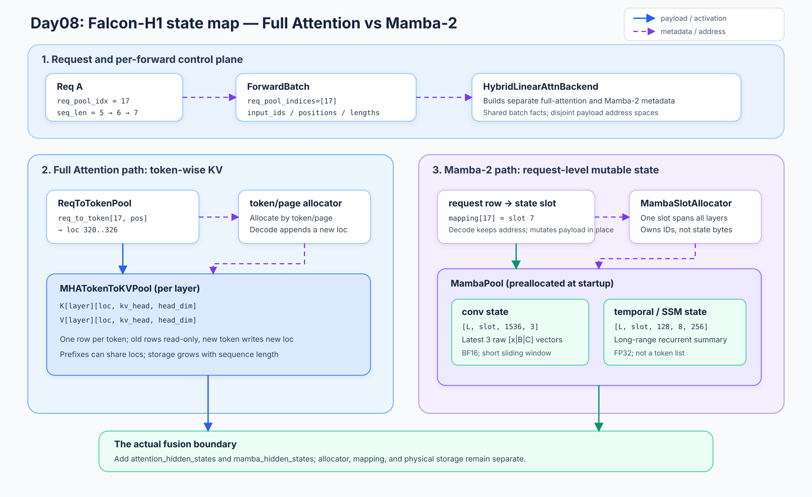
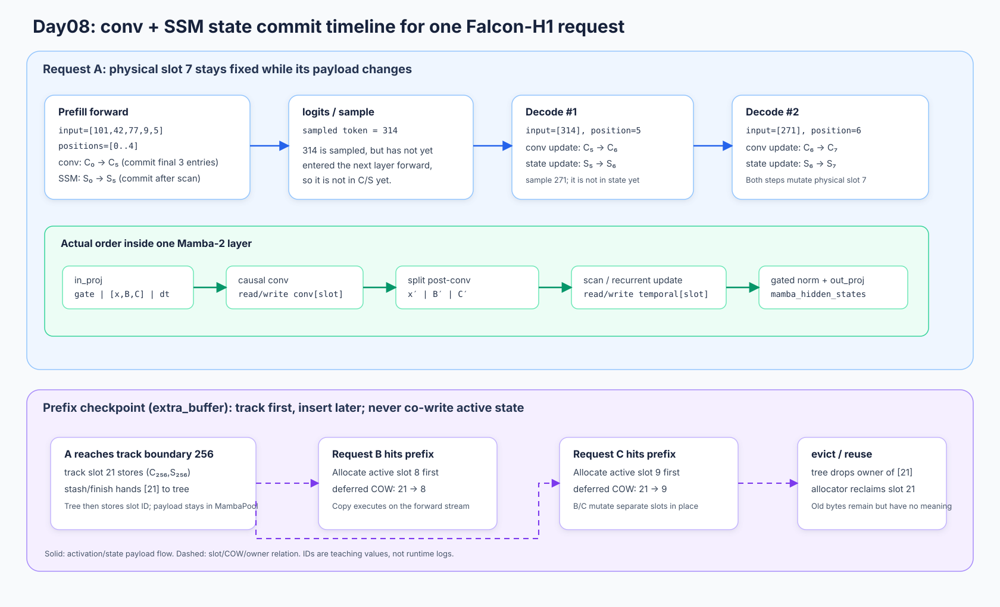

# Day08｜SGLang Mamba-2：沿 `conv_state → temporal` 状态机 debug

> **这篇的读法**：按状态转移从上到下读，遇到断点就去源码验证字段和 tensor；不要把它当成 Mamba 原理百科。本文只跟一条普通 Falcon-H1 请求，先走 prefill，再走 decode，最后看 prefix checkpoint 的 owner 转移。
>
> **源码基线**：当前 SGLang checkout `a70610005d3d3675ce5d5fdbe37a13b9df4c888e`。链接使用仓库相对路径，`#起止行` 是打开文件后的快速定位；切换版本后先按函数名重新搜索。正文行号直接写进标题，方便从文档跳到 debugger。
>
> **固定观测条件**：Falcon-H1、TP=1、UnifiedRadixCache、CUDA eager、无 speculative decoding、无 HiCache、`page_size=1`、开启 overlap schedule（[`HybridReqToTokenPool` 在 L1227](../../python/sglang/srt/mem_cache/memory_pool.py#1227-1227)；否则 `extra_buffer` 的 tracking buffer 可能只有一个 slot）。第一次实验可以显式设 `--attention-backend triton --mamba-radix-cache-strategy=extra_buffer`；`auto` 是否解析成 `extra_buffer` 还取决于 overlap、分页和 backend，请以 resolved args 为准。本文会在旁边说明 `no_buffer` 分支；切换到 `no_buffer` 必须另起一轮并关闭 overlap（[`validate_mamba_no_buffer · L143–L147`](../../python/sglang/srt/arg_groups/mamba_hook.py#143-147)），不把某个策略说成所有模型的必经路径。

## 0. 先看最短因果链：这不是一张“KV 表”

本课要回答一个可断点验证的问题：**同一个请求的一个 token，怎样先推进短卷积窗口，再推进长程 SSM state；请求分叉时，为什么只能复制 state 句柄而不能共写同一行？**



核心状态机（这些标签是本文的 debug 标签，不是源码里的 enum）：

```text
NEW
  └─ Req.init_next_round_input(tree_cache)
       ├─ prefix miss → MATCHED(miss)
       └─ prefix hit  → MATCHED(hit, 可能已预约 COW dst)
                            ↓ PrefillAdder 预算通过
ADMITTED
  └─ ScheduleBatch.prepare_for_extend()
       └─ MATERIALIZED(row + Full loc + active Mamba slot)
            ↓ 收集 clear/COW；forward stream 执行
READY
  └─ Mamba2Metadata + Mamba2AttnBackend.forward()
       └─ EXTEND(projection → causal conv → SSM scan/update)
            ├─ 普通 prefill 完成 → sample → DECODE
            ├─ extend/chunk track（extra_buffer）→ TRACKED_EXTEND(本地 snapshot)
            ├─ decode track 边界 → TRACKED_DECODE(本地 ping-pong snapshot)
            ├─ cache boundary + `is_insert=True` + 可发布 state → CHECKPOINTED(tree 接管 snapshot)
            └─ finish → FINISHED
DECODE
  └─ 每步追加 Full token loc，Mamba 继续读写自己的 active slot
       ├─ 到 track 边界 → TRACKED_DECODE（还没有 tree.insert）
       ├─ cache boundary + `is_insert=True` + 可发布 state → CHECKPOINTED
       └─ finish → FINISHED
FINISHED
  └─ request row/active slot 释放；tree 仍可能持有 MAMBA checkpoint
       └─ tree eviction → EVICTED（归还 slot ID，不等于销毁大 tensor）
```

`extra_buffer` 尚未到 track boundary 时，cache boundary 可能提前返回，状态仍停在 `EXTEND/DECODE`，只保留 request 自己的 loc；`CHECKPOINTED` 表示 tree 确实接管了一个可恢复 snapshot。

| 状态转移 | 代码证据 | 断点后必须成立的事实 |
| --- | --- | --- |
| `NEW → MATCHED` | [`Req.init_next_round_input · L1390–L1490`](../../python/sglang/srt/managers/schedule_batch.py#1390-1490)、[`UnifiedRadixCache.match_prefix · L523–L539`](../../python/sglang/srt/mem_cache/unified_radix_cache.py#523-539) | key 由 token id 构成；命中时 MAMBA component 可以先分配 COW destination；还没有跑 kernel |
| `MATCHED → ADMITTED` | [`scheduler.get_next_batch_to_run · L3692–L3716`](../../python/sglang/srt/managers/scheduler.py#3692-3716)、[`reject cleanup · L3730–L3744`](../../python/sglang/srt/managers/scheduler.py#3730-3744) | `PrefillAdder` 接受请求并锁住它要继续使用的 prefix；拒绝时回滚新 COW slot/标志，不能泄漏 |
| `ADMITTED → MATERIALIZED` | [`ScheduleBatch.prepare_for_extend · L2504–L2552`](../../python/sglang/srt/managers/schedule_batch.py#2504-2552)、[`alloc_for_extend · L282–L389`](../../python/sglang/srt/mem_cache/allocation.py#282-389) | request row、Full token loc 和 Mamba row→slot mapping 都已建立 |
| `MATERIALIZED → READY` | [`_collect_deferred_mamba_cow_and_clear · L2859–L2879`](../../python/sglang/srt/managers/schedule_batch.py#2859-2879)、[`_maybe_execute_deferred_mamba_cow_and_clear · L1678–L1724`](../../python/sglang/srt/model_executor/model_runner.py#1678-1724) | fresh slot 先 clear，prefix hit 先 COW；操作在 forward stream、第一次 layer read 之前完成 |
| `READY → EXTEND` | [`Mamba2AttnBackend.init_forward_metadata/forward · L917–L982`](../../python/sglang/srt/layers/attention/hybrid_linear_attn_backend.py#917-982)、[`MambaMixer2.forward · L440–L764`](../../python/sglang/srt/layers/attention/mamba/mamba.py#440-764) | 同一 `mamba_cache_indices` 被所有 Mamba 层复用；conv 与 temporal 的内容改变，slot 地址不因 token 增长而改变 |
| `EXTEND → TRACKED_EXTEND`（仅 `extra_buffer`，可选） | [`_mamba_radix_cache_v2_req_prepare_for_extend · L2763–L2857`](../../python/sglang/srt/managers/schedule_batch.py#2763-2857)、[`MambaMixer2.forward · L552–L572`](../../python/sglang/srt/layers/attention/mamba/mamba.py#552-572)、[`_track_mamba_state_extend · L844–L865`](../../python/sglang/srt/layers/attention/hybrid_linear_attn_backend.py#844-865) | extend/chunk 预先算 tracking destination，深度按 `mamba_checkpoint_grid`；conv 从 flattened 输入取边界窗口，SSM 从 final/intermediate state 写入 tracking slot；`no_buffer` 没有这条 tracking slot 路径，这一步还没有 `tree.insert` |
| `DECODE → TRACKED_DECODE`（可选） | [`Mamba2AttnBackend.forward · L960–L970`](../../python/sglang/srt/layers/attention/hybrid_linear_attn_backend.py#960-970)、[`_mamba_prefix_cache_update · L1213–L1262`](../../python/sglang/srt/managers/scheduler_components/batch_result_processor.py#1213-1262) | decode track boundary 时把 conv/temporal 快照写到 tracking slot，并轮换 `last/next_track_idx`；这一步还没有 `tree.insert` |
| `TRACKED_*/EXTEND → CHECKPOINTED`（可选） | [`stash_chunked_request · L3252–L3254`](../../python/sglang/srt/managers/scheduler.py#3252-3254)、[`调用点 · L3362–L3379`](../../python/sglang/srt/managers/scheduler.py#3362-3379)、[`batch result cache · L315–L347`](../../python/sglang/srt/managers/scheduler_components/batch_result_processor.py#315-347)、[`cache_unfinished_req · L925–L1048`](../../python/sglang/srt/mem_cache/unified_radix_cache.py#925-1048)、[`cache_finished_req · L838–L924`](../../python/sglang/srt/mem_cache/unified_radix_cache.py#838-924) | 进入 `cache_*` boundary（chunk stash、prefill result processing 或 finish）才把可恢复 state 和 token loc 交给 tree；extend checkpoint 用 `mamba_checkpoint_grid`，decode tracking 用 `mamba_track_grid`；`no_buffer` 在本实验固定的 `page_size=1` 下使用当前 token 长度；请求可以继续持有 active state |
| `EXTEND/DECODE → FINISHED` | [`cache_finished_req · L838–L924`](../../python/sglang/srt/mem_cache/unified_radix_cache.py#838-924)、[`release_kv_cache · L254–L297`](../../python/sglang/srt/mem_cache/common.py#254-297) | request row 会释放；Mamba slot 按 insert result 在 request 与 tree 之间转移或回 allocator，不能一概而论 |

### 0.1 用一组数字贯穿断点

数字只是便于看日志的教学值，不是假装的运行日志：

```text
请求 A：token ids = [101, 42, 77, 9, 5]
request row r = 17
Full Attention 新 token loc = [320, 321, 322, 323, 324]
Mamba active slot m = 7
extra_buffer（overlap schedule）的 tracking slots = [21, 22]
```

因此：`req_to_token[17, 3] = 323` 是 Full KV 的地址，`mapping[17] = 7` 是 Mamba state 的地址；`323` 和 `7` 没有算术关系。prefill 后 sample 出 `314`，并不表示 `314` 已经进入 state；它要等下一轮 decode 以 input token 的身份再次经过 `forward`。

## 1. 先建立五个主角：谁拥有哪份 state

### [`ReqKvInfo · schedule_batch.py#L848–L877`](../../python/sglang/srt/managers/schedule_batch.py#848-877)

| 对象 | 类型 / shape | 语义 | owner 与寿命 |
| --- | --- | --- | --- |
| `req.kv.req_pool_idx` | Python `int` | `req_to_token` 的 request row | request 持有 row 期间有效 |
| `req.kv.mamba_pool_idx` | 一个 `torch.Tensor` slot handle（代码注释按 shape `(1)` 设计） | 当前请求可写的 Mamba slot | 从 admission/COW 到 release |
| `req_to_token_pool.req_index_to_mamba_index_mapping` | GPU `torch.Tensor[req_pool_size]` | row → Mamba slot 的查表 | pool 常驻；batch 只读它的 snapshot |
| `MambaPool.State` | `conv: list[Tensor]`、`temporal: Tensor` | 真正的 persistent payload | server 启动时预分配；slot 复用而非逐请求 `empty` |
| `Mamba2Metadata` | 一次 forward 的 metadata | `mamba_cache_indices`、变长边界、prefill/decode 数量 | 本轮 forward；不拥有 state bytes |

`mamba_pool_idx` 的字段是单个请求级句柄，不是“每层一个编号”。pool 的第一维才区分 Mamba layer，第二维是共享的 slot 轴；同一个请求在所有 Mamba 层使用同一个 slot 数值。

### [`registry.py#L146–L178`](../../python/sglang/srt/mem_cache/registry.py#146-178) + [`component_type.py#L6–L30`](../../python/sglang/srt/mem_cache/unified_cache/component_type.py#6-30)：`FULL` 是组件坐标，不是物理坐标

Unified tree 的 `tree_components` 通常是 `(FULL, MAMBA)`。`FULL=0`、`MAMBA=2` 是 `component_data` 列表的枚举索引；[`UnifiedTreeNode · L108–L145`](../../python/sglang/srt/mem_cache/unified_cache/unified_tree_core.py#108-145) 预先按这个索引创建 namespace：

```text
node.component_data[FULL].value   → FULL namespace 的 value，通常是 token-loc 向量
node.component_data[MAMBA].value  → MAMBA namespace 的 value，通常是 state-slot handle
```

这里的 `FULL` 不是 page 坐标、GPU 行号，也不是 token id。`value` 是“缓存树持有的资源句柄”；真正的 K/V 或 conv/temporal bytes 仍在各自 pool。

### [`schedule_batch.py#L1419–L1461`](../../python/sglang/srt/managers/schedule_batch.py#1419-1461)：prefix key 先是 token id

`Req.init_next_round_input()` 用 `token_ids`（必要时再带上 `extra_key` / `cache_salt` 做隔离）构造 `RadixKey`，再把 match 的结果拆成 `prefix_indices`、`last_node` 和 `cache_protected_len`。树用 radix child/片段匹配 token key（可看 [`RadixKey · L181–L229`](../../python/sglang/srt/mem_cache/radix_cache.py#181-229) 与 [`UnifiedTreeCore.match_prefix · L698–L810`](../../python/sglang/srt/mem_cache/unified_cache/unified_tree_core.py#698-810)），不是拿 slot id 做全表逐项比较。

命中后的顺序很关键：

```text
token ids → radix match → 返回 FULL loc + MAMBA slot handle
                         → MAMBA component 预约 COW destination
                         → forward stream 才复制 payload
```

## 2. 启动时到底分配什么：先算 shape，再看地址

### [`FalconH1Config defaults · configs/falcon_h1.py#L140–L166`](../../python/sglang/srt/configs/falcon_h1.py#140-166) + [`mamba_d_head auto · L211–L234`](../../python/sglang/srt/configs/falcon_h1.py#211-234) + [`mamba2_cache_params · L287–L315`](../../python/sglang/srt/configs/falcon_h1.py#287-315)

Falcon-H1 默认值给出 `mamba_d_ssm=1024`、`mamba_n_heads=128`、`mamba_d_state=256`、`mamba_d_conv=4`、`mamba_chunk_size=256`；`mamba_d_head` 自动得到 $1024/128=8$。这些是模型配置，不是 allocator 在运行时猜出来的。

### [`Mamba2StateShape.create · mamba_utils.py#L188–L237`](../../python/sglang/srt/configs/mamba_utils.py#188-237) + [`mamba2_state_dtype · L47–L107`](../../python/sglang/srt/configs/mamba_utils.py#47-107)

TP=1、普通 layout 时：

$$
\texttt{conv\_dim}=1024+2\times1\times256=1536,
\qquad
\texttt{conv\_state\_shape}=(1536,4-1)=(1536,3).
$$

$$
\texttt{temporal\_state\_shape}=(128,8,256).
$$

默认 dtype 是 conv BF16、temporal FP32，但配置和环境变量可以覆盖它；不要只凭模型名在 debugger 中写死 dtype。

### [`MambaPool.State · memory_pool.py#L371–L414`](../../python/sglang/srt/mem_cache/memory_pool.py#371-414) + [`MambaPool.__init__ · L499–L613`](../../python/sglang/srt/mem_cache/memory_pool.py#499-613)

普通 layout 的 backing tensor（`L` 是本 rank 的 Mamba 层数，`M` 是可用 state slot 数）是：

```text
conv[0]   : [L, M + 1, 1536, 3]   # conv 是 list；Falcon 普通路径通常只有一项
temporal  : [L, M + 1, 128, 8, 256]
```

`+1` 的 slot 0 是 padding/dummy。[`HybridReqToTokenPool.mamba2_layer_cache · L1414–L1426`](../../python/sglang/srt/mem_cache/memory_pool.py#1414-1426) 先把全局 `layer_id` 映射为 pool ordinal，再由 [`MambaPool.mamba2_layer_cache · L933–L934`](../../python/sglang/srt/mem_cache/memory_pool.py#933-934) 取该层 view；随后 metadata 的 slot 轴定位请求。请求结束不会析构这些大 tensor。

量纲检查（仅用于规划容量）：

| 范围 | 计算 | 结果 |
| --- | ---: | ---: |
| 单层、单 slot 的 conv | $1536\times3\times2$ | 9,216 B |
| 单层、单 slot 的 temporal | $128\times8\times256\times4$ | 1,048,576 B |
| 单层、单 slot 合计 | — | 1,057,792 B |
| 32 层、单请求的一份 state | $1,057,792\times32$ | 32.28125 MiB |

这解释了 Mamba 的内存规律：它按 request slot 固定保存末态，不随上下文 token 数线性增长；Full KV 仍按 token/page 增长。这里是容量估算，不是“最多能并发多少请求”的完整调度结论。

## 3. `MATERIALIZED`：miss 与 hit 的 slot 分支不能混写

### [`alloc_req_slots · allocation.py#L229–L270`](../../python/sglang/srt/mem_cache/allocation.py#229-270) + [`HybridReqToTokenPool.alloc · memory_pool.py#L1349–L1405`](../../python/sglang/srt/mem_cache/memory_pool.py#1349-1405)

`alloc_req_slots()` 先按 Mamba state 的短缺量请求 tree eviction，再调用 request-row pool。之后 `HybridReqToTokenPool.alloc()` 对每个 request 做真正的 Mamba slot 绑定：

```text
prefix miss:
  mamba_allocator.alloc(1) → req.kv.mamba_pool_idx = fresh slot
  req.kv.mamba_needs_clear = True

prefix hit 且 finalize_match 已预约 COW:
  req.kv.mamba_pool_idx 已是 destination
  holds_mamba=True → alloc() 不再重复分配 active slot
```

所以“先分配 row 再分配 slot”不是所有命中路径都成立；命中路径可能在 `match_prefix()` 的 MAMBA finalizer 中先拿到 destination。反过来，`mamba_pool_idx` 也不能当作 `req_pool_idx` 使用。

### [`alloc_for_extend · allocation.py#L282–L389`](../../python/sglang/srt/mem_cache/allocation.py#282-389)

`ScheduleBatch.prepare_for_extend()` 先从 `fill_ids[len(prefix_indices):]` 得到本轮输入，并在 [`L2513–L2518`](../../python/sglang/srt/managers/schedule_batch.py#2513-2518) 计算 `prefix_lens` / `extend_lens`，再进入 `alloc_for_extend()`。后者使用这些已计算的长度并依次：

1. 使用已由 `prepare_for_extend()` 计算好的 `prefix_lens` / `extend_lens`，并调用上面的 request-row/Mamba admission；
2. 由 token allocator 得到 `out_cache_loc`（`page_size=1` 时是 token slots，分页时是 page-aware 路径）；
3. 把 `out_cache_loc` 写进 `req_to_token[row, position]`；
4. 更新 `kv_allocated_len` / `kv_committed_len`。

这里的 `out_cache_loc` 只描述 Full/MLA token cache；Mamba state 不会因为本轮有 5 个 token 就拿 5 个 slot。

## 4. `READY → EXTEND`：先做 deferred init，再让所有层读同一份 metadata

### [`_collect_deferred_mamba_cow_and_clear · schedule_batch.py#L2859–L2879`](../../python/sglang/srt/managers/schedule_batch.py#2859-2879) + [`_forward_raw · model_runner.py#L1726–L1775`](../../python/sglang/srt/model_executor/model_runner.py#1726-1775)

在 batch 已经 materialize 后，scheduler 只收集 source/destination：

```text
mamba_cow_src_index → mamba_cow_src_indices / mamba_cow_dst_indices
mamba_needs_clear   → mamba_clear_indices
```

`_forward_raw()` 的普通 eager 顺序是：

```text
_prepare_eager_forward_batch()
→ _maybe_execute_deferred_mamba_cow_and_clear()  # forward stream
→ EagerRunner._execute_extend/_execute_decode()
    → attn_backend.init_forward_metadata()
    → model.forward()
        → Mamba layer / mixer 读取并写回 state
```

对应入口是 [`EagerRunner._execute_extend · L272–L325`](../../python/sglang/srt/model_executor/runner/eager_runner.py#272-325) 和 [`_execute_decode · L243–L270`](../../python/sglang/srt/model_executor/runner/eager_runner.py#243-270)：metadata 必须在 `model.forward()` 之前准备好，而不是 forward 返回后才生成。

[`ModelRunner._maybe_execute_deferred_mamba_cow_and_clear · L1678–L1724`](../../python/sglang/srt/model_executor/model_runner.py#1678-1724) 会先把 virtual slot 翻译成 physical slot，再 clear 或 `MambaPool.copy_from()`。普通 static pool 的 translation 是 identity；这个调用仍保留，是为了统一 unified-memory 路径。不要把 clear/copy 放回 scheduler stream，否则可能与第一层 kernel 竞争。

### [`MambaAttnBackendBase._forward_metadata · hybrid_linear_attn_backend.py#L114–L276`](../../python/sglang/srt/layers/attention/hybrid_linear_attn_backend.py#114-276) + [`Mamba2Metadata.prepare_mixed · mamba2_metadata.py#L214–L324`](../../python/sglang/srt/layers/attention/mamba/mamba2_metadata.py#214-324)

`_forward_metadata()` 从 `req_pool_indices` gather row→slot，得到 kernel-facing `mamba_cache_indices`；同时构造 `query_start_loc`、tracking indices 和 physical translation。`prepare_mixed()` 产出 prefill/decode 的边界和初态 metadata，随后 [`MambaMixer2.forward() · L497–L510`](../../python/sglang/srt/layers/attention/mamba/mamba.py#497-510) 才按这些边界切分 flattened token：

```text
prefill token 区间（num_prefill_tokens）
→ decode token 区间（num_decodes；混合 batch 才有）
```

当 `extend_prefix_lens > 0` 时，`has_initial_states` 提供 context-length mask：对应 MAMBA state 已有效（例如完成 COW）时 scan 从 slot 起步，否则 `torch.where` 选择零初态；它本身不等于 tree 一定有可用 MAMBA checkpoint。只有 `prep_initial_states = any(has_initial_states[:num_prefills])` 时才计算 chunk indices/offsets，全新 prefix miss 可能保持 `None`。纯 decode CUDA graph 走 [`prepare_decode · L184–L212`](../../python/sglang/srt/layers/attention/mamba/mamba2_metadata.py#184-212)，不要把所有 decode 都称作 `prepare_mixed()`。

## 5. 一次 Mamba-2 layer：一个 token 的真实写回顺序



### [`FalconH1HybridAttentionDecoderLayer.forward · falcon_h1.py#L315–L367`](../../python/sglang/srt/models/falcon_h1.py#315-367)

Falcon-H1 每个 decoder layer 都走两条 branch：

```text
attention_hidden_states = self_attention(...)       # Full KV branch
mamba_hidden_states = Mamba2AttnBackend.forward(...) # Mamba branch
hidden_states = attention_hidden_states + mamba_hidden_states
```

这是 activation 汇合，不是把两种 cache 拼成一张表。调试时若只盯 Mamba tensor，却忘了最后的 addition，可能把 branch 输入不一致误判成 state cache 错误。

### [`Mamba2AttnBackend.init_forward_metadata/forward · hybrid_linear_attn_backend.py#L917–L982`](../../python/sglang/srt/layers/attention/hybrid_linear_attn_backend.py#917-982)

Mamba2 backend 的常规 eager 入口是 `forward()`；它先用全局 `layer_id` 取对应的 `layer_cache`，再调用 mixer。`forward_decode()` 和 `forward_extend()` 在这个 wrapper 上明确抛 `NotImplementedError`，这是一个很实用的断点提示：不要在错误的通用 backend 方法上 F11。

### [`MambaMixer2.forward · mamba.py#L440–L532`](../../python/sglang/srt/layers/attention/mamba/mamba.py#440-532)：projection 与拆分

以 TP=1、5 个 prefill token 为例：

```text
hidden_states                 [5, 4096]
projected_states              [5, 2688] = 1024(gate) + 1536(raw B/C) + 128(dt)
gate                          [5, 1024]
hidden_states_B_C             [5, 1536]
dt                            [5, 128]
```

代码在 `L497–L532` 把 flattened activation 按 `num_prefill_tokens` / `num_decode_tokens` 拆开；这里的 `num_decodes` 是 decode request 数，`num_decode_tokens` 才是 decode token 数；混合 batch 的 decode rows 不是另一次 Python forward。

### [`MambaMixer2.forward · mamba.py#L552–L633`](../../python/sglang/srt/layers/attention/mamba/mamba.py#552-633)：prefill 先更新 conv，再提交 temporal

对请求 A 的 slot 7：

1. `hidden_states_B_C_p.transpose(0, 1)` 变成 causal-conv 看到的 channel-major view；
2. `causal_conv1d_fn` 读取 `conv_state[slot=7]`，处理本轮 token，并把末窗口留回同一 slot。`conv_state` 的语义是最近的 raw `[x|B|C]` 窗口，shape 是 `[1536,3]`，不是 token-id 列表；
3. 卷积结果拆成 `x` `[5,1024]`、`B` `[5,256]`、`C` `[5,256]`；
4. `mamba_chunk_scan_combined` 读取 `temporal[slot=7]`（新请求时 initial state 为零），返回每 token output 与 `varlen_state`；
5. Python 在 `L629–L633` 执行 `ssm_state[state_indices_tensor_p] = varlen_state`，把末态提交回 slot 7。

因此 prefill 的最小 invariant 是：**在 active path 中，conv 保存局部 raw 窗口，temporal 保存长程 SSM 末态；两者都属于同一个 request-level slot，但不能互相重建。tracking snapshot 可能位于另一个 slot。**

### [`MambaMixer2.forward · mamba.py#L634–L764`](../../python/sglang/srt/layers/attention/mamba/mamba.py#634-764)：decode 原地递推

decode #1 的输入是 sample 得到的 `314`，位置 5；Full KV 申请新 loc 325，但 `mamba_cache_indices` 仍是 `[7]`：

```text
causal_conv1d_update(..., conv_state_indices=[7])  → conv[7] : C5 → C6
selective_state_update(..., state_batch_indices=[7]) → temporal[7] : S5 → S6
```

decode #2 才把 `271` 作为输入，得到 `C7/S7`。decode 的 `selective_state_update` 直接在 kernel 内读写 `ssm_state`；不能等待某个 Python assignment 才认为 state 已更新。最后 `L754–L764` 才做 gated norm 和 `out_proj`，生成 `[token_count,4096]` 的 Mamba activation。

采样时序应这样记：

```text
prefill forward(input_ids=[101,42,77,9,5]) → logits → sample 314
下一轮 prepare_for_decode() → input_ids=[314] → Mamba state 才纳入 314
```

结果处理在 [`batch_result_processor · L315–L347`](../../python/sglang/srt/managers/scheduler_components/batch_result_processor.py#315-347) 追加 `next_token_id`；下一轮 decode batch 在 [`prepare_for_decode · L3287–L3332`](../../python/sglang/srt/managers/schedule_batch.py#3287-3332) 分配新的 Full loc 并把最后一个输出 token 作为输入。看到“sample 后 temporal 立刻变化”时，先查是不是下一轮 forward 已经并行启动，而不是修改了采样语义。

## 6. `cache boundary → CHECKPOINTED`：先有本地快照，再谈 prefix tree

这一步最容易被写成“prefill 完成后统一插入”。真实语义要拆成两段：**extend/chunk 先更新 active state；只有 `extra_buffer` 才额外把边界 snapshot 写进 tracking slot，`no_buffer` 在 cache boundary 再分配 checkpoint slot 并复制 active state。decode 到 track 边界时由 backend 写 snapshot、result processor 轮换 ping-pong 元数据；只有进入 `cache_unfinished_req` 或 `cache_finished_req(is_insert=True)` 的 cache boundary（例如 chunk stash、prefill result processing 或成功 finish）才把可恢复 state 和 token loc 交给 tree。** 请求在 chunk stash 后仍可继续，decode track 本身也不等于一次 tree 插入。

### [`stash_chunked_request · scheduler.py#L3252–L3254`](../../python/sglang/srt/managers/scheduler.py#3252-3254) + [`batch result cache · L315–L347`](../../python/sglang/srt/managers/scheduler_components/batch_result_processor.py#315-347) + [`cache_unfinished_req · unified_radix_cache.py#L925–L1048`](../../python/sglang/srt/mem_cache/unified_radix_cache.py#925-1048) + [`cache_finished_req · L838–L924`](../../python/sglang/srt/mem_cache/unified_radix_cache.py#838-924)

unfinished/chunk 路径的时序是：

```text
extend forward
→ active slot 更新 conv window + temporal state
→ （仅 extra_buffer）mixer/backend 写入 tracking slot（边界 conv window + final/intermediate temporal state）
→ （cache boundary：chunk stash / prefill result）cache_unfinished_req()
→ Mamba component 准备 mamba_value（extra_buffer donate tracking；no_buffer 新 slot + copy active）
→ tree insert(FULL value + MAMBA checkpoint；若 extra_buffer 未到 boundary 则提前返回）
→ （仅 unfinished 路径）第二次 match_prefix()
→ canonical new_indices 写回 request row 的未保护区间
→ 更新 prefix_indices / cache_protected_len / last_node
```

decode track 的顺序单独记：

```text
decode forward
→ backend 把 conv/temporal 写入 tracking slot
→ result processor `_mamba_prefix_cache_update()` 轮换 last/next_track_idx、记录 seqlen
→ 后续 finish 才进入 cache_finished_req()；这里没有第二次 match_prefix()
```

finish path 再分两支：

```text
is_insert=True  → prepare_for_caching_req(is_finished=True) → insert → dec lock → cleanup/release
is_insert=False → free request-owned KV range                 → dec lock → cleanup/release
```

finish 的 [`cache_finished_req(is_insert=True) · L858–L915`](../../python/sglang/srt/mem_cache/unified_radix_cache.py#858-915) 会准备并插入 checkpoint，然后直接 decrement lock + cleanup/release；它不会像 unfinished 路径那样 rematch 并回写 request row。

“第二次 match”不是重复计算 state，也不是每次 track boundary 都会发生；它只在 `cache_unfinished_req()` 实际 insert 后让 request 采用 radix tree 拆分后的 canonical token loc，并重新建立 lock 边界，`cache_finished_req()` 不走这条 rematch。

### [`MambaComponent.prepare_for_caching_req · mamba_component.py#L529–L606`](../../python/sglang/srt/mem_cache/unified_cache/components/mamba_component.py#529-606)：`no_buffer` 与 `extra_buffer`

下面把 unfinished/chunk（`is_finished=False`）和 finish（`is_finished=True`）分行，不能把 active slot 的 owner 结论直接套到另一条路径。

| 策略 / 事件 | checkpoint value 怎样来 | 请求的 active slot 怎样处理 |
| --- | --- | --- |
| `no_buffer` + unfinished | 分配新的 Mamba slot，把 active slot 的 conv+temporal copy 到它，再交给 tree | active slot 保留；重复插入时新 checkpoint slot 会被释放 |
| `no_buffer` + finish | 用 `active_value = mamba_pool_idx` 作为待插入 value | 插入成功时 tree 接管这份 slot；重复插入时 cleanup 释放它 |
| `extra_buffer` + unfinished | 从 tracking ping-pong 的 `keep_idx` donate 一个已在边界写好的 slot，同时分配/替换下一个 tracking slot | active `mamba_pool_idx` 通常仍是请求自己的；tracking slot ID 会轮换，不能假设总 slot 数不变 |
| `extra_buffer` + finish | 从 ping-pong 的 `keep_idx` 取快照（或量化提交）作为待插入 value | cleanup 按插入结果保留 tree 所有的 keep slot，并释放请求侧其余资源 |

`extra_buffer` 只有在 `mamba_last_track_seqlen` 已设置时才有可缓存 state；未到 tracking boundary 时，`cache_unfinished_req` 可能只保留 request 当前 loc，不发布 MAMBA checkpoint。`no_buffer` 则按当前 token 长度准备 checkpoint，本实验固定 `page_size=1`（finish 若启用 ReplaySSM，还会扣除未 flush 的 ring depth），不要求一定落在 256 边界。本文图示的 Falcon track grid 取 256；实际 grid 由 [`mamba_cache_chunk_size / mamba_checkpoint_grid / mamba_track_grid · runtime_context.py#L1912–L1933`](../../python/sglang/srt/runtime_context.py#1912-1933) 和 resolved args 决定。

因此不能写成“chunk continuation 永远不分配新 state slot”。正确说法是：**active slot 通常沿用，但 checkpoint/tracking owner 在边界可能 donate、swap 或新分配。**

### [`MambaComponent.finalize_match_result_in_cache · mamba_component.py#L187–L216`](../../python/sglang/srt/mem_cache/unified_cache/components/mamba_component.py#187-216)：prefix hit 的 COW 分支

tree 的 MAMBA value 在 device 上是只读 checkpoint；当 `match_prefix()` 传入
`cow_mamba=True` 且命中节点有 device value 时，finalizer：

```text
source = node.component_data[MAMBA].value
dst = mamba_allocator.alloc(1)
req.kv.mamba_pool_idx = dst
req.kv.mamba_cow_src_index = source
req.kv.mamba_needs_clear = False
```

真正的 copy 延迟到第 4 节的 forward stream。这样 A 可以继续原地写 active slot 7，而 B/C 从同一个 checkpoint source 各自 COW 到 slot 8/9；source 仍 immutable。若启用 int8 checkpoint，tree value 是独立 checkpoint pool 的量化 slot，COW 会走 `load_to_active`，本文固定关闭该分支。

### [`MambaComponent.cleanup_after_caching_req · L608–L650`](../../python/sglang/srt/mem_cache/unified_cache/components/mamba_component.py#608-650) + [`evict_component · L322–L358`](../../python/sglang/srt/mem_cache/unified_cache/components/mamba_component.py#322-358)

finish、duplicate insert 和 eviction 是三个不同事件：

- finish：`is_insert=True` 且插入新 checkpoint 时释放 request 的 active row，被 tree 接管的 checkpoint slot 留给 tree；`is_insert=False` 或 duplicate insert 时，cleanup 把未被 tree 接管的 active/checkpoint slot 还回 allocator；
- eviction：component 把 node 的 MAMBA value 置空并提交 free action，slot ID 回 free list。

底层 `MambaPool` 的 backing tensor 仍常驻，free 只改变 owner bookkeeping，不承诺把旧 bytes 清零；下一位 owner 必须走 fresh clear 或 COW。

## 7. 按断点走一遍：不要一上来 F11 进 kernel

### 第一次运行的边界

关闭 CUDA graph、speculative、HiCache 和 unified-memory/page-major/envelope layout，先用 `page_size=1`；保留 `mamba_track_interval=256`。没有 Falcon-H1 权重或 GPU 时，可以只做静态断点布置，下面的 token/slot 数字仍然是教学值，不是运行日志。

### 8 个断点与预期

| # | 位置 | 先记录 | 通过条件 |
|---:|---|---|---|
| 1 | [`init_next_round_input · L1390–L1490`](../../python/sglang/srt/managers/schedule_batch.py#1390-1490) | token-id `RadixKey`、`prefix_indices`、`cache_protected_len`、`mamba_pool_idx` | key 是 token id；hit 时可能已有 COW dst；新请求 miss 时通常没有 slot，chunk continuation/retracted request 可能已经持有 active slot |
| 2 | [`MambaComponent.finalize_match_result_in_cache · L187–L216`](../../python/sglang/srt/mem_cache/unified_cache/components/mamba_component.py#187-216) | source/dst slot、`mamba_cow_src_index` | dst 与 source ID 不同；尚未发生 payload copy |
| 3 | [`HybridReqToTokenPool.alloc · L1351–L1405`](../../python/sglang/srt/mem_cache/memory_pool.py#1351-1405) | row、`mapping[row]`、`mamba_needs_clear` | miss 分到 fresh slot；命中且已有 MAMBA value/COW destination 时不重复 alloc；FULL-only 命中仍会分 fresh slot；mapping 与 Req 一致 |
| 4 | [`_collect_deferred_mamba_cow_and_clear · L2859–L2879`](../../python/sglang/srt/managers/schedule_batch.py#2859-2879) | clear/COW tensors | fresh 与 COW 互斥；source/destination 成对 |
| 5 | [`_maybe_execute_deferred_mamba_cow_and_clear · L1678–L1724`](../../python/sglang/srt/model_executor/model_runner.py#1678-1724) | copy/zero 后的 state 签名 | 第一次 Mamba layer read 前，fresh 全零或 COW 内容相等且 pointer 不 alias |
| 6 | [`Mamba2Metadata.prepare_mixed · L214–L324`](../../python/sglang/srt/layers/attention/mamba/mamba2_metadata.py#214-324) | `mamba_cache_indices`、`query_start_loc`、`num_prefills`、`num_decodes`、`has_initial_states` | row→slot 顺序与 batch rows 一致；prefix continuation 的 initial mask 正确 |
| 7 | [`MambaMixer2.forward · L552–L764`](../../python/sglang/srt/layers/attention/mamba/mamba.py#552-764)、[`_track_mamba_state_extend · L844–L865`](../../python/sglang/srt/layers/attention/hybrid_linear_attn_backend.py#844-865)、[`decode track · L951–L970`](../../python/sglang/srt/layers/attention/hybrid_linear_attn_backend.py#951-970) | conv/temporal pointer 与签名、state indices、tracking dst | prefill conv 先写窗口、scan 再写 temporal；extend/decode snapshot 写到 tracking slot；decode 普通路径两者同 active slot 原地变 |
| 8 | [`cache_unfinished_req · L925–L1048`](../../python/sglang/srt/mem_cache/unified_radix_cache.py#925-1048) / [`cache_finished_req · L838–L924`](../../python/sglang/srt/mem_cache/unified_radix_cache.py#838-924) | tree value、request fields、allocator free list | checkpoint owner 清楚；unfinished rematch 后 canonical loc 回 row；finish 路径不 rematch，slot 按插入结果转移或释放，evict 不重复 free |

### 用小签名看 state，不要打印整块 tensor

在断点处先同步一次（只用于 debug），再比较 pointer、shape、stride、dtype 和少量元素：

```python
import torch


def state_sig(tensor: torch.Tensor, slot: int) -> dict:
    view = tensor[slot]
    flat = view.detach().float().reshape(-1)
    return {
        "base_ptr": tensor.data_ptr(),
        "slot_ptr": view.data_ptr(),
        "slot": slot,
        "shape": tuple(view.shape),
        "stride": tuple(view.stride()),
        "dtype": str(view.dtype),
        "l1": float(flat.abs().sum().item()),
        "head": flat[:8].cpu().tolist(),
    }


torch.cuda.synchronize()
layer_cache = req_to_token_pool.mamba2_layer_cache(layer_id)
slot = int(forward_metadata.mamba_cache_indices[0].item())
print("conv", state_sig(layer_cache.conv[0], slot))
print("ssm ", state_sig(layer_cache.temporal, slot))
```

预期观察：

| 时刻 | slot pointer | conv 内容 | temporal 内容 |
|---|---|---|---|
| fresh clear 后 | slot 7 固定 | 全零 | 全零 |
| 5-token prefill 后 | 不变 | 非零，末 3 条 raw window | 非零，$S_5$ |
| sample 出 314 后、下一轮 forward 前 | 不变 | 不变 | 不变 |
| decode 输入 314 后 | 不变 | $C_5\to C_6$ | $S_5\to S_6$ |
| prefix COW 后 | source/dst 不同 | 内容相等、地址不 alias | 内容相等、地址不 alias |

`.item()` 会同步 GPU；签名函数不要放进性能基准或生产热路径。关闭 int8/HiCache 时 COW 应逐元素相等；只看 norm 不能证明 slot、stride 和 owner 都正确。

### 出错时的排查顺序

```text
request row 是否换了
→ mapping[row] 是否仍指向预期 Mamba slot
→ fresh 是否 clear、hit 是否 COW，且发生在 forward 前
→ mamba_cache_indices 是否被 physical translation 后再交给 kernel
→ prefill/decode flattened token 顺序与 query_start_loc 是否一致
→ conv window 轴、temporal [H, P, N] 形状和 dtype/stride 是否匹配
→ 最后才进入 causal-conv 或 selective-update kernel 的数值细节
```

现象到原因的最小映射：

| 现象 | 优先怀疑 |
|---|---|
| active `mamba_cache_indices` 的 pointer/slot 换了 | slot lifecycle、COW/reallocation 或误走了重新 admission；tracking donate 通常不应改变 active slot |
| tracking slot 的 pointer 换了 | `extra_buffer` 的 ping-pong donate/rotation 可能是预期，核对 `last_track_idx` / `next_track_idx` 和 tracked seqlen |
| pointer 不变但 state 全不变 | `mamba_cache_indices`、forward mode、Mamba layer 是否真的执行 |
| COW 后 B 写入影响 A | source/destination alias、copy 尚未完成或 tree value 被当 active slot 写 |
| prefill 第一 token 就错 | `has_initial_states` / prefix depth、conv 初始窗口、row→slot mapping |
| Mamba branch 对但最终 logits 错 | Falcon layer 的 attention/Mamba hidden input 或 `attention + mamba` 汇合点 |

## 8. 哪些分支先不要混进主线

下面是“知道入口即可”的旁路，不是本课状态机的默认路径：

- speculative verify：`SpeculativeState.intermediate_ssm`、draft conv window 和 commit/rollback 会增加另一套临时 owner；先关闭；
- `extra_buffer_lazy`：第二个 tracking slot 延迟到边界分配，不能套用普通 ping-pong 数量；
- int8 checkpoint：tree value 属于独立 checkpoint pool，COW 是量化加载，不是 active pool 的普通 copy；
- HiCache / host / disaggregation：增加 host value、load-back 和 physical translation，但仍必须满足“进入 mixer 前 depth 正确”；
- envelope/page-major/unified memory：conv 和 temporal 可能是同一 raw buffer 的 strided view，语义仍是两份 state；
- CUDA graph：decode-only metadata 来自 `prepare_decode()`，静态 buffer 会遮住部分 Python 时序；
- KDA/GDN/linear attention：可以复用 MambaPool 和 lifecycle 契约，但 temporal 的数学含义、conv layout 与 kernel 不同，不要按字段名类比。

## 9. 手撕：把状态机缩成一个可验证的 tiny store

用 Python + NumPy 实现一个 `TinyMambaStore`，只保留本课四个不变量：

```python
class TinyMambaStore:
    def __init__(self, num_slots, d_conv, window, p, n): ...
    def start(self, req_id, checkpoint_id=None): ...  # clear 或 COW
    def step(self, req_id, raw_u, x, B, C, a): ...     # shift + S update
    def checkpoint(self, req_id, checkpoint_id): ...
    def finish(self, req_id): ...
    def evict(self, checkpoint_id): ...
```

验收条件：slot 0 保留；`conv=[num_slots+1,d_conv,window]`、`ssm=[num_slots+1,p,n]`；checkpoint source immutable；两个 request 从同一 checkpoint 启动后 slot 不同；B 写一步不会改变 C 或 source；owner 表与 free list 没有重复。最后再把 `no_buffer` 的 copy 与 `extra_buffer` 的 donate 分别实现，体会为什么 SGLang 把“state payload”和“slot owner”拆成两层。

## 10. 读完后的检查清单

1. 能从 `req_pool_idx=17` 追到 `mapping[17]=7`，再追到 `[layer,7]` 的 conv/temporal view，并说清 `FULL` 只是 component namespace。
2. 能在 `MambaMixer2.forward` 的代码顺序中指出 projection、conv 写回、prefill scan 写回、decode in-place update 和最终 activation addition。
3. 能区分两条路径：chunked prefill 是 forward 后由 scheduler stash → `cache_unfinished_req`（普通 prefill 也可能由 result processor 触发同一入口）；decode track boundary 先由 backend/result processor 更新本地 tracking snapshot，之后只有进入 cache boundary 才调用 `cache_unfinished_req` / `cache_finished_req`；两者都不是 prefill 之前把 state 提前塞进 tree。
4. 能用 pointer + 内容签名证明：同一 request decode 地址不变、内容改变；prefix 分叉地址不同、初始内容相同；finish 按 `insert_result` 转移或释放 slot，evict 释放 tree owner，但都不析构 pool tensor。

下一天再把 Full Attention、MLA/DSA、KDA 与 Mamba-2 放在同一张 lifecycle 表里；本课先把 Mamba-2 自己的状态机跑通。
