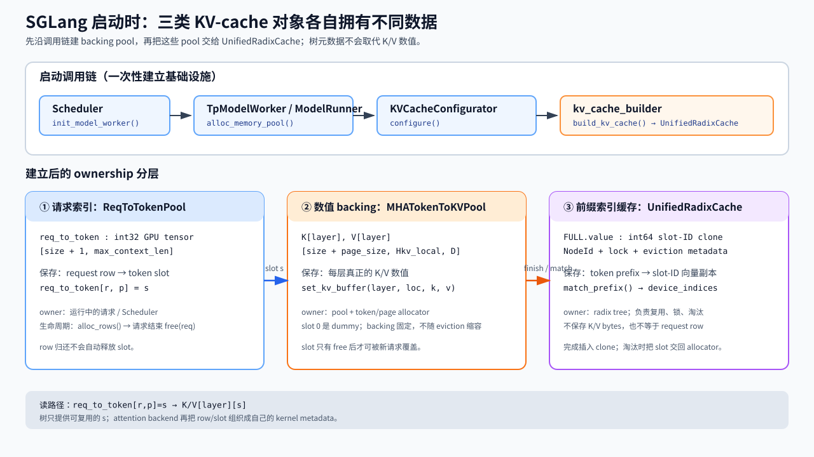
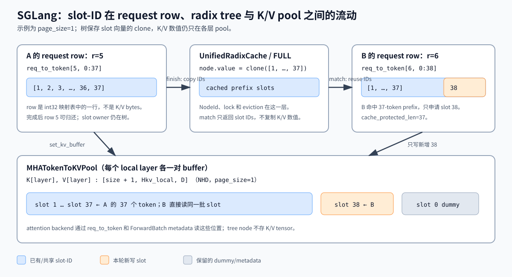
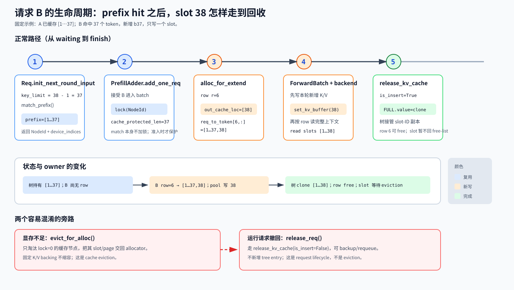

# Day 05｜SGLang Full Attention KV Cache：从 prefix 命中走到 attention 读写

> 源码基线：SGLang checkout 的 `HEAD` 为 `db017e34902b51e1fd1ac7ebbedaf720c75b374d`（2026-09-02）。源码链接都指向同一个 checkout；代码变化后请按函数名重新定位，不要把行号当成 API。
>
> 文件与目录已经切换为 `sglang_full_attention_kv_cache`，正文也完全使用 SGLang 术语。本文不是 vLLM `BlockPool`/`BlockTable` 的平移版。

> 源码定位约定：源码链接使用 `文件.py#起始行-结束行`，点击即可跳到当前实现；正文同时保留 `Lx–Ly` 方便扫读，第 8 节集中列出完整入口。这些行号只对上述 commit 有效；切换版本后先按函数名搜索，再用行号确认局部逻辑。

这篇按“打开源码，沿一条请求走完”的方式写。主线只覆盖 **CUDA、标准 decoder-only MHA、Full Attention、单个 TP rank 的 local KV heads、无 speculative decode、无 DCP/CP、无 SWA/Mamba/MLA/HiCache**。主缓存实现假定 prefix cache 开启且没有显式指定其他 radix-cache backend；这时 registry 为普通 MHA 选择 `UnifiedRadixCache`，树中只有 `ComponentType.FULL`。attention backend 用 FlashInfer 的调用点作具体例子；Triton、FA3、TRTLLM 等实现共享池和索引契约，但元数据格式不同。

如果只想先抓住主线，记住三个对象：

1. `ReqToTokenPool.req_to_token`：请求行号 → 每个逻辑 token 的 KV slot。
2. `MHATokenToKVPool` + allocator：KV slot → 各层 K/V 数值。
3. `UnifiedRadixCache`：token 前缀 → **复制保存的 slot-ID 向量**，并负责锁和淘汰。

完整因果链只有一行：

~~~text
启动建池
→ waiting 请求查 radix prefix
→ PrefillAdder 锁定命中节点并准入
→ ScheduleBatch 分配 row/slot
→ ForwardBatch 交给 RadixAttention/backend
→ 先写本轮 K/V、再读整段上下文
→ 完成时插入树、释放请求私有 slot
→ 显存不足时淘汰未锁定前缀并复用 slot
~~~

上面这行是“请求如何经过各层”的概念链，不是初始化函数的逐行调用图。读源码时要把两种箭头分开：`→` 表示实际函数调用；缩进下面的对象表示上层函数内部创建或返回的结果。特别是，`init_memory_pools()` 不会直接调用 `TpModelWorker.alloc_memory_pool()`，中间还有一个 target-only helper：`init_target_memory_pool()`。

## 0. 先锁定阅读假设和术语

### 0.1 本课范围

| 项目 | 本课假设 | 放宽后需要另读什么 |
|---|---|---|
| 模型 | 标准 decoder-only MHA，所有相关层都是 Full Attention | 混合 SWA/Mamba、MLA、DSA 会增加 component 或换池 |
| page size | CUDA 的默认值通常是 `1`；本文主线固定为 `1` | 显式 `--page-size P`、MUSA、backend 约束会进入 paged allocator |
| KV layout | 未量化、NHD、`MHATokenToKVPool` | HND、vectorized-5d、FP4/FP8 会改变 buffer 或写入路径 |
| 并行 | 一个 TP rank 的 local heads；无 DCP/CP/speculation | 需要额外的 ID 翻译、验证窗口或临时容量 |
| prefix cache | registry 默认的 `UnifiedRadixCache`，`FULL` component | `--disable-radix-cache`、C++/LMCache/FlexKV 等会换实现 |
| prefill | 数字例子先走一次完整、非 chunked extend | `3.3` 单独说明 chunk boundary 怎样回写 tree |
| attention | 以 FlashInfer 的 paged 分支说明 | backend 可改写 page size、读表和 kernel metadata |
| 示例 | 4 个 local Full Attention 层，`Hkv=8`、`Dk=Dv=128`、BF16 | 真实容量以启动时 `KVCacheConfigurator` 的结果为准 |

`page_size=1` 不是“永远没有页”的意思：allocator 仍有容量和 free-list，只是一个 page 只含一个 token，因此 page ID 和 token slot 的数值关系退化为直接索引。SGLang 的默认值和 backend 兼容性修正规则见 [`_page_size_default()` · L1377–L1399](../../python/sglang/srt/arg_groups/overrides.py#1377-1399)。

### 0.2 六个容易混淆的量

| 名称 | 源码对象/类型 | 含义 |
|---|---|---|
| 逻辑位置 `p` | 请求序列中的整数位置 | “这是第几个 token”，从 0 开始；不是显存地址 |
| request row `r` | `ReqToTokenPool` 返回的 Python `int` | `req_to_token` 的行号；一个运行中的请求占一行 |
| token slot `s` | allocator 返回的 `torch.int64` 元素 | K/V pool 的索引；`page_size=1` 时可直接索引 NHD 的第一维 |
| page | allocator 的 page ID 和页内 offset | `P>1` 时按页申请，kernel 可能接收 page table；扁平 slot 常写成 `page_id*P+offset` |
| tree value | `torch.int64` 一维 tensor | radix 节点保存的 slot-ID 副本，不是 K/V bytes，也不是 request row |
| K/V buffer | 每层一对 GPU tensor | 真正的 key/value 数值；只有 attention 的写入路径会触碰它 |

还要区分四种长度：

- `prefix_indices`：本轮 prefix lookup 返回、可直接复用的 slot 向量。
- `cache_protected_len`：树当前为请求保护的前缀边界；在普通 `page_size=1` 的 MHA 路径中通常等于 `len(prefix_indices)`。
- `kv_allocated_len`：请求行已经拿到的 slot 数量。
- `kv_committed_len`：这些 slot 中已经有本轮有效 KV 的长度，满足 `kv_committed_len <= kv_allocated_len`。

## 1. 启动：先建池，再建树

### 1.1 从 Scheduler 追到三个池

SGLang 的启动顺序不是“请求来了才创建一张 block table”。这里先给出可逐跳跟进的真实调用关系；本文固定 `speculative_algorithm=None`，所以只展开 target worker 分支：

~~~text
Scheduler.__init__
├─ self.init_model_worker()                         # scheduler.py:553
│  ├─ init_tp_model_worker()
│  │  └─ self.tp_worker = TpModelWorker(...)
│  ├─ maybe_init_draft_worker()
│  │  └─ self.draft_worker = None  # speculative disabled
│  ├─ init_memory_pools()
│  │  └─ init_target_memory_pool()
│  │     └─ self.tp_worker.alloc_memory_pool()
│  │        └─ self.model_runner.alloc_memory_pool()
│  │           ├─ init_kv_cache_configurator()
│  │           ├─ kv_cache_configurator.configure()
│  │           │  └─ _init_pools()
│  │           │     ├─ ReqToTokenPool
│  │           │     ├─ MHATokenToKVPool
│  │           │     └─ TokenToKVPoolAllocator / PagedTokenToKVPoolAllocator
│  │           └─ _init_post_memory_pool_components()
│  │              └─ init_kv_index_translator()
│  ├─ init_all_attention_backends()
│  └─ init_all_cuda_graphs()
└─ kv_cache_builder.build_kv_cache()                 # scheduler.py:559
   ├─ params = CacheInitParams(...)
   └─ create_tree_cache(...)
      └─ registry.create_tree_cache(...)
~~~

按当前文件实际跳转时，光标在 `self.init_target_memory_pool()` 后依次进入 [`init_target_memory_pool()` · L1006–L1018](../../python/sglang/srt/managers/scheduler.py#1006-1018)、[`TpModelWorker.alloc_memory_pool()` · L407–L433](../../python/sglang/srt/managers/tp_worker.py#407-433)、[`ModelRunner.alloc_memory_pool()` · L881–L903](../../python/sglang/srt/model_executor/model_runner.py#881-903)，再进入 [`KVCacheConfigurator.configure()` · L296–L329](../../python/sglang/srt/mem_cache/kv_cache_configurator.py#296-329)。`configure()` 通过 [`_init_pools()` · L397–L510](../../python/sglang/srt/mem_cache/kv_cache_configurator.py#397-510) 创建并返回三个 pool/allocator 对象；它们不是 `configure()` 后面的同名函数调用。

`ModelRunner.init_kv_index_translator()` 也不是和 `configure()` 同一层的并列步骤，而是 `alloc_memory_pool()` 返回结果后，经 [`_init_post_memory_pool_components()` · L904–L934](../../python/sglang/srt/model_executor/model_runner.py#904-934) 做的后置接线。最后，`build_kv_cache()` 是 `Scheduler.__init__` 在 `init_model_worker()` 返回之后的下一阶段，不在 `init_memory_pools()` 内部。

对应源码入口（均为当前基线行号）：

- Scheduler 的外层顺序见 [`Scheduler.__init__` 中的调用 · L553–L559](../../python/sglang/srt/managers/scheduler.py#553-559)；worker 调用链见 [`init_memory_pools()` · L1020–L1038](../../python/sglang/srt/managers/scheduler.py#1020-1038)、[`init_target_memory_pool()` · L1006–L1018](../../python/sglang/srt/managers/scheduler.py#1006-1018)、[`init_model_worker()` · L1047–L1060](../../python/sglang/srt/managers/scheduler.py#1047-1060)，以及 [`TpModelWorker.alloc_memory_pool()` · L407–L433](../../python/sglang/srt/managers/tp_worker.py#407-433)；
- 池的选择见 [`ModelRunner.alloc_memory_pool()` · L881–L903](../../python/sglang/srt/model_executor/model_runner.py#881-903)、[`KVCacheConfigurator.configure()` · L296–L329](../../python/sglang/srt/mem_cache/kv_cache_configurator.py#296-329)、[`_init_pools()` · L397–L510](../../python/sglang/srt/mem_cache/kv_cache_configurator.py#397-510)、[`_build_req_to_token_pool()` · L938–L966](../../python/sglang/srt/mem_cache/kv_cache_configurator.py#938-966) 和 MHA pool/allocator 的两个构造入口（[L1796–L1830](../../python/sglang/srt/mem_cache/kv_cache_configurator.py#1796-1830)、[L1832–L1945](../../python/sglang/srt/mem_cache/kv_cache_configurator.py#1832-1945)）；
- tree 构造主流程见 [`build_kv_cache()` · L197–L370](../../python/sglang/srt/mem_cache/kv_cache_builder.py#197-370)；
- 默认实现选择见 [`default_radix_cache_factory()` · L80–L143](../../python/sglang/srt/mem_cache/registry.py#80-143) 与 [`_create_unified_radix_cache()` · L146–L196](../../python/sglang/srt/mem_cache/registry.py#146-196)。

这里有两个边界：

1. ModelRunner.alloc_memory_pool() 只负责 backing pool、allocator 和 translator，不负责把 token 前缀登记到树。
2. build_kv_cache() 把已经存在的 pool 交给 UnifiedRadixCache。树元数据和 K/V 数值是两种所有权，不能合成一个“缓存数组”。

图 1 只回答“启动后谁保存什么”：`ReqToTokenPool` 保存 row → slot 映射，`MHATokenToKVPool` 保存每层 K/V 数值，`UnifiedRadixCache/FULL` 保存可复用的 slot-ID 副本。三者的生命周期不同，后文的 lookup、forward 和 release 都是在这三个 owner 之间传递索引。

### 1.2 ReqToTokenPool：请求行不是 KV 数据

普通 MHA 使用 [`ReqToTokenPool` · L257–L337](../../python/sglang/srt/mem_cache/memory_pool.py#257-337)：

~~~text
req_to_token: torch.Tensor
dtype  = int32
device = runner device
shape  = [size + 1, max_context_len]
~~~

size 是可同时登记的请求数；代码额外留出 row 0 作为 dummy/padding，所以真实 free row 从 1 开始。free_slots 是 Python 列表，alloc_rows() 取出 row ID 并更新 generation；free(req) 只归还这一行。它不释放行里指向的 KV slot，slot 的回收由 allocator 和 tree-cache 生命周期决定。

可以把它写成：

$$
\texttt{req\_to\_token}[r,p] = s
$$

左边是“请求 $r$ 的逻辑位置 $p$”，右边才是“去 K/V pool 取第 $s$ 行”。这张表本身不存 K/V 数值。

### 1.3 MHATokenToKVPool：每层各有 K/V backing

未量化、NHD 分支的 [`MHATokenToKVPool` · L1809–L1931](../../python/sglang/srt/mem_cache/memory_pool.py#1809-1931) 为每个 local layer 建一对 buffer：构造与布局在 L1809–L1931，[buffer shape 与创建 · L2099–L2163](../../python/sglang/srt/mem_cache/memory_pool.py#2099-2163)在 L2099–L2163，[普通写入路径 · L2381–L2460](../../python/sglang/srt/mem_cache/memory_pool.py#2381-2460)在 L2381–L2460。源码的 shape 是：

~~~text
K[layer]: [size + page_size, Hkv_local, Dk]
V[layer]: [size + page_size, Hkv_local, Dv]
~~~

当本文的 size 就是能容纳的K/V cache数量， page_size=1 时就是 [size+1, Hkv_local, D]；**slot 0 对应 dummy 行**。HND、量化和后捕获分支会改 shape，不能把上面的 NHD 形状外推到所有模型。

set_kv_buffer() 只接收 layer、写入位置 loc 和当前 K/V tensor，做边界检查后把数值写入对应层。它不知道 token hash、radix node 或请求引用计数；这些信息已经在上游表和树中解决。

### 1.4 allocator：`page_size=1` 是 token allocator，`page_size>1` 才显式按页

这里有两个容易混淆的量：

- `page_size` 是一个物理 page 容纳多少个 token；`page_size=1` 表示一个 page 只有一个 token。
- `page_id` 是某个具体物理 page 的编号。allocator 预留 slot 0 做 dummy，所以 free-list 从 `page_id=1` 开始。

当 `page_size=1` 时，`page_id=1` 对应的 flat loc 也恰好是 1；当 `page_size=64` 时，`page_id=1` 对应的是 `loc=64..127`。数值相同只是退化路径下的结果，不要把 `page_size=1` 读成“第 1 页”。

普通 CUDA、无 DCP、page_size=1 时，configurator 选择 [`TokenToKVPoolAllocator` · L28–L75](../../python/sglang/srt/mem_cache/allocator/token.py#28-75)：

~~~text
free_pages = [1, 2, ..., size]
slot 0     = dummy
alloc(n)   = 取出 n 个 slot，返回 int64 tensor
free(x)    = 把 slot 放回 free/release 容器
~~~

如果 page_size=P>1，则选择 [`PagedTokenToKVPoolAllocator` · L105–L271](../../python/sglang/srt/mem_cache/allocator/paged.py#105-271)（类与 `alloc/free` 主路径）：

- free_pages 保存 page ID（同样从 1 开始）；
- alloc_extend() 根据 prefix 的最后一个 slot、序列长度和 P，处理已有页的尾部、新整页和最后的 partial page；
- 返回值仍可是一维 token-slot tensor，常见形式是 page_id * P + offset；
- free() 会用 free_index // P 去重后归还 page。

所以“按页申请”和“按 slot 写入”是两个相邻但不同的粒度。本文主线用 P=1，避免把 vLLM 的 physical block 概念误带进 SGLang。

### 1.5 容量和字节数：算的是 pool，不是本轮申请

在本课的未量化 MHA 假设下，一层每个 token 的 K/V payload 为：

$$
\text{bytes}_{\text{token,layer}}
 = H_{kv,\text{local}}\,(D_k+D_v)\,s_{\text{dtype}}
$$

4 个 local Full Attention 层的每 token 总量再乘以 $L_{\text{local}}=4$。以 Hkv_local=8、Dk=Dv=128、BF16（2 bytes）为例：

$$
8 \times (128+128) \times 2
 = 4096\ \text{bytes}
 = 4\ \text{KiB/token/layer}
$$

因此 37 个 token 的有效 payload 是：

$$
37 \times 4\ \text{KiB} = 148\ \text{KiB/layer},
\qquad
148 \times 4 = 592\ \text{KiB/4 layers}.
$$

这是“已有 37 个 token 的数值”所占空间，不等于启动时只分配 592 KiB。DefaultPoolConfigurator 用每 token、跨 local layers 的 cell_size，按

$$
\text{available\_bytes}
 = \text{max\_tokens}\times\text{coeff}+\text{bias}
$$

反推整个 pool 能容纳多少 token；实现和量化修正见 [`DefaultPoolConfigurator._compute_cell_size()` · L248–L362](../../python/sglang/srt/model_executor/pool_configurator.py#248-362)（其中[普通 MHA 公式 · L338–L345](../../python/sglang/srt/model_executor/pool_configurator.py#338-345)）。实际 backing 还包含 dummy slot、对齐和可能的 scale/布局开销。

## 2. Prefix lookup：树返回 slot 向量，不搬 K/V

### 2.1 请求如何生成 lookup key

waiting 请求进入 [`Req.init_next_round_input()` · L1390–L1489](../../python/sglang/srt/managers/schedule_batch.py#1390-1489) 时，先把 `origin_input_ids + output_ids` 刷新成 `full_untruncated_fill_ids`，再计算允许命中的最大前缀：

~~~python
key_limit = max(input_len - 1, 0)
key = RadixKey(
    full_untruncated_fill_ids,
    extra_key=req.extra_key,
    cache_salt=req.cache_salt,
    limit=key_limit,
)
result = tree_cache.match_prefix(
    MatchPrefixParams(key=key, req=req, cow_mamba=False)
)
~~~

这段是源码的关键等价形式，省略了 multimodal/SWA 等分支。input_len - 1 是有意保留最后一个 token 给 logits；因此一个长度恰好为 37 的新请求，lookup 最多只查 36 个 token。extra_key 和 cache_salt 是命名空间，不能只看 token IDs 就假定可共享。

这里必须把“逻辑 key”和“物理 value”分开：[`RadixKey` · L59–L85](../../python/sglang/srt/mem_cache/radix_cache.py#59-85) 的主体是 token IDs 加命名空间，而 tree value 才是 slot IDs。匹配也不是拿整段 prefix 的一个 hash 就直接判相等：[`child_key()` · L217–L229](../../python/sglang/srt/mem_cache/radix_cache.py#217-229) 先取首 token/首 page 构造可哈希的字典 key，tree 在 [`_match_prefix_helper()` · L725–L810](../../python/sglang/srt/mem_cache/unified_cache/unified_tree_core.py#725-810) 中先查 `node.children`（[L738](../../python/sglang/srt/mem_cache/unified_cache/unified_tree_core.py#738-738)、[L779–L780](../../python/sglang/srt/mem_cache/unified_cache/unified_tree_core.py#779-780)），再由 [`RadixKey.match()` · L181–L215](../../python/sglang/srt/mem_cache/radix_cache.py#181-215) 对 edge 上的 token slice 做精确比较（[调用点 L786–L787](../../python/sglang/srt/mem_cache/unified_cache/unified_tree_core.py#786-787)）。所以它是“hash/dict 缩小候选 + token 序列精确匹配”，不是逐个 child 线性扫描，也不是只相信 hash。

这点和 vLLM 的共同点是：prefix cache 的逻辑身份都来自 token 序列，都会借助可哈希 key 加速候选查找；差别是这里的默认实现沿 radix edge 匹配可变长 token slice。`UnifiedTreeNode.hash_value` 的 SHA 链只在 storage/KV event 等能力开启时由 [`_add_new_node()` · L1212–L1226](../../python/sglang/srt/mem_cache/unified_cache/unified_tree_core.py#1212-1226) 条件计算，不是默认内存树查找的唯一依据。

RadixKey.page_aligned(P) 在 P>1 时向下取整；`page_size=1` 时不改变长度。命中结果写回：

~~~text
req.prefix_indices      = MatchResult.device_indices  # 1-D int64
req.last_node            = last_device_node            # Unified tree 的 NodeId
req.kv.cache_protected_len
  = result.cache_protected_len 或 len(prefix_indices)
~~~

### 2.2 当前默认的 UnifiedRadixCache

普通 MHA 走 [`registry._create_unified_radix_cache()` · L146–L196](../../python/sglang/srt/mem_cache/registry.py#146-196)（[`tree_components=(FULL,)` 的选择 · L158–L165](../../python/sglang/srt/mem_cache/registry.py#158-165)），再构造 [`UnifiedRadixCache` · L157–L230](../../python/sglang/srt/mem_cache/unified_radix_cache.py#157-230)。它把结构、NodeId、锁和淘汰交给 [`UnifiedTreeCore` · L386–L450](../../python/sglang/srt/mem_cache/unified_cache/unified_tree_core.py#386-450)。

[`UnifiedTreeCore.match_prefix()` · L698–L810](../../python/sglang/srt/mem_cache/unified_cache/unified_tree_core.py#698-810) 做的事情可以压缩成三步：

1. 沿 radix child 按 RadixKey 比较 token，必要时把已有节点切分；
2. 拼接每个匹配节点 FULL component 的 value；
3. 返回 MatchResult.device_indices（一维 slot-ID tensor）以及 last_device_node/best_match_node 等 NodeId。

`FULL` 在这里是 component 类型/字典索引，不是 tensor 坐标。它让统一树能同时容纳 Full Attention、SWA、Mamba 等不同缓存组件；纯 MHA 只有 `(FULL,)`。实现见 [`FullComponent` · L43–L344](../../python/sglang/srt/mem_cache/unified_cache/components/full_component.py#43-344)：[match validator · L105–L140](../../python/sglang/srt/mem_cache/unified_cache/components/full_component.py#105-140)、[切分时 clone value · L142–L158](../../python/sglang/srt/mem_cache/unified_cache/components/full_component.py#142-158)、[lock/unlock · L263–L344](../../python/sglang/srt/mem_cache/unified_cache/components/full_component.py#263-344)。树拥有的是 slot-ID 副本；命中时不会搬运 K/V 数值，也不会新建一份 K/V backing。

请求被 PrefillAdder.add_one_req() 接受后，调度策略才调用 _req_inc_lock_ref()，沿 last_node 向根增加 component lock。锁的作用是让这段树路径暂时不可淘汰，不是给每一个 K/V 数值再加一份独立的引用计数。请求完成或离开运行集时再对称地 decrement。

### 2.3 三张表在同一时刻分别保存什么

| 结构 | 示例内容 | 谁消费 |
|---|---|---|
| req.prefix_indices | [1, 2, 3, ...]，设备上的 1-D int64 | ScheduleBatch.prepare_for_extend() |
| req_to_token[r, :] | 当前请求行，把 prefix 和本轮新 slot 拼成完整映射 | attention backend 的读表构造 |
| radix node FULL.value | 对已缓存前缀的 slot-ID clone | 下一次 match_prefix()、lock、evict |

同一段 prefix 的三份“数字”可能相等，但它们的 owner 和生命周期不同。尤其不要把 FULL.value 当成 K/V tensor；真正的 K/V 仍在 token_to_kv_pool.get_kv_buffer(layer_id)。

## 3. Extend/decode 分配：先分 row，再分 slot

### 3.1 Extend 的核心输入

[`ScheduleBatch.prepare_for_extend()` · L2504–L2551](../../python/sglang/srt/managers/schedule_batch.py#2504-2551) 对 batch 中每条请求计算：

~~~text
prefix_len = len(req.prefix_indices)
seq_len    = req.extend_range.end
extend_len = req.extend_range.length
extend_num_tokens = sum(extend_len for all requests)
~~~

input_ids 只取 `get_fill_ids()[prefix_len:]`，即本轮真正要计算的新 token。随后调用 [`alloc_for_extend()` · L282–L389](../../python/sglang/srt/mem_cache/allocation.py#282-389)：

1. alloc_req_slots() 从 ReqToTokenPool 取每条请求的 row；
2. `page_size=1` 调 `alloc_token_slots(tree_cache, extend_num_tokens)`，不足时先让 tree cache 处理短缺；`page_size>1` 调 `alloc_paged_token_slots_extend()`；
3. write_cache_indices() 把已有 prefix 和新 slot 写回各自 row；
4. 更新每条请求的 kv_allocated_len、kv_committed_len。

写表的等价式是：

$$
\begin{aligned}
\texttt{req\_to\_token}[r,0:\text{prefix\_len}]
  &\leftarrow \texttt{prefix\_indices},\\
\texttt{req\_to\_token}[r,\text{prefix\_len}:\text{seq\_len}]
  &\leftarrow \texttt{out\_cache\_loc}[o:o+\text{extend\_len}].
\end{aligned}
$$

其中 $o$ 是 batch packed 新 token 区间的起点。这里不是二维笛卡尔积：每条请求只消费自己那一段连续的 out_cache_loc。

### 3.2 Decode 只追加当前位置

无 speculative 的 [`alloc_for_decode()` · L521–L561](../../python/sglang/srt/mem_cache/allocation.py#521-561)（入口与 row 写入）中：

- page_size=1：一次申请 batch_size * token_per_req 个 slot；
- page_size>1：从 req_to_token[req_pool_indices, seq_lens-1] 取每条请求的 last_loc，交给 paged allocator；
- decoder-only 的写位置就是旧的 seq_lens：

~~~text
req_to_token[req_pool_indices, seq_lens] = out_cache_loc
~~~

然后每条请求的 allocated/committed length 都增加 token_per_req。decode 不重新做 prefix lookup；它沿用当前 row 和上一步的树锁。

### 3.3 Chunked prefill 的中间边界

如果 `PrefillAdder` 因 token budget 只接受一部分 prompt，本轮 forward 结束后 scheduler 会调用 `maybe_cache_unfinished_req()`，最终进入 `UnifiedRadixCache.cache_unfinished_req()`。它不是 finish 的简化别名，关键步骤是：

1. 从当前 request row 读取已经算出的 slot IDs，按 `page_size` 对齐后插入 tree；
2. 对照 radix tree 再做一次 match，把 canonical 的 `new_indices` 写回 row 的未保护区间；
3. 释放重复/未插入的 slot，先 decrement 旧 lock，再锁定新的 `last_node`；
4. 更新 `prefix_indices`、`cache_protected_len` 和 `last_node`，但保留 request row 继续下一 chunk。

因此，SGLang 的 chunked prefill **确实会在整个 prompt 尚未 prefill 完时，把已经完成计算的对齐 chunk 插入 prefix cache**。下一轮输入仍然是 `get_fill_ids()[len(prefix_indices):]`；它可能比上一轮短，也可能从刚插入的共享节点继续。完整实现见 [`UnifiedRadixCache.cache_unfinished_req()` · L925–L1048](../../python/sglang/srt/mem_cache/unified_radix_cache.py#925-1048)，结果处理入口见 [`process_batch_result_prefill()` · L240–L346](../../python/sglang/srt/managers/scheduler_components/batch_result_processor.py#240-346)，scheduler 暂存 chunked request 的入口见 [`stash_chunked_request()` · L3252–L3253](../../python/sglang/srt/managers/scheduler.py#3252-3253) 及 [`get_next_batch_to_run()` 中的调用处 · L3368–L3379](../../python/sglang/srt/managers/scheduler.py#3368-3379)。

### 3.4 allocator 短缺不是请求抢占

[`alloc_token_slots()` · L150–L170](../../python/sglang/srt/mem_cache/allocation.py#150-170) 会调用 [`evict_from_tree_cache()` · L168–L194](../../python/sglang/srt/mem_cache/common.py#168-194)。它只在可用 slot 不够时计算 shortfall，并请求 tree cache 淘汰未锁定的缓存节点。这个动作释放的是**缓存前缀**。

调度器为了给高优先级请求腾位置而 retract/preempt 运行中请求，走的是 release_req()/release_kv_cache(..., is_insert=False)，必要时还会做 host backup 或重新排队。这是**运行请求生命周期**，不能写成“evict 就是 preempt”。

## 4. Forward：ForwardBatch 只携带本轮索引

### 4.1 从 ScheduleBatch 到 runner

[`ForwardBatch` · L394–L411](../../python/sglang/srt/model_executor/forward_batch_info.py#394-411) 的核心字段集中在上述范围，[`init_new()` · L723–L800](../../python/sglang/srt/model_executor/forward_batch_info.py#723-800) 的 `ScheduleBatch` 映射在上述范围。这里给出本文 `page_size=1`、decoder-only 的典型 shape：

| 字段 | 典型 shape / dtype | 语义 |
|---|---|---|
| input_ids | [extend_num_tokens], int64 | 本轮 extend 的新 token；decode 通常是 batch token |
| req_pool_indices | [batch_size], int64 | 这些 batch lane 对应的 req_to_token 行 |
| seq_lens | [batch_size], int64 | 本轮 forward 后的逻辑长度 |
| out_cache_loc | extend 为 [extend_num_tokens]，decode 为 [batch_size]，int64 | 当前 K/V 要写入的 slot |
| seq_lens_sum | Python 标量 | batch 序列长度和，用于 metadata |

`ForwardBatch.init_new()` 还调用 `KVIndexTranslator.rebind_write_loc()`。在本文的普通 MHA pool 上这是 no-op；统一内存池、DCP 等路径会把 virtual ID 翻译成 kernel-facing ID。translator 的 [`index_table_for_batch()` · L290–L320](../../python/sglang/srt/mem_cache/kv_index_translator.py#290-320) 与 [`rebind_write_loc()` · L342–L356](../../python/sglang/srt/mem_cache/kv_index_translator.py#342-356) 分别见上述范围。

对 plain pool，index_table_for_batch() 返回的本质是：

~~~text
ids     = req_to_token
row_ids = req_pool_indices
entry_page_size = 1
~~~

也就是说 backend 可以读取 `ids[row_ids[b], 0:seq_lens[b]]`。普通 paged allocator 即使 `page_size>1`，这份 view 仍可能透传 token-slot 表，再由 backend 按 page size 构造自己的 page metadata；只有统一内存池等存在多套 ID 空间时，translator 才真正生成 translated table。关键不是“所有分页都由 translator 完成”，而是 backend 不能越过这份契约自行猜 ID 空间。

### 4.2 RadixAttention 不负责查树

模型层的 [`RadixAttention.forward()` · L157–L290](../../python/sglang/srt/layers/radix_attention.py#157-290) 收到 q/k/v 和 ForwardBatch 后，选择 piecewise custom op 或 `get_attn_backend().forward(...)`。prefix lookup 已经在 scheduler admission 阶段完成；attention layer 不会再次按 token hash 查 radix tree。

以 FlashInfer backend 为例：[`init_forward_metadata()` · L956–L1053](../../python/sglang/srt/layers/attention/flashinfer_backend.py#956-1053)、[`forward_extend()` · L1314–L1474](../../python/sglang/srt/layers/attention/flashinfer_backend.py#1314-1474)（本文关心的 paged 取 buffer、写 K/V 和 wrapper 调用集中在 [L1323–L1377](../../python/sglang/srt/layers/attention/flashinfer_backend.py#1323-1377)）、[`forward_decode()` · L1475–L1532](../../python/sglang/srt/layers/attention/flashinfer_backend.py#1475-1532)。

1. init_forward_metadata() 向 KVIndexTranslator.index_table_for_batch() 要一份本 batch 的读表视图，并更新 prefill/decode wrapper 的 indptr、indices 等 metadata；
2. forward_extend()/forward_decode() 在保存 K/V 时，用 forward_batch.out_cache_loc 调 token_to_kv_pool.set_kv_buffer(...)；
3. paged wrapper 再按 metadata 从每个请求的 row 读取完整上下文，并执行 attention。

在 paged extend 分支，源码顺序确实是“set_kv_buffer → wrapper.forward”；ragged 分支会把当前 k/v 作为输入并和已有 cache 合并，不能简单说成所有 backend 都只读 pool。Triton backend 的对应入口是 [`init_forward_metadata()` · L750–L1015](../../python/sglang/srt/layers/attention/triton_backend.py#750-1015)、[`forward_extend()` · L1334–L1823](../../python/sglang/srt/layers/attention/triton_backend.py#1334-1823) 和 [`forward_decode()` · L1824–L2030](../../python/sglang/srt/layers/attention/triton_backend.py#1824-2030)；它使用自己的 `kv_indptr/kv_indices`，但仍遵守“slot 写入由 pool 完成、读索引由 batch metadata 提供”的边界。

因此 kernel 通常不知道：

- 哪些 token hash 相同；
- 哪个 NodeId 持有这段 prefix；
- lock/refcount 是否为 0；
- 某个 slot 是刚申请的还是从 prefix 复用的。

这些都是 scheduler、allocation 和 tree-cache 层的职责。

## 5. 一组连续数字：A → B → C

下面固定 page_size=1，假设 allocator 尚未发生回收，示意 free-list 恰好按递增顺序给出 slot；真实运行中 slot ID 会因复用而不同。仍用前面的 4 层、8 KV heads、128 维 BF16 参数。

### 5.1 A：37-token prompt 首次进入

设 A 的 prompt 是 a[0:37]。

1. input_len=37，所以 key_limit=36；树为空，prefix_indices=[]。
2. PrefillAdder 接受请求并为它分配 row r=5。
3. prepare_for_extend() 得到 prefix_len=0、extend_len=37，allocator 返回：

   ~~~text
   out_cache_loc = [1, 2, 3, ..., 37]
   ~~~

4. write_cache_indices() 写入：

   ~~~text
   req_to_token[5, 0:37] = [1, 2, ..., 37]
   ~~~

5. 每一层的 forward_extend() 把本层 K/V 分别写到这些 slot；37 个 token 的有效数值是 148 KiB/layer，四层合计 592 KiB。

假设 A 的 kv_len_to_handle=37 并正常完成，release_kv_cache() 调 UnifiedRadixCache.cache_finished_req()。树把 token key 和 req_to_token[5,0:37] 的 **clone** 插入 FULL.value，然后 row 5 归还给 ReqToTokenPool。此时 [1..37] 仍由树拥有，不能回到 allocator free-list；K/V backing 也没有缩小。

> 初次 lookup 的 input_len-1 限制只影响“本轮可复用多少”；完成时缓存已提交的序列可以把这 37 个 token 登记进树。

### 5.2 B：A 的 37-token 前缀后再接一个 token

B 的 prompt 是 a[0:37] + [b37]，总长 38。

1. key_limit=38-1=37，所以 lookup 可以完整命中 A 的 37-token node：

   ~~~text
   prefix_indices = [1, 2, ..., 37]
   cache_protected_len = 37
   ~~~

2. B 获得另一个 row，例如 r=6；extend_len=1，allocator 只给一个新 slot：

   ~~~text
   out_cache_loc = [38]
   req_to_token[6, 0:38] = [1, 2, ..., 37, 38]
   ~~~

3. attention 只把 b37 的 K/V 写到 slot 38，但读取时通过 B 的 row 看到前 37 个共享 slot 加这个新 slot。没有发生 37-token 的 K/V memcpy。

如果 B 只是一个长度也为 37 的重复 prompt，key_limit=36，命中会停在 [1..36]，最后一个 token 仍需重新计算。这是源码里保留 logits 位置的直接结果。

### 5.3 C：前 20 个相同，之后分叉

设 C 长度为 25，前 20 个 token 与 A 相同，后 5 个为 c[20:25]。

1. key_limit=24，radix walk 在位置 20 分叉，返回 prefix_indices=[1..20]。
2. C 取 row r=7，extend_len=5，示意 allocator 给出 [39..43]：

   ~~~text
   req_to_token[7, 0:25] = [1, ..., 20, 39, 40, 41, 42, 43]
   ~~~

3. lookup/insert 共同完成在 token 20 处分支：如果旧 node 还未切分，match_prefix() 会先切分，完成时 insert 再创建 child；已有共享前缀继续由父节点持有，C 的新 suffix 由 child 的 FULL.value 持有。Unified insert 对重叠区间产生的 duplicate/free action 会交回 allocator，不能凭“看起来是同一段”手工再 free 一次。

这三个请求把“复用 prefix”和“申请新 token”分开了：A 申请 37，B 只申请 1，C 只申请 5；batch 汇总时才把各请求的新增长度拼成一个 out_cache_loc。

图 2 把同一组数字放回时间轴：命中只产生 `[1…37]`，本轮分配只产生 `[38]`；完成时树 clone slot-ID 并释放 row，显存短缺和运行请求撤回则分别走 eviction 与 `release_req(is_insert=False)`。

### 5.4 把 page_size 改成 16 会发生什么

这是可选分支，不改变上面的所有权关系：

- RadixKey.page_aligned(16) 向下取整；
- 长度 37 的 A 完成插入时，树最多登记前 32 个 token；未对齐的尾 5 个 slot 按 cache_finished_req() 的 tail 规则释放；
- 长度 38 的 B lookup 的上限是 37，再向下对齐后仍最多命中 32，extend 部分是 6 个 token；
- allocator 按 page ID 申请，返回的扁平 slot 可能形如 page_id*16 + offset；page ID、逻辑 page 和 slot 不是同一概念。

所以 page-aware 路径的“缓存边界”是页对齐的，而 `kv_allocated_len/kv_committed_len` 仍以请求 token 长度记录。需要同时看 [`RadixKey` · L59–L235](../../python/sglang/srt/mem_cache/radix_cache.py#59-235)、[paged allocator · L105–L271](../../python/sglang/srt/mem_cache/allocator/paged.py#105-271) 和 [`allocation.py` · L150–L389](../../python/sglang/srt/mem_cache/allocation.py#150-389)，不要只看一个数组猜全链路。

## 6. 完成、释放、淘汰：三种动作三种 owner

### 6.1 请求完成：树接管 slot-ID 副本

普通完成路径由 [`release_kv_cache()` · L254–L296](../../python/sglang/srt/mem_cache/common.py#254-296) 串起来：

~~~text
effective_kv_committed_len
  → tree_cache.cache_finished_req(req, kv_len_to_handle=...)
    → 复制/插入已提交 prefix 的 slot IDs
    → 释放 unaligned tail、duplicate 或未插入区间
  → 释放可能过分配的 [committed_len, allocated_len)
  → req_to_token_pool.free(req)
~~~

[`cache_finished_req()` · L838–L924](../../python/sglang/srt/mem_cache/unified_radix_cache.py#838-924) 的实现见上述范围。它从 request row 读 slot IDs，构造 `RadixKey`，把 values 复制给 tree；它不会把 K/V 数值复制进树。因而完成后：

- request row 可以立即给下一个请求；
- 树节点仍保留 slot-ID，直到它被淘汰；
- K/V pool 的固定 backing 继续存在；
- 只有 allocator 收到 free slot/page 后，地址才可被新请求覆盖。

### 6.2 retract/preempt：释放运行请求，不插入树

调度器的 [`release_req()` · L3158–L3172](../../python/sglang/srt/managers/schedule_batch.py#3158-3172) 为 retraction 调 `release_kv_cache(..., is_insert=False)`，随后可能把请求 reset 并重新排队。decode disaggregation 还可能先把 KV backup 到 host。这里的目标是释放请求私有的 row/slot 或保存恢复所需状态，不是构造新的 prefix-cache entry。

因此阅读日志时要问“谁拥有这段 slot”：

| 动作 | 主要释放/改变 | 树是否新增 entry |
|---|---|---|
| prefix hit | 请求复用已有 slot-ID | 否 |
| request finish | 请求私有尾部 + row；树接管已插入 prefix 的 slot-ID clone | 通常是 |
| retract/preempt | 运行请求的私有 slot/row，可能 host backup | 否（is_insert=False） |
| cache eviction | 未锁定 tree node 的 slot/page | 删除或 tombstone 该缓存值 |

### 6.3 显存短缺：evict_for_alloc

[`evict_from_tree_cache()` · L168–L194](../../python/sglang/srt/mem_cache/common.py#168-194) 先看 allocator 的 `available_size()`，只把 shortfall 传给 `tree_cache.evict_for_alloc(EvictParams(...))`；Unified wrapper 的入口见 [`UnifiedRadixCache.evict_for_alloc()` · L566–L639](../../python/sglang/srt/mem_cache/unified_radix_cache.py#566-639)。Unified cache 再让 `FullComponent` 找可淘汰的 device leaf：

1. lock 为 0 的节点才可能进入 evictable 集合；
2. FullComponent.evict_component() 把该节点的 slot-ID tensor 交给 allocator；
3. tree core 将 device value 置空/移除相应叶子状态；
4. 同一个 slot 随后可被 allocator 重新发给新请求。

如果启用 HiCache，节点可能只从 device 被淘汰、host value 仍在，状态会变成 tombstone/host-backed；这超出本文的 device-only 主线。无论哪种实现，固定 K/V backing tensor 都不会因为一次 eviction “缩容”。

## 7. 读源码时必须守住的 invariant

1. **row ID ≠ slot ID**：req_pool_idx 是 req_to_token 行；out_cache_loc/prefix_indices 是 K/V slot。
2. **tree value ≠ K/V bytes**：FULL.value 是复制的 int64 slot 向量；数值只在 MHATokenToKVPool。
3. **slot 0 是 dummy**：真实 allocator slot/page 从 1 开始，padding 写入可落到保留位置。
4. **lookup 上限是 input_len-1**：重复完整 prompt 不一定返回全长 hit。
5. **out_cache_loc 只代表本轮新增写入**：extend 是 packed suffix，decode 通常是一请求一个位置；prefix 复用不会再次出现在其中。
6. **cache_protected_len 不等于“所有 row slot 都被树拥有”**：page>1、SWA 或 host tier 可能留下 partial/非 device 区间。
7. **page 申请和 slot 寻址可切换**：看到 free_pages 不代表 kernel 一定接收 page ID；translator/backend 可能再展开成 token IDs。
8. **match 不等于 lock**：match_prefix() 返回候选，准入时的 PrefillAdder._req_inc_lock_ref() 才把路径保护起来。
9. **eviction 不等于 preemption**：前者淘汰缓存节点，后者释放/备份运行请求并可能重算。
10. **不要让 backend 自己猜 ID 空间**：普通 pool 可直接透传；统一 pool/DCP 必须经过 KVIndexTranslator。

遇到“第二个相同请求没有完全命中”时，按这个顺序排查：

~~~text
token IDs 是否真的相同
→ extra_key/cache_salt 是否相同
→ key_limit 是否因 input_len-1 或 logprob 被截断
→ page_size 是否把长度向下对齐
→ FULL node 的 value 是否仍在 device
→ 请求是否在 match 后被 PrefillAdder 接受并加锁
~~~

## 8. 源码导航：建议按这个顺序打开

下面的范围不是说函数只做这一件事，而是标出与本文主线直接相关、值得先读的代码。VS Code 可用 `Ctrl+G` 输入起始行；源码变动后按“入口”列的符号名搜索。

| 层 | 文件 | 入口（链接标题已含行号） |
|---|---|---|
| page 默认值 | `overrides.py` | [`_page_size_default()` · L1377–L1399](../../python/sglang/srt/arg_groups/overrides.py#1377-1399) |
| 启动/调度 | `scheduler.py` | [`Scheduler.__init__` 中的调用 · L553–L559](../../python/sglang/srt/managers/scheduler.py#553-559)；[`init_target_memory_pool()` · L1006–L1018](../../python/sglang/srt/managers/scheduler.py#1006-1018)；[`init_memory_pools()` · L1020–L1038](../../python/sglang/srt/managers/scheduler.py#1020-1038)；[`init_model_worker()` · L1047–L1060](../../python/sglang/srt/managers/scheduler.py#1047-1060)；[`stash_chunked_request()` · L3252–L3253](../../python/sglang/srt/managers/scheduler.py#3252-3253)；[`get_next_batch_to_run()` · L3342–L3379](../../python/sglang/srt/managers/scheduler.py#3342-3379)；[`run_batch()` · L4020–L4092](../../python/sglang/srt/managers/scheduler.py#4020-4092) |
| worker | `tp_worker.py` | [`alloc_memory_pool()` · L407–L433](../../python/sglang/srt/managers/tp_worker.py#407-433)；[`init_attention_backends()` · L435–L439](../../python/sglang/srt/managers/tp_worker.py#435-439) |
| runner 的 pool 接线 | `model_runner.py` | [`alloc_memory_pool()` · L881–L903](../../python/sglang/srt/model_executor/model_runner.py#881-903)；[`init_kv_index_translator()` · L869–L879](../../python/sglang/srt/model_executor/model_runner.py#869-879)；后置接线见 `_init_post_memory_pool_components()` |
| 容量/池构造 | `kv_cache_configurator.py` | [`configure()` · L296–L329](../../python/sglang/srt/mem_cache/kv_cache_configurator.py#296-329)；[`_init_pools()` · L397–L510](../../python/sglang/srt/mem_cache/kv_cache_configurator.py#397-510)；[`_build_req_to_token_pool()` · L938–L966](../../python/sglang/srt/mem_cache/kv_cache_configurator.py#938-966)；[`_build_mha_kv_pool()` · L1796–L1830](../../python/sglang/srt/mem_cache/kv_cache_configurator.py#1796-1830)；[`_build_token_to_kv_pool_allocator()` · L1832–L1945](../../python/sglang/srt/mem_cache/kv_cache_configurator.py#1832-1945) |
| 容量公式 | `pool_configurator.py` | [`DefaultPoolConfigurator._compute_cell_size()` · L248–L362](../../python/sglang/srt/model_executor/pool_configurator.py#248-362)；[普通 MHA 公式 · L338–L345](../../python/sglang/srt/model_executor/pool_configurator.py#338-345) |
| request row | `memory_pool.py` | [`ReqToTokenPool` · L257–L337](../../python/sglang/srt/mem_cache/memory_pool.py#257-337) 的建表、alloc/release |
| K/V 数值池 | `memory_pool.py` | [`MHATokenToKVPool` · L1809–L1931](../../python/sglang/srt/mem_cache/memory_pool.py#1809-1931)；[buffer 创建 · L2099–L2163](../../python/sglang/srt/mem_cache/memory_pool.py#2099-2163)；[`set_kv_buffer()` · L2381–L2460](../../python/sglang/srt/mem_cache/memory_pool.py#2381-2460) |
| token allocator | `token.py` | [`TokenToKVPoolAllocator.alloc/free` · L28–L75](../../python/sglang/srt/mem_cache/allocator/token.py#28-75) |
| paged allocator | `paged.py` | [`alloc()` · L149–L170](../../python/sglang/srt/mem_cache/allocator/paged.py#149-170)；[`alloc_extend()` · L172–L220](../../python/sglang/srt/mem_cache/allocator/paged.py#172-220)；[`alloc_decode()` · L222–L259](../../python/sglang/srt/mem_cache/allocator/paged.py#222-259)；[`free()` · L261–L271](../../python/sglang/srt/mem_cache/allocator/paged.py#261-271) |
| tree 构造 | `kv_cache_builder.py` | [`build_kv_cache()` · L197–L370](../../python/sglang/srt/mem_cache/kv_cache_builder.py#197-370) |
| tree 实现选择 | `registry.py` | [`default_radix_cache_factory()` · L80–L143](../../python/sglang/srt/mem_cache/registry.py#80-143)；[`_create_unified_radix_cache()` · L146–L196](../../python/sglang/srt/mem_cache/registry.py#146-196)；[component 选择 · L158–L165](../../python/sglang/srt/mem_cache/registry.py#158-165) |
| token key | `radix_cache.py` | [`RadixKey` · L59–L85](../../python/sglang/srt/mem_cache/radix_cache.py#59-85)；[`match()` · L181–L215](../../python/sglang/srt/mem_cache/radix_cache.py#181-215)；[`child_key()` · L217–L229](../../python/sglang/srt/mem_cache/radix_cache.py#217-229)；[`hash_page()` · L231–L235](../../python/sglang/srt/mem_cache/radix_cache.py#231-235) |
| tree wrapper API | `unified_radix_cache.py` | [`match_prefix()` · L523–L539](../../python/sglang/srt/mem_cache/unified_radix_cache.py#523-539)；[`insert()` · L544–L561](../../python/sglang/srt/mem_cache/unified_radix_cache.py#544-561)；[`evict_for_alloc()` · L566–L639](../../python/sglang/srt/mem_cache/unified_radix_cache.py#566-639)；[`cache_finished_req()` · L838–L924](../../python/sglang/srt/mem_cache/unified_radix_cache.py#838-924)；[`cache_unfinished_req()` · L925–L1048](../../python/sglang/srt/mem_cache/unified_radix_cache.py#925-1048) |
| tree 结构/匹配 | `unified_tree_core.py` | [`UnifiedTreeNode` · L108–L157](../../python/sglang/srt/mem_cache/unified_cache/unified_tree_core.py#108-157)；[`match_prefix()` · L698–L723](../../python/sglang/srt/mem_cache/unified_cache/unified_tree_core.py#698-723)；[`_match_prefix_helper()` · L725–L810](../../python/sglang/srt/mem_cache/unified_cache/unified_tree_core.py#725-810) |
| tree 插入 | `unified_tree_core.py` | [`begin_insert()` · L927–L968](../../python/sglang/srt/mem_cache/unified_cache/unified_tree_core.py#927-968)；[`_insert_walk_step()` · L1018–L1059](../../python/sglang/srt/mem_cache/unified_cache/unified_tree_core.py#1018-1059)；[`_add_new_node()` · L1212–L1231](../../python/sglang/srt/mem_cache/unified_cache/unified_tree_core.py#1212-1231) |
| Full component | `full_component.py` | [match validator · L105–L140](../../python/sglang/srt/mem_cache/unified_cache/components/full_component.py#105-140)；[value clone · L142–L158](../../python/sglang/srt/mem_cache/unified_cache/components/full_component.py#142-158)；[evict · L160–L230](../../python/sglang/srt/mem_cache/unified_cache/components/full_component.py#160-230)；[lock/unlock · L263–L344](../../python/sglang/srt/mem_cache/unified_cache/components/full_component.py#263-344) |
| 请求 lookup 状态 | `schedule_batch.py` | [`ReqKvInfo` · L849–L903](../../python/sglang/srt/managers/schedule_batch.py#849-903)；[`get_fill_ids()` · L1366–L1367](../../python/sglang/srt/managers/schedule_batch.py#1366-1367)；[`init_next_round_input()` · L1390–L1489](../../python/sglang/srt/managers/schedule_batch.py#1390-1489) |
| batch 分配入口 | `schedule_batch.py` | [`prepare_for_extend()` · L2504–L2551](../../python/sglang/srt/managers/schedule_batch.py#2504-2551)；[`release_req()` · L3158–L3172](../../python/sglang/srt/managers/schedule_batch.py#3158-3172)；[`prepare_for_decode()` · L3287–L3334](../../python/sglang/srt/managers/schedule_batch.py#3287-3334) |
| 准入与锁 | `schedule_policy.py` | [`PrefillAdder._req_inc_lock_ref()` · L926–L932](../../python/sglang/srt/managers/schedule_policy.py#926-932)；[`add_one_req()` · L1177–L1330](../../python/sglang/srt/managers/schedule_policy.py#1177-1330) |
| 分配写表 | `allocation.py` | [`write_cache_indices()` · L54–L103](../../python/sglang/srt/mem_cache/allocation.py#54-103)；[token/paged/row alloc · L150–L270](../../python/sglang/srt/mem_cache/allocation.py#150-270)；[`alloc_for_extend()` · L282–L389](../../python/sglang/srt/mem_cache/allocation.py#282-389)；[`alloc_for_decode()` · L521–L561](../../python/sglang/srt/mem_cache/allocation.py#521-561) |
| chunk 结果处理 | `batch_result_processor.py` | [`process_batch_result_prefill()` · L240–L346](../../python/sglang/srt/managers/scheduler_components/batch_result_processor.py#240-346) |
| forward 元数据 | `forward_batch_info.py` | [`ForwardBatch` · L394–L411](../../python/sglang/srt/model_executor/forward_batch_info.py#394-411)；[`init_new()` · L723–L800](../../python/sglang/srt/model_executor/forward_batch_info.py#723-800) |
| ID 翻译 | `kv_index_translator.py` | [`index_table_for_batch()` · L290–L320](../../python/sglang/srt/mem_cache/kv_index_translator.py#290-320)；[`rebind_write_loc()` · L342–L356](../../python/sglang/srt/mem_cache/kv_index_translator.py#342-356) |
| attention 入口 | `radix_attention.py` | [`RadixAttention.forward()` · L157–L290](../../python/sglang/srt/layers/radix_attention.py#157-290) |
| FlashInfer 例子 | `flashinfer_backend.py` | [`init_forward_metadata()` · L956–L1053](../../python/sglang/srt/layers/attention/flashinfer_backend.py#956-1053)；[`forward_extend()` · L1314–L1474](../../python/sglang/srt/layers/attention/flashinfer_backend.py#1314-1474)；[`forward_decode()` · L1475–L1532](../../python/sglang/srt/layers/attention/flashinfer_backend.py#1475-1532) |
| Triton 例子 | `triton_backend.py` | [`init_forward_metadata()` · L750–L1015](../../python/sglang/srt/layers/attention/triton_backend.py#750-1015)；[`forward_extend()` 及分支 · L1334–L1823](../../python/sglang/srt/layers/attention/triton_backend.py#1334-1823)；[`forward_decode()` · L1824–L2030](../../python/sglang/srt/layers/attention/triton_backend.py#1824-2030) |
| 完成/回收 | `common.py` | [`maybe_cache_unfinished_req()` · L161–L165](../../python/sglang/srt/mem_cache/common.py#161-165)；[`evict_from_tree_cache()` · L168–L194](../../python/sglang/srt/mem_cache/common.py#168-194)；[`release_kv_cache()` · L254–L296](../../python/sglang/srt/mem_cache/common.py#254-296) |

### 8.1 旧版 RadixCache 放在哪里

[`旧版 RadixCache · L303–L863`](../../python/sglang/srt/mem_cache/radix_cache.py#303-863) 仍值得读：它把 `RadixKey`、page 对齐、slot vector 和 lock 的基本语义写得更短；但当前 registry 的 plain-MHA 默认分支是 `UnifiedRadixCache`，且显式 backend、实验性 C++ tree、LMCache/FlexKV、禁用 radix cache 都可能改变实现。阅读旧类时只抽取契约，不要把 `TreeNode` 对象、字段名或调用顺序直接当成当前默认实现。

## 9. 明确不在本课主线的分支

- hybrid SWA/Mamba：多个 component、独立窗口/状态池和额外 lock；
- MLA/DSA：KV 形状、压缩状态或 indexer 不再是普通 MHA 公式；
- page_size>1、DCP/CP：页对齐、virtual/physical/kernel-facing ID 翻译；
- speculative decode：draft/verify、临时 slot 和接受/回滚；
- HiCache、LMCache、FlexKV、disaggregation：host/storage tier、异步 transfer、tombstone；
- 量化 KV、HND、ROCm vectorized-5d：buffer shape 和写入 kernel；
- 自定义/实验性 radix backend：registry 可能返回非 unified 实现。

这些分支共享“请求表 → KV pool → attention metadata”的大方向，但不能把本文 `page_size=1` 的数组和释放时机照抄过去。

## 10. 自测：不看注释也能回答这些问题

1. req_pool_idx=6 和 out_cache_loc[0]=38 分别在哪个 tensor/列表里？谁会释放它们？
2. B 命中 A 的 37-token prefix 时，为什么没有 37-token K/V copy？
3. prefix_indices、req_to_token[6,:]、树节点 FULL.value 为什么可能内容相同却不能互换 owner？
4. 长度 37 的重复 prompt 为什么最多命中 36？把 page_size 改成 16 后又变成多少？
5. kv_allocated_len=38、kv_committed_len=37 时，release_kv_cache 应释放哪一段？
6. allocator 不够 slot 时，什么条件会触发 evict_for_alloc？为什么这不等于抢占 running request？
7. FlashInfer/Triton 的读表不同，为什么仍能共享 ReqToTokenPool 和 allocator？

如果这 7 个问题都能沿着上面的源码链接指出“字段 → 生产者 → 消费者 → owner → 回收点”，就已经完成了 SGLang plain Full Attention KV cache 的第一遍代码走读。
