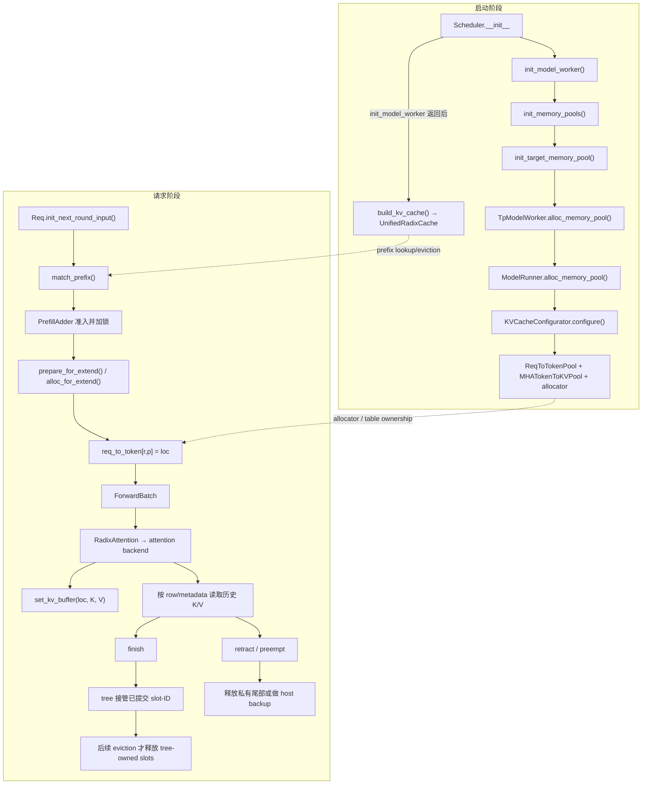
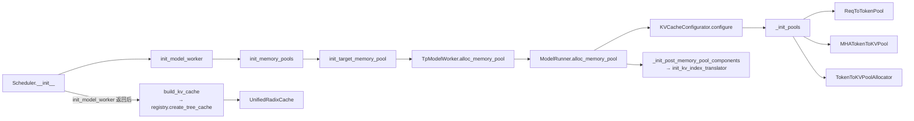
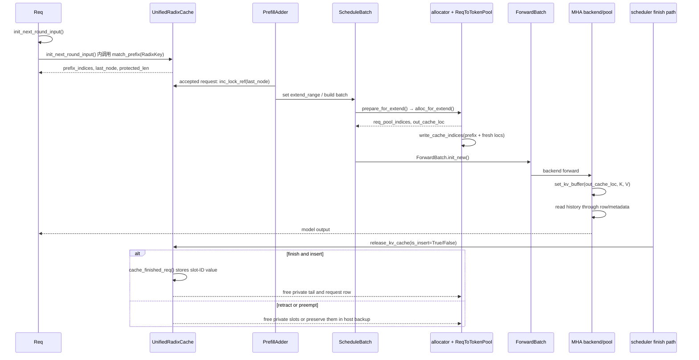
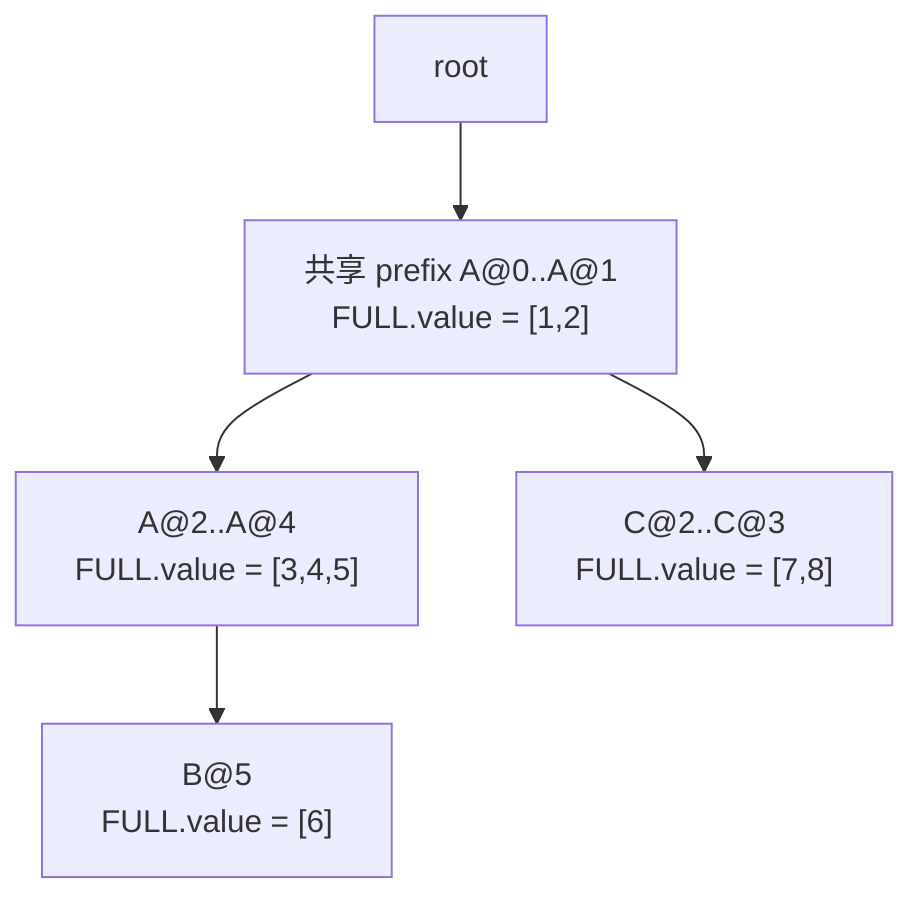

# Day 05｜SGLang Full Attention KV Cache：沿源码带读一条请求

> 源码基线：当前 checkout 的 `HEAD` 为 `89afcd44b62471051be82053ed42230f23eafc5a`（2026-09-04）。链接中的行号只用于快速定位；版本变化后请优先按函数名重新搜索。
>
> 本文采用 **source-first**：默认你已经熟悉 MHA 的基本计算，理论只保留理解 SGLang 数据布局所需的最短部分。主线固定为 CUDA、plain decoder-only MHA、Full Attention、单 worker、无 speculative decode、无 DCP/CP、无 HiCache；同时假设 prefix cache 开启，未启用 C++/LMCache/FlexKV 等 registry 替代后端，也没有显式指定其他 radix backend，因此默认树实现是 `UnifiedRadixCache` 的 `FULL` component。其他 backend 和分页分支放到边界章节。

## 0. 先确定本文要追什么

本文只回答一个实现问题：

> 一个历史 token 的 K/V，从 SGLang 启动时的 pool 创建开始，怎样经过 prefix 命中、请求分配、forward 写入、attention 读取，最后在完成或淘汰时被释放或继续复用？

MHA 理论只需要记住一件事：第 $l$ 层的历史 K/V 是按 token 保存的两块数据，当前 query 不需要进入 cache。对一个物理 slot `loc`，可以把它抽象成：

$$
K_l[\mathrm{loc}],\quad V_l[\mathrm{loc}]
$$

请求的逻辑位置并不是 `loc`。SGLang 先用 request row 把“第几个 token”映射到 slot，再由 attention backend 根据 batch metadata 读取这些 slot。

### 0.1 首屏总览



图中有两条线，但它们的职责不同：启动阶段创建对象；请求阶段只携带这些对象的索引和状态。`UnifiedRadixCache` 保存的是可复用的 slot-ID 引用，不是 K/V bytes。

### 0.2 四个 owner 先分清

| 对象 | 保存什么 | 谁写入 | 谁读取 | 生命周期 |
|---|---|---|---|---|
| `ReqToTokenPool` | request row → 逻辑 token 的 slot 表 | allocation | `ForwardBatch` 提供的 row ID + backend 的 `KVIndexTranslator` | 请求运行期间 |
| `TokenToKVPoolAllocator` | 可分配、可释放的 slot/page | allocator | allocation/eviction | pool 常驻 |
| `MHATokenToKVPool` | 每层真正的 K/V tensor | attention backend | attention backend/kernel | pool 常驻 |
| `UnifiedRadixCache` | token prefix → slot-ID tensor 副本、锁、淘汰状态 | finish/unfinished-cache | prefix lookup/eviction | cache entry 生命周期 |

后文每节都会回答四个问题：**从哪里进、状态改了什么、谁消费、下一跳去哪**。

### 0.3 这篇文档怎么带你读

不要把后面的代码块当成需要一次性背下来的 API。每一段只做一件事：先接住上一段交来的对象或字段，再把它交给下一段。读每个代码块时，按下面三个问题停一下：

1. 这一段拿到的输入是谁刚刚产生的？
2. 哪一行真正改变了状态，或把状态交给了另一个 owner？
3. 下一段会从哪里取走这个结果？

因此正文会采用“短源码 → 关键解释 → 下一跳”的节奏。解释不会逐行翻译，而是只挑会改变索引、shape、owner 或生命周期的语句。你第一次阅读时可以沿着正文走完主线；需要 debug 时，再点击同一段旁边的源码链接深入分支。

文中的 Python 代码块都标明了来源；写着“压缩展示”或“省略与主线无关字段”时，表示它是从真实源码删掉分支后的阅读版本，不保证可以原样复制运行。真正需要运行/断点时，以旁边的文件行号为准。

## 1. 启动建池：不要从 `ModelRunner` 猜入口

### 1.1 真实入口



**导航卡**

- 从哪里进：[`Scheduler.__init__`](../../python/sglang/srt/managers/scheduler.py#548-559) 调 [`init_model_worker`](../../python/sglang/srt/managers/scheduler.py#1047-1060)，返回后才调用 `build_kv_cache()`。
- 这一段看什么：`init_memory_pools()` 内的 target-only helper，以及 `TpModelWorker` 如何把入口转给 runner。
- 下一跳：[`ModelRunner.alloc_memory_pool`](../../python/sglang/srt/model_executor/model_runner.py#881-903) → `KVCacheConfigurator.configure()`。
- 先忽略什么：`draft_worker`、CUDA graph、HiCache；它们不改变 plain target pool 的创建契约。

先看外层函数，确认这不是一条凭空拼出的类名链：

```python
# scheduler.py#1047-1060，省略权重 overlap 和 warmup 细节
def init_model_worker(self):
    self.init_tp_model_worker()
    self.maybe_init_draft_worker()
    self.init_memory_pools()
    self.init_all_attention_backends()
    self.init_all_cuda_graphs()
```

**带读。** `init_memory_pools()` 位于 worker 创建之后、attention backend 初始化之前：backend 启动时已经可以拿到 pool，但 pool 创建本身不依赖 backend。接下来只展开 `init_memory_pools()` 的 target 分支，读者就能把 Mermaid 中的第一条边和真实代码对上。

Scheduler 的中间层是：

```python
# scheduler.py，保留主线语句
def init_memory_pools(self):
    self.init_target_memory_pool()
    ...

def init_target_memory_pool(self):
    ...
    self.tp_worker.alloc_memory_pool()
```

对应[`init_model_worker`](../../python/sglang/srt/managers/scheduler.py#1047-1060)、[`init_memory_pools`](../../python/sglang/srt/managers/scheduler.py#1020-1033)和[`init_target_memory_pool`](../../python/sglang/srt/managers/scheduler.py#1006-1018)。所以你在 IDE 里找不到“`init_memory_pools` 直接调用 `TpModelWorker`”是正常的，中间就是这个 helper。

**带读。** 这里有一个容易迷路的生命周期边界：`init_model_worker()` 不只是“加载模型”，它还负责把 KV pool 建好；而 `build_kv_cache()` 要等它返回，才能拿到已经存在的 pool 去创建树。也就是说，树不是先于 pool 的抽象目录，树创建时已经知道自己要管理哪一个 allocator 和哪一张 request table。记住这条先后关系，后面看到 prefix 命中时就不会误以为 radix tree 自己保存了 K/V。

接下来沿着 `init_target_memory_pool()` 往下走。这个 helper 是“target worker 需要建池”的判断点，真正把工作转交给 `TpModelWorker` 的调用就在这里。

### 1.2 `TpModelWorker` 只转交 pool 工作

**导航卡**

- 从哪里进：`Scheduler.init_target_memory_pool()`。
- 这一段看什么：它把共享的 `req_to_token_pool` / allocator 接到 runner，并调用 runner 的同名方法。
- 下一跳：`ModelRunner.alloc_memory_pool()`。
- 先忽略什么：`model_runner_list[1:]` 是同一 worker 内的其他 runner 镜像，不是另一套 cache 设计。

源码的关键部分是：

```python
# tp_worker.py#407-424
def alloc_memory_pool(
    self,
    memory_pool_config=None,
    req_to_token_pool=None,
    token_to_kv_pool_allocator=None,
):
    if req_to_token_pool is not None:
        self.req_to_token_pool = req_to_token_pool
        self.model_runner.req_to_token_pool = req_to_token_pool
    if token_to_kv_pool_allocator is not None:
        self.token_to_kv_pool_allocator = token_to_kv_pool_allocator
        self.model_runner.token_to_kv_pool_allocator = token_to_kv_pool_allocator
    self.model_runner.alloc_memory_pool(memory_pool_config)
```

完整入口见[`TpModelWorker.alloc_memory_pool`](../../python/sglang/srt/managers/tp_worker.py#407-433)。它不是 KV layout 的实现者；它负责把 worker 级依赖传给 `ModelRunner`。

**带读。** 这段没有分配 tensor，反而很重要：如果调用方传入了已有的 `req_to_token_pool` 或 allocator，worker 先把同一个对象的引用接到自己和 `model_runner` 上；没有传入时，才让 runner 自己按配置创建。这样 draft worker 或同一 worker 的多个 runner 可以共享地址管理，而不会悄悄复制一套映射表。最后一行才是本条主线的下一跳：进入 `ModelRunner.alloc_memory_pool()`。

### 1.3 `ModelRunner` 接收 configurator 的结果

```python
# model_runner.py#881-902，省略与主线无关的字段
def alloc_memory_pool(self, memory_pool_config=None):
    if memory_pool_config is not None:
        self.memory_pool_config = memory_pool_config
    self.init_kv_cache_configurator()
    result = self.kv_cache_configurator.configure(
        pre_model_load_memory=self.pre_model_load_memory
    )
    self.max_total_num_tokens = result.max_total_num_tokens
    self.req_to_token_pool = result.req_to_token_pool
    self.token_to_kv_pool = result.token_to_kv_pool
    self.token_to_kv_pool_allocator = result.token_to_kv_pool_allocator
    self._init_post_memory_pool_components()
```

这里最容易误读的点是：`configure()` 返回的是一组已经创建好的对象；`ModelRunner` 只是接住并保存引用。`_init_post_memory_pool_components()` 随后调用[`init_kv_index_translator`](../../python/sglang/srt/model_executor/model_runner.py#869-879)，这是读表转换器的后置接线，不是 pool 构造的一部分。

**带读。** `ModelRunner` 在这里完成的是“接线”，不是“决定每个 token 怎么算”。`configure()` 根据显存预算和模型配置完成构造，返回的 `result` 里已经有三种不同职责的对象；这几行把它们保存成 runner 后续 forward 会使用的属性。最后的 `_init_post_memory_pool_components()` 把 `req_to_token`、allocator 和 KV pool 交给 translator，形成从请求行到 kernel-facing index 的读路径。现在 pool 的 owner 已经确定，下一段才去看 configurator 如何选择具体实现。

### 1.4 configurator 选择 plain MHA 的三个对象

**导航卡**

- 从哪里进：`KVCacheConfigurator.configure()`。
- 这一段看什么：`_init_pools()` 返回 `req_to_token_pool`、`token_to_kv_pool`、`token_to_kv_pool_allocator`。
- 下一跳：plain MHA 继续到 `_build_token_to_kv_pool()`、`_build_mha_kv_pool()` 和 allocator 分支。
- 先忽略什么：unified memory、hybrid SWA/Mamba、DSA/MLA 分支。

入口见[`configure`](../../python/sglang/srt/mem_cache/kv_cache_configurator.py#296-329)和[`_init_pools`](../../python/sglang/srt/mem_cache/kv_cache_configurator.py#397-595)。plain MHA 的关键构造点是：

- request table：[`_build_req_to_token_pool`](../../python/sglang/srt/mem_cache/kv_cache_configurator.py#938-966)；
- MHA backing：[`_build_mha_kv_pool`](../../python/sglang/srt/mem_cache/kv_cache_configurator.py#1796-1830)；
- allocator：[`_build_token_to_kv_pool_allocator`](../../python/sglang/srt/mem_cache/kv_cache_configurator.py#1832-1960)。

普通 CUDA、`page_size=1`、无 DCP 时，allocator 分支选择[`TokenToKVPoolAllocator`](../../python/sglang/srt/mem_cache/kv_cache_configurator.py#1928-1937)；否则会进入 paged 或硬件专用 allocator。`build_kv_cache()` 是下一阶段：[`kv_cache_builder.build_kv_cache`](../../python/sglang/srt/mem_cache/kv_cache_builder.py#197-370)取已有 pool，再由[`registry.create_tree_cache`](../../python/sglang/srt/mem_cache/registry.py#80-196)选择 `UnifiedRadixCache`。

**带读。** `configure()` 的关键不是函数名，而是它把“同一个抽象契约”落成三种对象：一张 row→slot 表、一块按 slot 存 K/V 的 backing，以及一个发放/回收 slot 的 allocator。分支条件只决定具体类和布局；后面请求生命周期依赖的仍是这三个契约。到这里可以先暂停启动链：pool 已经存在，tree 也拿到了 pool 的引用；接下来我们只追一个请求如何使用这些对象。

## 2. 先分清 row、slot、K/V 和 tree

这一节是后面读请求生命周期的词典。不要把它们都叫“cache index”。

### 2.1 request row：`ReqToTokenPool`

**导航卡**

- 从哪里进：`KVCacheConfigurator._build_req_to_token_pool()`。
- 这一段看什么：`req_to_token` 的 shape、dummy row、`alloc_rows/free_rows`。
- 下一跳：`allocation.write_cache_indices()` 把 prefix 和新 slot 写入这张表。

源码在[`ReqToTokenPool`](../../python/sglang/srt/mem_cache/memory_pool.py#257-337)：

```python
# memory_pool.py#273-283
self._alloc_size = size + 1
self.req_to_token = torch.zeros(
    (self._alloc_size, max_context_len),
    dtype=torch.int32,
    device=device,
)
self.free_slots = list(range(1, self._alloc_size))
```

因此：

- `r` 是 request row，不是 KV slot；
- `p` 是请求内逻辑 token 位置；
- `req_to_token[r, p]` 的值才是 `loc`；
- row 0 是 padding/dummy，真实 row 从 1 开始；
- `free_rows()` 只归还 request row，不自动释放 row 指向的 K/V slot。

**带读。** 可以先用一个具体索引把这张表固定下来：假设 `req_pool_idx=4`，请求中的第 2 个 token 对应 `req_to_token[4, 2] = 17`，那么 `4` 是“这条请求占用的行”，`2` 是逻辑位置，`17` 才是 K/V pool 的物理 slot。表里只存最后这个整数，不存 K/V 数值。这样做的好处是请求结束时可以归还 row，而 slot 的释放仍由 allocator/tree 根据自己的生命周期决定；两种回收不会互相混淆。

下一段沿着值 `17` 继续走：它会被拿去索引 `MHATokenToKVPool` 的第一维。

### 2.2 K/V 数值：`MHATokenToKVPool`

MHA 理论在这里落地成物理 tensor。默认 NHD layout 的核心 shape 是：

$$
K_l\in\mathbb{R}^{(\mathrm{size}+\mathrm{page\_size})\times H_{kv}\times D_k},
\qquad
V_l\in\mathbb{R}^{(\mathrm{size}+\mathrm{page\_size})\times H_{kv}\times D_v}.
$$

对应源码 `_kv_buffer_shapes()` 的返回值是 `(rows, head_num, head_dim)` 和 `(rows, head_num, v_head_dim)`，其中 `rows=size+page_size`：[`memory_pool.py#2099-2110`](../../python/sglang/srt/mem_cache/memory_pool.py#2099-2110)。buffer 的实际创建在[`#2112-2163`](../../python/sglang/srt/mem_cache/memory_pool.py#2112-2163)。

这里的第一维不是某条请求的长度，而是全局可寻址的 slot 行。第二维是当前 TP rank 负责的 KV heads，最后一维是每个 head 的维度；`layer_num` 则让 pool 为每个有效 layer 各持有一对 K/V buffer。因此同一个 `loc=17` 在不同 layer 中代表不同的一行数值，但在同一 layer 内，K 和 V 共享这个 slot 坐标。

**导航卡**

- 从哪里进：`KVCacheConfigurator._build_mha_kv_pool()`。
- 这一段看什么：每个有效 layer 一对 `k_buffer/v_buffer`，以及 `set_kv_buffer()` 如何把 `loc` 映射到物理行。
- 下一跳：attention backend 在 forward 中调用 `set_kv_buffer()`，随后 wrapper 读取 `get_kv_buffer()`。

写入接口的关键契约是：

```python
# memory_pool.py#2381-2460，压缩展示
def set_kv_buffer(
    self,
    layer,
    loc_info,
    cache_k,
    cache_v,
    k_scale=None,
    v_scale=None,
    layer_id_override=None,
    dcp_kv_mask=None,
):
    loc, _, _ = unwrap_write_loc(loc_info)
    layer_id = layer_id_override or layer.layer_id
    ...
    self._store_kv_layer(layer_id - self.start_layer, loc, cache_k, cache_v)
```

它只关心 `loc`、当前层和 K/V 数值，不知道 token hash、radix node 或请求锁。完整实现见[`MHATokenToKVPool.set_kv_buffer`](../../python/sglang/srt/mem_cache/memory_pool.py#2381-2460)。

**带读。** `unwrap_write_loc()` 只是把 backend 可能携带的附加定位信息拆出真正的 `loc`；随后 `layer_id` 决定写哪一对 per-layer buffer，最后 `_store_kv_layer()` 才执行物理写入。注意这里完全没有 token ID 匹配或树操作，所以它只能消费上游已经准备好的地址。下一段的 allocator 正是这些地址的生产者。

### 2.3 allocator：谁给出 `loc`

在本文忽略 disaggregation 的 `release_pages` 分支时，plain CUDA `page_size=1` 的 `TokenToKVPoolAllocator` free list 从 1 开始，slot 0 保留给 dummy 写入：

```python
# allocator/token.py#42-63
def clear(self):
    self.free_pages = torch.arange(
        1, self.size + 1, dtype=torch.int64, device=self.device
    )

def alloc(self, need_size):
    select_index = self.free_pages[:need_size]
    self.free_pages = self.free_pages[need_size:]
    return select_index
```

所以在这个主线里，allocator 返回的是一维 `int64` slot tensor；它不写 `req_to_token`，也不写 K/V。`allocation.py` 把这两个动作接起来。

**带读。** allocator 的职责可以刻意说得很窄：它只回答“这次给你哪些可写地址”。`alloc()` 消耗 free list，`write_cache_indices()` 才把地址放进某个 request row，attention backend 再把 K/V 数值写到这些地址。slot 0 作为 dummy 的原因是 CUDA graph 或 padding token 可能需要一个安全的落点；它不是一条真实请求的缓存。

`page_size>1` 时，allocator 可能按 page 申请、按 token-slot 返回；这会引入 page ID、offset 和 page table，但不会改变“allocator 给地址、pool 存数值”的 ownership。只在第 7 节简述，不把它混进主线。

### 2.4 prefix tree：`UnifiedRadixCache` 保存的是 slot-ID 副本

`build_kv_cache()` 创建 tree 后，`UnifiedRadixCache`/`UnifiedTreeCore` 管理的是：

| tree 内状态 | 含义 |
|---|---|
| `RadixKey` | token IDs、`extra_key`、`cache_salt` 等逻辑身份 |
| `FULL.value` | 在本文 plain Full Attention 路径中，是一维 slot-ID tensor 的副本 |
| `NodeId`/lock | 节点的保护和淘汰状态 |

它不保存 K/V bytes。命中时返回 `device_indices`，attention 仍通过 request row 或 translator 访问真正的 pool；其他 component（如 SWA、Mamba、C128）可能有不同的 value 语义。

**带读。** 这解释了 prefix cache 的“复用”到底复用了什么：树复用的是一串已经算过的物理地址，而不是把 K/V 从一个节点复制到另一个节点。命中后，请求只需把这串 slot-ID 接到自己的 row 上；后续 kernel 通过 row/translator 找回同一批 K/V。树负责逻辑身份、锁和淘汰，pool 负责数值，这两个 owner 要一直分开看。

入口：[`UnifiedRadixCache.match_prefix`](../../python/sglang/srt/mem_cache/unified_radix_cache.py#523-539)、[`UnifiedTreeCore.match_prefix`](../../python/sglang/srt/mem_cache/unified_cache/unified_tree_core.py#698-810)。当前 plain MHA 默认 component 是 `FULL`，选择见[`registry.py#146-196`](../../python/sglang/srt/mem_cache/registry.py#146-196)。

### 2.5 请求上的几个长度字段

这些字段都描述“这条请求如何使用地址”，不是 K/V tensor 的另一份副本：

| 字段 | 语义 | 谁更新 |
|---|---|---|
| `prefix_indices` | prefix lookup 返回、可以直接复用的 slot-ID 向量 | `match_prefix()` |
| `cache_protected_len` | 当前请求需要 tree lock 保护的前缀边界 | lookup / unfinished-cache rematch |
| `kv_allocated_len` | request row 已经拿到 slot 的逻辑长度 | `alloc_for_extend()` / `alloc_for_decode()` |
| `kv_committed_len` | 当前已纳入有效上下文、可交给 finish/tree 处理的长度 | plain、无 overlap 的主线中通常随 allocation 更新；其他路径可能滞后 |

`kv_committed_len` 不是“kernel 已经写完 K/V”的回执：plain 主线的 extend 分配阶段就在[`allocation.py#385-387`](../../python/sglang/srt/mem_cache/allocation.py#385-387)更新它；异常、overlap 或 speculative 路径可能再按自己的提交/回滚逻辑调整。finish 时，`effective_kv_committed_len` 决定 tree 接管到哪里，其余 overallocated 区间单独释放。

到这里，四个 owner 和四个长度/索引字段已经齐了。接下来不再介绍新对象，而是按时间顺序看它们如何接力：先 lookup 得到可复用 slot，再 admission 保护它，随后 allocation 把 prefix 和新 slot 写进 row，最后 forward 消费这张 row。

## 3. 一条请求的源码生命周期

### 3.1 全流程先看一遍



下面每节只展开一跳，不重新讲整张图。

图中 `finish` 和 `retract/preempt` 故意分开：前者可能把已提交的 slot-ID 留给 tree，后者处理仍属于运行中请求的地址，必要时做 backup。两者都经过 release 相关代码，但后续 owner 不同。

### 3.2 lookup：`Req` 先拿到 prefix slot 向量

**导航卡**

- 从哪里进：scheduler 的 prefill loop；请求内部进入[`Req.init_next_round_input`](../../python/sglang/srt/managers/schedule_batch.py#1390-1490)。
- 这一段看什么：`key_limit`、`RadixKey`、`match_result.device_indices`。
- 下一跳：`PrefillAdder.add_one_req()` 做预算和准入锁。
- 先忽略什么：SWA reprefill、session、HiCache；它们会改变 lookup 上限或 host 状态，但不改变基本返回契约。

关键源码关系是：

```python
# schedule_batch.py#1419-1489，压缩展示
token_ids_to_match = self.full_untruncated_fill_ids
key_limit = self._compute_max_prefix_len(input_len)
match_result = tree_cache.match_prefix(
    MatchPrefixParams(
        key=RadixKey(token_ids_to_match, self.extra_key,
                    limit=key_limit, cache_salt=self.cache_salt),
        req=self,
    )
)
self.prefix_indices = match_result.device_indices
self.last_node = match_result.last_device_node
self.kv.cache_protected_len = (
    match_result.cache_protected_len
    if match_result.cache_protected_len is not None
    else len(self.prefix_indices)
)
```

`prefix_indices` 是设备上的 slot-ID 向量；它不是 K/V 数值，也不是 row。lookup 只返回“可以复用哪些地址”，不会复制 37-token 的 K/V。

**逐步读这段。** 第一行拿的是完整 token 序列，避免为了匹配 prefix 先复制一份数组；第二行通过 `_compute_max_prefix_len()` 把可匹配长度限制为 `input_len - 1`（普通路径要留下当前要预测/计算的 token）。`match_prefix()` 消费的是 token key，返回的 `device_indices` 才转成后续 attention 可用的 slot-ID。最后三行把结果写回 `Req`：`prefix_indices` 给 allocation 使用，`last_node` 给 lock 使用，`cache_protected_len` 给 finish/release 使用。

所以 lookup 的产物不是“请求已经拥有一整行 cache”，而是一个待接入的 prefix 地址向量。下一跳 admission 必须先保护它，才能安全地分配 suffix。

### 3.3 admission：找到节点不等于已经分配 row

`PrefillAdder.add_one_req()` 先在 [`_lock_node`](../../python/sglang/srt/managers/schedule_policy.py#1024-1039) 里临时加锁做预算判断；请求真正被接受后，再由 `_req_inc_lock_ref()` 保持 `last_node` 的请求级保护，避免 allocation 期间 prefix 被 eviction。相关入口在 [`schedule_policy.py#926-932`](../../python/sglang/srt/managers/schedule_policy.py#926-932) 和 [`#1177-1352`](../../python/sglang/srt/managers/schedule_policy.py#1177-1352)。

这一步的状态变化只有：

| 此前 | 此后 |
|---|---|
| `prefix_indices` / `last_node` 已由 lookup 得到 | 命中路径被 lock，request 进入 `can_run_list` |
| `req.kv.req_pool_idx is None` | 仍可能是 `None` |
| 没有本轮新 slot | 仍没有本轮新 slot |

真正分配 row 和 slot 的下一跳是 `ScheduleBatch.prepare_for_extend()`，不是 `PrefillAdder`。

**为什么要分成两步？** lookup 面向的是共享 tree，allocation 面向的是当前 batch。两者之间可能有显存压力、prefill token 预算或并发请求竞争；lock 只保证“刚刚命中的 tree 节点在这段决策期间不能被淘汰”，并不等于已经拿到了 request row。读到这里时，可以把请求记成：`prefix_indices` 已知、prefix 被保护、suffix 还没有地址。

### 3.4 extend：一次分 row、分 slot、写 request table

**导航卡**

- 从哪里进：scheduler 建好 `ScheduleBatch` 后调用[`prepare_for_extend`](../../python/sglang/srt/managers/schedule_batch.py#2504-2552)。
- 这一段看什么：`prefix_lens`、`extend_lens`、`out_cache_loc`，以及 `alloc_for_extend()` 的三步。
- 下一跳：`ForwardBatch.init_new()` 把这些字段带进 model runner。
- 先忽略什么：KV reuse、DSV4-NPU、hybrid SWA 专用钩子。

`prepare_for_extend()` 先计算本轮输入和长度：

```python
# schedule_batch.py#2513-2517
input_ids = [r.get_fill_ids()[len(r.prefix_indices):] for r in reqs]
extend_num_tokens = sum(len(ids) for ids in input_ids)
seq_lens = [r.extend_range.end for r in reqs]
prefix_lens = [len(r.prefix_indices) for r in reqs]
extend_lens = [r.extend_range.length for r in reqs]
```

随后进入[`alloc_for_extend`](../../python/sglang/srt/mem_cache/allocation.py#282-389)：

```python
# allocation.py#312-366
req_pool_indices = alloc_req_slots(...)
if alloc_page_size == 1:
    out_cache_loc = alloc_token_slots(tree_cache, batch.extend_num_tokens)
else:
    out_cache_loc = alloc_paged_token_slots_extend(...)
write_cache_indices(
    out_cache_loc, req_pool_indices_device, req_pool_indices_cpu,
    prefix_lens_device, prefix_lens_cpu, batch.seq_lens,
    batch.seq_lens_cpu, extend_lens_device, extend_lens_cpu,
    prefix_tensors, batch.req_to_token_pool,
)
```

其中 `write_cache_indices()` 做的不是抽象“绑定”，而是两次写表：先把 `prefix_tensors` 写到 row 的前缀区，再把 packed 的 `out_cache_loc` 按每个请求的 `extend_len` 切片写到 suffix 区，具体见[`allocation.py#54-103`](../../python/sglang/srt/mem_cache/allocation.py#54-103)。

本轮最重要的字段关系：

| 字段 | 含义 | 典型 shape |
|---|---|---|
| `req_pool_indices` | batch lane 对应哪一行 request table | `[batch]` |
| `prefix_lens` | 每条请求已有多少可复用 token | `[batch]` |
| `out_cache_loc` | 本轮新 K/V 要写的 slot，按 batch packed | `[extend_num_tokens]` |
| `req_to_token` | 全局 request table 中的 prefix + suffix 映射 | `[pool_rows, max_context_len]` |

**关键结论：** `out_cache_loc` 只包含本轮新写入的 suffix；命中的 prefix 不会再次出现在里面。

**带读。** 这段 allocation 的顺序可以压缩成三件事：先给请求找 row，再给本轮新 token 找 slot，最后把两段地址（已有 prefix + 新 suffix）拼回 row。`prefix_lens` 决定每条请求从 packed 的 `out_cache_loc` 中切哪一段；因此 `out_cache_loc` 是 batch 级的一维数组，而 `req_to_token` 是按请求行组织的二维表。`ForwardBatch` 下一步只需要携带这两个结果，不需要重新做一次 prefix 匹配。

此时 K/V 数值还没有写入。allocation 只把“将来写到哪里”准备好；真正产生 K/V 并写入 `loc` 的动作要等模型 forward 经过 attention backend。

### 3.5 decode：只追加当前位置

对已经持有有效 KV、普通且非 speculative 的连续 decode 请求而言，decode 不重新做 prefix lookup。`ScheduleBatch.prepare_for_decode()` 在[`schedule_batch.py#3287-3334`](../../python/sglang/srt/managers/schedule_batch.py#3287-3334)调[`alloc_for_decode`](../../python/sglang/srt/mem_cache/allocation.py#521-584)。plain `page_size=1` 的主线是：

```python
# allocation.py#534-561
out_cache_loc = alloc_token_slots(tree_cache, bs * token_per_req)
locs = batch.seq_lens.clone()
batch.req_to_token_pool.write(
    (batch.req_pool_indices, locs), out_cache_loc.to(torch.int32)
)
```

这表示每个 request row 在旧的 `seq_len` 位置追加一个新 slot；随后 `seq_lens`、`kv_allocated_len` 和（在这条 plain 主线中）`kv_committed_len` 增加。retract 后重建 row、session/unfinished-cache 修正，以及 speculative verify 可能重新建立或修正 prefix 状态，先放到边界章节。

decode 和 extend 的差别只在“本轮新增多少 token”：extend 通常一次为 prompt suffix 分配一段 packed slot，decode 则在每行当前长度的位置追加一个（或少量）slot。无论哪种模式，写表动作都先发生，backend 才能用新的 `out_cache_loc` 写入当前 K/V。

### 3.6 `ForwardBatch`：把索引交给 runner，不拥有 K/V

`ForwardBatch` 的核心字段定义在[`forward_batch_info.py#393-411`](../../python/sglang/srt/model_executor/forward_batch_info.py#393-411)：

| 字段 | 作用 |
|---|---|
| `input_ids` | 本轮要计算的 token |
| `req_pool_indices` | 去 `ReqToTokenPool` 取哪几行 |
| `seq_lens` | 每条请求当前可见长度 |
| `out_cache_loc` | 当前 K/V 写入哪些 slot |
| `seq_lens_sum` | backend 构造 metadata 的长度汇总 |

`ForwardBatch.init_new()` 在[`#722-830`](../../python/sglang/srt/model_executor/forward_batch_info.py#722-830)从 `ScheduleBatch` 组装这些字段；随后在[`#830`](../../python/sglang/srt/model_executor/forward_batch_info.py#830)重新绑定本轮的 write location。它是本轮 forward 的索引快照，不是另一份 cache。

**带读。** 这里是 scheduler 世界和 model-runner 世界的交界：scheduler 负责决定请求行、长度和写入位置，`ForwardBatch` 把决定结果冻结成一次 forward 的输入快照。它携带构造读表所需的 `req_pool_indices + seq_lens`，以及当前 K/V 的 `out_cache_loc`；attention backend 再通过 [`KVIndexTranslator.index_table_for_batch`](../../python/sglang/srt/mem_cache/kv_index_translator.py#290-320) 生成 kernel-facing read table。表本身与 K/V backing 仍由 runner/backend 持有，因此 forward 结束后，真正需要回收的仍然是 allocator/tree 里的 slot，而不是 `ForwardBatch` 自己。

这一步实际产出两个方向的地址：`out_cache_loc` 给“写当前 K/V”的路径，`req_pool_indices + seq_lens` 给“构造历史读取表”的路径。把两者分开，后面读 `forward_extend()` 时就不会把 write location 误认为完整的 read table。

## 4. forward：先写本轮 K/V，再读历史

### 4.1 `RadixAttention` 不查 radix tree

prefix lookup 已经发生在 scheduler admission。模型层的[`RadixAttention.forward`](../../python/sglang/srt/layers/radix_attention.py#157-298)不负责再次比较 token IDs 或访问 `UnifiedTreeCore`；它把 `q/k/v` 和 `ForwardBatch` 交给统一 attention op 或具体 backend。

**导航卡**

- 从哪里进：模型层 `RadixAttention.forward()`。
- 这一段看什么：backend 的 `forward_extend/forward_decode` 接收到 `out_cache_loc` 和读表 metadata。
- 下一跳：以 FlashInfer 为例进入 `init_forward_metadata()`、`forward_extend()` 或 `forward_decode()`。
- 先忽略什么：Triton/FA3/TRTLLM 的 wrapper 差异；它们换 kernel metadata，但共享 pool 的写入契约。

这一步是一个重要的边界：到 scheduler 为止，系统只是在组织地址；从 `RadixAttention.forward()` 开始，模型才拿着当前 token 的 `q/k/v` 真正做计算。不要把“命中了 radix prefix”理解成 attention 层又查了一遍树；attention 只消费已经整理好的 batch metadata。

### 4.2 FlashInfer extend：`out_cache_loc` 写当前 K/V

FlashInfer 的[`forward_extend`](../../python/sglang/srt/layers/attention/flashinfer_backend.py#1314-1472)在 paged 分支的顺序很直白：

```python
# flashinfer_backend.py#1341-1377
pool = self.token_to_kv_pool
kv_cache = pool.get_kv_buffer(layer.layer_id)
if k is not None and save_kv_cache:
    self.token_to_kv_pool.set_kv_buffer(
        layer,
        KVWriteLoc(cache_loc, self.forward_metadata.swa_out_cache_loc),
        k,
        v,
        *self._kv_write_scales(layer),
    )
o = prefill_wrapper_paged.forward(q, kv_cache, ...)
```

这里 `cache_loc` 来自 `forward_batch.out_cache_loc`（普通 self-attention 分支见[`#1326-1330`](../../python/sglang/srt/layers/attention/flashinfer_backend.py#1326-1330)）。因此当前 token 的 K/V 先写进 pool，wrapper 才按 metadata 读完整历史。ragged 分支会把当前 K/V 作为输入合并，不能把“所有 backend 都只读 pool”当成普遍规律。

**逐行抓重点。** `get_kv_buffer()` 先拿到当前 layer 的 backing；`set_kv_buffer()` 用 allocation 阶段传下来的 `cache_loc` 写入当前这一批 K/V；`prefill_wrapper_paged.forward()` 随后用读表和长度 metadata 读取 prefix 加 suffix。也就是说，同一个 token 在这段代码中经过了两个不同接口：写入接口接收 `out_cache_loc`，读取接口接收 kernel-facing 的 index table。两者都指向同一块 pool，但职责不同。

### 4.3 FlashInfer decode：同一契约，写入长度不同

[`forward_decode`](../../python/sglang/srt/layers/attention/flashinfer_backend.py#1474-1531)仍然先调用 `set_kv_buffer()`（[`#1493-1502`](../../python/sglang/srt/layers/attention/flashinfer_backend.py#1493-1502)），然后拿 `get_kv_buffer()`（[`#1517-1519`](../../python/sglang/srt/layers/attention/flashinfer_backend.py#1517-1519)）交给 decode wrapper（[`#1521-1529`](../../python/sglang/srt/layers/attention/flashinfer_backend.py#1521-1529)）。差别只是 decode 通常每个 request 每轮追加一个位置，`out_cache_loc` 的 shape 从 packed extend 长度变成 batch 级长度。

因此可以把 extend/decode 共同契约记成一句话：**先用本轮写地址落地 K/V，再用读表把完整上下文交给 kernel；变化的是批量形状，不是 owner 关系。**

### 4.4 backend 如何拿到读表

`init_forward_metadata()` 会向 `KVIndexTranslator.index_table_for_batch()` 要 kernel-facing 的读表；translator 的入口见[`kv_index_translator.py#290-320`](../../python/sglang/srt/mem_cache/kv_index_translator.py#290-320)。普通 pool 可能直接透传 `req_to_token` 的 token IDs；统一内存、DCP 或 paged backend 才需要进一步翻译或展开。

因此 backend 通常不知道：

- token hash 是否命中；
- 哪个 radix `NodeId` 拥有 prefix；
- lock/refcount 是否为零；
- 某个 slot 是刚申请的还是 prefix 复用的。

它只消费本轮 metadata 和 K/V buffer。

这也是为什么 debug 时要沿两个方向分别追：如果当前 token 的数值不对，先查 `set_kv_buffer()` 和 `out_cache_loc`；如果历史长度或读取范围不对，查 `req_to_token`、`seq_lens` 和 `KVIndexTranslator`。不要一看到 attention 输出错误就直接跳进 kernel。

## 5. 一个受控但真实的状态 trace

这一节用小数字模拟源码的 plain `page_size=1` 路径。数字是人为固定的 free-list 初态，不代表所有部署都会得到同样的 row/slot 编号。

### 5.1 固定条件

| 项目 | 本例设定 |
|---|---|
| request rows | `[1,2,3,4]` 可用；row 0 dummy；`ReqToTokenPool.alloc_rows()` 从尾部取 |
| KV slots | `[1,2,...]` 可用；slot 0 dummy；`TokenToKVPoolAllocator.alloc()` 从前部取 |
| page | `page_size=1`，不引入 page-table 分支 |
| 请求 | A 长度 5；B 与 A 前 5 个 token 相同并追加 1 个；C 与 A 前 2 个 token 相同，之后分叉并有 2 个新 token |
| 调度 | A 先完成；B/C 在同一个 extend batch；无 eviction、无 chunk |

### 5.2 Checkpoint 1：A lookup 后

`A` 的 `input_len=5`，普通 prefix lookup 会按 `key_limit` 留出最后一个 token；树为空，所以：

| 字段 | 值 |
|---|---|
| `prefix_indices` | `[]` |
| `extend_range` | `[0,5)` |
| `last_node` | root/empty match |
| lock | 没有可保护的 prefix |

入口是[`Req.init_next_round_input`](../../python/sglang/srt/managers/schedule_batch.py#1390-1490)，准入随后进入 `PrefillAdder.add_one_req()`。

此刻 A 只有“逻辑输入”和一个空的匹配结果，还没有 request row，也没有新 slot。这个 checkpoint 的意义是把 lookup 和 allocation 分开：树为空并不代表 allocator 已经运行，只代表下一轮需要为全部 5 个 token 申请新地址。

### 5.3 Checkpoint 2：A allocation 与 forward 后

`alloc_for_extend()` 先取一个 row，再取 5 个新 slot：

| 状态 | 值 |
|---|---|
| `req_pool_idx(A)` | `4`（从 `[1,2,3,4]` 尾部取） |
| `out_cache_loc` | `[1,2,3,4,5]` |
| `req_to_token[4,:5]` | `[1,2,3,4,5]` |
| `ForwardBatch.out_cache_loc` | `[1,2,3,4,5]` |
| forward 写入 | 每个 Full Attention layer 的 K/V buffer 对应这些 slot |

backend 写完 K/V 后，A 完成；`release_kv_cache(is_insert=True)` 把这段 slot-ID 的副本交给 tree。此时 row 4 可以归还，但 slots 1–5 仍被 tree 引用。

这里第一次出现两个并行生命周期：A 的 row 是临时工作区，随着请求结束可以释放；A 的 slot 可能因为被 tree 接管而继续存活。之后 B 命中 A 时，复用的正是 `[1,2,3,4,5]` 这串地址，而不是重新计算或复制一份 K/V。

### 5.4 Checkpoint 3：B/C lookup 与同批 allocation

假设 A 的 prefix entry 仍在 device、未被淘汰：

| 请求 | token 关系 | `prefix_indices` | `extend_lens` |
|---|---|---|---:|
| B | `A@0..A@4, B@5` | `[1,2,3,4,5]` | 1 |
| C | `A@0,A@1,C@2,C@3` | `[1,2]` | 2 |

`ScheduleBatch.prepare_for_extend()` 把两条 suffix packed 成 3 个 token；一次 `alloc_for_extend()` 取两个 request row 和三个 KV slots：

| 字段 | 值 |
|---|---|
| `req_pool_indices` | `[3,4]`（row 4 被复用，但它不等于 A 的旧 K/V slot） |
| `out_cache_loc` | `[6,7,8]` |
| `req_to_token[3,:6]`（B） | `[1,2,3,4,5,6]` |
| `req_to_token[4,:4]`（C） | `[1,2,7,8]` |
| packed `input_ids` | `[B@5,C@2,C@3]` |

这一轮 forward 只把 slot 6–8 写入 K/V pool；prefix 的 slot 1–5 由各自 row 读取，不发生 5-token K/V copy。

这就是 prefix reuse 在代码层面的最小证据：B/C 的 `out_cache_loc` 只有新 suffix，旧 prefix 只通过 `write_cache_indices()` 写进各自 row。于是 batch 可以把不同请求的 suffix packed 在一起，同时让每条请求沿自己的 row 读取共享前缀。

### 5.5 Checkpoint 4：B/C 完成后

tree 的逻辑关系可以用状态图表示：



图里的 `FULL.value` 仍是 slot-ID tensor；K/V 数值一直在 `MHATokenToKVPool`。B/C 的 request rows 可以释放，tree 继续保护它们引用的 slots，直到 eviction。

如果你要在 debug 中验证这张图，不要只打印 tree node；同时打印 `req.kv.req_pool_idx`、`req_to_token[row, :seq_len]` 和 allocator 的 free list。三者分别对应请求工作区、地址映射和可用地址，缺一项都可能把“row 被复用”误判成“K/V 被覆盖”。

## 6. 完成、chunk、eviction：三种状态变化不要混写

### 6.1 finish：tree 接管 slot-ID，pool 不复制 bytes

**导航卡**

- 从哪里进：结果处理器或 decode finish state。
- 这一段看什么：`release_kv_cache()` 的 `is_insert`、`kv_len_to_handle`，以及 `cache_finished_req()` 的 `req_to_token` 读取。
- 下一跳：tree insert 后释放未对齐尾部、过分配区间和 request row。

[`release_kv_cache`](../../python/sglang/srt/mem_cache/common.py#254-297)的核心顺序：

```python
# common.py#269-296
effective_kv_committed_len = req.effective_kv_committed_len()
tree_cache.cache_finished_req(
    req,
    is_insert=is_insert and not req.skip_radix_cache_insert,
    kv_len_to_handle=effective_kv_committed_len,
)
_release_overallocated_kv_indices(...)
tree_cache.req_to_token_pool.free(req)
req.kv.mark_kv_released()
```

`UnifiedRadixCache.cache_finished_req()` 先从 request row 取 token IDs 和 slot IDs（[`#850-854`](../../python/sglang/srt/mem_cache/unified_radix_cache.py#850-854)），再把 `kv_indices[:page_aligned_len].to(..., copy=True)` 放进 `insert_params.value`（[`#858-896`](../../python/sglang/srt/mem_cache/unified_radix_cache.py#858-896)）。这就是“tree 接管地址引用”的准确含义：复制的是 slot-ID tensor，不是 K/V bytes。

**带读。** `release_kv_cache()` 先根据 `effective_kv_committed_len` 决定哪些逻辑位置已经值得缓存；tree 插入时构造 `RadixKey`，并复制 slot-ID value，未对齐尾部及 overallocated 区间随后交还 allocator，最后 request row 才释放。顺序不能反过来：如果先归还 row，tree 就无法从 row 读取要接管的 slot-ID；如果先释放 slot，tree 保存的地址又会立即失效。

### 6.2 chunked prefill：中间结果也可能进树

chunked prefill 不必放进主线，但要记住它不是 finish 的简单别名：

- 入口：[`maybe_cache_unfinished_req`](../../python/sglang/srt/mem_cache/common.py#161-165) → [`cache_unfinished_req`](../../python/sglang/srt/mem_cache/unified_radix_cache.py#925-1048)；
- 它插入已经计算完成且 page-aligned 的前缀；
- 插入后会重新 `match_prefix()`，把 canonical `new_indices` 写回 request row（[`#993-1008`](../../python/sglang/srt/mem_cache/unified_radix_cache.py#993-1008)）；
- 旧 lock 释放、新的 last node 重新加锁（[`#1010-1037`](../../python/sglang/srt/mem_cache/unified_radix_cache.py#1010-1037)）。

### 6.3 eviction ≠ retract/preempt

| 动作 | 作用对象 | 是否插入 tree |
|---|---|---|
| prefix hit | 请求复用已有 slot-ID | 否 |
| finish | request 私有尾部释放；已提交 prefix 交给 tree | 通常是 |
| eviction | lock=0 的 tree cache node，归还其 slot/page | 删除/失效已有 entry |
| retract/preempt | 正在运行的 request row/私有 slot，必要时做 host backup | 否，通常 `is_insert=False` |

slot 不够时，[`alloc_token_slots`](../../python/sglang/srt/mem_cache/allocation.py#150-170)先调用[`evict_from_tree_cache`](../../python/sglang/srt/mem_cache/common.py#168-195)，只把 allocator 的 shortfall 交给 `tree_cache.evict_for_alloc()`。这不是调度器抢占运行请求。运行请求的释放入口是[`ScheduleBatch.release_req`](../../python/sglang/srt/managers/schedule_batch.py#3158-3172)。

读这张表时可以只问一个问题：这个动作当前针对的是“共享 tree entry”还是“仍在运行的 request”？前者是 eviction，后者是 retract/preempt；只有 finish 的正常 insert 路径会把已提交的 slot-ID 放进 tree。把这三种动作混成一个“释放 cache”函数，是调试生命周期问题时最常见的误区。

## 7. 主线之外的分支：只知道入口即可

| 分支 | 主线变化 | 先看哪里 |
|---|---|---|
| `page_size>1` | page 申请与 token-slot 寻址分开，backend 需要 page table/offset | [`alloc_paged_token_slots_extend`](../../python/sglang/srt/mem_cache/allocation.py#173-220)、[`PagedTokenToKVPoolAllocator`](../../python/sglang/srt/mem_cache/allocator/paged.py#105-271) |
| KV index translation | 普通 pool 可透传 ID；unified/DCP 需要 kernel-facing 翻译 | [`KVIndexTranslator.index_table_for_batch`](../../python/sglang/srt/mem_cache/kv_index_translator.py#290-320) |
| 其他 attention backend | wrapper metadata 和 kernel 调用不同，但仍消费 `out_cache_loc`/读表并调用 pool | [`TritonAttnBackend.forward_extend`](../../python/sglang/srt/layers/attention/triton_backend.py#1334-1823) |
| speculative decode | draft/verify 有临时 slot、接受/回滚状态 | 先看 `spec_prepare_for_decode`，不要套用普通 decode trace |
| hybrid SWA/Mamba、HiCache | 多 component、环形窗口或 host tier | 从 configurator 的 hybrid 分支进入 |

不要先把这些分支混进 plain MHA 的每个箭头里；先把 row/slot/KV/tree 四个 owner 走通。

这些分支不是主线的反例，而是对同一契约的替换：可能换 allocator、换 pool layout、增加 host tier，或改变 forward metadata。等主线跑通后，再从表格里的入口切进去，会比一开始把所有条件分支展开更容易定位。

### 7.1 外部参考图：paged KV 的 page-table 视角


这张图来自 [FlashInfer 的 KV-cache layout 文档](https://docs.flashinfer.ai/tutorials/kv_layout.html)，展示 `page_indices`、`last_page_len`、`kv_indptr` 和物理 page 的对应关系；原图资产来自 [flashinfer-ai/web-data](https://github.com/flashinfer-ai/web-data/blob/d7cc3d229f23d7c0a81c1e45d8591f4337c18efb/tutorials/page_layout.png)，仓库采用 [Apache-2.0](https://github.com/flashinfer-ai/web-data/blob/d7cc3d229f23d7c0a81c1e45d8591f4337c18efb/LICENSE)。它是外部实现的 page-level 对照图，不是 SGLang 本文 `page_size=1` 主线的运行截图：在本文主线上，可以把“page 内 token offset”退化成单 token slot，但“逻辑位置 → 物理地址 → kernel 读取”这个关系仍然相同。

读图时只抓三件事：左侧是物理 KV 数据，右侧表格是每个 request 的 page 目录，底部数组是 kernel 使用的压缩索引。回到本文，`ReqToTokenPool` 承担了类似的逻辑位置到物理 slot 关系，而 `KVIndexTranslator`/backend 负责把它整理成 kernel 能消费的读表；不要把这张 page-level 图当成 `UnifiedRadixCache` 的内部结构。

## 8. 源码导航：主线入口索引

这是主线必读的 10 个入口，不是所有相关文件的索引；第一遍按正文走，第二遍可从这里直接跳到源码：

1. [`Scheduler.__init__`](../../python/sglang/srt/managers/scheduler.py#548-559) → [`init_model_worker`](../../python/sglang/srt/managers/scheduler.py#1047-1060) → [`init_memory_pools`](../../python/sglang/srt/managers/scheduler.py#1020-1033)；
2. [`init_target_memory_pool`](../../python/sglang/srt/managers/scheduler.py#1006-1018) → [`TpModelWorker.alloc_memory_pool`](../../python/sglang/srt/managers/tp_worker.py#407-433)；
3. [`ModelRunner.alloc_memory_pool`](../../python/sglang/srt/model_executor/model_runner.py#881-903) → [`KVCacheConfigurator.configure`](../../python/sglang/srt/mem_cache/kv_cache_configurator.py#296-329)；
4. [`MHATokenToKVPool`](../../python/sglang/srt/mem_cache/memory_pool.py#1809-1931) 与 [`ReqToTokenPool`](../../python/sglang/srt/mem_cache/memory_pool.py#257-337)；
5. [`TokenToKVPoolAllocator.alloc`](../../python/sglang/srt/mem_cache/allocator/token.py#28-75)；
6. [`Req.init_next_round_input`](../../python/sglang/srt/managers/schedule_batch.py#1390-1490) → [`UnifiedRadixCache.match_prefix`](../../python/sglang/srt/mem_cache/unified_radix_cache.py#523-539)；
7. [`ScheduleBatch.prepare_for_extend`](../../python/sglang/srt/managers/schedule_batch.py#2504-2552) → [`alloc_for_extend`](../../python/sglang/srt/mem_cache/allocation.py#282-389)；
8. [`ForwardBatch`](../../python/sglang/srt/model_executor/forward_batch_info.py#393-411) → [`FlashInferBackend.forward_extend`](../../python/sglang/srt/layers/attention/flashinfer_backend.py#1314-1472)；
9. [`release_kv_cache`](../../python/sglang/srt/mem_cache/common.py#254-297) → [`UnifiedRadixCache.cache_finished_req`](../../python/sglang/srt/mem_cache/unified_radix_cache.py#838-924)；
10. [`evict_from_tree_cache`](../../python/sglang/srt/mem_cache/common.py#168-195) → `evict_for_alloc()`。

每读完一个入口，先回答：**它改了哪个字段？下一个函数从哪里拿这个字段？谁最终释放它？**

## 9. 两遍读法：先建立模型，再定位 bug

第一遍不要打开所有分支。按 `1 → 2 → 3 → 4 → 5.2～5.4 → 6.1` 读完，只需要确认四件事：谁拥有 row、谁发放 slot、谁写 K/V、谁在 finish/eviction 时继续保护或释放 slot。第 7 节和具体 kernel 先跳过。

第二遍再按现象选择入口：

| 你看到的现象 | 从哪里开始 debug | 先确认什么 |
|---|---|---|
| prefix 明明相同却没有命中 | [`Req.init_next_round_input`](../../python/sglang/srt/managers/schedule_batch.py#1390-1490) → [`UnifiedRadixCache.match_prefix`](../../python/sglang/srt/mem_cache/unified_radix_cache.py#523-539) | `RadixKey`、`key_limit`、`prefix_indices` |
| row 有了但 slot 映射不对 | [`prepare_for_extend`](../../python/sglang/srt/managers/schedule_batch.py#2504-2552) → [`alloc_for_extend`](../../python/sglang/srt/mem_cache/allocation.py#282-389) | `req_pool_indices`、`out_cache_loc`、`write_cache_indices()` |
| 当前 token 的 K/V 写错位置 | [`FlashInferBackend.forward_extend`](../../python/sglang/srt/layers/attention/flashinfer_backend.py#1314-1472) | `cache_loc`、layer ID、`set_kv_buffer()` |
| 历史上下文长度或读取范围不对 | [`KVIndexTranslator.index_table_for_batch`](../../python/sglang/srt/mem_cache/kv_index_translator.py#290-320) | `req_to_token`、`seq_lens`、kernel-facing table |
| 请求结束后显存没有回收或 prefix 不再复用 | [`release_kv_cache`](../../python/sglang/srt/mem_cache/common.py#254-297) → [`cache_finished_req`](../../python/sglang/srt/mem_cache/unified_radix_cache.py#838-924) | `kv_committed_len`、tree lock、allocator free list |

这样 debug 是沿着字段反向走，而不是从一个巨大的 attention kernel 入口盲目向前翻。

## 10. 不变量与自测

1. `req_pool_idx`、逻辑位置 `p`、KV slot `loc`、page ID 分别属于哪一层？
2. prefix hit 为什么只返回 slot-ID，不复制历史 K/V？
3. `out_cache_loc` 为什么只包含本轮新 suffix？
4. `ForwardBatch` 为什么只携带 `req_pool_indices`、`seq_lens` 和 `out_cache_loc`，而由 backend/translator 构造读表？
5. finish、eviction、retract 分别由谁触发，哪一种会把 slot-ID 放入 tree？
6. 为什么 `TpModelWorker.alloc_memory_pool()` 前面还要经过 `init_target_memory_pool()`？

如果这 6 个问题都能沿着文中的入口找到 producer、consumer 和 lifetime，plain Full Attention KV cache 的第一遍源码走读就完成了。后续再单独展开 page allocator、chunked prefill 或具体 kernel，不会破坏这条主线。
