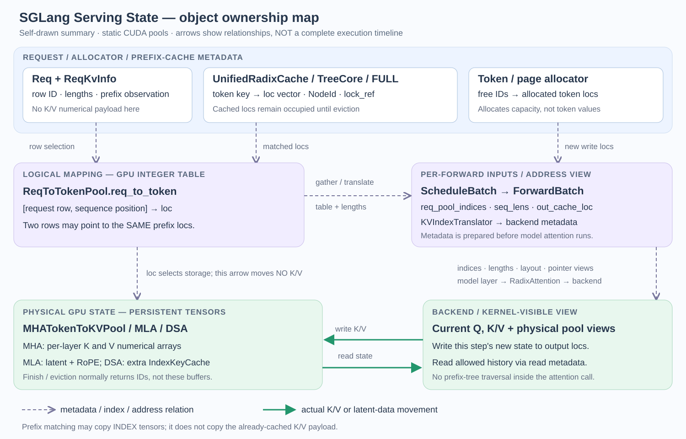

# 00｜SGLang Serving State 对象地图：先找入口，再查职责

> 这篇是“源码导航页”，不是第三篇完整教程。它只回答三个问题：对象在哪里创建、保存什么、下一步交给谁。
> 先读第 1 节的两条主线，再按问题跳到对象卡；不要从头背完所有类名。
> 完整调用树只放在两条主线上；对象卡统一给“入口 → 输出”，可选分支只标出新增对象和入口。

相关的完整推导放在 [Day05：Full Attention KV Cache](../sglang_full_attention_kv_cache/day05_sglang_full_attention_kv_cache.md) 和 [Day06：MLA/DSA latent cache](../day06_sglang_mla_dsa_latent_cache/day06_sglang_mla_dsa_latent_cache.md)。

## 0. 阅读边界

本文先固定最容易追的主线：单个 CUDA worker、普通 Full Attention、非 unified-memory 的静态 KV pool、启用普通 prefix cache、没有 speculative decoding、DCP/CP/SWA；为避免再引入分支，先不展开 chunk cache 和替代 radix backend。MLA、DSA、Mamba/Linear Attention 只在第 5 节说明“多了什么对象”。

源码链接按当前工作区的函数附近行号写；当前 main 已在文档使用的 db017 快照之后，行号漂移时以函数名为准。链接的目标是本地源码，适合在 VS Code 中边看边跳。

### 第一遍只记四句话

1. `Scheduler` 决定这一轮哪些请求可以运行；它不亲自算 attention。
2. `TpModelWorker` 是执行侧的包装，`ModelRunner` 才持有模型运行资源并调用 forward。
3. `ReqToTokenPool` 管“请求 row → token loc”的表；allocator 管“哪些 loc/page 还能发”。
4. physical pool（GPU 上的持久 Tensor）保存真正的 K/V；radix cache（前缀索引树）保存可复用前缀的地址记录和保护状态。

先忽略权重加载、TP/NCCL、CUDA Graph、采样和 disaggregation。只有当它们改变你正在追的对象或地址时，再回来看对应分支。

如果当前只在补 Day05：按 `0 → 1.1 → 1.2 → 2.1–2.5 → 3` 顺读即可；第 5、6、7、8、9 节都是按需查询。

## 1. 两条真实代码导航

### 1.1 启动：pool 和 prefix tree 不是同一个入口

下面是普通非 speculative 路径。缩进中的每一层都是为了告诉你“上一层从哪里进来”；中间包装函数可以先不读实现，但不要从地图上删掉。

~~~text
Scheduler.__init__
├─ init_model_worker()                                      call: scheduler.py:553 / def:1047
│  ├─ init_tp_model_worker()                                → 创建 self.tp_worker
│  ├─ maybe_init_draft_worker()                             → 普通路径得到 None
│  ├─ init_memory_pools()                                   scheduler.py:1020
│  │  └─ init_target_memory_pool()                          scheduler.py:1006
│  │     └─ self.tp_worker.alloc_memory_pool()              tp_worker.py:407
│  │        └─ self.model_runner.alloc_memory_pool()        model_runner.py:881
│  │           ├─ init_kv_cache_configurator()               call:886 / def:605
│  │           │  └─ 只组装 configurator，不建 pool
│  │           ├─ KVCacheConfigurator.configure()           configurator.py:296
│  │           │  ├─ _resolve_memory_pool_config()           容量计算（可跳）
│  │           │  ├─ _derive_pool_sizes()                   容量计算（可跳）
│  │           │  └─ _init_pools()                          configurator.py:397
│  │           │     ├─ _build_req_to_token_pool()          configurator.py:938
│  │           │     ├─ _build_token_to_kv_pool()           configurator.py:1125
│  │           │     └─ _build_token_to_kv_pool_allocator() configurator.py:1832
│  │           └─ _init_post_memory_pool_components()
│  │              └─ init_kv_index_translator()
│  ├─ init_all_attention_backends()                         → backend
│  └─ init_all_cuda_graphs()                                → graph

（init_model_worker() 返回后）
└─ kv_cache_builder.build_kv_cache()                        scheduler.py:559
   └─ CacheInitParams → TreeCacheBuildContext(params=...) → registry.create_tree_cache()
      └─ 本节假设下得到 UnifiedRadixCache
~~~

把这条链拆成两段理解：

- `TpModelWorker.alloc_memory_pool()` 主要是 worker 边界的转发层（还会把共享引用传给额外 runner 并做容量检查）。真正“选择池类型、建 Tensor、返回 allocator”的下一站是 `ModelRunner.alloc_memory_pool()` → `KVCacheConfigurator.configure()` → `_init_pools()`。
- `init_tp_model_worker()` 先只看它的出口即可：[`init_tp_model_worker`](../../python/sglang/srt/managers/scheduler.py#L955-L971) 在普通 CUDA 分支把 `self.tp_worker` 实例化为 `TpModelWorker`；权重加载和并行组装先跳过。
- `init_kv_cache_configurator()` 只把模型、page size、dtype 等参数装进 configurator，不会创建 K/V Tensor；`configure()` 中的 config resolve / size derive 是容量计算，先看懂它们的输入输出即可，细节可以跳到 `_init_pools()`。
- 如果已经点进 `_init_pools()`，继续按三个 builder 找就够了：[req builder](../../python/sglang/srt/mem_cache/kv_cache_configurator.py#L938-L966) 建映射 row，[pool builder](../../python/sglang/srt/mem_cache/kv_cache_configurator.py#L1125-L1245) 建 physical pool，[allocator builder](../../python/sglang/srt/mem_cache/kv_cache_configurator.py#L1832-L1959) 建地址分配器。它们是同一个初始化阶段的三个分支，不是三次独立初始化。
- 如果 `_init_pools()` 顶部命中了 unified-memory fast path，就会改走统一 buffer 的构建逻辑，不会按这里的三个普通 builder 顺序下钻；那是另一条按需分支。
- `build_kv_cache()` 使用已经建好的 pool/allocator，另行装配 prefix tree。它是 `init_model_worker()` 之后的阶段，不是 `TpModelWorker.alloc_memory_pool()` 的隐藏下一层。

你在 `init_memory_pools()` 中还会看到 `resolve_decode_retraction_backup()`；它是 disaggregation/retraction 的旁路接线，位于 target pool 和可选 draft pool 之间，不改变本节的 pool 创建主线。

| 你要找的节点 | 入口链接 | 这一跳只看什么 |
| --- | --- | --- |
| 调度器启动顺序 | [Scheduler.__init__](../../python/sglang/srt/managers/scheduler.py#L553-L559) | `init_model_worker` 后才到 `build_kv_cache` |
| target pool 入口 | [init_memory_pools → init_target_memory_pool](../../python/sglang/srt/managers/scheduler.py#L1006-L1033) | guard 通过后调用 `tp_worker.alloc_memory_pool()` |
| worker 包装层 | [TpModelWorker.alloc_memory_pool](../../python/sglang/srt/managers/tp_worker.py#L407-L433) | 传递共享 pool/allocator，再转给 runner |
| 真正的 pool 装配 | [ModelRunner.alloc_memory_pool](../../python/sglang/srt/model_executor/model_runner.py#L881-L903) → [init_kv_cache_configurator](../../python/sglang/srt/model_executor/model_runner.py#L605-L630) | 调用 configurator，接收 result 并挂到 runner |
| configurator 内部 | [configure](../../python/sglang/srt/mem_cache/kv_cache_configurator.py#L296-L329) → [_init_pools](../../python/sglang/srt/mem_cache/kv_cache_configurator.py#L397-L510) | 配置 → sizing → 三类 pool 结果 |
| tree 装配 | [build_kv_cache](../../python/sglang/srt/mem_cache/kv_cache_builder.py#L197-L330) → [create_tree_cache](../../python/sglang/srt/mem_cache/registry.py#L199-L250) | `CacheInitParams` 放进 `TreeCacheBuildContext`，再选择 tree 实现 |

### 1.2 一次请求：从匹配到 kernel

~~~text
等待队列中的 Req
  → prefix match / 准入
  → ScheduleBatch.prepare_for_extend()                  schedule_batch.py:2504
     └─ alloc_for_extend()                              allocation.py:282
        ├─ 分配 request row
        ├─ 分配本轮 out_cache_loc
        └─ 写入 req_to_token 表
  → Scheduler.run_batch()                               scheduler.py:4020
     └─ model_worker.forward_batch_generation()          scheduler.py:4188 附近
        ├─ ForwardBatch.init_new()                      forward_batch_info.py:723
        └─ ModelRunner.forward()                        model_runner.py:1582
           └─ attention backend 读历史、写新 K/V
  → 结果处理、prefix insert/解锁、row 与可淘汰地址回收
~~~

请求链中最容易漏掉的中间入口是 `alloc_for_extend()`：`prepare_for_extend()` 不是“已经拿到地址”，它只是准备字段并调用分配函数。`ForwardBatch` 也不是第二份持久缓存，它只把这一轮需要的 rows、长度、读表和写位置整理成执行输入。

| 源码入口 | 上一站给它什么 | 它交给下一站什么 |
| --- | --- | --- |
| [Req.init_next_round_input → tree_cache.match_prefix](../../python/sglang/srt/managers/schedule_batch.py#L1390-L1495) | token 序列、tree cache | `prefix_indices`、节点句柄 |
| [ScheduleBatch.prepare_for_extend](../../python/sglang/srt/managers/schedule_batch.py#L2504-L2585) | 请求的 prefix/extend 长度 | `out_cache_loc`、`req_pool_indices` |
| [alloc_for_extend](../../python/sglang/srt/mem_cache/allocation.py#L282-L370) | row、allocator、页大小 | 写回映射表的 loc |
| [Scheduler.run_batch](../../python/sglang/srt/managers/scheduler.py#L4020-L4200) | 已准备好的 `ScheduleBatch` | 调用当前 `model_worker` |
| [TpModelWorker.forward_batch_generation](../../python/sglang/srt/managers/tp_worker.py#L593-L660) | `ScheduleBatch` | `ForwardBatch` 和 runner 输出 |
| [ForwardBatch.init_new](../../python/sglang/srt/model_executor/forward_batch_info.py#L723-L795) | 调度侧 batch | GPU/本轮 metadata view |
| [ModelRunner.forward](../../python/sglang/srt/model_executor/model_runner.py#L1582-L1645) | forward view | logits、attention 输出及写入副作用 |

### 1.3 三个“主角”怎样分工

| 对象 | 它负责 | 它不负责 | 长期 owner / 生命周期 |
| --- | --- | --- | --- |
| `Scheduler` | 准入、预算、batch 组织、结果回写 | 不保存 K/V 数值、不执行 kernel | 调度状态；进程内长期存在 |
| `TpModelWorker` | worker 边界、把请求交给 runner | 不自己实现 pool sizing 和 attention 数学 | runner 的外层引用 |
| `ModelRunner` | model、pool、allocator、translator、forward | 不决定哪个请求先准入 | 跨 forward 持有运行资源 |
| `KVCacheConfigurator` | 一次性解析配置并创建 pool | 不是运行期 allocator，也不是 tree owner | `configure()` 返回后主要留下结果 |
| `ForwardBatch` | 当前一次 forward 的 tensor/view | 不拥有 persistent KV | 一次 forward 借用，随后丢弃或复用 buffer |

这也回答“为什么 SGLang 看起来像只有 Scheduler”：`Scheduler` 是调度进程中最显眼的控制器，但同一条主线还经过 worker、runner、pool 和 backend。Engine/TokenizerManager 等上层负责接收请求并启动这些组件；不要把整个 SGLang 等同于一个 Scheduler。

读代码时可以先用这个临时判断：看到 `worker.forward_batch_generation()`，是在把调度 batch 搭到执行侧；看到 `runner.forward()`，才是在真正执行模型层和 attention。它不是严格的类定义，只是定位调用层次的捷径。

初始化末尾还会设置 `self.model_worker`：没有 speculative 时它指向 target 的 `tp_worker`，启用 speculative 时才切到 draft worker。这只是当前 forward 的 dispatch 别名，不改变 target pool 的创建入口。[dispatch 位置](../../python/sglang/srt/managers/scheduler.py#L1084-L1092)

## 2. 核心对象卡：每张卡都给出入口和下一站

### 2.1 `Req` / `ReqKvInfo`：请求记录 + 资源进度

**入口 → 输出：** [Req、ReqKvInfo](../../python/sglang/srt/managers/schedule_batch.py#L849-L980) → 调度器用它们计算 prefix、extend 和释放边界。

`Req` 保存业务身份、输入/输出 token 和调度进度；`ReqKvInfo` 把容易混淆的资源状态集中起来。先记这几个字段：

| 字段 | 单位 | 含义 |
| --- | --- | --- |
| `rid` | 业务字符串 | 请求身份 |
| `kv.req_pool_idx` | row ID | 这条请求在 `ReqToTokenPool` 的登记行 |
| `prefix_indices` | token loc 向量 | tree 命中的、可读的旧地址；不是 token ID |
| `kv.cache_protected_len` | token 数 | tree 当前保护的前缀边界 |
| `kv.kv_committed_len` | token 数 | 已提交 K/V 的进度边界 |
| `kv.kv_allocated_len` | token 数 | 请求已拿到地址的范围上界 |
| `kv.mamba_pool_idx` | state slot | 只有 hybrid recurrent 路径才有的另一种资源 |

`cached_len`、`cache_protected_len`、`kv_committed_len` 不要按名字互换：它们的 owner 和更新时间不同。一个 row 存在，只能说明有登记位置，不能说明整行每一列都有有效 K/V。

### 2.2 `ReqToTokenPool`：地址映射表，不是 K/V

**入口 → 输出：** [ReqToTokenPool](../../python/sglang/srt/mem_cache/memory_pool.py#L257-L337) → `req_to_token[row, position] = loc`。

普通路径中它是 GPU `int32` Tensor，形状近似 `[请求行数 + 1, 最大上下文长度]`；第 0 行是 dummy，真实 row 从 1 开始。`free_slots` 是 CPU 侧可用 row 列表，`req_generation` 用来区分同一 row 的不同次使用。

~~~text
token ID（文本是什么）       : [10, 11, 12, 13, 20]
req_to_token[row=3, :]（放哪）: [12, 13, 14, 15, 28]
                                      ↑ loc，不是 token ID
~~~

释放 row 通常只归还 row ID；不要求先把整行旧整数全部清零。真正的有效范围由请求长度、登记状态和本轮读表共同限定。

### 2.3 allocator 与 physical pool：发地址和存数值是两件事

**入口 → 输出：** [alloc_for_extend](../../python/sglang/srt/mem_cache/allocation.py#L282-L370) → allocator 发 loc/page；[MHATokenToKVPool](../../python/sglang/srt/mem_cache/memory_pool.py#L1809-L1931) → [set_kv_buffer](../../python/sglang/srt/mem_cache/memory_pool.py#L2381-L2460) 按 loc 写入每层 K/V。

| 对象 | 管什么 | 典型输出 | 不要误解为 |
| --- | --- | --- | --- |
| `TokenToKVPoolAllocator` | `page_size = 1` 时的 token loc | 一串 flat loc | 已经产生 K/V |
| `PagedTokenToKVPoolAllocator` | `page_size > 1` 时内部按 physical page 管理 | 对外通常返回展开后的 flat loc | 每次 decode 必须新申请一页 |
| `MHATokenToKVPool` | GPU 上跨 forward 保留的 K/V Tensor | `k_buffer[layer]`、`v_buffer[layer]` | prefix tree 或 free list |

页内关系可先只记：`loc = page_id × P + offset`。这里 `T` 是 pool capacity，`P` 是 page size。allocator 决定地址能不能再发；只有当前 forward 的 K/V 写入后，该地址才有可读数值。普通布局下每层大致是 `[T + P, Hkv_local, D]`，其中 `Hkv_local` 是当前 TP rank 的 local KV heads，不是全局 head 数。

### 2.4 `UnifiedRadixCache`：保存“可复用前缀的记录”

**入口 → 输出：** [build_kv_cache → create_tree_cache](../../python/sglang/srt/mem_cache/kv_cache_builder.py#L197-L330) → [UnifiedRadixCache.match_prefix](../../python/sglang/srt/mem_cache/unified_radix_cache.py#L523-L539) → `prefix_indices` 与节点句柄。

正式实现把职责拆开：

| 对象 | 主要职责 | 里面的 `value` 是什么 |
| --- | --- | --- |
| `UnifiedRadixCache` | 对外接入 match/insert/lock/release | 不等于整棵树的所有字段 |
| `UnifiedTreeCore` | 节点、边、匹配、LRU、可淘汰状态 | 树结构元数据 |
| `UnifiedTreeNode` | parent/children、prefix key、component 数据 | 节点级记录 |
| `FullComponent` / `ComponentData` | FULL 状态的 loc、lock、eviction 规则 | 通常是地址/句柄 Tensor，不是 attention 的 V |

`match_prefix()` 给出“哪些旧 loc 可以读”，不自动等于锁定。准入时还要由调度侧增加 lock；请求完成时再插入可复用尾部、解锁，并把真正可回收的地址交回 allocator。树复制的通常是 loc 记录，物理 K/V 仍留在 pool 中。

源码入口：[UnifiedTreeCore 的节点状态](../../python/sglang/srt/mem_cache/unified_cache/unified_tree_core.py#L108-L157)、[TreeCore.match_prefix](../../python/sglang/srt/mem_cache/unified_cache/unified_tree_core.py#L698-L746)、[准入时的 lock](../../python/sglang/srt/managers/schedule_policy.py#L1330-L1354)、[finish/release](../../python/sglang/srt/mem_cache/unified_radix_cache.py#L838-L915)。

### 2.5 `ScheduleBatch` / `ForwardBatch` / backend：本轮执行视图

**入口 → 输出：** [ScheduleBatch.prepare_for_extend](../../python/sglang/srt/managers/schedule_batch.py#L2504-L2585) → [ForwardBatch.init_new](../../python/sglang/srt/model_executor/forward_batch_info.py#L723-L795) → backend metadata。

| 字段 | 长度/单位 | 作用 |
| --- | --- | --- |
| `req_pool_indices` | batch size 个 row ID | 每条 batch lane 去查哪一行 |
| `seq_lens` | 每条请求一个有效长度 | attention 可读到哪里 |
| `prefix_lens` / `extend_lens` | 每条请求各一个 token 数 | 旧 prefix 与本轮新算范围 |
| `out_cache_loc` | 本轮新 token 数 | 当前 K/V 写到哪里 |
| `input_ids` / `positions` | 本轮新 token 数 | 模型本轮处理什么 |

两条请求新增 6 和 2 个 token 时，`req_pool_indices` 仍长 2，但 `input_ids` 与 `out_cache_loc` 通常长 8。这里是 request 粒度切换到 token 粒度的地方。

`ForwardBatch` 可能借用 `ScheduleBatch` 的 Tensor；它不是跨请求共享的缓存容器。backend metadata 再把 row/loc/length 转成 page table、ragged offsets 或 sparse indices。**读表**描述历史在哪里，**write loc** 描述本轮新结果写哪里，二者不能互换。

## 3. 用一个 A/B 例子把对象接起来

只看普通 paged MHA，取教学用 page size `P = 4`。树中已有 prefix `[10, 11, 12, 13]`，位于 page 3，所以 flat loc 是 `[12, 13, 14, 15]`。A 和 B 共享这个只读 prefix。

| 现场 | A | B | 所属层 |
| --- | --- | --- | --- |
| token IDs | `[10,11,12,13,20,21]` | `[10,11,12,13,30]` | `Req` |
| request row | `3` | `5` | `ReqToTokenPool` |
| prefix loc | `[12,13,14,15]` | `[12,13,14,15]` | tree → mapping |
| 新写入 loc | `[28,29]` | `[40]` | allocator → `out_cache_loc` |
| 完整有效长度 | `6` | `5` | `seq_lens` |

合并成一个 forward：

~~~text
req_pool_indices = [3, 5]       # 两条请求的 row
seq_lens         = [6, 5]       # 两条请求各自可读长度
input_ids        = [20, 21, 30] # 本轮新增 token，共 3 个
out_cache_loc    = [28, 29, 40] # 三个新 K/V 的写地址
~~~

这几个数字的关系是：

1. tree 先返回共享 prefix 的 loc；match 本身不复制 K/V。
2. allocator 再给 A、B 的 suffix 发不同 loc，并把它们写入各自 row。
3. forward 用 prefix loc 读旧 K/V，用 `out_cache_loc` 写新 K/V。
4. A 完成时可以释放 row 3；共享 prefix 要先解除保护，再由 eviction、重复插入或清理路径决定何时回到 allocator。

A 的 row 恰好等于 page 3 只是示例巧合。row、page ID、flat loc 和 NodeId 属于不同 ID 空间。

## 4. ID 与长度速查

### 4.1 整数先问“它数的是什么”

| 名称 | 例子 | owner | 能否直接当普通 KV 地址 |
| --- | --- | --- | --- |
| `rid` | `A` | `Req` | 否 |
| token ID | `20` | 输入/输出 token 序列 | 否 |
| sequence position | `5` | 请求内位置 | 否 |
| request row | `3` | `ReqToTokenPool` | 否，需查表 |
| flat token loc | `29` | token allocator / pool | 普通 flat pool 可以 |
| physical page ID | `7` | paged allocator | 否，还要页内 offset |
| tree `NodeId` | `42` | `UnifiedTreeCore` | 否，只定位树节点 |
| recurrent state slot | `9` | `MambaSlotAllocator` | 否，它是另一种 state 地址 |

### 4.2 长度也有 owner

| 名称 | 先理解成 | 不要直接等同于 |
| --- | --- | --- |
| `prefix_indices` 长度 | tree 本次返回的可复用 token 数 | 整条请求已算长度 |
| `cache_protected_len` | tree 当前保护到的边界 | allocator 已分配上界 |
| `kv_committed_len` | 已提交 K/V 的进度 | 本轮 query 数 |
| `kv_allocated_len` | 请求记录的已分配范围 | physical buffer 总容量 |
| `extend_lens` | 本轮每条请求新增多少 | batch 中请求条数 |
| `seq_lens` | 每条请求本轮可读的完整长度 | `out_cache_loc` 的长度 |

## 5. 按需分支：只看“多出来的对象”

### 5.1 MLA

普通 MLA 不再把每层 K/V 展开成所有 head，而是由 [MLATokenToKVPool](../../python/sglang/srt/mem_cache/memory_pool.py#L3970-L4078) 保存 compressed latent 和 RoPE 分量，常见行形状近似 `[T + P, 1, r + s]`。这里 `T` 是 pool capacity，`P` 是 page size，`r`、`s` 来自模型配置。先沿用“同一个 loc 找到本层持久数值”的心智模型；payload shape 和 getter 再去读 Day06。

### 5.2 DSA

[DSATokenToKVPool](../../python/sglang/srt/mem_cache/memory_pool.py#L4421-L4569) 在 MLA 主池旁增加 [IndexKeyCache](../../python/sglang/srt/mem_cache/index_key_cache.py#L14-L114)。主 latent、index K/scale 仍通过 loc 对齐，但 sidecar 是另一块物理存储；[Indexer](../../python/sglang/srt/layers/attention/dsa/dsa_indexer.py#L1471-L1552) 生成本轮 score/top-k，[DSAMetadata](../../python/sglang/srt/layers/attention/dsa_backend.py#L193-L255) 携带 page/length/offset 等执行元数据，sparse backend 再消费这些结果。top-k 是 query-dependent 的执行结果，不是 prefix tree 永久保存的 token 列表。

### 5.3 Mamba / Linear Attention

这条路径把寻址粒度从“每个历史 token 的 loc”换成“每条序列的 state slot”：[HybridReqToTokenPool](../../python/sglang/srt/mem_cache/memory_pool.py#L1193-L1408) 维护 row→slot 映射，[MambaSlotAllocator](../../python/sglang/srt/mem_cache/allocator/mamba.py#L30-L97) 分配 slot，[MambaPool](../../python/sglang/srt/mem_cache/memory_pool.py#L371-L414) 保存 state。row 3 和 slot 9 可以同时存在，但不能互当地址。

### 5.4 `draft_worker` 到底是什么

`draft_worker` 是 speculative decoding 的可选第二个 worker，不是普通路径中的隐藏主角。[maybe_init_draft_worker](../../python/sglang/srt/managers/scheduler.py#L973-L1003) 在启用 spec 时创建它；随后 [init_memory_pools](../../python/sglang/srt/managers/scheduler.py#L1020-L1033) 把 target 的 `req_to_token_pool` 和 allocator 传给它。没有 speculative 时 `draft_worker is None`，这整段可跳过。

## 6. 正式 SGLang 与 mini-SGLang：只做职责翻译

不要按类名一一对应，按“谁拥有哪种状态”对应：

| 正式 SGLang | mini-SGLang | 共同直觉 | 关键差异 |
| --- | --- | --- | --- |
| `Scheduler` + `PrefillAdder` | `Scheduler` + prefill manager → `PrefillAdder` | 选择本轮请求、做 prefix match 和预算检查 | 正式调度分支更多 |
| `TpModelWorker` + `ModelRunner` | `Engine` + `Context` | 模型执行资源和当前 batch 入口 | mini 把多个正式边界合并了 |
| `ReqToTokenPool` | `TableManager` + `Context.page_table` | row → loc 的映射 | mini 还另有 token-ID `token_pool` |
| token allocator | `CacheManager` free list | 发可用 page/loc | page 单位和 sentinel 规则不同 |
| `MHATokenToKVPool` | `MHAKVCache` | loc → 持久 K/V 数值 | Tensor layout 不同 |
| `UnifiedRadixCache` + TreeCore | `RadixPrefixCache` | match/insert/lock/evict | 正式把 component/state 拆开 |
| `ForwardBatch` + backend metadata | `Batch` + `ForwardInput` | 组织一次 forward 的读写参数 | mini 没有同名中间类 |

mini 的 `Engine` 不是正式 SGLang 的 `TpModelWorker` 别名；它更像把启动、资源挂载和一部分执行入口合并后的教学对象。用 mini 理解数据流，用正式源码确认字段、单位和生命周期。

## 7. 按问题选源码路线

每条路线只读“入口 → 下一站 → 要回答的问题”。读完能回答问题就停，不必顺着整个文件滚到底。

| 你遇到的问题 | 从这里开始 | 下一站 | 读完应能说清 |
| --- | --- | --- | --- |
| 为什么找不到 `TpModelWorker.alloc_memory_pool` | [scheduler.py: init_target_memory_pool](../../python/sglang/srt/managers/scheduler.py#L1006-L1018) | `tp_worker.py:alloc_memory_pool` → `model_runner.py:alloc_memory_pool` | wrapper 不是 pool 创建者 |
| pool 具体在哪建 | [ModelRunner.alloc_memory_pool](../../python/sglang/srt/model_executor/model_runner.py#L881-L903) | `KVCacheConfigurator.configure` → `_init_pools` | result 中返回哪三个核心对象 |
| prefix 命中后地址从哪来 | [Req.init_next_round_input → tree_cache.match_prefix](../../python/sglang/srt/managers/schedule_batch.py#L1390-L1495) | `alloc_for_extend` | 旧 prefix loc 和新 suffix loc 如何拼接 |
| 本轮到底写哪 | [ScheduleBatch.prepare_for_extend](../../python/sglang/srt/managers/schedule_batch.py#L2504-L2585) | `ForwardBatch.init_new` → `ModelRunner.forward` | `out_cache_loc` 与 read table 的区别 |
| 请求结束为什么不清空整个 pool | [UnifiedRadixCache finish](../../python/sglang/srt/mem_cache/unified_radix_cache.py#L838-L915) | [release_kv_cache](../../python/sglang/srt/mem_cache/common.py#L254-L296) | row、cached prefix、physical buffer 的释放边界 |
| 碰到 MLA/DSA 名字 | [MLATokenToKVPool](../../python/sglang/srt/mem_cache/memory_pool.py#L3970-L4078) | `DSATokenToKVPool` → `IndexKeyCache` | 多的是 payload/sidecar/backend，不是新一套 row 语义 |

## 8. 容易误判的名字

| 看到 | 先不要理解成 | 更安全的读法 |
| --- | --- | --- |
| `token_pool` | K/V 大张量 | 先查它保存 token ID 还是 cache Tensor |
| `slot` | 一定是 token loc | 看 owner：row、page、token 或 recurrent state |
| `value` | attention 的 V | tree 中常是 loc/句柄，必须看 component |
| `page_table` | 一定是 page ID | mini 的 context 表可能是 flat loc，backend 表才是 page ID |
| `cached_len` | 全仓库同一个长度 | 先看谁写、谁读、何时更新 |
| `free` | 删除 GPU Tensor | 通常只是归还 row/page 的可分配资格 |
| `RadixAttention` | 每层现场查 radix tree | 它是模型层到 attention backend 的接口 |
| `HybridBackend` | 已实现 Mamba/KDA state 管理 | mini 中它主要分流 prefill/decode |
| `topk_indices` | 一定是 physical loc | 查 producer/consumer 的 ID 契约 |

## 9. 最后自测：不用背实现细节

1. `init_memory_pools()` 里面为什么看不到 `ModelRunner.alloc_memory_pool()`？请沿 `init_target_memory_pool()` 和 `TpModelWorker.alloc_memory_pool()` 补上中间两跳。
2. `ReqToTokenPool`、allocator、physical pool、radix tree 各自拥有哪一种状态？
3. A、B 共享 prefix loc 时，为什么可以共享旧 K/V，却不能共用同一个可写 recurrent state slot？
4. 为什么两个请求的 `req_pool_indices` 长度可以是 2，而 `out_cache_loc` 长度是 3 或 8？
5. 请求完成后，什么可以立刻归还，什么要等 unlock/eviction，什么始终是全局 backing Tensor？

如果这五题能用第 3 节的 A/B 数字回答，Atlas 的目标就达到了。接下来要深入机制时，回到 Day05 的 Full Attention 分配/回收主线；要追 latent、index sidecar 或 state slot，再进入 Day06 或后续 Linear Attention 文档。

图只用于查“谁引用谁、谁保存什么”；阅读顺序仍以第 1 节的真实调用链为准。
